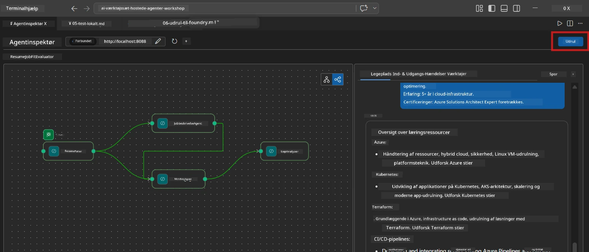
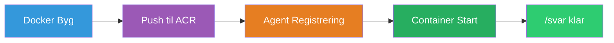
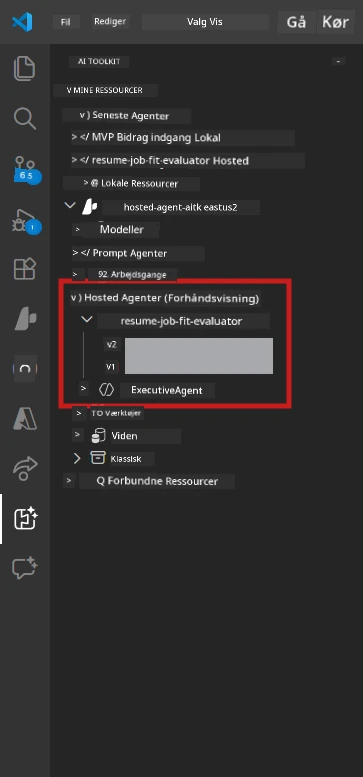

# Modul 6 - Udrul til Foundry Agent Service

I dette modul udruller du dit lokalt testede multi-agent workflow til [Microsoft Foundry](https://learn.microsoft.com/azure/foundry/agents/concepts/hosted-agents) som en **Hosted Agent**. Udrulningsprocessen bygger et Docker container image, skubber det til [Azure Container Registry (ACR)](https://learn.microsoft.com/azure/container-registry/container-registry-intro) og opretter en hosted agent version i [Foundry Agent Service](https://learn.microsoft.com/azure/foundry/agents/how-to/publish-agent).

> **Vigtig forskel fra Lab 01:** Udrulningsprocessen er identisk. Foundry behandler dit multi-agent workflow som en enkelt hosted agent – kompleksiteten er inde i containeren, men udrulningsfladen er det samme `/responses` endpoint.

---

## Forudsætninger

Før udrulning, kontroller hvert punkt nedenfor:

1. **Agenten består lokale smoke tests:**
   - Du har gennemført alle 3 tests i [Modul 5](05-test-locally.md) og workflowet producerede komplet output med gap cards og Microsoft Learn URLs.

2. **Du har [Azure AI User](https://learn.microsoft.com/azure/foundry/concepts/rbac-foundry) rolle:**
   - Tildelt i [Lab 01, Modul 2](../../lab01-single-agent/docs/02-create-foundry-project.md). Bekræft:
   - [Azure Portal](https://portal.azure.com) → dit Foundry **projekt** resource → **Access control (IAM)** → **Role assignments** → bekræft at **[Azure AI User](https://aka.ms/foundry-ext-project-role)** er listet for din konto.

3. **Du er logget ind på Azure i VS Code:**
   - Tjek Accounts-ikonet nederst til venstre i VS Code. Dit kontonavn skal være synligt.

4. **`agent.yaml` har korrekte værdier:**
   - Åbn `PersonalCareerCopilot/agent.yaml` og bekræft:
     ```yaml
     environment_variables:
       - name: PROJECT_ENDPOINT
         value: ${PROJECT_ENDPOINT}
       - name: MODEL_DEPLOYMENT_NAME
         value: ${MODEL_DEPLOYMENT_NAME}
     ```
   - Disse skal matche de env vars, som din `main.py` læser.

5. **`requirements.txt` har korrekte versioner:**
   ```
   agent-framework-azure-ai==1.0.0rc3
   agent-framework-core==1.0.0rc3
   azure-ai-agentserver-agentframework==1.0.0b16
   azure-ai-agentserver-core==1.0.0b16
   debugpy
   agent-dev-cli --pre
   ```

---

## Trin 1: Start udrulningen

### Mulighed A: Udrul fra Agent Inspector (anbefalet)

Hvis agenten kører via F5 med Agent Inspector åben:

1. Se i **øverste højre hjørne** af Agent Inspector panelet.
2. Klik på **Deploy** knappen (sky ikon med en opad-pil ↑).
3. Udrulningsguiden åbnes.



### Mulighed B: Udrul fra Command Palette

1. Tryk `Ctrl+Shift+P` for at åbne **Command Palette**.
2. Skriv: **Microsoft Foundry: Deploy Hosted Agent** og vælg det.
3. Udrulningsguiden åbnes.

---

## Trin 2: Konfigurer udrulningen

### 2.1 Vælg målprojektet

1. En dropdown viser dine Foundry projekter.
2. Vælg det projekt, du brugte gennem workshoppen (fx `workshop-agents`).

### 2.2 Vælg container agent filen

1. Du bliver bedt om at vælge agentens entry point.
2. Naviger til `workshop/lab02-multi-agent/PersonalCareerCopilot/` og vælg **`main.py`**.

### 2.3 Konfigurer ressourcer

| Indstilling | Anbefalet værdi | Noter |
|-------------|-----------------|-------|
| **CPU** | `0.25` | Standard. Multi-agent workflows behøver ikke mere CPU, da modelkald er I/O-bundne |
| **Memory** | `0.5Gi` | Standard. Forøg til `1Gi`, hvis du tilføjer store databehandlingsværktøjer |

---

## Trin 3: Bekræft og udrul

1. Guiden viser et udrulningsresumé.
2. Gennemgå og klik **Confirm and Deploy**.
3. Følg fremskridtet i VS Code.

### Hvad sker der under udrulningen

Se VS Code **Output** panelet (vælg "Microsoft Foundry" i dropdown):


1. **Docker build** – Bygger containeren fra din `Dockerfile`:
   ```
   Step 1/6 : FROM python:3.14-slim
   Step 2/6 : WORKDIR /app
   ...
   Successfully built abc123def456
   ```

2. **Docker push** – Skubber imaget til ACR (1-3 minutter ved første udrulning).

3. **Agent registrering** – Foundry opretter en hosted agent med metadata fra `agent.yaml`. Agentnavnet er `resume-job-fit-evaluator`.

4. **Container start** – Containeren startes i Foundrys administrerede infrastruktur med en system-administreret identitet.

> **Første udrulning er langsommere** (Docker skubber alle lag). Efterfølgende udrulninger genbruger cached lag og er hurtigere.

### Specifikke noter for multi-agent

- **Alle fire agenter er inde i én container.** Foundry ser en enkelt hosted agent. WorkflowBuilder grafen kører internt.
- **MCP kald går udgående.** Containeren skal have internetadgang for at nå `https://learn.microsoft.com/api/mcp`. Foundrys administrerede infrastruktur leverer dette som standard.
- **[Managed Identity](https://learn.microsoft.com/python/api/overview/azure/identity-readme#managed-identity-support).** I det hosted miljø returnerer `get_credential()` i `main.py` `ManagedIdentityCredential()` (fordi `MSI_ENDPOINT` er sat). Dette sker automatisk.

---

## Trin 4: Verificer udrulningsstatus

1. Åbn **Microsoft Foundry** sidebjælken (klik på Foundry ikonet i Aktivitetslinjen).
2. Udvid **Hosted Agents (Preview)** under dit projekt.
3. Find **resume-job-fit-evaluator** (eller dit agentnavn).
4. Klik på agentnavnet → udvid versioner (fx `v1`).
5. Klik på versionen → tjek **Container Details** → **Status**:



| Status | Betydning |
|--------|-----------|
| **Started** / **Running** | Container kører, agent er klar |
| **Pending** | Container starter op (vent 30-60 sekunder) |
| **Failed** | Container kunne ikke starte (tjek logs - se nedenfor) |

> **Multi-agent opstart tager længere tid** end single-agent fordi containeren opretter 4 agent-instanser ved opstart. "Pending" i op til 2 minutter er normalt.

---

## Almindelige udrulningsfejl og løsninger

### Fejl 1: Permission denied - `agents/write`

```
Error: lacks the required data action 
Microsoft.CognitiveServices/accounts/AIServices/agents/write
```

**Løsning:** Tildel **[Azure AI User](https://learn.microsoft.com/azure/foundry/concepts/rbac-foundry)** rolle på **projekt**-niveau. Se [Modul 8 - Fejlfinding](08-troubleshooting.md) for trin-for-trin instruktioner.

### Fejl 2: Docker kører ikke

```
Error: Docker build failed / Cannot connect to Docker daemon
```

**Løsning:**
1. Start Docker Desktop.
2. Vent på "Docker Desktop is running".
3. Bekræft: `docker info`
4. **Windows:** Sørg for at WSL 2 backend er aktiveret i Docker Desktop indstillinger.
5. Prøv igen.

### Fejl 3: pip install fejler under Docker build

```
Error: Could not find a version that satisfies the requirement agent-dev-cli
```

**Løsning:** `--pre` flaget i `requirements.txt` håndteres anderledes i Docker. Sørg for at din `requirements.txt` indeholder:
```
agent-dev-cli --pre
```

Hvis Docker stadig fejler, opret en `pip.conf` eller giv `--pre` via et build-argument. Se [Modul 8](08-troubleshooting.md).

### Fejl 4: MCP værktøj fejler i hosted agent

Hvis Gap Analyzer stopper med at producere Microsoft Learn URLs efter udrulning:

**Årsag:** Netværkspolitik kan blokere udgående HTTPS fra containeren.

**Løsning:**
1. Dette er normalt ikke et problem med Foundrys standardkonfiguration.
2. Hvis det sker, tjek om Foundry projektets virtuelle netværk har en NSG, der blokerer udgående HTTPS.
3. MCP værktøjet har indbyggede fallback URLs, så agenten vil stadig producere output (uden live URLs).

---

### Tjekliste

- [ ] Udrulningskommandoen gennemførtes uden fejl i VS Code
- [ ] Agent vises under **Hosted Agents (Preview)** i Foundry sidebjælken
- [ ] Agentnavnet er `resume-job-fit-evaluator` (eller dit valgte navn)
- [ ] Container status viser **Started** eller **Running**
- [ ] (Hvis fejl) Du har identificeret fejlen, anvendt løsningen og udrullet igen med succes

---

**Forrige:** [05 - Test Lokalt](05-test-locally.md) · **Næste:** [07 - Verificer i Playground →](07-verify-in-playground.md)

---

<!-- CO-OP TRANSLATOR DISCLAIMER START -->
**Ansvarsfraskrivelse**:  
Dette dokument er oversat ved hjælp af AI-oversættelsestjenesten [Co-op Translator](https://github.com/Azure/co-op-translator). Selvom vi bestræber os på nøjagtighed, bedes du være opmærksom på, at automatiserede oversættelser kan indeholde fejl eller unøjagtigheder. Det oprindelige dokument på dets oprindelige sprog skal betragtes som den autoritative kilde. For kritisk information anbefales professionel menneskelig oversættelse. Vi påtager os intet ansvar for misforståelser eller fejltolkninger, der opstår som følge af brugen af denne oversættelse.
<!-- CO-OP TRANSLATOR DISCLAIMER END -->