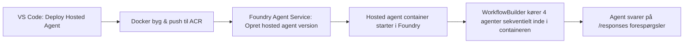
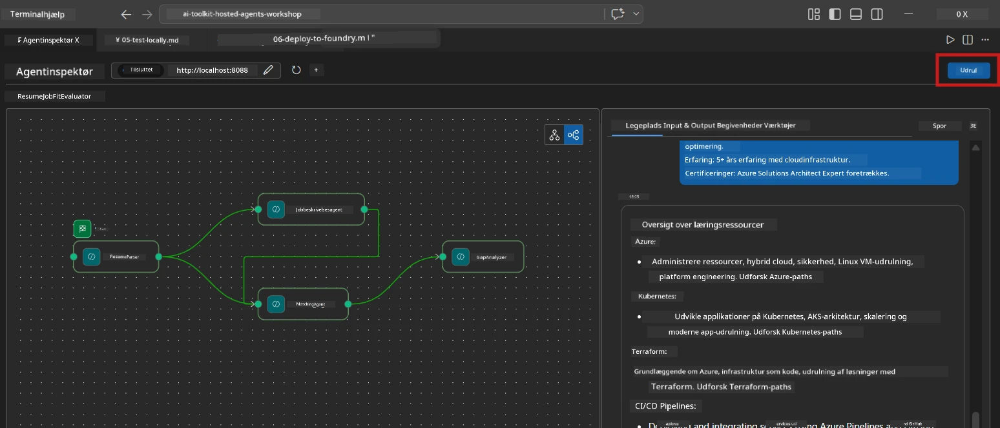
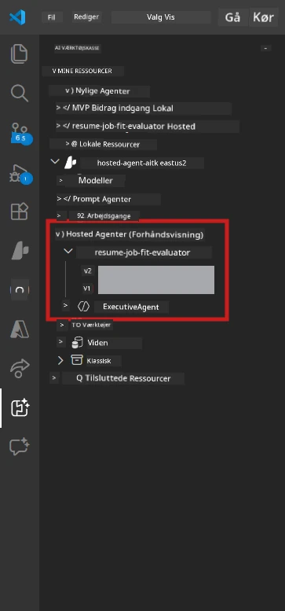

# Modul 6 - Deploy til Foundry Agent Service

⏱️ ~10 min

I denne modul implementerer du din lokalt testede multi-agent workflow til [Microsoft Foundry](https://learn.microsoft.com/azure/foundry/agents/concepts/hosted-agents) som en **Hosted Agent**. Deployprocessen bygger et Docker container image, uploader det til [Azure Container Registry (ACR)](https://learn.microsoft.com/azure/container-registry/container-registry-intro), og opretter en hosted agent version i [Foundry Agent Service](https://learn.microsoft.com/azure/foundry/agents/how-to/publish-agent).

> **Nøgledifference fra Lab 01:** Deployprocessen er identisk. Foundry behandler din multi-agent workflow som en enkelt hosted agent – kompleksiteten er inde i containeren, men deployments-fladen er den samme `/responses` endpoint.

### Deploypipeline


```mermaid
flowchart LR
    A[VS Code: Deploy Hosted Agent] --> B[Docker byg & push til ACR]
    B --> C[Foundry Agent Service: Opret hosted agent version]
    C --> D[Hosted agent container starter i Foundry]
    D --> E[WorkflowBuilder kører 4 agenter sekventielt inde i containeren]
    E --> F[Agent svarer på /responses forespørgsler]
```

---

## Forudsætninger

Før du deployer, verificer hvert punkt nedenfor:

1. **Agent består lokale smoke tests:**
   - Du har gennemført alle 3 tests i [Modul 5](05-test-locally.md) og workflowet producerede komplet output med gap cards og Microsoft Learn URLs.

2. **Du har rollen [Foundry User](https://learn.microsoft.com/azure/foundry/concepts/rbac-foundry)** (for at deploye skal du mindst have **Foundry Project Manager** på projektomfang):

   > **Note:** Foundry RBAC rollerne er for nylig omdøbt – **Foundry User**, **Foundry Owner** og **Foundry Project Manager** hed tidligere Azure AI User, Azure AI Owner, og Azure AI Project Manager. Rolles IDs og tilladelser er uændrede.

   - Verificer i [Azure Portal](https://portal.azure.com) → dit Foundry **projekt** resource → **Access control (IAM)** → **Role assignments** → bekræft at **Foundry User** (eller højere) er listet for din konto.

3. **Du er logget ind i Azure i VS Code:**
   - Se efter konti-ikonet nederst i venstre hjørne af VS Code. Dit kontonavn skal være synligt.

4. **`agent.yaml` har korrekte værdier:**
   - Åbn `PersonalCareerCopilot/agent.yaml` og verificer:
     ```yaml
     environment_variables:
       - name: AZURE_AI_MODEL_DEPLOYMENT_NAME
         value: ${AZURE_AI_MODEL_DEPLOYMENT_NAME}
     ```
   - `FOUNDRY_PROJECT_ENDPOINT` er **ikke** opført her – Foundry injicerer det ved runtime. Kun `AZURE_AI_MODEL_DEPLOYMENT_NAME` skal deklareres.

5. **`requirements.txt` har korrekte versioner:**
   ```
   agent-framework-foundry
   agent-framework-foundry-hosting
   mcp<2,>=1.24.0
   debugpy
   ```

---

## Trin 1: Start deployment

### Option A: Deploy fra Agent Inspector (anbefalet)

Hvis agenten kører via F5 med Agent Inspector åben:

1. Kig på **øverste højre hjørne** af Agent Inspector panelet.
2. Klik på **Deploy** knappen (sky-ikon med en opadgående pil ↑).
3. Deploy-guiden åbner.



### Option B: Deploy fra Command Palette

1. Tryk på `Ctrl+Shift+P` for at åbne **Command Palette**.
2. Skriv: **Foundry Toolkit: Deploy Hosted Agent** og vælg det.
3. Deploy-guiden åbner.

---

## Trin 2: Konfigurer deployment

### 2.1 Vælg målprojektet

1. En dropdown viser dine Foundry projekter.
2. Vælg det projekt, du har brugt gennem hele workshoppen (f.eks. `workshop-agents`).

### 2.2 Vælg container agent filen

1. Du bliver bedt om at vælge agent entry point.
2. Naviger til `workshop/lab02-multi-agent/PersonalCareerCopilot/` og vælg **`main.py`**.

### 2.3 Konfigurer ressourcer

| Indstilling | Anbefalet værdi | Noter |
|---------|------------------|-------|
| **Deploymetode** | **Container** (anbefalet) eller **Kode** | Container bygger et Docker image; Kode uploader kilde som en ZIP (preview) |
| **Container Registry** | **Standard ACR** | Foundry opretter og administrerer en til dig |
| **CPU** | `0.25` | Standard. Multi-agent workflows behøver ikke mere CPU da modelkald er I/O-bundne |
| **Hukommelse** | `0.5Gi` | Standard. Øg til `1Gi` hvis du tilføjer store dataprocestyper |

---

## Trin 3: Bekræft og deploy

1. Guiden viser et deploymentsresumé.
2. Gennemgå og klik **Bekræft og Deploy**.
3. Følg fremskridtet i VS Code.

### Hvad sker der under deployment

Følg VS Code **Output** panelet (vælg "Microsoft Foundry" dropdown):

1. **Docker build** - Bygger containeren ud fra din `Dockerfile`
   ```
   Step 1/6 : FROM python:3.12-slim
   Step 2/6 : WORKDIR /app
   ...
   Successfully built abc123def456
   ```

2. **Docker push** - Pusher imaget til ACR (1-3 minutter første gang).

3. **Agent registrering** - Foundry opretter en hosted agent med metadata fra `agent.yaml`. Agent navnet er `resume-job-fit-evaluator`.

4. **Container start** - Containeren kører i Foundrys administrerede infrastruktur med en systemstyret identitet.

> **Første deployment er langsommere** (Docker pusher alle lag). Efterfølgende deployment genbruger cachede lag og går hurtigere.

### Multi-agent specifikke noter

- **Alle fire agenter er i én container.** Foundry ser en enkelt hosted agent. WorkflowBuilder grafen kører internt.
- **MCP kald går ud af containeren.** Containeren har brug for internetadgang til `https://learn.microsoft.com/api/mcp`. Foundrys administrerede infrastruktur leverer dette som standard.
- **[Managed Identity](https://learn.microsoft.com/azure/foundry/agents/concepts/agent-identity).** Foundry opretter automatisk en **dedikeret per-agent Entra identitet** for hver Hosted agent ved deployment. I det hosted miljø løses `DefaultAzureCredential` til denne agent identitet automatisk – ingen manuel konfiguration af managed identity er nødvendig.

---

## Trin 4: Verificer deployment status

1. Åbn **Microsoft Foundry** sidebar (klik Foundry ikonet i Activity Bar).
2. Udvid **Hosted Agents (Preview)** under dit projekt.
3. Find **resume-job-fit-evaluator** (eller dit agent navn).
4. Klik på agentnavnet → udvid versioner (f.eks. `v1`).
5. Klik på versionen → check **Container Detaljer** → **Status**:



| Status | Betydning |
|--------|---------|
| **aktiv** | Agenten kører og er klar til at modtage forespørgsler |
| **oprettelse** | Container starter (vent 30–60 sekunder) |
| **fejlet** | Container kunne ikke starte (tjek logs - se nedenfor) |

> **Note:** VS Code sidebar kan vise labels som "Running" eller "Started" mens API status bruger `active`/`creating`. Begge viser samme tilstand.

> **Multi-agent opstart tager længere tid** end enkelt-agent da containeren opretter 4 agentinstanser ved startup. `creating` op til 2 minutter er normalt.

---

## Almindelige deploymentsfejl og løsninger

### Fejl 1: Permission denied - `agents/write`

```
Error: lacks the required data action 
Microsoft.CognitiveServices/accounts/AIServices/agents/write
```

**Løsning:** Tildel **[Foundry User](https://learn.microsoft.com/azure/foundry/concepts/rbac-foundry)** rollen (tidligere **Azure AI User**) på **projekt** niveau. Se [Modul 8 - Fejlfinding](08-troubleshooting.md) for trinvis vejledning.

### Fejl 2: Docker kører ikke

```
Error: Docker build failed / Cannot connect to Docker daemon
```

**Løsning:**
1. Start Docker Desktop.
2. Vent på "Docker Desktop is running".
3. Verificer: `docker info`
4. **Windows:** Sørg for WSL 2 backend er aktiveret i Docker Desktop indstillinger.
5. Prøv igen.

### Fejl 3: pip install fejler under Docker build

```
Error: Could not find a version that satisfies the requirement agent-framework-foundry
```

**Løsning:** Verificer at `requirements.txt` matcher:
```
agent-framework-foundry
agent-framework-foundry-hosting
mcp<2,>=1.24.0
debugpy
```

Hvis build stadig fejler, kan dit Docker-netværk blokere PyPI. Tjek `docker info` for proxy indstillinger.

### Fejl 4: MCP værktøj fejler i hosted agent

Hvis Gap Analyzer holder op med at producere Microsoft Learn URLs efter deployment:

**Årsag:** Netværkspolitik blokerer muligvis udgående HTTPS fra container.

**Løsning:**
1. Dette er normalt ikke et problem med Foundrys standardopsætning.
2. Hvis problemet opstår, tjek om Foundry projektets virtuelle netværk har en NSG der blokerer udgående HTTPS.
3. MCP værktøjet har indbyggede fallback URLs, så agenten vil stadig producere output (uden live URLs).

---

### Checkpoint

- [ ] Deploy-kommandoen fuldført uden fejl i VS Code
- [ ] Agent vises under **Hosted Agents (Preview)** i Foundry sidebar
- [ ] Agent navn er `resume-job-fit-evaluator` (eller dit valgte navn)
- [ ] Container status viser **Started** eller **Running**
- [ ] (Hvis fejl) Du identificerede fejlen, anvendte rettelsen, og deployede igen med succes

---

**Forrige:** [05 - Test Lokalt](05-test-locally.md) · **Næste:** [07 - Verificer i Playground →](07-verify-in-playground.md)

---

<!-- CO-OP TRANSLATOR DISCLAIMER START -->
**Ansvarsfraskrivelse**:
Dette dokument er blevet oversat ved hjælp af AI-oversættelsestjenesten [Co-op Translator](https://github.com/Azure/co-op-translator). Selvom vi bestræber os på nøjagtighed, skal du være opmærksom på, at automatiserede oversættelser kan indeholde fejl eller unøjagtigheder. Det originale dokument på dets oprindelige sprog bør betragtes som den autoritative kilde. For kritisk information anbefales professionel menneskelig oversættelse. Vi påtager os intet ansvar for misforståelser eller fejltolkninger, der opstår som følge af brugen af denne oversættelse.
<!-- CO-OP TRANSLATOR DISCLAIMER END -->