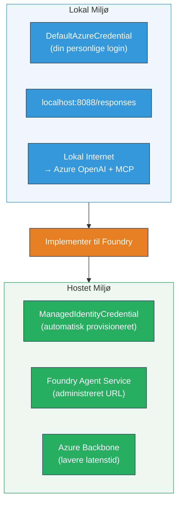

# Modul 7 - Verificer i Playground

I dette modul tester du din udrullede multi-agent workflow i både **VS Code** og **[Foundry Portal](https://ai.azure.com)** for at bekræfte, at agenten opfører sig identisk med lokal testning.

---

## Hvorfor verificere efter udrulning?

Din multi-agent workflow kørte perfekt lokalt, så hvorfor teste igen? Det hostede miljø adskiller sig på flere måder:


| Forskel | Lokalt | Hosted |
|-----------|-------|--------|
| **Identitet** | [`DefaultAzureCredential`](https://learn.microsoft.com/azure/developer/python/sdk/authentication/credential-chains#defaultazurecredential-overview) (din personlige login) | [`ManagedIdentityCredential`](https://learn.microsoft.com/python/api/overview/azure/identity-readme#managed-identity-support) (automatisk provisioneret) |
| **Endpoint** | `http://localhost:8088/responses` | [Foundry Agent Service](https://learn.microsoft.com/azure/foundry/agents/concepts/hosted-agents) endpoint (administreret URL) |
| **Netværk** | Lokal maskine → Azure OpenAI + MCP udgående | Azure backbone (lavere latenstid mellem tjenester) |
| **MCP forbindelse** | Lokal internet → `learn.microsoft.com/api/mcp` | Container udgående → `learn.microsoft.com/api/mcp` |

Hvis en miljøvariabel er forkert konfigureret, RBAC adskiller sig, eller MCP udgående er blokeret, fanger du det her.

---

## Mulighed A: Test i VS Code Playground (anbefalet først)

[Foundry-udvidelsen](https://marketplace.visualstudio.com/items?itemName=TeamsDevApp.vscode-ai-foundry) indeholder en integreret Playground, der lader dig chatte med din udrullede agent uden at forlade VS Code.

### Trin 1: Naviger til din hostede agent

1. Klik på ikonet **Microsoft Foundry** i VS Code’s **Activity Bar** (venstre sidepanel) for at åbne Foundry-panelet.
2. Udvid dit tilkoblede projekt (f.eks. `workshop-agents`).
3. Udvid **Hosted Agents (Preview)**.
4. Du bør se dit agentnavn (f.eks. `resume-job-fit-evaluator`).

### Trin 2: Vælg en version

1. Klik på agentnavnet for at udvide dets versioner.
2. Klik på den version, du har udrullet (f.eks. `v1`).
3. Et **detaljeret panel** åbnes med Container-detaljer.
4. Bekræft status er **Started** eller **Running**.

### Trin 3: Åbn Playground

1. I det detaljerede panel, klik på **Playground**-knappen (eller højreklik på versionen → **Open in Playground**).
2. En chatgrænseflade åbner i en VS Code-fane.

### Trin 4: Kør dine røgtest

Brug de samme 3 tests fra [Modul 5](05-test-locally.md). Skriv hver besked i Playground inputboksen og tryk på **Send** (eller **Enter**).

#### Test 1 - Fuld CV + JD (standard flow)

Indsæt fuldt CV + JD prompten fra Modul 5, Test 1 (Jane Doe + Senior Cloud Engineer hos Contoso Ltd).

**Forventet:**
- Fit score med opdelt matematik (100-points skala)
- Matchede kompetencer sektion
- Manglende kompetencer sektion
- **Et gap card per manglende færdighed** med Microsoft Learn URLs
- Læringsvejkort med tidslinje

#### Test 2 - Hurtig kort test (minimal input)

```
RESUME: 3 years Python developer, knows Django and PostgreSQL, no cloud experience.

JOB: Cloud DevOps Engineer requiring AWS, Kubernetes, Terraform, CI/CD. 5 years needed.
```
  
**Forventet:**
- Lavere fit score (< 40)
- Ærlig vurdering med trinvist læringsforløb
- Flere gap cards (AWS, Kubernetes, Terraform, CI/CD, erfaringsgap)

#### Test 3 - Kandidat med høj fit

```
RESUME:
10 years Azure Cloud Architect. AZ-305 certified. Expert in AKS, Terraform, Azure DevOps, 
Azure Functions, Helm, Prometheus, Grafana, Python, Go. Led platform team of 8.

JOB:
Senior Cloud Engineer. Required: AKS, Terraform, Azure DevOps, Python. Preferred: Helm, Go.
5+ years experience. AZ-305 preferred.
```
  
**Forventet:**
- Høj fit score (≥ 80)
- Fokus på interviewforberedelse og polering
- Få eller ingen gap cards
- Kort tidslinje med fokus på forberedelse

### Trin 5: Sammenlign med lokale resultater

Åbn dine noter eller browserfanen fra Modul 5, hvor du gemte lokale svar. For hver test:

- Har svaret den **samme struktur** (fit score, gap cards, roadmap)?
- Følger det samme **scoringsskema** (100-point opdeling)?
- Er **Microsoft Learn URLs** stadig til stede i gap cards?
- Er der **ét gap card per manglende færdighed** (ikke afkortet)?

> **Små ordlydsforskelle er normale** - modellen er ikke deterministisk. Fokusér på struktur, scoringskonsistens og MCP-værktøjets brug.

---

## Mulighed B: Test i Foundry Portal

[Foundry Portal](https://ai.azure.com) tilbyder en webbaseret playground, nyttig til deling med teammedlemmer eller interessenter.

### Trin 1: Åbn Foundry Portal

1. Åbn din browser og gå til [https://ai.azure.com](https://ai.azure.com).
2. Log ind med den samme Azure-konto, som du har brugt gennem hele workshoppen.

### Trin 2: Naviger til dit projekt

1. På startskærmen, kig efter **Recent projects** i venstre sidepanel.
2. Klik på dit projektnavn (f.eks. `workshop-agents`).
3. Hvis du ikke ser det, klik på **All projects** og søg efter det.

### Trin 3: Find din udrullede agent

1. I projektets venstre navigation, klik **Build** → **Agents** (eller find sektionen **Agents**).
2. Du skal se en liste over agenter. Find din udrullede agent (f.eks. `resume-job-fit-evaluator`).
3. Klik på agentnavnet for at åbne dens detaljeside.

### Trin 4: Åbn Playground

1. På agentens detaljeside, kig på topværktøjslinjen.
2. Klik **Open in playground** (eller **Try in playground**).
3. En chatgrænseflade åbnes.

### Trin 5: Kør de samme røgtest

Gentag alle 3 tests fra VS Code Playground sektionen ovenfor. Sammenlign hvert svar med både lokale resultater (Modul 5) og VS Code Playground resultater (Mulighed A ovenfor).

---

## Multi-agent specifik verifikation

Ud over grundlæggende korrekthed, verificer disse multi-agent-specifikke adfærd:

### MCP værktøjsudførelse

| Check | Hvordan verificere | Beståelsesbetingelse |
|-------|--------------------|---------------------|
| MCP kald lykkes | Gap cards indeholder `learn.microsoft.com` URLs | Rigtige URL’er, ikke fallback-meddelelser |
| Flere MCP kald | Hvert High/Medium prioritets gap har ressourcer | Ikke kun det første gap card |
| MCP fallback virker | Hvis URLs mangler, se efter fallback tekst | Agent producerer stadig gap cards (med eller uden URLs) |

### Agent koordination

| Check | Hvordan verificere | Beståelsesbetingelse |
|-------|--------------------|---------------------|
| Alle 4 agenter kørte | Output indeholder fit score OG gap cards | Score kommer fra MatchingAgent, kort fra GapAnalyzer |
| Parallel fan-out | Responstid er rimelig (< 2 min) | Hvis > 3 min, kan parallel udførelse ikke virke |
| Dataintegritet | Gap cards refererer til færdigheder fra matching rapport | Ingen hallucinerede færdigheder der ikke er i JD |

---

## Valideringsrubrik

Brug denne rubrik til at evaluere din multi-agent workflows hostede adfærd:

| # | Kriterium | Beståelsesbetingelse | Bestået? |
|---|-----------|----------------------|----------|
| 1 | **Funktionel korrekthed** | Agent svarer på CV + JD med fit score og gap-analyse | |
| 2 | **Scoringskonsistens** | Fit score bruger 100-points skala med opdelingsmatematik | |
| 3 | **Gap card komplethed** | Ét kort per manglende færdighed (ikke afkortet eller kombineret) | |
| 4 | **MCP værktøjsintegration** | Gap cards inkluderer rigtige Microsoft Learn URL’er | |
| 5 | **Strukturel konsistens** | Outputstruktur matcher mellem lokal og hosted kørsel | |
| 6 | **Responstid** | Hosted agent svarer inden for 2 minutter for fuld vurdering | |
| 7 | **Ingen fejl** | Ingen HTTP 500 fejl, timeouts eller tomme svar | |

> En "bestået" betyder, at alle 7 kriterier opfyldes for alle 3 røgtest i mindst én playground (VS Code eller Portal).

---

## Fejlfinding af playground-problemer

| Symptom | Sandsynlig årsag | Løsning |
|---------|------------------|---------|
| Playground loader ikke | Containerstatus ikke "Started" | Gå tilbage til [Modul 6](06-deploy-to-foundry.md), verificer udrulningsstatus. Vent hvis "Pending" |
| Agent returnerer tomt svar | Modeludrulningsnavn matcher ikke | Tjek `agent.yaml` → `environment_variables` → `MODEL_DEPLOYMENT_NAME` matcher din udrullede model |
| Agent returnerer fejlmeddelelse | [RBAC](https://learn.microsoft.com/azure/foundry/concepts/rbac-foundry) tilladelse mangler | Tildel **[Azure AI User](https://aka.ms/foundry-ext-project-role)** på projektomfang |
| Ingen Microsoft Learn URLs i gap cards | MCP udgående blokeret eller MCP server utilgængelig | Tjek om containeren kan nå `learn.microsoft.com`. Se [Modul 8](08-troubleshooting.md) |
| Kun 1 gap card (afkortet) | GapAnalyzer instruktioner mangler "CRITICAL" blok | Gennemgå [Modul 3, Trin 2.4](03-configure-agents.md) |
| Fit score meget forskellig fra lokal | Forskellig model eller instruktioner udrullet | Sammenlign `agent.yaml` miljøvariabler med lokal `.env`. Udrul igen hvis nødvendigt |
| "Agent not found" i Portal | Udrulning stadig pågår eller fejlet | Vent 2 minutter, opdater siden. Hvis stadig mangler, udrul igen fra [Modul 6](06-deploy-to-foundry.md) |

---

### Checkpoint

- [ ] Testet agent i VS Code Playground - alle 3 røgtest bestået
- [ ] Testet agent i [Foundry Portal](https://ai.azure.com) Playground - alle 3 røgtest bestået
- [ ] Svar er strukturelt konsistente med lokal testning (fit score, gap cards, roadmap)
- [ ] Microsoft Learn URLs er til stede i gap cards (MCP værktøj virker i hosted miljø)
- [ ] Ét gap card per manglende færdighed (ingen afkortning)
- [ ] Ingen fejl eller timeouts under testning
- [ ] Valideringsrubrik fuldført (alle 7 kriterier bestået)

---

**Forrige:** [06 - Deploy to Foundry](06-deploy-to-foundry.md) · **Næste:** [08 - Troubleshooting →](08-troubleshooting.md)

---

<!-- CO-OP TRANSLATOR DISCLAIMER START -->
**Ansvarsfraskrivelse**:  
Dette dokument er oversat ved hjælp af AI-oversættelsestjenesten [Co-op Translator](https://github.com/Azure/co-op-translator). Selvom vi bestræber os på nøjagtighed, bedes du være opmærksom på, at automatiserede oversættelser kan indeholde fejl eller unøjagtigheder. Det oprindelige dokument på dets modersmål bør betragtes som den autoritative kilde. For vigtig information anbefales professionel menneskelig oversættelse. Vi påtager os intet ansvar for misforståelser eller fejltolkninger, der opstår ved brug af denne oversættelse.
<!-- CO-OP TRANSLATOR DISCLAIMER END -->