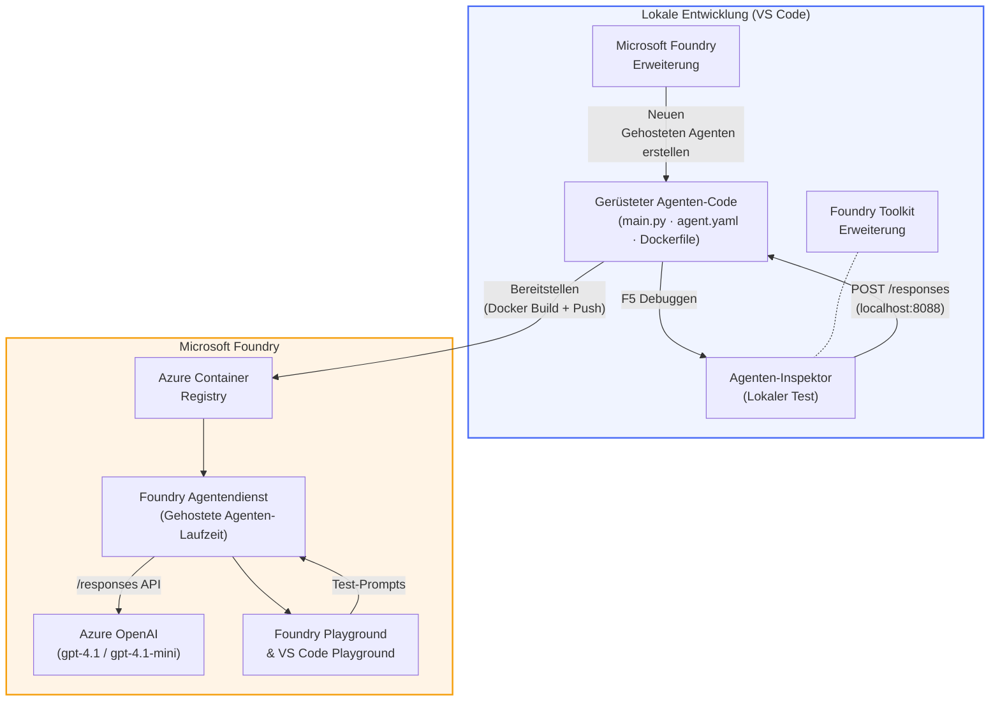

# Foundry Toolkit + Foundry Hosted Agents Workshop

[](https://www.python.org/)
[](https://github.com/microsoft/agents)
[](https://learn.microsoft.com/azure/ai-foundry/agents/concepts/hosted-agents/)
[](https://ai.azure.com/)
[](https://learn.microsoft.com/azure/ai-services/openai/)
[](https://learn.microsoft.com/cli/azure/install-azure-cli)
[](https://learn.microsoft.com/azure/developer/azure-developer-cli/install-azd)
[](https://www.docker.com/)
[](https://marketplace.visualstudio.com/items?itemName=ms-windows-ai-studio.windows-ai-studio)
[](LICENSE)

Erstellen, testen und bereitstellen von KI-Agenten auf dem **Microsoft Foundry Agent Service** als **Hosted Agents** – vollständig aus VS Code mithilfe der **Microsoft Foundry-Erweiterung** und des **Foundry Toolkit**.

> **Hosted Agents befinden sich derzeit in der Vorschau.** Unterstützte Regionen sind begrenzt – siehe [Verfügbarkeitsregionen](https://learn.microsoft.com/azure/foundry/agents/concepts/hosted-agents#region-availability).

> Der Ordner `agent/` in jedem Labor wird **automatisch von der Foundry-Erweiterung vorstrukturiert** – Sie passen dann den Code an, testen lokal und deployen.

<!-- CO-OP TRANSLATOR LANGUAGES TABLE START -->
[Arabic](../ar/README.md) | [Bengali](../bn/README.md) | [Bulgarian](../bg/README.md) | [Burmese (Myanmar)](../my/README.md) | [Chinese (Simplified)](../zh-CN/README.md) | [Chinese (Traditional, Hong Kong)](../zh-HK/README.md) | [Chinese (Traditional, Macau)](../zh-MO/README.md) | [Chinese (Traditional, Taiwan)](../zh-TW/README.md) | [Croatian](../hr/README.md) | [Czech](../cs/README.md) | [Danish](../da/README.md) | [Dutch](../nl/README.md) | [Estonian](../et/README.md) | [Finnish](../fi/README.md) | [French](../fr/README.md) | [German](./README.md) | [Greek](../el/README.md) | [Hebrew](../he/README.md) | [Hindi](../hi/README.md) | [Hungarian](../hu/README.md) | [Indonesian](../id/README.md) | [Italian](../it/README.md) | [Japanese](../ja/README.md) | [Kannada](../kn/README.md) | [Khmer](../km/README.md) | [Korean](../ko/README.md) | [Lithuanian](../lt/README.md) | [Malay](../ms/README.md) | [Malayalam](../ml/README.md) | [Marathi](../mr/README.md) | [Nepali](../ne/README.md) | [Nigerian Pidgin](../pcm/README.md) | [Norwegian](../no/README.md) | [Persian (Farsi)](../fa/README.md) | [Polish](../pl/README.md) | [Portuguese (Brazil)](../pt-BR/README.md) | [Portuguese (Portugal)](../pt-PT/README.md) | [Punjabi (Gurmukhi)](../pa/README.md) | [Romanian](../ro/README.md) | [Russian](../ru/README.md) | [Serbian (Cyrillic)](../sr/README.md) | [Slovak](../sk/README.md) | [Slovenian](../sl/README.md) | [Spanish](../es/README.md) | [Swahili](../sw/README.md) | [Swedish](../sv/README.md) | [Tagalog (Filipino)](../tl/README.md) | [Tamil](../ta/README.md) | [Telugu](../te/README.md) | [Thai](../th/README.md) | [Turkish](../tr/README.md) | [Ukrainian](../uk/README.md) | [Urdu](../ur/README.md) | [Vietnamese](../vi/README.md)

> **Bevorzugen Sie das lokale Klonen?**
>
> Dieses Repository enthält über 50 Sprachübersetzungen, was die Downloadgröße erheblich vergrößert. Um ohne Übersetzungen zu klonen, verwenden Sie Sparse Checkout:
>
> **Bash / macOS / Linux:**
> ```bash
> git clone --filter=blob:none --sparse https://github.com/microsoft-foundry/Foundry_Toolkit_for_VSCode_Lab.git
> cd Foundry_Toolkit_for_VSCode_Lab
> git sparse-checkout set --no-cone '/*' '!translations' '!translated_images'
> ```
>
> **CMD (Windows):**
> ```cmd
> git clone --filter=blob:none --sparse https://github.com/microsoft-foundry/Foundry_Toolkit_for_VSCode_Lab.git
> cd Foundry_Toolkit_for_VSCode_Lab
> git sparse-checkout set --no-cone "/*" "!translations" "!translated_images"
> ```
>
> So erhalten Sie alles, was Sie zum Abschluss des Kurses benötigen, mit einem viel schnelleren Download.
<!-- CO-OP TRANSLATOR LANGUAGES TABLE END -->

---

## Architektur


**Ablauf:** Foundry-Erweiterung scaffoldet den Agent → Sie passen Code & Anweisungen an → testen lokal mit Agent Inspector → deployen zu Foundry (Docker-Image wird zu ACR gepusht) → verifizieren im Playground.

---

## Was Sie bauen werden

| Labor | Beschreibung | Status |
|-------|--------------|--------|
| **Lab 01 - Single Agent** | Erstellen des **„Explain Like I'm an Executive“-Agenten**, lokalen Test und Deployment zu Foundry | ✅ Verfügbar |
| **Lab 02 - Multi-Agent Workflow** | Erstellen des **„Resume → Job Fit Evaluator“** – 4 Agenten arbeiten zusammen, um Lebensläufe zu bewerten und einen Lernplan zu erstellen | ✅ Verfügbar |

---

## Lernen Sie den Executive Agent kennen

In diesem Workshop bauen Sie den **„Explain Like I'm an Executive“-Agenten** – einen KI-Agenten, der komplizierten technischen Jargon in ruhige, für den Vorstandssaal geeignete Zusammenfassungen übersetzt. Denn seien wir ehrlich, niemand im Vorstand will etwas über „Thread-Pool-Erschöpfung durch synchrone Aufrufe, eingeführt in Version 3.2“ hören.

Ich habe diesen Agenten gebaut, nachdem ich zu oft erlebt habe, dass mein perfekt gestalteter Post-Mortem-Bericht die Antwort bekam: *„Also... ist die Website jetzt down oder nicht?“*

### Wie es funktioniert

Sie geben ihm ein technisches Update. Er liefert eine Executive Summary – drei Stichpunkte, kein Jargon, keine Stack-Traces, keine existentielle Angst. Nur **was passiert ist**, **Geschäftsauswirkung** und **nächster Schritt**.

### Sehen Sie es in Aktion

**Sie sagen:**
> „Die API-Latenz hat sich aufgrund von Thread-Pool-Erschöpfung wegen synchroner Aufrufe, die in v3.2 eingeführt wurden, erhöht.“

**Der Agent antwortet:**

> **Executive Summary:**
> - **Was passiert ist:** Nach dem letzten Release hat sich das System verlangsamt.
> - **Geschäftsauswirkung:** Einige Nutzer haben Verzögerungen bei der Nutzung des Dienstes erlebt.
> - **Nächster Schritt:** Die Änderung wurde zurückgenommen und ein Fix wird vor der nächsten Bereitstellung vorbereitet.

### Warum dieser Agent?

Er ist ein tod-einfacher, zweckgebundener Agent – perfekt, um den Workflow von Hosted Agents von Anfang bis Ende kennenzulernen, ohne sich in komplexen Toolchains zu verlieren. Und ehrlich? Jedes Engineering-Team könnte so einen gebrauchen.

---

## Aufbau des Workshops

```
📂 Foundry_Toolkit_for_VSCode_Lab/
├── 📄 README.md                      ← You are here
├── 📂 ExecutiveAgent/                ← Standalone hosted agent project
│   ├── agent.yaml
│   ├── Dockerfile
│   ├── main.py
│   └── requirements.txt
└── 📂 workshop/
    ├── 📂 lab01-single-agent/        ← Full lab: docs + agent code
    │   ├── README.md                 ← Hands-on lab instructions
    │   ├── 📂 docs/                  ← Step-by-step tutorial modules
    │   │   ├── 00-prerequisites.md
    │   │   ├── 01-install-foundry-toolkit.md
    │   │   ├── 02-create-foundry-project.md
    │   │   ├── 03-create-hosted-agent.md
    │   │   ├── 04-configure-and-code.md
    │   │   ├── 05-test-locally.md
    │   │   ├── 06-deploy-to-foundry.md
    │   │   ├── 07-verify-in-playground.md
    │   │   └── 08-troubleshooting.md
    │   └── 📂 agent/                 ← Reference solution (auto-scaffolded by Foundry extension)
    │       ├── agent.yaml
    │       ├── Dockerfile
    │       ├── main.py
    │       └── requirements.txt
    └── 📂 lab02-multi-agent/         ← Resume → Job Fit Evaluator
        ├── README.md                 ← Hands-on lab instructions (end-to-end)
        ├── 📂 docs/                  ← Step-by-step tutorial modules
        │   ├── 00-prerequisites.md
        │   ├── 01-understand-multi-agent.md
        │   ├── 02-scaffold-multi-agent.md
        │   ├── 03-configure-agents.md
        │   ├── 04-orchestration-patterns.md
        │   ├── 05-test-locally.md
        │   ├── 06-deploy-to-foundry.md
        │   ├── 07-verify-in-playground.md
        │   └── 08-troubleshooting.md
        └── 📂 PersonalCareerCopilot/ ← Reference solution (multi-agent workflow)
            ├── agent.yaml
            ├── Dockerfile
            ├── main.py
            └── requirements.txt
```

> **Hinweis:** Der Ordner `agent/` in jedem Labor wird von der **Microsoft Foundry-Erweiterung** erzeugt, wenn Sie im Command Palette `Microsoft Foundry: Create a New Hosted Agent` ausführen. Die Dateien werden dann mit den Anweisungen, Tools und der Konfiguration Ihres Agenten angepasst. Lab 01 führt Sie Schritt für Schritt durch die Neuanlage von Grund auf.

---

## Erste Schritte

### 1. Repository klonen

```bash
git clone https://github.com/microsoft-foundry/Foundry_Toolkit_for_VSCode_Lab.git
cd Foundry_Toolkit_for_VSCode_Lab
```

### 2. Ein Python-Virtual-Environment einrichten

```bash
python -m venv venv
```

Aktivieren Sie es:

- **Windows (PowerShell):**
  ```powershell
  .\venv\Scripts\Activate.ps1
  ```
- **macOS / Linux:**
  ```bash
  source venv/bin/activate
  ```

### 3. Abhängigkeiten installieren

```bash
pip install -r workshop/lab01-single-agent/agent/requirements.txt
```

### 4. Umgebungsvariablen konfigurieren

Kopieren Sie die Beispieldatei `.env` aus dem Agent-Ordner und füllen Sie Ihre Werte ein:

```bash
cp workshop/lab01-single-agent/agent/.env.example workshop/lab01-single-agent/agent/.env
```

Bearbeiten Sie `workshop/lab01-single-agent/agent/.env`:

```env
AZURE_AI_PROJECT_ENDPOINT=https://<your-account>.services.ai.azure.com/api/projects/<your-project>
MODEL_DEPLOYMENT_NAME=<your-model-deployment-name>
```

### 5. Folgen Sie den Workshop-Labs

Jedes Labor ist eigenständig mit seinen eigenen Modulen. Beginnen Sie mit **Lab 01**, um die Grundlagen zu lernen, dann fahren Sie mit **Lab 02** für Multi-Agent-Workflows fort.

#### Lab 01 - Single Agent ([vollständige Anweisungen](workshop/lab01-single-agent/README.md))

| # | Modul | Link |
|---|--------|------|
| 1 | Voraussetzungen lesen | [00-prerequisites.md](workshop/lab01-single-agent/docs/00-prerequisites.md) |
| 2 | Foundry Toolkit & Foundry-Erweiterung installieren | [01-install-foundry-toolkit.md](workshop/lab01-single-agent/docs/01-install-foundry-toolkit.md) |
| 3 | Ein Foundry-Projekt erstellen | [02-create-foundry-project.md](workshop/lab01-single-agent/docs/02-create-foundry-project.md) |
| 4 | Einen Hosted Agent erstellen | [03-create-hosted-agent.md](workshop/lab01-single-agent/docs/03-create-hosted-agent.md) |
| 5 | Anweisungen & Umgebung konfigurieren | [04-configure-and-code.md](workshop/lab01-single-agent/docs/04-configure-and-code.md) |
| 6 | Lokal testen | [05-test-locally.md](workshop/lab01-single-agent/docs/05-test-locally.md) |
| 7 | Zu Foundry deployen | [06-deploy-to-foundry.md](workshop/lab01-single-agent/docs/06-deploy-to-foundry.md) |
| 8 | Im Playground verifizieren | [07-verify-in-playground.md](workshop/lab01-single-agent/docs/07-verify-in-playground.md) |
| 9 | Fehlerbehebung | [08-troubleshooting.md](workshop/lab01-single-agent/docs/08-troubleshooting.md) |

#### Lab 02 - Multi-Agent Workflow ([vollständige Anweisungen](workshop/lab02-multi-agent/README.md))

| # | Modul | Link |
|---|--------|------|
| 1 | Voraussetzungen (Lab 02) | [00-prerequisites.md](workshop/lab02-multi-agent/docs/00-prerequisites.md) |
| 2 | Multi-Agent-Architektur verstehen | [01-understand-multi-agent.md](workshop/lab02-multi-agent/docs/01-understand-multi-agent.md) |
| 3 | Multi-Agent-Projekt scaffolden | [02-scaffold-multi-agent.md](workshop/lab02-multi-agent/docs/02-scaffold-multi-agent.md) |
| 4 | Agenten & Umgebung konfigurieren | [03-configure-agents.md](workshop/lab02-multi-agent/docs/03-configure-agents.md) |
| 5 | Orchestrierungsmuster | [04-orchestration-patterns.md](workshop/lab02-multi-agent/docs/04-orchestration-patterns.md) |
| 6 | Lokal testen (Multi-Agent) | [05-test-locally.md](workshop/lab02-multi-agent/docs/05-test-locally.md) |
| 7 | Einsatz bei Foundry | [06-deploy-to-foundry.md](workshop/lab02-multi-agent/docs/06-deploy-to-foundry.md) |
| 8 | Überprüfung im Playground | [07-verify-in-playground.md](workshop/lab02-multi-agent/docs/07-verify-in-playground.md) |
| 9 | Fehlerbehebung (Multi-Agent) | [08-troubleshooting.md](workshop/lab02-multi-agent/docs/08-troubleshooting.md) |

---

## Betreuer

<table>
<tr>
    <td align="center"><a href="https://github.com/ShivamGoyal03">
        <br />
        <sub><b>Shivam Goyal</b></sub>
    </a><br />
    </td>
</tr>
</table>

---

## Erforderliche Berechtigungen (kurze Übersicht)

| Szenario | Erforderliche Rollen |
|----------|---------------------|
| Neues Foundry-Projekt erstellen | **Azure AI Owner** auf Foundry-Ressource |
| Bereitstellung in bestehendes Projekt (neue Ressourcen) | **Azure AI Owner** + **Contributor** auf Abonnement |
| Bereitstellung in vollständig konfiguriertes Projekt | **Reader** auf Konto + **Azure AI User** auf Projekt |

> **Wichtig:** Azure `Owner`- und `Contributor`-Rollen umfassen nur *Verwaltungs*-Berechtigungen, keine *Entwicklungs*- (Datenaktions-)Berechtigungen. Sie benötigen **Azure AI User** oder **Azure AI Owner**, um Agents zu erstellen und bereitzustellen.

---

## Verweise

- [Schnellstart: Ihren ersten gehosteten Agent bereitstellen (VS Code)](https://learn.microsoft.com/azure/foundry/agents/quickstarts/quickstart-hosted-agent)
- [Was sind gehostete Agents?](https://learn.microsoft.com/azure/foundry/agents/concepts/hosted-agents)
- [Erstellen von gehosteten Agent-Workflows in VS Code](https://learn.microsoft.com/azure/foundry/agents/how-to/vs-code-agents-workflow-pro-code)
- [Bereitstellen eines gehosteten Agents](https://learn.microsoft.com/azure/foundry/agents/how-to/deploy-hosted-agent)
- [RBAC für Microsoft Foundry](https://learn.microsoft.com/azure/foundry/concepts/rbac-foundry)
- [Beispiel Architecture Review Agent](https://github.com/Azure-Samples/agent-architecture-review-sample) – Realer gehosteter Agent mit MCP-Tools, Excalidraw-Diagrammen und Dualbereitstellung

---

## Lizenz

[MIT](../../LICENSE)

---

<!-- CO-OP TRANSLATOR DISCLAIMER START -->
**Haftungsausschluss**:  
Dieses Dokument wurde mit dem KI-Übersetzungsdienst [Co-op Translator](https://github.com/Azure/co-op-translator) übersetzt. Obwohl wir Genauigkeit anstreben, beachten Sie bitte, dass automatisierte Übersetzungen Fehler oder Ungenauigkeiten enthalten können. Das Originaldokument in seiner Ursprungssprache gilt als maßgebliche Quelle. Für kritische Informationen wird eine professionelle menschliche Übersetzung empfohlen. Wir übernehmen keine Haftung für Missverständnisse oder Fehlinterpretationen, die durch die Verwendung dieser Übersetzung entstehen.
<!-- CO-OP TRANSLATOR DISCLAIMER END -->