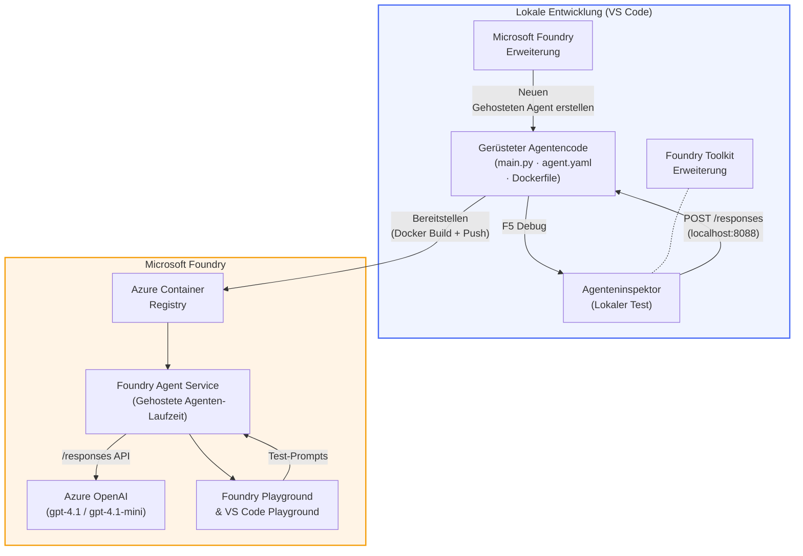

# Foundry Toolkit + Foundry Hosted Agents Workshop

[](https://www.python.org/)
[](https://github.com/microsoft/agents)
[](https://learn.microsoft.com/azure/ai-foundry/agents/concepts/hosted-agents/)
[](https://ai.azure.com/)
[](https://learn.microsoft.com/azure/ai-services/openai/)
[](https://learn.microsoft.com/cli/azure/install-azure-cli)
[](https://learn.microsoft.com/azure/developer/azure-developer-cli/install-azd)
[](https://www.docker.com/)
[](https://marketplace.visualstudio.com/items?itemName=ms-windows-ai-studio.windows-ai-studio)
[](LICENSE)

Erstellen, testen und bereitstellen Sie KI-Agenten in den **Microsoft Foundry Agent Service** als **Hosted Agents** – vollständig aus VS Code mit der **Microsoft Foundry-Erweiterung** und dem **Foundry Toolkit**.

> **Hosted Agents befinden sich derzeit in der Vorschau.** Unterstützte Regionen sind begrenzt – siehe [Region Verfügbarkeit](https://learn.microsoft.com/azure/foundry/agents/concepts/hosted-agents#region-availability).

> Der Ordner `agent/` innerhalb jedes Labs wird **automatisch von der Foundry-Erweiterung generiert** – Sie passen dann den Code an, testen lokal und deployen.

### 🌐 Mehrsprachige Unterstützung

#### Unterstützt über GitHub Action (automatisiert & immer aktuell)

<!-- CO-OP TRANSLATOR LANGUAGES TABLE START -->
[Arabisch](../ar/README.md) | [Bengalisch](../bn/README.md) | [Bulgarisch](../bg/README.md) | [Birmanisch (Myanmar)](../my/README.md) | [Chinesisch (vereinfacht)](../zh-CN/README.md) | [Chinesisch (traditionell, Hongkong)](../zh-HK/README.md) | [Chinesisch (traditionell, Macau)](../zh-MO/README.md) | [Chinesisch (traditionell, Taiwan)](../zh-TW/README.md) | [Kroatisch](../hr/README.md) | [Tschechisch](../cs/README.md) | [Dänisch](../da/README.md) | [Niederländisch](../nl/README.md) | [Estnisch](../et/README.md) | [Finnisch](../fi/README.md) | [Französisch](../fr/README.md) | [Deutsch](./README.md) | [Griechisch](../el/README.md) | [Hebräisch](../he/README.md) | [Hindi](../hi/README.md) | [Ungarisch](../hu/README.md) | [Indonesisch](../id/README.md) | [Italienisch](../it/README.md) | [Japanisch](../ja/README.md) | [Kannada](../kn/README.md) | [Khmer](../km/README.md) | [Koreanisch](../ko/README.md) | [Litauisch](../lt/README.md) | [Malaiisch](../ms/README.md) | [Malayalam](../ml/README.md) | [Marathi](../mr/README.md) | [Nepalesisch](../ne/README.md) | [Nigerianisches Pidgin](../pcm/README.md) | [Norwegisch](../no/README.md) | [Persisch (Farsi)](../fa/README.md) | [Polnisch](../pl/README.md) | [Portugiesisch (Brasilien)](../pt-BR/README.md) | [Portugiesisch (Portugal)](../pt-PT/README.md) | [Punjabi (Gurmukhi)](../pa/README.md) | [Rumänisch](../ro/README.md) | [Russisch](../ru/README.md) | [Serbisch (Kyrillisch)](../sr/README.md) | [Slowakisch](../sk/README.md) | [Slowenisch](../sl/README.md) | [Spanisch](../es/README.md) | [Suaheli](../sw/README.md) | [Schwedisch](../sv/README.md) | [Tagalog (Filipino)](../tl/README.md) | [Tamil](../ta/README.md) | [Telugu](../te/README.md) | [Thailändisch](../th/README.md) | [Türkisch](../tr/README.md) | [Ukrainisch](../uk/README.md) | [Urdu](../ur/README.md) | [Vietnamesisch](../vi/README.md)

> **Möchten Sie lieber lokal klonen?**
>
> Dieses Repository enthält über 50 Sprachübersetzungen, was die Downloadgröße erheblich erhöht. Um ohne Übersetzungen zu klonen, verwenden Sie Sparse Checkout:
>
> **Bash / macOS / Linux:**
> ```bash
> git clone --filter=blob:none --sparse https://github.com/microsoft-foundry/Foundry_Toolkit_for_VSCode_Lab.git
> cd Foundry_Toolkit_for_VSCode_Lab
> git sparse-checkout set --no-cone '/*' '!translations' '!translated_images'
> ```
>
> **CMD (Windows):**
> ```cmd
> git clone --filter=blob:none --sparse https://github.com/microsoft-foundry/Foundry_Toolkit_for_VSCode_Lab.git
> cd Foundry_Toolkit_for_VSCode_Lab
> git sparse-checkout set --no-cone "/*" "!translations" "!translated_images"
> ```
>
> So erhalten Sie alles Nötige, um den Kurs mit einer viel schnelleren Downloadzeit abzuschließen.
<!-- CO-OP TRANSLATOR LANGUAGES TABLE END -->

---

## Architektur


**Ablauf:** Foundry-Erweiterung generiert den Agenten → Sie passen Code & Anweisungen an → lokal mit Agent Inspector testen → in Foundry deployen (Docker-Image wird in ACR gepusht) → im Playground verifizieren.

---

## Was Sie bauen werden

| Lab | Beschreibung | Status |
|-----|-------------|--------|
| **Lab 01 - Einzelner Agent** | Erstellen Sie den **"Erkläre es mir wie einem Geschäftsführer" Agenten**, testen Sie ihn lokal und deployen Sie ihn in Foundry | ✅ Verfügbar |
| **Lab 02 - Multi-Agent Workflow** | Erstellen Sie den **"Lebenslauf → Job-Fit-Bewerter"** - 4 Agenten arbeiten zusammen, um die Passung des Lebenslaufs zu bewerten und eine Lern-Roadmap zu erstellen | ✅ Verfügbar |

---

## Treffen Sie den Executive Agent

In diesem Workshop bauen Sie den **"Erkläre es mir wie einem Geschäftsführer" Agenten** – ein KI-Agent, der kompliziertes technisches Fachchinesisch nimmt und es in ruhige, vorstandstaugliche Zusammenfassungen übersetzt. Denn mal ehrlich, niemand im C-Level möchte von "Thread-Pool-Ermüdung verursacht durch synchrone Aufrufe in Version 3.2" hören.

Ich habe diesen Agenten gebaut, nachdem ich zu oft erlebt habe, dass mein perfekt ausgearbeiteter Post-Mortem-Bericht die Antwort bekam: *"Also... ist die Website jetzt down oder nicht?"*

### Wie es funktioniert

Sie geben ihm ein technisches Update. Er gibt eine Executive Summary zurück – drei Stichpunkte, kein Fachjargon, keine Stack-Traces, keine existenzielle Angst. Nur **was passiert ist**, **Auswirkungen auf das Geschäft** und **nächster Schritt**.

### Sehen Sie es in Aktion

**Sie sagen:**
> "Die API-Latenz hat sich erhöht aufgrund von Thread-Pool-Ermüdung, verursacht durch synchrone Aufrufe, die in v3.2 eingeführt wurden."

**Der Agent antwortet:**

> **Executive Summary:**
> - **Was passiert ist:** Nach dem neuesten Release hat sich das System verlangsamt.
> - **Auswirkungen auf das Geschäft:** Einige Nutzer erlebten Verzögerungen bei der Nutzung des Dienstes.
> - **Nächster Schritt:** Die Änderung wurde zurückgenommen und eine Korrektur wird vor der erneuten Bereitstellung vorbereitet.

### Warum dieser Agent?

Er ist ein tod-einfacher, zweckgebundener Agent – perfekt, um den Hosted-Agent-Workflow von Anfang bis Ende zu lernen, ohne sich in komplexen Toolchains zu verlieren. Und ehrlich? Jedes Engineering-Team könnte so einen gebrauchen.

---

## Workshop-Struktur

```
📂 Foundry_Toolkit_for_VSCode_Lab/
├── 📄 README.md                      ← You are here
├── 📂 ExecutiveAgent/                ← Standalone hosted agent project
│   ├── agent.yaml
│   ├── Dockerfile
│   ├── main.py
│   └── requirements.txt
└── 📂 workshop/
    ├── 📂 lab01-single-agent/        ← Full lab: docs + agent code
    │   ├── README.md                 ← Hands-on lab instructions
    │   ├── 📂 docs/                  ← Step-by-step tutorial modules
    │   │   ├── 00-prerequisites.md
    │   │   ├── 01-install-foundry-toolkit.md
    │   │   ├── 02-create-foundry-project.md
    │   │   ├── 03-create-hosted-agent.md
    │   │   ├── 04-configure-and-code.md
    │   │   ├── 05-test-locally.md
    │   │   ├── 06-deploy-to-foundry.md
    │   │   ├── 07-verify-in-playground.md
    │   │   └── 08-troubleshooting.md
    │   └── 📂 agent/                 ← Reference solution (auto-scaffolded by Foundry extension)
    │       ├── agent.yaml
    │       ├── Dockerfile
    │       ├── main.py
    │       └── requirements.txt
    └── 📂 lab02-multi-agent/         ← Resume → Job Fit Evaluator
        ├── README.md                 ← Hands-on lab instructions (end-to-end)
        ├── 📂 docs/                  ← Step-by-step tutorial modules
        │   ├── 00-prerequisites.md
        │   ├── 01-understand-multi-agent.md
        │   ├── 02-scaffold-multi-agent.md
        │   ├── 03-configure-agents.md
        │   ├── 04-orchestration-patterns.md
        │   ├── 05-test-locally.md
        │   ├── 06-deploy-to-foundry.md
        │   ├── 07-verify-in-playground.md
        │   └── 08-troubleshooting.md
        └── 📂 PersonalCareerCopilot/ ← Reference solution (multi-agent workflow)
            ├── agent.yaml
            ├── Dockerfile
            ├── main.py
            └── requirements.txt
```

> **Hinweis:** Der Ordner `agent/` innerhalb jedes Labs wird von der **Microsoft Foundry-Erweiterung** erzeugt, wenn Sie `Microsoft Foundry: Create a New Hosted Agent` aus der Kommandopalette ausführen. Die Dateien werden dann mit den Anweisungen, Werkzeugen und der Konfiguration Ihres Agenten angepasst. Lab 01 führt Sie durch das komplette Nachbauen von Grund auf.

---

## Erste Schritte

### 1. Klonen Sie das Repository

```bash
git clone https://github.com/microsoft-foundry/Foundry_Toolkit_for_VSCode_Lab.git
cd Foundry_Toolkit_for_VSCode_Lab
```

### 2. Richten Sie eine Python-Virtual Environment ein

```bash
python -m venv venv
```

Aktivieren Sie es:

- **Windows (PowerShell):**
  ```powershell
  .\venv\Scripts\Activate.ps1
  ```
- **macOS / Linux:**
  ```bash
  source venv/bin/activate
  ```

### 3. Installieren Sie Abhängigkeiten

```bash
pip install -r workshop/lab01-single-agent/agent/requirements.txt
```

### 4. Konfigurieren Sie Umgebungsvariablen

Kopieren Sie die Beispiel-.env-Datei im Agentenordner und füllen Sie Ihre Werte aus:

```bash
cp workshop/lab01-single-agent/agent/.env.example workshop/lab01-single-agent/agent/.env
```

Bearbeiten Sie `workshop/lab01-single-agent/agent/.env`:

```env
AZURE_AI_PROJECT_ENDPOINT=https://<your-account>.services.ai.azure.com/api/projects/<your-project>
MODEL_DEPLOYMENT_NAME=<your-model-deployment-name>
```

### 5. Folgen Sie den Workshop-Labs

Jedes Lab ist eigenständig mit eigenen Modulen. Beginnen Sie mit **Lab 01**, um die Grundlagen zu lernen, danach folgt **Lab 02** für Multi-Agent Workflows.

#### Lab 01 - Einzelner Agent ([vollständige Anweisungen](workshop/lab01-single-agent/README.md))

| # | Modul | Link |
|---|--------|------|
| 1 | Lesen Sie die Voraussetzungen | [00-prerequisites.md](workshop/lab01-single-agent/docs/00-prerequisites.md) |
| 2 | Installieren Sie Foundry Toolkit & Foundry-Erweiterung | [01-install-foundry-toolkit.md](workshop/lab01-single-agent/docs/01-install-foundry-toolkit.md) |
| 3 | Erstellen Sie ein Foundry-Projekt | [02-create-foundry-project.md](workshop/lab01-single-agent/docs/02-create-foundry-project.md) |
| 4 | Erstellen Sie einen Hosted Agent | [03-create-hosted-agent.md](workshop/lab01-single-agent/docs/03-create-hosted-agent.md) |
| 5 | Konfigurieren von Anweisungen & Umgebung | [04-configure-and-code.md](workshop/lab01-single-agent/docs/04-configure-and-code.md) |
| 6 | Testen Sie lokal | [05-test-locally.md](workshop/lab01-single-agent/docs/05-test-locally.md) |
| 7 | Deployen Sie in Foundry | [06-deploy-to-foundry.md](workshop/lab01-single-agent/docs/06-deploy-to-foundry.md) |
| 8 | Verifizieren Sie im Playground | [07-verify-in-playground.md](workshop/lab01-single-agent/docs/07-verify-in-playground.md) |
| 9 | Fehlerbehebung | [08-troubleshooting.md](workshop/lab01-single-agent/docs/08-troubleshooting.md) |

#### Lab 02 - Multi-Agent Workflow ([vollständige Anweisungen](workshop/lab02-multi-agent/README.md))

| # | Modul | Link |
|---|--------|------|
| 1 | Voraussetzungen (Lab 02) | [00-prerequisites.md](workshop/lab02-multi-agent/docs/00-prerequisites.md) |
| 2 | Verstehen der Multi-Agent-Architektur | [01-understand-multi-agent.md](workshop/lab02-multi-agent/docs/01-understand-multi-agent.md) |
| 3 | Scaffold des Multi-Agent-Projekts | [02-scaffold-multi-agent.md](workshop/lab02-multi-agent/docs/02-scaffold-multi-agent.md) |
| 4 | Konfigurieren von Agenten & Umgebung | [03-configure-agents.md](workshop/lab02-multi-agent/docs/03-configure-agents.md) |
| 5 | Orchestrierungsmuster | [04-orchestration-patterns.md](workshop/lab02-multi-agent/docs/04-orchestration-patterns.md) |
| 6 | Testen Sie lokal (Multi-Agent) | [05-test-locally.md](workshop/lab02-multi-agent/docs/05-test-locally.md) |
| 7 | Bereitstellung in Foundry | [06-deploy-to-foundry.md](workshop/lab02-multi-agent/docs/06-deploy-to-foundry.md) |
| 8 | Überprüfung im Playground | [07-verify-in-playground.md](workshop/lab02-multi-agent/docs/07-verify-in-playground.md) |
| 9 | Fehlerbehebung (Multi-Agent) | [08-troubleshooting.md](workshop/lab02-multi-agent/docs/08-troubleshooting.md) |

---

## Verantwortlicher

<table>
<tr>
    <td align="center"><a href="https://github.com/ShivamGoyal03">
        <br />
        <sub><b>Shivam Goyal</b></sub>
    </a><br />
    </td>
</tr>
</table>

---

## Benötigte Berechtigungen (Kurzübersicht)

| Szenario | Erforderliche Rollen |
|----------|---------------------|
| Neues Foundry-Projekt erstellen | **Azure AI Owner** auf Foundry-Ressource |
| Bereitstellung in bestehendem Projekt (neue Ressourcen) | **Azure AI Owner** + **Contributor** auf Abonnement |
| Bereitstellung in vollständig konfiguriertem Projekt | **Reader** auf Konto + **Azure AI User** auf Projekt |

> **Wichtig:** Azure `Owner`- und `Contributor`-Rollen enthalten nur *Verwaltungs*-Berechtigungen, keine *Entwicklungs*- (Datenaktionen) Berechtigungen. Sie benötigen **Azure AI User** oder **Azure AI Owner**, um Agenten zu erstellen und bereitzustellen.

---

## Verweise

- [Schnellstart: Ihren ersten gehosteten Agenten bereitstellen (VS Code)](https://learn.microsoft.com/azure/foundry/agents/quickstarts/quickstart-hosted-agent)
- [Was sind gehostete Agenten?](https://learn.microsoft.com/azure/foundry/agents/concepts/hosted-agents)
- [Workflows für gehostete Agenten in VS Code erstellen](https://learn.microsoft.com/azure/foundry/agents/how-to/vs-code-agents-workflow-pro-code)
- [Einen gehosteten Agenten bereitstellen](https://learn.microsoft.com/azure/foundry/agents/how-to/deploy-hosted-agent)
- [RBAC für Microsoft Foundry](https://learn.microsoft.com/azure/foundry/concepts/rbac-foundry)
- [Architektur-Review Agent Beispiel](https://github.com/Azure-Samples/agent-architecture-review-sample) – Realistischer gehosteter Agent mit MCP-Tools, Excalidraw-Diagrammen und dualer Bereitstellung

---

## Lizenz

[MIT](../../LICENSE)

---

<!-- CO-OP TRANSLATOR DISCLAIMER START -->
**Haftungsausschluss**:  
Dieses Dokument wurde mit dem KI-Übersetzungsdienst [Co-op Translator](https://github.com/Azure/co-op-translator) übersetzt. Obwohl wir uns um Genauigkeit bemühen, beachten Sie bitte, dass automatisierte Übersetzungen Fehler oder Ungenauigkeiten enthalten können. Das Originaldokument in seiner Ursprungssprache ist als maßgebliche Quelle zu betrachten. Für kritische Informationen wird eine professionelle menschliche Übersetzung empfohlen. Wir übernehmen keine Haftung für Missverständnisse oder Fehlinterpretationen, die aus der Nutzung dieser Übersetzung entstehen.
<!-- CO-OP TRANSLATOR DISCLAIMER END -->