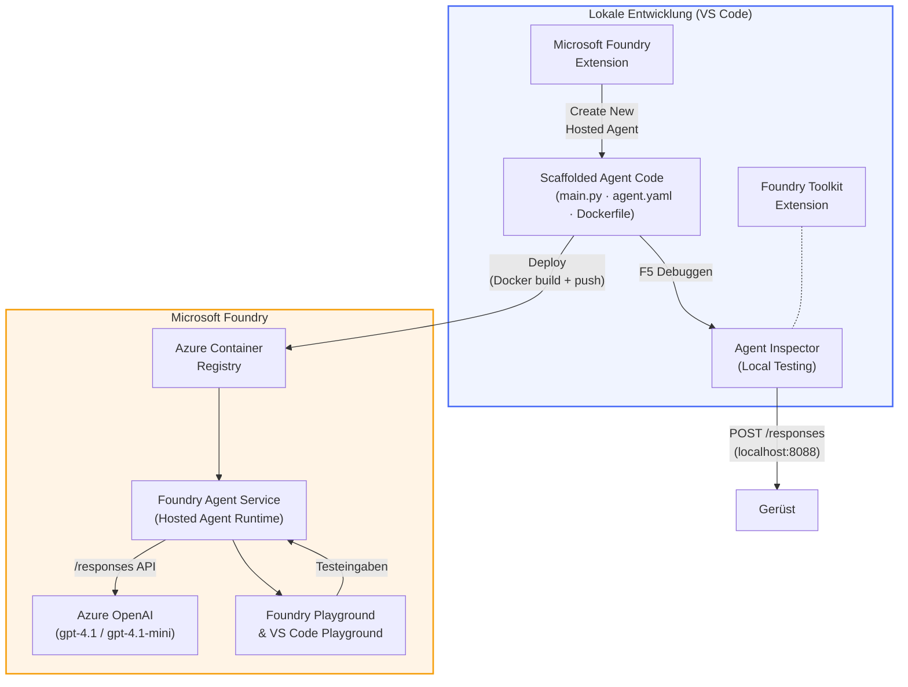

# Foundry Toolkit + Foundry Hosted Agents Workshop

[](https://www.python.org/)
[](https://github.com/microsoft/agents)
[](https://learn.microsoft.com/azure/foundry/agents/concepts/hosted-agents)
[](https://ai.azure.com/)
[](https://learn.microsoft.com/azure/ai-services/openai/)
[](https://learn.microsoft.com/cli/azure/install-azure-cli)
[](https://learn.microsoft.com/azure/developer/azure-developer-cli/install-azd)
[](https://www.docker.com/)
[](https://marketplace.visualstudio.com/items?itemName=ms-windows-ai-studio.windows-ai-studio)
[](LICENSE)

Erstellen, testen und bereitstellen von KI-Agenten zum **Microsoft Foundry Agent Service** als **Hosted Agents** – vollständig aus VS Code heraus mithilfe der **Microsoft Foundry-Erweiterung** und des **Foundry Toolkit**.

> **Hosted Agents befinden sich derzeit in der Vorschau.** Die unterstützten Regionen sind begrenzt – siehe [Verfügbarkeit der Regionen](https://learn.microsoft.com/azure/foundry/agents/concepts/hosted-agents#region-availability).

> Der `agent/`-Ordner in jedem Labor wird **automatisch von der Foundry-Erweiterung erstellt** – Du passt dann den Code an, testest lokal und stellst bereit.

### 🌐 Mehrsprachige Unterstützung

#### Unterstützt über GitHub Action (Automatisiert & immer aktuell)

<!-- CO-OP TRANSLATOR LANGUAGES TABLE START -->
[Arabisch](../ar/README.md) | [Bengalisch](../bn/README.md) | [Bulgarisch](../bg/README.md) | [Birmanisch (Myanmar)](../my/README.md) | [Chinesisch (vereinfacht)](../zh-CN/README.md) | [Chinesisch (traditionell, Hongkong)](../zh-HK/README.md) | [Chinesisch (traditionell, Macau)](../zh-MO/README.md) | [Chinesisch (traditionell, Taiwan)](../zh-TW/README.md) | [Kroatisch](../hr/README.md) | [Tschechisch](../cs/README.md) | [Dänisch](../da/README.md) | [Niederländisch](../nl/README.md) | [Estnisch](../et/README.md) | [Finnisch](../fi/README.md) | [Französisch](../fr/README.md) | [Deutsch](./README.md) | [Griechisch](../el/README.md) | [Hebräisch](../he/README.md) | [Hindi](../hi/README.md) | [Ungarisch](../hu/README.md) | [Indonesisch](../id/README.md) | [Italienisch](../it/README.md) | [Japanisch](../ja/README.md) | [Kannada](../kn/README.md) | [Khmer](../km/README.md) | [Koreanisch](../ko/README.md) | [Litauisch](../lt/README.md) | [Malaiisch](../ms/README.md) | [Malajalam](../ml/README.md) | [Marathi](../mr/README.md) | [Nepalesisch](../ne/README.md) | [Nigerianisches Pidgin](../pcm/README.md) | [Norwegisch](../no/README.md) | [Persisch (Farsi)](../fa/README.md) | [Polnisch](../pl/README.md) | [Portugiesisch (Brasilien)](../pt-BR/README.md) | [Portugiesisch (Portugal)](../pt-PT/README.md) | [Panjabi (Gurmukhi)](../pa/README.md) | [Rumänisch](../ro/README.md) | [Russisch](../ru/README.md) | [Serbisch (Kyrillisch)](../sr/README.md) | [Slowakisch](../sk/README.md) | [Slowenisch](../sl/README.md) | [Spanisch](../es/README.md) | [Swahili](../sw/README.md) | [Schwedisch](../sv/README.md) | [Tagalog (Filipino)](../tl/README.md) | [Tamilisch](../ta/README.md) | [Telugu](../te/README.md) | [Thailändisch](../th/README.md) | [Türkisch](../tr/README.md) | [Ukrainisch](../uk/README.md) | [Urdu](../ur/README.md) | [Vietnamesisch](../vi/README.md)

> **Möchtest du lieber lokal klonen?**
>
> Dieses Repository enthält über 50 Sprachübersetzungen, was die Download-Größe erheblich erhöht. Um ohne Übersetzungen zu klonen, verwende Sparse Checkout:
>
> **Bash / macOS / Linux:**
> ```bash
> git clone --filter=blob:none --sparse https://github.com/microsoft-foundry/Foundry_Toolkit_for_VSCode_Lab.git
> cd Foundry_Toolkit_for_VSCode_Lab
> git sparse-checkout set --no-cone '/*' '!translations' '!translated_images'
> ```
>
> **CMD (Windows):**
> ```cmd
> git clone --filter=blob:none --sparse https://github.com/microsoft-foundry/Foundry_Toolkit_for_VSCode_Lab.git
> cd Foundry_Toolkit_for_VSCode_Lab
> git sparse-checkout set --no-cone "/*" "!translations" "!translated_images"
> ```
>
> Dies gibt dir alles, was du zum Abschluss des Kurses benötigst, mit einem deutlich schnelleren Download.
<!-- CO-OP TRANSLATOR LANGUAGES TABLE END -->

---

## Architektur


```mermaid
flowchart TB
    subgraph Local["Lokale Entwicklung (VS Code)"]
        direction TB
        FE["Microsoft Foundry
        Extension"]
        FoundryToolkit["Foundry Toolkit
        Extension"]
        Scaffold["Scaffolded Agent Code
        (main.py · agent.yaml · Dockerfile)"]
        Inspector["Agent Inspector
        (Local Testing)"]
        FE -- "Create New
        Hosted Agent" --> Scaffold
        Scaffold -- "F5 Debuggen" --> Inspector
        FoundryToolkit -.- Inspector
    end

    subgraph Cloud["Microsoft Foundry"]
        direction TB
        ACR["Azure Container
        Registry"]
        AgentService["Foundry Agent Service
        (Hosted Agent Runtime)"]
        Model["Azure OpenAI
        (gpt-4.1 / gpt-4.1-mini)"]
        Playground["Foundry Playground
        & VS Code Playground"]
        ACR --> AgentService
        AgentService -- "/responses API" --> Model
        AgentService --> Playground
    end

    Scaffold -- "Deploy
    (Docker build + push)" --> ACR
    Inspector -- "POST /responses
    (localhost:8088)" --> Gerüst
    Playground -- "Testeingaben" --> AgentService

    style Local fill:#f0f4ff,stroke:#4a6cf7,stroke-width:2px
    style Cloud fill:#fff4e6,stroke:#f59e0b,stroke-width:2px
```

**Ablauf:** Die Foundry-Erweiterung erstellt den Agenten → Du passt Code & Anweisungen an → Test lokal mit Agent Inspector → Bereitstellung in Foundry (Docker-Image wird zu ACR gepusht) → Überprüfung im Playground.

---

## Was du bauen wirst

| Labor | Beschreibung | Status |
|-----|-------------|--------|
| **Labor 01 - Einzelner Agent** | Baue den **"Explain Like I'm an Executive" Agent**, teste ihn lokal und stelle ihn in Foundry bereit | ✅ Verfügbar |
| **Labor 02 - Multi-Agent Workflow** | Baue den **"Lebenslauf → Job Fit Evaluator"** - 4 Agenten arbeiten zusammen, um die Passgenauigkeit des Lebenslaufs zu bewerten und einen Lernfahrplan zu erstellen | ✅ Verfügbar |

---

## Triff den Executive Agent

In diesem Workshop baust du den **"Explain Like I'm an Executive" Agent** – einen KI-Agenten, der komplexe technische Fachbegriffe nimmt und sie in ruhige, vorstandsreife Zusammenfassungen übersetzt. Denn ehrlich: Keiner im C-Level möchte von „Thread-Pool-Erschöpfung durch synchrone Aufrufe, eingeführt in Version 3.2," hören.

Ich habe diesen Agenten nach zu vielen Vorfällen erstellt, bei denen mein perfekt formulierter "Post-Mortem"-Bericht mit der Antwort endete: *„Also... ist die Webseite jetzt down oder nicht?“*

### Wie es funktioniert

Du gibst ihm ein technisches Update. Er gibt eine Zusammenfassung für Führungskräfte zurück – drei Stichpunkte, kein Fachjargon, keine Stack-Traces, keine existenzielle Verzweiflung. Nur **was passiert ist**, **Geschäftsauswirkung** und **nächster Schritt**.

### Sieh es in Aktion

**Du sagst:**
> „Die API-Latenz hat sich aufgrund von Thread-Pool-Erschöpfung durch synchrone Aufrufe, eingeführt in Version 3.2, erhöht.“

**Der Agent antwortet:**

> **Zusammenfassung für Führungskräfte:**
> - **Was passiert ist:** Nach dem letzten Release hat sich das System verlangsamt.
> - **Geschäftsauswirkung:** Einige Benutzer erlebten Verzögerungen bei der Nutzung des Dienstes.
> - **Nächster Schritt:** Die Änderung wurde zurückgenommen, und es wird ein Fix vorbereitet, bevor erneut bereitgestellt wird.

### Warum dieser Agent?

Es ist ein einfachster Agent mit klarer Aufgabe – perfekt, um den Workflow mit Hosted Agents von Anfang bis Ende zu lernen, ohne sich in komplexen Toolchains zu verlieren. Und ehrlich? Jedes Engineering-Team könnte so einen gebrauchen.

---

## Workshop-Struktur

```
📂 Foundry_Toolkit_for_VSCode_Lab/
├── 📄 README.md                      ← You are here
└── 📂 workshop/
    ├── 📂 lab01-single-agent/        ← Full lab: docs + agent code
    │   ├── README.md                 ← Hands-on lab instructions
    │   ├── 📂 docs/                  ← Step-by-step tutorial modules
    │   │   ├── 00-prerequisites.md
    │   │   ├── 01-setup.md
    │   │   ├── 02-create-hosted-agent.md
    │   │   ├── 03-configure-and-code.md
    │   │   ├── 04-test-locally.md
    │   │   ├── 05-deploy-to-foundry.md
    │   │   ├── 06-verify-in-playground.md
    │   │   ├── 07-summary.md
    │   │   └── 08-troubleshooting.md
    │   └── 📂 agent/                 ← Reference solution (auto-scaffolded by Foundry extension)
    │       ├── agent.yaml
    │       ├── Dockerfile
    │       ├── main.py
    │       └── requirements.txt
    └── 📂 lab02-multi-agent/         ← Resume → Job Fit Evaluator
        ├── README.md                 ← Hands-on lab instructions (end-to-end)
        ├── 📂 docs/                  ← Step-by-step tutorial modules
        │   ├── 00-prerequisites.md
        │   ├── 01-understand-multi-agent.md
        │   ├── 02-scaffold-multi-agent.md
        │   ├── 03-configure-agents.md
        │   ├── 04-orchestration-patterns.md
        │   ├── 05-test-locally.md
        │   ├── 06-deploy-to-foundry.md
        │   ├── 07-verify-in-playground.md
        │   └── 08-troubleshooting.md
        └── 📂 PersonalCareerCopilot/ ← Reference solution (multi-agent workflow)
            ├── agent.yaml
            ├── Dockerfile
            ├── main.py
            └── requirements.txt
```

> **Hinweis:** Der `agent/`-Ordner in jedem Labor ist der Ordner, den die **Microsoft Foundry-Erweiterung** generiert, wenn du `Microsoft Foundry: Create a New Hosted Agent` aus der Befehls-Palette ausführst. Die Dateien werden dann mit den Anweisungen, Tools und Konfigurationen deines Agenten angepasst. Labor 01 führt dich durch die Neuanlage von Grund auf.

---

## Erste Schritte

### 1. Repository klonen

```bash
git clone https://github.com/microsoft-foundry/Foundry_Toolkit_for_VSCode_Lab.git
cd Foundry_Toolkit_for_VSCode_Lab
```

### 2. Python-Virtual Environment einrichten

```bash
python -m venv venv
```

Aktiviere es:

- **Windows (PowerShell):**
  ```powershell
  .\venv\Scripts\Activate.ps1
  ```
- **macOS / Linux:**
  ```bash
  source venv/bin/activate
  ```

### 3. Abhängigkeiten installieren

```bash
pip install -r workshop/lab01-single-agent/agent/requirements.txt
```

### 4. Umgebungsvariablen konfigurieren

Kopiere die Beispiel-`.env`-Datei in den Agenten-Ordner und fülle deine Werte aus:

```bash
cp workshop/lab01-single-agent/agent/.env.example workshop/lab01-single-agent/agent/.env
```

Bearbeite `workshop/lab01-single-agent/agent/.env`:

```env
AZURE_AI_PROJECT_ENDPOINT=https://<your-account>.services.ai.azure.com/api/projects/<your-project>
AZURE_AI_MODEL_DEPLOYMENT_NAME=<your-model-deployment-name>
```

### 5. Folge den Workshop-Laboren

Jedes Labor ist in sich geschlossen mit eigenen Modulen. Starte mit **Labor 01**, um die Grundlagen zu lernen, und fahre dann mit **Labor 02** für Multi-Agent-Workflows fort.

#### Labor 01 - Einzelner Agent ([vollständige Anleitung](workshop/lab01-single-agent/README.md))

| Nr. | Modul | Link |
|---|--------|------|
| 1 | Voraussetzungen lesen | [00-prerequisites.md](workshop/lab01-single-agent/docs/00-prerequisites.md) |
| 2 | Foundry Toolkit & Foundry-Erweiterung installieren | [01-setup.md](workshop/lab01-single-agent/docs/01-setup.md) |
| 3 | Ein Foundry-Projekt erstellen | [01-setup.md](workshop/lab01-single-agent/docs/01-setup.md) |
| 4 | Einen Hosted Agent erstellen | [02-create-hosted-agent.md](workshop/lab01-single-agent/docs/02-create-hosted-agent.md) |
| 5 | Anweisungen & Umgebung konfigurieren | [03-configure-and-code.md](workshop/lab01-single-agent/docs/03-configure-and-code.md) |
| 6 | Lokal testen | [04-test-locally.md](workshop/lab01-single-agent/docs/04-test-locally.md) |
| 7 | In Foundry bereitstellen | [05-deploy-to-foundry.md](workshop/lab01-single-agent/docs/05-deploy-to-foundry.md) |
| 8 | Im Playground überprüfen | [06-verify-in-playground.md](workshop/lab01-single-agent/docs/06-verify-in-playground.md) |
| 9 | Fehlerbehebung | [08-troubleshooting.md](workshop/lab01-single-agent/docs/08-troubleshooting.md) |

#### Labor 02 - Multi-Agent Workflow ([vollständige Anleitung](workshop/lab02-multi-agent/README.md))

| Nr. | Modul | Link |
|---|--------|------|
| 1 | Voraussetzungen (Labor 02) | [00-prerequisites.md](workshop/lab02-multi-agent/docs/00-prerequisites.md) |
| 2 | Multi-Agent-Architektur verstehen | [01-understand-multi-agent.md](workshop/lab02-multi-agent/docs/01-understand-multi-agent.md) |
| 3 | Multi-Agent-Projekt erstellen | [02-scaffold-multi-agent.md](workshop/lab02-multi-agent/docs/02-scaffold-multi-agent.md) |
| 4 | Agenten & Umgebung konfigurieren | [03-configure-agents.md](workshop/lab02-multi-agent/docs/03-configure-agents.md) |
| 5 | Orchestrierungs-Muster | [04-orchestration-patterns.md](workshop/lab02-multi-agent/docs/04-orchestration-patterns.md) |
| 6 | Lokal testen (Multi-Agent) | [05-test-locally.md](workshop/lab02-multi-agent/docs/05-test-locally.md) |

| 7 | Bereitstellung in Foundry | [06-deploy-to-foundry.md](workshop/lab02-multi-agent/docs/06-deploy-to-foundry.md) |
| 8 | Überprüfung im Playground | [07-verify-in-playground.md](workshop/lab02-multi-agent/docs/07-verify-in-playground.md) |
| 9 | Fehlerbehebung (Multi-Agent) | [08-troubleshooting.md](workshop/lab02-multi-agent/docs/08-troubleshooting.md) |

---

## Verantwortlicher

<table>
<tr>
    <td align="center"><a href="https://github.com/ShivamGoyal03">
        <br />
        <sub><b>Shivam Goyal</b></sub>
    </a><br />
    </td>
</tr>
</table>

---

## Erforderliche Berechtigungen (Kurzübersicht)

| Szenario | Erforderliche Rollen |
|----------|---------------|
| Neues Foundry-Projekt erstellen | **Azure AI Owner** für Foundry-Ressource |
| Bereitstellung für bestehendes Projekt (neue Ressourcen) | **Azure AI Owner** + **Contributor** auf Abonnement |
| Bereitstellung für vollständig konfiguriertes Projekt | **Reader** auf Konto + **Azure AI User** im Projekt |

> **Wichtig:** Azure `Owner`- und `Contributor`-Rollen beinhalten nur *Verwaltungs*-Berechtigungen, nicht *Entwicklungs* (Datenaktions-) Berechtigungen. Zum Erstellen und Bereitstellen von Agents benötigen Sie **Azure AI User** oder **Azure AI Owner**.

---

## Referenzen

- [Schnellstart: Bereitstellen Ihres ersten gehosteten Agents (VS Code)](https://learn.microsoft.com/azure/foundry/agents/quickstarts/quickstart-hosted-agent)
- [Was sind gehostete Agents?](https://learn.microsoft.com/azure/foundry/agents/concepts/hosted-agents)
- [Erstellen von gehosteten Agent-Workflows in VS Code](https://learn.microsoft.com/azure/foundry/agents/how-to/vs-code-agents-workflow-pro-code)
- [Bereitstellen eines gehosteten Agents](https://learn.microsoft.com/azure/foundry/agents/how-to/deploy-hosted-agent)
- [RBAC für Microsoft Foundry](https://learn.microsoft.com/azure/foundry/concepts/rbac-foundry)
- [Architecture Review Agent Beispiel](https://github.com/Azure-Samples/agent-architecture-review-sample) - Realer gehosteter Agent mit MCP-Tools, Excalidraw-Diagrammen und Dual-Bereitstellung

---


## Lizenz

[MIT](../../LICENSE)

---

<!-- CO-OP TRANSLATOR DISCLAIMER START -->
**Haftungsausschluss**:
Dieses Dokument wurde mit dem KI-Übersetzungsdienst [Co-op Translator](https://github.com/Azure/co-op-translator) übersetzt. Obwohl wir uns um Genauigkeit bemühen, beachten Sie bitte, dass automatisierte Übersetzungen Fehler oder Ungenauigkeiten enthalten können. Das Originaldokument in seiner Ursprungssprache gilt als maßgebliche Quelle. Bei kritischen Informationen wird eine professionelle menschliche Übersetzung empfohlen. Wir übernehmen keine Haftung für Missverständnisse oder Fehlinterpretationen, die aus der Verwendung dieser Übersetzung entstehen.
<!-- CO-OP TRANSLATOR DISCLAIMER END -->