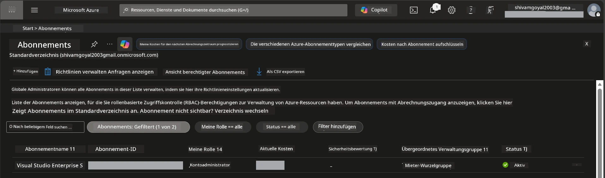

# Modul 0 - Voraussetzungen

Bevor Sie mit dem Workshop beginnen, stellen Sie sicher, dass Sie die folgenden Tools, Zugänge und Umgebungen bereit haben. Folgen Sie jedem Schritt unten – überspringen Sie nichts.

---

## 1. Azure-Konto & Abonnement

### 1.1 Erstellen oder Überprüfen Ihres Azure-Abonnements

1. Öffnen Sie einen Browser und navigieren Sie zu [https://azure.microsoft.com/free/](https://azure.microsoft.com/free/).
2. Falls Sie kein Azure-Konto haben, klicken Sie auf **Start free** und folgen Sie dem Anmeldeprozess. Sie benötigen ein Microsoft-Konto (oder erstellen Sie eins) und eine Kreditkarte zur Identitätsprüfung.
3. Wenn Sie bereits ein Konto haben, melden Sie sich unter [https://portal.azure.com](https://portal.azure.com) an.
4. Klicken Sie im Portal auf das **Abonnements**-Fenster (Blade) in der linken Navigation (oder suchen Sie nach „Abonnements“ in der oberen Suchleiste).
5. Vergewissern Sie sich, dass mindestens ein **Aktives** Abonnement angezeigt wird. Notieren Sie sich die **Abonnement-ID** – Sie benötigen sie später.



### 1.2 Verstehen der erforderlichen RBAC-Rollen

Die [Hosted Agent](https://learn.microsoft.com/azure/foundry/agents/concepts/hosted-agents)-Bereitstellung erfordert **Datenaktions-Berechtigungen**, die die Standardrollen Azure `Owner` und `Contributor` **nicht** enthalten. Sie benötigen eine der folgenden [Rollenkombinationen](https://learn.microsoft.com/azure/foundry/concepts/rbac-foundry#built-in-roles):

| Szenario | Erforderliche Rollen | Wo zuweisen |
|----------|---------------------|-------------|
| Neues Foundry-Projekt erstellen | **Azure AI Owner** auf Foundry-Ressource | Foundry-Ressource im Azure-Portal |
| Bereitstellung in bestehendem Projekt (neue Ressourcen) | **Azure AI Owner** + **Contributor** auf Abonnement | Abonnement + Foundry-Ressource |
| Bereitstellung in komplett konfiguriertem Projekt | **Reader** auf Konto + **Azure AI User** auf Projekt | Konto + Projekt im Azure-Portal |

> **Wichtiger Hinweis:** Azure `Owner` und `Contributor` Rollen decken nur *Management*-Berechtigungen (ARM-Operationen) ab. Sie benötigen [**Azure AI User**](https://learn.microsoft.com/azure/foundry/concepts/rbac-foundry#built-in-roles) (oder höher) für *Datenaktionen* wie `agents/write`, die zur Erstellung und Bereitstellung von Agenten notwendig sind. Diese Rollen weisen Sie in [Modul 2](02-create-foundry-project.md) zu.

---

## 2. Lokale Werkzeuge installieren

Installieren Sie jedes der unten aufgeführten Tools. Überprüfen Sie nach der Installation, ob es funktioniert, indem Sie den Prüfbefehl ausführen.

### 2.1 Visual Studio Code

1. Gehen Sie zu [https://code.visualstudio.com/](https://code.visualstudio.com/).
2. Laden Sie den Installer für Ihr Betriebssystem herunter (Windows/macOS/Linux).
3. Führen Sie den Installer mit den Standardeinstellungen aus.
4. Öffnen Sie VS Code, um zu bestätigen, dass es startet.

### 2.2 Python 3.10+

1. Gehen Sie zu [https://www.python.org/downloads/](https://www.python.org/downloads/).
2. Laden Sie Python 3.10 oder höher herunter (3.12+ empfohlen).
3. **Windows:** Aktivieren Sie während der Installation auf dem ersten Bildschirm **„Python zu PATH hinzufügen“**.
4. Öffnen Sie ein Terminal und überprüfen Sie:

   ```powershell
   python --version
   ```
  
   Erwartete Ausgabe: `Python 3.10.x` oder höher.

### 2.3 Azure CLI

1. Gehen Sie zu [https://learn.microsoft.com/cli/azure/install-azure-cli](https://learn.microsoft.com/cli/azure/install-azure-cli).
2. Folgen Sie der Installationsanleitung für Ihr Betriebssystem.
3. Überprüfen Sie:

   ```powershell
   az --version
   ```
  
   Erwartet: `azure-cli 2.80.0` oder höher.

4. Melden Sie sich an:

   ```powershell
   az login
   ```
  
### 2.4 Azure Developer CLI (azd)

1. Gehen Sie zu [https://learn.microsoft.com/azure/developer/azure-developer-cli/install-azd](https://learn.microsoft.com/azure/developer/azure-developer-cli/install-azd).
2. Folgen Sie der Installationsanleitung für Ihr Betriebssystem. Unter Windows:

   ```powershell
   winget install microsoft.azd
   ```
  
3. Überprüfen Sie:

   ```powershell
   azd version
   ```
  
   Erwartet: `azd version 1.x.x` oder höher.

4. Melden Sie sich an:

   ```powershell
   azd auth login
   ```
  
### 2.5 Docker Desktop (optional)

Docker ist nur notwendig, wenn Sie das Container-Image lokal erstellen und testen möchten, bevor Sie es bereitstellen. Die Foundry-Erweiterung übernimmt den Container-Build während der Bereitstellung automatisch.

1. Gehen Sie zu [https://docs.docker.com/get-docker/](https://docs.docker.com/get-docker/).
2. Laden Sie Docker Desktop für Ihr Betriebssystem herunter und installieren Sie es.
3. **Windows:** Stellen Sie sicher, dass während der Installation das WSL 2-Backend ausgewählt ist.
4. Starten Sie Docker Desktop und warten Sie, bis das Symbol in der Taskleiste **„Docker Desktop is running“** anzeigt.
5. Öffnen Sie ein Terminal und überprüfen Sie:

   ```powershell
   docker info
   ```
  
   Dies sollte die Docker-Systeminformationen ohne Fehler ausgeben. Falls Sie `Cannot connect to the Docker daemon` sehen, warten Sie einige Sekunden, bis Docker vollständig gestartet ist.

---

## 3. VS Code-Erweiterungen installieren

Sie benötigen drei Erweiterungen. Installieren Sie diese **vor** Beginn des Workshops.

### 3.1 Microsoft Foundry für VS Code

1. Öffnen Sie VS Code.
2. Drücken Sie `Ctrl+Shift+X`, um die Erweiterungsansicht zu öffnen.
3. Geben Sie im Suchfeld **„Microsoft Foundry“** ein.
4. Finden Sie **Microsoft Foundry for Visual Studio Code** (Publisher: Microsoft, ID: `TeamsDevApp.vscode-ai-foundry`).
5. Klicken Sie auf **Installieren**.
6. Nach der Installation sollte das **Microsoft Foundry**-Symbol in der Aktivitätsleiste (linke Seitenleiste) erscheinen.

### 3.2 Foundry Toolkit

1. Suchen Sie in der Erweiterungsansicht (`Ctrl+Shift+X`) nach **„Foundry Toolkit“**.
2. Finden Sie **Foundry Toolkit** (Publisher: Microsoft, ID: `ms-windows-ai-studio.windows-ai-studio`).
3. Klicken Sie auf **Installieren**.
4. Das **Foundry Toolkit**-Symbol sollte in der Aktivitätsleiste erscheinen.

### 3.3 Python

1. Suchen Sie in der Erweiterungsansicht nach **„Python“**.
2. Finden Sie **Python** (Publisher: Microsoft, ID: `ms-python.python`).
3. Klicken Sie auf **Installieren**.

---

## 4. Anmeldung bei Azure aus VS Code

Das [Microsoft Agent Framework](https://learn.microsoft.com/agent-framework/overview/) verwendet [`DefaultAzureCredential`](https://learn.microsoft.com/azure/developer/python/sdk/authentication/credential-chains#defaultazurecredential-overview) für die Authentifizierung. Sie müssen in VS Code bei Azure angemeldet sein.

### 4.1 Anmeldung über VS Code

1. Klicken Sie unten links in VS Code auf das **Konten**-Symbol (Personen-Silhouette).
2. Klicken Sie auf **Anmelden, um Microsoft Foundry zu verwenden** (oder **Bei Azure anmelden**).
3. Es öffnet sich ein Browserfenster – melden Sie sich mit dem Azure-Konto an, das Zugriff auf Ihr Abonnement hat.
4. Kehren Sie zu VS Code zurück. Dort sollte unten links Ihr Kontoname sichtbar sein.

### 4.2 (Optional) Anmeldung via Azure CLI

Wenn Sie die Azure CLI installiert haben und eine Anmeldung über die CLI bevorzugen:

```powershell
az login
```
  
Dies öffnet einen Browser zum Anmelden. Nach der Anmeldung legen Sie das richtige Abonnement fest:

```powershell
az account set --subscription "<your-subscription-id>"
```
  
Überprüfen Sie:

```powershell
az account show --query "{name:name, id:id, state:state}" --output table
```
  
Sie sollten Ihren Abonnementnamen, die ID und den Status `Enabled` sehen.

### 4.3 (Alternative) Service Principal Authentifizierung

Für CI/CD oder geteilte Umgebungen setzen Sie stattdessen diese Umgebungsvariablen:

```powershell
$env:AZURE_TENANT_ID = "<your-tenant-id>"
$env:AZURE_CLIENT_ID = "<your-client-id>"
$env:AZURE_CLIENT_SECRET = "<your-client-secret>"
```
  
---

## 5. Vorschau-Beschränkungen

Bevor Sie fortfahren, beachten Sie die aktuellen Beschränkungen:

- [**Hosted Agents**](https://learn.microsoft.com/azure/foundry/agents/concepts/hosted-agents) befinden sich derzeit in der **öffentlichen Vorschau** – nicht für produktive Workloads empfohlen.
- **Unterstützte Regionen sind begrenzt** – prüfen Sie die [Regionsverfügbarkeit](https://learn.microsoft.com/azure/foundry/agents/concepts/hosted-agents#region-availability) vor Ressourcenerstellung. Wenn Sie eine nicht unterstützte Region wählen, schlägt die Bereitstellung fehl.
- Das Paket `azure-ai-agentserver-agentframework` ist eine Vorabversion (`1.0.0b16`) – APIs können sich ändern.
- Skalierungsgrenzen: Hosted Agents unterstützen 0-5 Replikate (einschließlich Scale-to-Zero).

---

## 6. Vorab-Checkliste

Gehen Sie jeden Punkt unten durch. Falls ein Schritt fehlschlägt, beheben Sie das Problem, bevor Sie fortfahren.

- [ ] VS Code startet ohne Fehler
- [ ] Python 3.10+ ist in Ihrem PATH (`python --version` zeigt `3.10.x` oder höher)
- [ ] Azure CLI ist installiert (`az --version` zeigt `2.80.0` oder höher)
- [ ] Azure Developer CLI ist installiert (`azd version` zeigt Versionsinfos)
- [ ] Microsoft Foundry-Erweiterung ist installiert (Symbol in Aktivitätsleiste sichtbar)
- [ ] Foundry Toolkit-Erweiterung ist installiert (Symbol in Aktivitätsleiste sichtbar)
- [ ] Python-Erweiterung ist installiert
- [ ] Sie sind in VS Code bei Azure angemeldet (Konten-Symbol unten links überprüfen)
- [ ] `az account show` zeigt Ihr Abonnement an
- [ ] (Optional) Docker Desktop läuft (`docker info` zeigt Systeminfos ohne Fehler)

### Kontrollpunkt

Öffnen Sie die Aktivitätsleiste von VS Code und bestätigen Sie, dass Sie sowohl die **Foundry Toolkit** als auch die **Microsoft Foundry** Sidebar-Ansichten sehen können. Klicken Sie auf beide, um sicherzustellen, dass sie ohne Fehler laden.

---

**Weiter:** [01 - Installieren von Foundry Toolkit & Foundry Extension →](01-install-foundry-toolkit.md)

---

<!-- CO-OP TRANSLATOR DISCLAIMER START -->
**Haftungsausschluss**:  
Dieses Dokument wurde mit dem KI-Übersetzungsdienst [Co-op Translator](https://github.com/Azure/co-op-translator) übersetzt. Obwohl wir uns um Genauigkeit bemühen, beachten Sie bitte, dass automatisierte Übersetzungen Fehler oder Ungenauigkeiten enthalten können. Das Originaldokument in seiner Ursprungssprache gilt als verbindliche Quelle. Für wichtige Informationen wird eine professionelle menschliche Übersetzung empfohlen. Wir übernehmen keine Haftung für Missverständnisse oder Fehlinterpretationen, die aus der Nutzung dieser Übersetzung entstehen.
<!-- CO-OP TRANSLATOR DISCLAIMER END -->