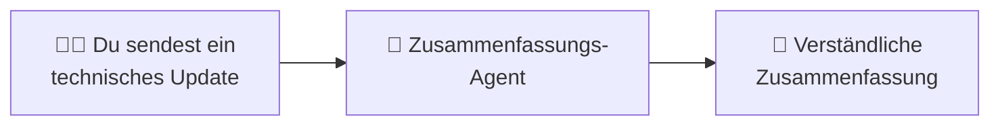

# Modul 0 - Einführung

⏱️ ~10 Min.

> [!WARNING]
> **Vorschau & Einschränkungen:** [Gehostete Agents](https://learn.microsoft.com/azure/foundry/agents/concepts/hosted-agents) befinden sich derzeit in der **öffentlichen Vorschau** – nicht für produktive Workloads empfohlen. Beachten Sie Folgendes:
> - **Unterstützte Regionen sind begrenzt** – prüfen Sie die [Regionsverfügbarkeit](https://learn.microsoft.com/azure/foundry/agents/concepts/hosted-agents#region-availability), bevor Sie Ressourcen erstellen. Wenn Sie eine nicht unterstützte Region wählen, schlägt die Bereitstellung fehl.
> - Das Paket `azure-ai-agentserver-agentframework` ist eine Vorabversion – APIs können sich zwischen den Versionen ändern.
> - Skalierungsgrenzen: Gehostete Agents unterstützen 0–5 Replikate (einschließlich Skalierung auf Null).
> - Einige in diesem Workshop gezeigte Funktionen können sich ändern, wenn der Dienst näher an die allgemeine Verfügbarkeit (GA) kommt.

## Was du bauen wirst

In diesem Workshop baust du einen **„Erkläre es, als wäre ich eine Führungskraft“**-Agenten – einen gehosteten KI-Agenten, der komplexe technische Updates nimmt und sie als klare, für Führungskräfte verständliche Zusammenfassungen umschreibt.

```mermaid
flowchart LR
    A["🧑‍💻 Du sendest ein\ntechnisches Update"] --> B["🤖 Zusammenfassungs-\nAgent"]
    B --> C["📝 Verständliche\nZusammenfassung"]
```

**Der Agent verwendet:**
- **Microsoft Agent Framework** – für Agentenlogik und -struktur
- **Foundry Toolkit für VS Code** – zum Gerüstaufbau, lokalen Testen und Bereitstellen
- **Ein KI-Modell** (z.B. `gpt-4.1-mini/gpt-5-mini`) – zur Generierung der Zusammenfassungen

Am Ende dieses Labs hast du einen funktionierenden Agenten, den du lokal mit dem Agent Inspector testen und optional in die Cloud bereitstellen kannst.

---

## Was sind gehostete Agents?

Ein **gehosteter Agent** ist ein KI-Agent, der als verwalteter Dienst in Microsoft Foundry ausgeführt wird. Statt deine eigene Infrastruktur zu verwalten, paketierst du deinen Agenten-Code in einem Container und Foundry übernimmt Skalierung, Hosting und stellt einen standardmäßigen HTTP-Endpunkt bereit.

| Konzept | Bedeutung |
|---------|--------------|
| **Agent** | Dein Python-Code, der eine Benutzeranfrage erhält, ein KI-Modell aufruft und eine strukturierte Antwort zurückgibt |
| **Gehostet** | Foundry betreibt deinen Container für dich – keine VMs, kein Kubernetes, keine Infrastrukturverwaltung |
| **Antwortprotokoll** | Eine standardmäßige HTTP-API (`POST /responses`), die jeder Client zum Interagieren mit deinem Agenten aufrufen kann |
| **Agent Inspector** | Eine lokale Test-UI (integriert im Foundry Toolkit), mit der du vor der Bereitstellung mit deinem Agenten chatten kannst |

In diesem Workshop gehst du von Null zu einem vollständig gehosteten Agenten – oder stoppst beim lokalen Testen, wenn du möchtest.

---

## Wähle deinen Weg

> ⚠️ **Wähle einen Weg, bevor du fortfährst.** Deine Wahl bestimmt, welche Tools du installierst und welche Module applicable sind. Du kannst später von Weg B → Weg A wechseln, wenn du ein Abonnement hast.

<strong>🅰️ Weg A – Azure Cloud (erfordert Azure-Abonnement)</strong>

| | Details |
|---|---|
| **Für wen?** | Du hast ein aktives Azure-Abonnement und kannst Foundry-Ressourcen erstellen |
| **Modell** | Azure OpenAI via Foundry (z.B. `gpt-4.1-mini/gpt-5-mini`) |
| **Abgedeckte Module** | Alle Module (00–07) |
| **Cloud-Bereitstellung?** | ✅ Ja – vollständige End-to-End-Bereitstellung |

<strong>🅱️ Weg B – Lokal / Free-Tier (kein Azure-Abonnement benötigt)</strong>

| | Details |
|---|---|
| **Für wen?** | MVPs, Studierende oder alle ohne Azure-Zugang |
| **Modell** | **Foundry Local** (kostenlos, läuft auf deinem Rechner) |
| **Abgedeckte Module** | Module 00–04 (ohne Bereitstellung & Cloud-Verifizierung) |
| **Cloud-Bereitstellung?** | ❌ Nein – nur lokale Tests via Agent Inspector |

---

## Alle Wege: Benötigte Tools

Installiere die folgenden Tools. Nach der Installation überprüfe die Funktionalität mit dem Prüfbefehl.

| # | Tool | Version | Installation | Überprüfung (erwartete Ausgabe) |
|---|------|---------|-------------|------------------------------------|
| 1 | **Visual Studio Code** | Neueste | [code.visualstudio.com](https://code.visualstudio.com/) | Startet ohne Fehler |
| 2 | **Python** | 3.12 oder höher | [python.org/downloads](https://www.python.org/downloads/) | `python --version` $\rightarrow$ `Python 3.12.x` |
| 3 | **Foundry Toolkit für VS Code** | Neueste | Extension ID: `ms-windows-ai-studio.windows-ai-studio` | Foundry-Symbol in der Aktivitätsleiste |
| 4 | **Python-Erweiterung für VS Code** | Neueste | Extension ID: `ms-python.python` | Im Erweiterungsfenster installiert |

> [!TIP]
> **Profi-Tipps zur Installation:**
> - **Python PATH (Windows):** Kontrolliere immer **„Python zum PATH hinzufügen“** im ersten Bildschirm des Python-Installers. Ohne das wird `python` im Terminal nicht erkannt.
> - **Mehrere Python-Versionen:** Wenn du sowohl Python 3.10 als auch 3.12 installiert hast, nutze `python3.12 -m venv .venv`, um sicherzustellen, dass die korrekte Version für deine virtuelle Umgebung verwendet wird.
> - **Docker WSL 2 (Windows):** Während der Docker Desktop-Installation wähle unbedingt die **WSL 2-Backend**-Option aus. Docker mit Hyper-V ist langsamer und kann Probleme mit Foundry-Container-Builds verursachen.
> - **Docker startet nicht?** Warte 30–60 Sekunden nach dem Start von Docker Desktop. Führe `docker info` aus – wenn „Cannot connect to the Docker daemon“ erscheint, initialisiert Docker noch.
> - **VS Code-Erweiterungen laden nicht?** Nach der Installation der Erweiterungen Fenster neu laden: `Ctrl+Shift+P` → `Developer: Reload Window`.

> **Windows-Nutzer:** Wähle **„Python zum PATH hinzufügen“** während der Python-Installation.

**Weiter:** [01 - Setup →](01-setup.md)

---

<!-- CO-OP TRANSLATOR DISCLAIMER START -->
**Haftungsausschluss**:
Dieses Dokument wurde mit dem KI-Übersetzungsdienst [Co-op Translator](https://github.com/Azure/co-op-translator) übersetzt. Obwohl wir uns um Genauigkeit bemühen, beachten Sie bitte, dass automatisierte Übersetzungen Fehler oder Ungenauigkeiten enthalten können. Das Originaldokument in seiner Ursprungssprache gilt als maßgebliche Quelle. Bei kritischen Informationen wird eine professionelle menschliche Übersetzung empfohlen. Wir übernehmen keine Haftung für Missverständnisse oder Fehlinterpretationen, die aus der Verwendung dieser Übersetzung entstehen.
<!-- CO-OP TRANSLATOR DISCLAIMER END -->