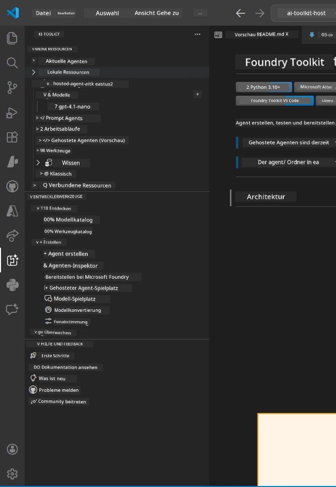
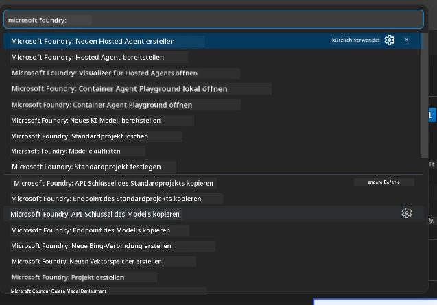

# Modul 1 - Installieren des Foundry Toolkits & der Foundry-Erweiterung

Dieses Modul führt Sie durch die Installation und Überprüfung der beiden wichtigsten VS Code-Erweiterungen für diesen Workshop. Wenn Sie diese bereits in [Modul 0](00-prerequisites.md) installiert haben, verwenden Sie dieses Modul, um sicherzustellen, dass sie korrekt funktionieren.

---

## Schritt 1: Installieren der Microsoft Foundry-Erweiterung

Die **Microsoft Foundry für VS Code**-Erweiterung ist Ihr Hauptwerkzeug zum Erstellen von Foundry-Projekten, Bereitstellen von Modellen, Gerüsten von gehosteten Agenten und direktem Deployment aus VS Code.

1. Öffnen Sie VS Code.
2. Drücken Sie `Ctrl+Shift+X`, um das **Erweiterungen**-Fenster zu öffnen.
3. Geben Sie oben im Suchfeld ein: **Microsoft Foundry**
4. Suchen Sie das Ergebnis mit dem Titel **Microsoft Foundry for Visual Studio Code**.
   - Herausgeber: **Microsoft**
   - Erweiterungs-ID: `TeamsDevApp.vscode-ai-foundry`
5. Klicken Sie auf die Schaltfläche **Installieren**.
6. Warten Sie, bis die Installation abgeschlossen ist (Sie sehen eine kleine Fortschrittsanzeige).
7. Nach der Installation sehen Sie in der **Aktivitätsleiste** (die vertikale Symbolleiste auf der linken Seite von VS Code) ein neues **Microsoft Foundry**-Symbol (ähnelt einem Diamanten/AI-Symbol).
8. Klicken Sie auf das **Microsoft Foundry**-Symbol, um die Seitenleiste zu öffnen. Dort sollten Sie Abschnitte sehen für:
   - **Ressourcen** (oder Projekte)
   - **Agenten**
   - **Modelle**

> **Wenn das Symbol nicht erscheint:** Versuchen Sie, VS Code neu zu laden (`Ctrl+Shift+P` → `Developer: Reload Window`).

---

## Schritt 2: Installieren der Foundry Toolkit-Erweiterung

Die **Foundry Toolkit**-Erweiterung bietet den [**Agent Inspector**](https://learn.microsoft.com/azure/foundry/agents/how-to/vs-code-agents-workflow-pro-code) – eine visuelle Oberfläche zum lokalen Testen und Debuggen von Agenten – sowie Playground-, Modellverwaltungs- und Bewertungstools.

1. Geben Sie im Erweiterungen-Fenster (`Ctrl+Shift+X`) im Suchfeld ein: **Foundry Toolkit**
2. Finden Sie **Foundry Toolkit** in den Ergebnissen.
   - Herausgeber: **Microsoft**
   - Erweiterungs-ID: `ms-windows-ai-studio.windows-ai-studio`
3. Klicken Sie auf **Installieren**.
4. Nach der Installation erscheint das **Foundry Toolkit**-Symbol in der Aktivitätsleiste (sieht aus wie ein Roboter-/Funkelsymbol).
5. Klicken Sie auf das **Foundry Toolkit**-Symbol, um die Seitenleiste zu öffnen. Sie sollten den Willkommensbildschirm des Foundry Toolkits mit Optionen sehen für:
   - **Modelle**
   - **Playground**
   - **Agenten**

---

## Schritt 3: Überprüfen, ob beide Erweiterungen funktionieren

### 3.1 Microsoft Foundry-Erweiterung überprüfen

1. Klicken Sie auf das **Microsoft Foundry**-Symbol in der Aktivitätsleiste.
2. Falls Sie bei Azure angemeldet sind (aus Modul 0), sollten Ihre Projekte unter **Ressourcen** aufgeführt sein.
3. Wenn Sie zur Anmeldung aufgefordert werden, klicken Sie auf **Anmelden** und folgen Sie dem Authentifizierungsprozess.
4. Bestätigen Sie, dass die Seitenleiste ohne Fehler angezeigt wird.

### 3.2 Foundry Toolkit-Erweiterung überprüfen

1. Klicken Sie auf das **Foundry Toolkit**-Symbol in der Aktivitätsleiste.
2. Bestätigen Sie, dass der Willkommensbildschirm oder das Hauptfenster ohne Fehler geladen wird.
3. Sie müssen noch nichts konfigurieren – wir verwenden den Agent Inspector in [Modul 5](05-test-locally.md).

### 3.3 Überprüfung über die Befehls-Palette

1. Drücken Sie `Ctrl+Shift+P`, um die Befehls-Palette zu öffnen.
2. Geben Sie **"Microsoft Foundry"** ein – Sie sollten Befehle sehen wie:
   - `Microsoft Foundry: Create a New Hosted Agent`
   - `Microsoft Foundry: Deploy Hosted Agent`
   - `Microsoft Foundry: Open Model Catalog`
3. Drücken Sie `Escape`, um die Befehls-Palette zu schließen.
4. Öffnen Sie die Befehls-Palette erneut und geben Sie **"Foundry Toolkit"** ein – Sie sollten Befehle sehen wie:
   - `Foundry Toolkit: Open Agent Inspector`

> Wenn Sie diese Befehle nicht sehen, sind die Erweiterungen möglicherweise nicht korrekt installiert. Versuchen Sie, sie zu deinstallieren und erneut zu installieren.

---

## Was diese Erweiterungen in diesem Workshop tun

| Erweiterung | Funktion | Wann Sie sie verwenden |
|-------------|----------|-----------------------|
| **Microsoft Foundry für VS Code** | Erstellen von Foundry-Projekten, Bereitstellen von Modellen, **Gerüstbildung von [gehosteten Agenten](https://learn.microsoft.com/azure/foundry/agents/concepts/hosted-agents)** (generiert automatisch `agent.yaml`, `main.py`, `Dockerfile`, `requirements.txt`), Deployment beim [Foundry Agent Service](https://learn.microsoft.com/azure/foundry/agents/overview) | Module 2, 3, 6, 7 |
| **Foundry Toolkit** | Agent Inspector für lokales Testen/Debuggen, Playground-Oberfläche, Modellverwaltung | Module 5, 7 |

> **Die Foundry-Erweiterung ist das wichtigste Tool in diesem Workshop.** Sie verwaltet den gesamten Lebenszyklus: Gerüstbildung → Konfiguration → Deployment → Überprüfung. Das Foundry Toolkit ergänzt dies durch den visuellen Agent Inspector für lokale Tests.

---

### Kontrollpunkt

- [ ] Microsoft Foundry-Symbol ist in der Aktivitätsleiste sichtbar
- [ ] Ein Klick darauf öffnet die Seitenleiste ohne Fehler
- [ ] Foundry Toolkit-Symbol ist in der Aktivitätsleiste sichtbar
- [ ] Ein Klick darauf öffnet die Seitenleiste ohne Fehler
- [ ] `Ctrl+Shift+P` → Eingabe "Microsoft Foundry" zeigt verfügbare Befehle
- [ ] `Ctrl+Shift+P` → Eingabe "Foundry Toolkit" zeigt verfügbare Befehle

---

**Zurück:** [00 - Voraussetzungen](00-prerequisites.md) · **Weiter:** [02 - Foundry-Projekt erstellen →](02-create-foundry-project.md)

---

<!-- CO-OP TRANSLATOR DISCLAIMER START -->
**Haftungsausschluss**:  
Dieses Dokument wurde mit dem KI-Übersetzungsdienst [Co-op Translator](https://github.com/Azure/co-op-translator) übersetzt. Während wir uns um Genauigkeit bemühen, beachten Sie bitte, dass automatisierte Übersetzungen Fehler oder Ungenauigkeiten enthalten können. Das Originaldokument in seiner Ursprungssprache gilt als maßgebliche Quelle. Für kritische Informationen wird eine professionelle menschliche Übersetzung empfohlen. Wir übernehmen keine Haftung für Missverständnisse oder Fehlinterpretationen, die aus der Verwendung dieser Übersetzung entstehen.
<!-- CO-OP TRANSLATOR DISCLAIMER END -->