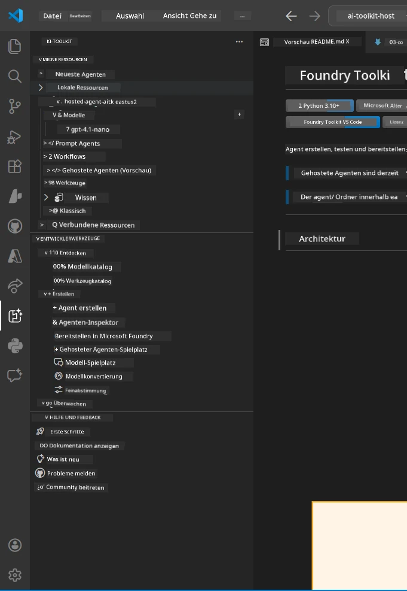
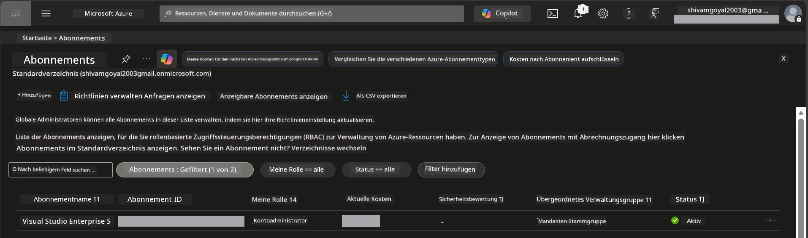
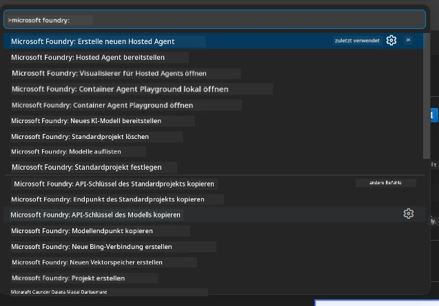
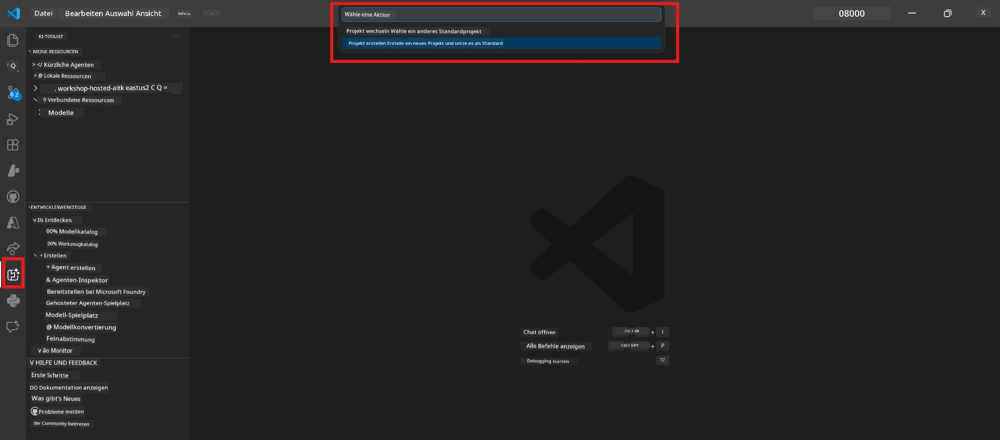
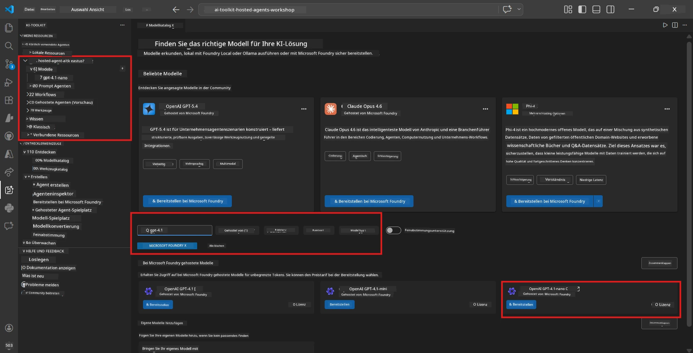
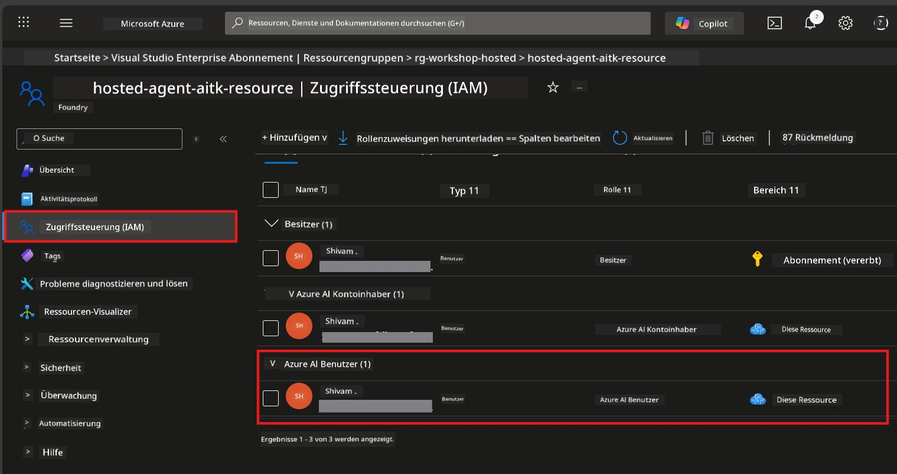

# Einrichtung: Erweiterung, Projekt & Modell

⏱️ ~15 Min.

In diesem Modul installieren und überprüfen Sie die Foundry Toolkit-Erweiterung, erstellen (oder verbinden sich mit) ein Foundry-Projekt und setzen ein Modell ein, das Ihr Agent verwenden wird.

## Schritt 1: Foundry Toolkit installieren

**Foundry Toolkit für VS Code** ist die Haupt-Erweiterung für diesen Workshop. Sie bietet Projekterstellung, Modellauslieferung, Agentengerüst, lokale Tests (Agent Inspector) und Cloud-Bereitstellung – alles aus VS Code.

1. Öffnen Sie VS Code und drücken Sie `Strg+Shift+X`, um das **Extensions**-Panel zu öffnen.
2. Suchen Sie nach **Foundry Toolkit**.
3. Installieren Sie **Foundry Toolkit für VS Code** (Publisher: Microsoft, ID: `ms-windows-ai-studio.windows-ai-studio`).
4. Nach der Installation erscheint das **Foundry Toolkit**-Symbol in der Aktivitätsleiste (linke Seitenleiste).

> *Hinweis: Die Aktivitätsleiste kann in älteren Erweiterungsversionen "AI TOOLKIT" anzeigen. Die Funktionalität ist jedoch gleich.*



## Schritt 2: Einrichtung basierend auf Ihrem Zugang

> **Wählen Sie Ihren Pfad:** Erweitern Sie den Bereich unten, der zu Ihrer Einrichtung passt. Sie müssen nur **einen** Pfad abschließen.

<details>
<summary><strong>🅰️ Pfad A - Azure Cloud (erfordert Azure-Abonnement)</strong></summary>

### Azure CLI

1. Installation unter [learn.microsoft.com/cli/azure/install-azure-cli](https://learn.microsoft.com/cli/azure/install-azure-cli).
2. Überprüfen: `az --version` (mindestens Version 2.80.0).
3. Anmeldung: `az login`

### Authentifizierungsoptionen

Das [Microsoft Agent Framework](https://learn.microsoft.com/agent-framework/overview/) verwendet [`DefaultAzureCredential`](https://learn.microsoft.com/azure/developer/python/sdk/authentication/credential-chains#defaultazurecredential-overview), das mehrere Authentifizierungsmethoden der Reihenfolge nach ausprobiert. Wählen Sie jene aus, die am besten zu Ihrer Umgebung passt:

#### Option 1: VS Code Konten (empfohlen für Workshops)
1. Klicken Sie auf das **Konten**-Symbol (Personen-Silhouette) unten links in VS Code.
2. Wählen Sie **Anmelden, um Microsoft Foundry zu nutzen** (oder **Mit Azure anmelden**).
3. Ein Browser öffnet sich – melden Sie sich mit dem Azure-Konto an, das Zugriff auf Ihr Abonnement hat.
4. Kehren Sie zu VS Code zurück. Ihr Kontoname sollte unten links angezeigt werden.

#### Option 2: Azure CLI
```bash
az login
az account set --subscription "<your-subscription-id>"
```

#### Option 3: Service Principal (Enterprise/CI)
Für gesicherte Umgebungen oder CI/CD-Pipelines setzen Sie diese Umgebungsvariablen in Ihrer `.env`-Datei:
```env
AZURE_TENANT_ID=<your-tenant-id>
AZURE_CLIENT_ID=<your-client-id>
AZURE_CLIENT_SECRET=<your-client-secret>
```

> **Funktionsweise von `DefaultAzureCredential`:** Es versucht zuerst Umgebungsvariablen, dann verwaltete Identität, anschließend VS Code-Anmeldung und zuletzt Azure CLI – und verwendet die erste erfolgreiche Methode. Siehe [Dokumentation zur Credential-Kette](https://learn.microsoft.com/azure/developer/python/sdk/authentication/credential-chains#defaultazurecredential-overview).

### Azure Developer CLI (azd)

1. Installieren: `winget install microsoft.azd` (Windows) oder siehe [Installationsanleitung](https://learn.microsoft.com/azure/developer/azure-developer-cli/install-azd).
2. Überprüfen: `azd version`
3. Anmelden: `azd auth login`

### Docker Desktop (optional)

Docker wird nur benötigt, wenn Sie Container lokal bauen möchten. Die Foundry-Erweiterung übernimmt Builds automatisch während der Bereitstellung.

1. Installation unter [docs.docker.com/get-docker](https://docs.docker.com/get-docker/).
2. Überprüfen: `docker info`

### Azure Abonnement & RBAC

1. Melden Sie sich unter [portal.azure.com](https://portal.azure.com) an.
2. Navigieren Sie zu **Abonnements** und bestätigen Sie, dass mindestens eines **Aktiv** ist.
3. Notieren Sie Ihre **Abonnement-ID** – Sie benötigen sie in Modul 01.



#### RBAC-Szenarientabelle

Die Bereitstellung von [Hosted Agent](https://learn.microsoft.com/azure/foundry/agents/concepts/hosted-agents) erfordert **Data Action**-Berechtigungen, die Standard-Azure-`Owner`- und `Contributor`-Rollen **nicht** beinhalten. Verwenden Sie die folgende Tabelle, um die benötigten Rollen zu bestimmen:

| Szenario | Erforderliche Rollen | Zuweisungsort |
|----------|---------------------|---------------|
| Neues Foundry-Projekt erstellen | **Azure AI Owner** auf Foundry-Ressource | Foundry-Ressource im Azure-Portal |
| Bereitstellung in bestehendes Projekt (neue Ressourcen) | **Azure AI Owner** + **Contributor** auf Abonnement | Abonnement + Foundry-Ressource |
| Bereitstellung in voll konfiguriertes Projekt | **Reader** auf Konto + **Azure AI User** auf Projekt | Konto + Projekt im Azure-Portal |
| Nur lokale Tests (keine Bereitstellung) | **Azure AI User** auf Projekt | Projekt im Azure-Portal |

> **Wichtig:** Azure-`Owner`- und `Contributor`-Rollen decken nur *Verwaltungs*berechtigungen (ARM-Operationen) ab. Für *Data Actions* wie `agents/write`, die zum Erstellen und Bereitstellen von Agents erforderlich sind, brauchen Sie [**Azure AI User**](https://learn.microsoft.com/azure/foundry/concepts/rbac-foundry#built-in-roles) (oder höher).

## Mit Foundry-Projekt verbinden oder neues erstellen



1. Drücken Sie `Strg+Shift+P` → geben Sie **Foundry Toolkit: Projekt erstellen** ein → auswählen.
2. Wählen Sie Ihr **Azure-Abonnement** aus dem Dropdown.
3. Wählen oder erstellen Sie eine **Ressourcengruppe** (z. B. `rg-hosted-agents-workshop`).
4. Wählen Sie eine **Region**, die Hosted Agents unterstützt: `East US`, `West US 2` oder `Sweden Central`. Siehe [Verfügbarkeitsregionen](https://learn.microsoft.com/azure/foundry/agents/concepts/hosted-agents#region-availability).
5. Geben Sie einen Projektnamen ein (z. B. `workshop-agents`).
6. Warten Sie 2–5 Minuten für die Bereitstellung. Eine Fortschrittsbenachrichtigung erscheint in VS Code.
7. Nach Abschluss erscheint Ihr Projekt in der **Foundry Toolkit**-Seitenleiste unter **MEINE RESSOURCEN**.



## Modell bereitstellen & RBAC zuweisen

Ihr Hosted Agent benötigt ein KI-Modell, um Antworten zu generieren.

#### Modell-Auswahlmatrix
Je nach Bedarf können Sie zwischen verschiedenen Modellstufen wählen:

| Modell | Am besten für | Kosten | Hinweise |
|--------|--------------|--------|----------|
| `gpt-4.1` | Hochwertige, nuancierte Antworten | Höher | Beste Ergebnisse, empfohlen für abschließende Tests |
| `gpt-4.1-mini/gpt-5-mini` | Schnelle Iteration, niedriger Kosten | Niedriger | Gut für Workshop-Entwicklung und schnelle Tests |
| `gpt-4.1-nano` | Leichte Aufgaben | Am niedrigsten | Kosteneffektiv, aber einfachere Antworten |

1. Drücken Sie `Strg+Shift+P` → **Foundry Toolkit: Modellkatalog öffnen** (oder klicken Sie im Sidebar unter ENTWICKLERWERKZEUGE → Entdecken auf **Modellkatalog**).
2. Suchen Sie im Katalog nach **gpt-4.1**.
3. Finden Sie **OpenAI GPT-4.1-mini** (oder `gpt-5-mini` für bessere Qualität) und klicken Sie auf **Bereitstellen**.



4. In der Bereitstellungskonfiguration:
   - **Bereitstellungsname:** Belassen Sie den Standard oder geben Sie einen eigenen Namen ein. **Merken Sie sich diesen Namen.**
   - **Ziel:** Wählen Sie **Bereitstellen im Foundry Toolkit** → wählen Sie Ihr Projekt.
5. Klicken Sie auf **Bereitstellen** und warten Sie 1–3 Minuten.

> **Empfehlung:** Nutzen Sie `gpt-4.1-mini/gpt-5-mini` für den Workshop – schnell, günstig und gute Ergebnisse erzielend.

### Werte notieren

Nach der Bereitstellung notieren Sie sich diese zwei Werte (benötigen Sie in Modul 03):

| Wert | Wo zu finden |
|------|--------------|
| **Projekt-Endpunkt** | Klicken Sie in der Seitenleiste auf Ihr Projekt → Detailansicht zeigt die URL (z. B. `https://<account>.services.ai.azure.com/api/projects/<project>`) |
| **Name der Modellbereitstellung** | Erweitern Sie Projekt → **Modelle** → Name neben Ihrem bereitgestellten Modell (z. B. `gpt-4.1-mini/gpt-5-mini`) |

### RBAC-Rolle zuweisen

> ⚠️ **Dies ist der häufigste vergessene Schritt.** Ohne die richtige Rolle wird die Bereitstellung in Modul 05 fehlschlagen.

#### Welche Rolle benötige ich?
Je nach Szenario benötigen Sie folgende Rollenkombinationen:

| Szenario | Erforderliche Rollen | Zuweisungsort |
|----------|---------------------|---------------|
| Neues Foundry-Projekt erstellen | **Azure AI Owner** auf Foundry-Ressource | Foundry-Ressource im Azure-Portal |
| Bereitstellung in bestehendes Projekt (neue Ressourcen) | **Azure AI Owner** + **Contributor** auf Abonnement | Abonnement + Foundry-Ressource |
| Bereitstellung in voll konfiguriertes Projekt | **Reader** auf Konto + **Azure AI User** auf Projekt | Konto + Projekt im Azure-Portal |

**Wichtig:** Azure-`Owner`- und `Contributor`-Rollen decken nur *Verwaltungs*berechtigungen ab. Für *Data Actions* wie `agents/write`, die zum Erstellen und Bereitstellen von Agents nötig sind, benötigen Sie **Azure AI User** (oder höher).

1. Öffnen Sie [portal.azure.com](https://portal.azure.com).
2. Suchen Sie Ihren **Foundry-Projektnamen** → klicken Sie das Ergebnis vom Typ **"Foundry Toolkit project"** (NICHT das übergeordnete Konto).
3. Klicken Sie links auf **Zugriffssteuerung (IAM)**.
4. Klicken Sie auf **+ Hinzufügen** → **Rollenzuweisung hinzufügen**.
5. **Rollen-Tab:** Suchen Sie nach **Azure AI User**, wählen Sie diese Rolle aus und klicken Sie auf **Weiter**.
6. **Mitglieder-Tab:** Wählen Sie **Benutzer, Gruppe oder Dienstprinzipal** → klicken Sie auf **+ Mitglieder auswählen** → suchen und wählen Sie sich selbst aus → klicken Sie auf **Auswählen**.
7. Klicken Sie auf **Überprüfen + zuweisen** → erneut auf **Überprüfen + zuweisen**.
8. **Warten Sie 1–2 Minuten** auf die Propagierung.

> **Warum diese Rolle?** Azure-`Owner`/`Contributor` gewähren nur Verwaltungsberechtigungen. Die **Azure AI User**-Rolle enthält die `agents/write` Data Action, die zum Erstellen und Bereitstellen von Agents erforderlich ist. Siehe [Foundry RBAC-Dokumentation](https://learn.microsoft.com/azure/foundry/concepts/rbac-foundry#built-in-roles).



</details>

<details>
<summary><strong>🅱️ Pfad B - Lokal / Free-Tier (kein Azure-Abonnement benötigt)</strong></summary>

### Foundry Local

Foundry Local ermöglicht es Ihnen, KI-Modelle auf Ihrem eigenen Rechner auszuführen – kein Cloud-Konto erforderlich. Sie können Foundry Local-Modelle mit Foundry Toolkit über den Modellkatalog wie folgt verwenden:

1. Öffnen Sie die Foundry Toolkit-Erweiterung.
2. Navigieren Sie in Foundry Toolkit zu **Entwicklerwerkzeuge** > und wählen Sie **Modellkatalog**.
3. Wählen Sie im neuen Fenster in der Navigationsleiste **lokal** aus.
4. Scrollen Sie zu **Phi 4 Mini** und klicken Sie auf die **Hinzufügen-Schaltfläche**. Ein Popup erscheint, das anzeigt, dass das Modell heruntergeladen wird.
5. Sobald das Modell heruntergeladen ist, können Sie zum nächsten Schritt fortfahren.

</details>

### ✅ Kontrollpunkt


- [ ] `Strg+Shift+P` → "Foundry Toolkit" zeigt verfügbare Befehle an
- [ ] Foundry Toolkit-Erweiterung installiert und Seitenleiste lädt ohne Fehler
- [ ] VS Code öffnet und läuft korrekt
- [ ] `python --version` zeigt 3.10+
- [ ] Foundry Toolkit-Symbol sichtbar in der VS Code Aktivitätsleiste
- [ ] **Pfad A:** `az login` erfolgreich, Abonnement ist aktiv
- [ ] **Pfad B:** Foundry Local läuft (`foundry local status`)
- [ ] **Pfad A:** Foundry-Projekt sichtbar in Seitenleiste, Modell bereitgestellt, Azure AI User Rolle zugewiesen
- [ ] **Pfad B:** Foundry Local läuft mit einem Modell
- [ ] Sie haben Ihren **Endpunkt** und **Modelbereitstellungsnamen** notiert


**Vorheriges:** [00 - Voraussetzungen](00-prerequisites.md) · **Nächstes:** [02 - Hosting-Agent erstellen →](02-create-hosted-agent.md)

---

<!-- CO-OP TRANSLATOR DISCLAIMER START -->
**Haftungsausschluss**:
Dieses Dokument wurde mit dem KI-Übersetzungsdienst [Co-op Translator](https://github.com/Azure/co-op-translator) übersetzt. Obwohl wir uns um Genauigkeit bemühen, beachten Sie bitte, dass automatisierte Übersetzungen Fehler oder Ungenauigkeiten enthalten können. Das Originaldokument in seiner Ursprungssprache gilt als maßgebliche Quelle. Bei kritischen Informationen wird eine professionelle menschliche Übersetzung empfohlen. Wir übernehmen keine Haftung für Missverständnisse oder Fehlinterpretationen, die aus der Verwendung dieser Übersetzung entstehen.
<!-- CO-OP TRANSLATOR DISCLAIMER END -->