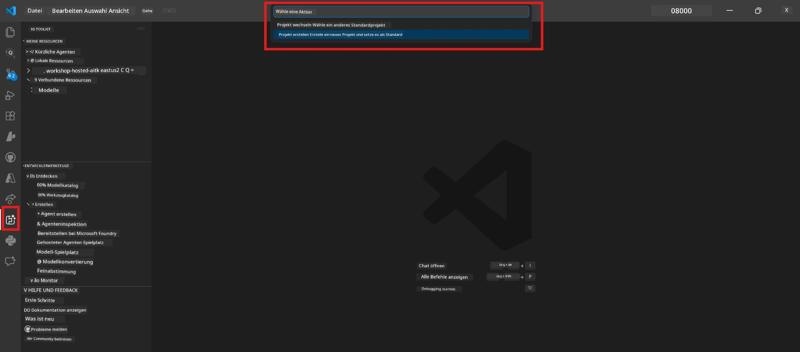
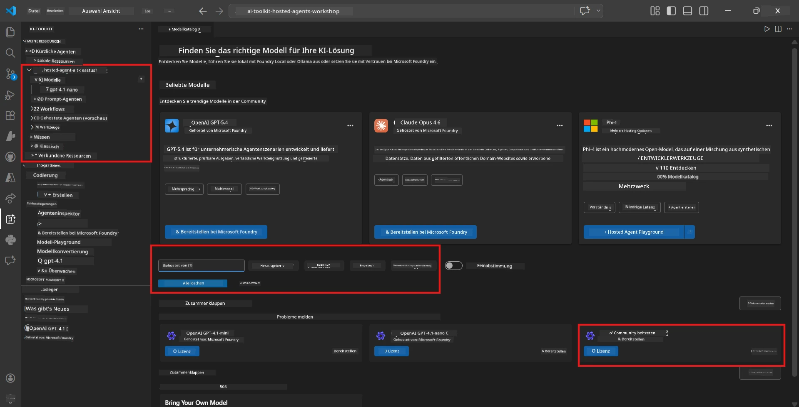
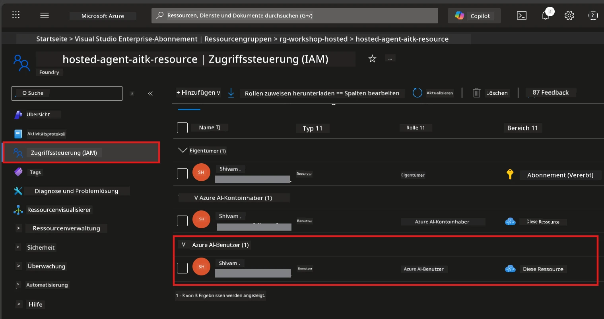

# Modul 2 - Erstellen eines Foundry-Projekts & Bereitstellen eines Modells

In diesem Modul erstellen Sie ein Microsoft Foundry-Projekt (oder wählen eines aus) und stellen ein Modell bereit, das Ihr Agent verwenden wird. Jeder Schritt ist ausdrücklich beschrieben – folgen Sie ihnen der Reihe nach.

> Wenn Sie bereits ein Foundry-Projekt mit einem bereitgestellten Modell haben, springen Sie zu [Modul 3](03-create-hosted-agent.md).

---

## Schritt 1: Erstellen eines Foundry-Projekts aus VS Code

Sie verwenden die Microsoft Foundry-Erweiterung, um ein Projekt zu erstellen, ohne VS Code zu verlassen.

1. Drücken Sie `Ctrl+Shift+P`, um die **Befehls-Palette** zu öffnen.
2. Geben Sie ein: **Microsoft Foundry: Create Project** und wählen Sie es aus.
3. Ein Dropdown-Menü erscheint – wählen Sie Ihr **Azure-Abonnement** aus der Liste aus.
4. Sie werden aufgefordert, eine **Ressourcengruppe** auszuwählen oder zu erstellen:
   - Um eine neue zu erstellen: Geben Sie einen Namen ein (z.B. `rg-hosted-agents-workshop`) und drücken Sie Enter.
   - Um eine vorhandene zu verwenden: Wählen Sie diese aus dem Dropdown-Menü aus.
5. Wählen Sie eine **Region**. **Wichtig:** Wählen Sie eine Region, die gehostete Agenten unterstützt. Prüfen Sie die [Regionsverfügbarkeit](https://learn.microsoft.com/azure/foundry/agents/concepts/hosted-agents#region-availability) – gängige Optionen sind `East US`, `West US 2` oder `Sweden Central`.
6. Geben Sie einen **Namen** für das Foundry-Projekt ein (z.B. `workshop-agents`).
7. Drücken Sie Enter und warten Sie, bis die Bereitstellung abgeschlossen ist.

> **Die Bereitstellung dauert 2-5 Minuten.** Sie sehen eine Fortschrittsmeldung unten rechts in VS Code. Schließen Sie VS Code während der Bereitstellung nicht.

8. Nach Abschluss zeigt die **Microsoft Foundry**-Seitenleiste Ihr neues Projekt unter **Resources** an.
9. Klicken Sie auf den Projektnamen, um es zu erweitern, und bestätigen Sie, dass Abschnitte wie **Models + endpoints** und **Agents** angezeigt werden.



### Alternative: Erstellung über das Foundry-Portal

Wenn Sie lieber den Browser verwenden:

1. Öffnen Sie [https://ai.azure.com](https://ai.azure.com) und melden Sie sich an.
2. Klicken Sie auf der Startseite auf **Create project**.
3. Geben Sie einen Projektnamen ein, wählen Sie Ihr Abonnement, die Ressourcengruppe und die Region aus.
4. Klicken Sie auf **Create** und warten Sie die Bereitstellung ab.
5. Nach der Erstellung kehren Sie zu VS Code zurück – das Projekt sollte nach Aktualisierung der Foundry-Seitenleiste (Klick auf das Aktualisierungssymbol) erscheinen.

---

## Schritt 2: Bereitstellen eines Modells

Ihr [gehosteter Agent](https://learn.microsoft.com/azure/foundry/agents/concepts/hosted-agents) benötigt ein Azure OpenAI-Modell, um Antworten zu generieren. Sie werden jetzt eines [bereitstellen](https://learn.microsoft.com/azure/ai-foundry/openai/how-to/create-resource#deploy-a-model).

1. Drücken Sie `Ctrl+Shift+P`, um die **Befehls-Palette** zu öffnen.
2. Geben Sie ein: **Microsoft Foundry: Open [Model Catalog](https://learn.microsoft.com/azure/ai-foundry/openai/concepts/models)** und wählen Sie es aus.
3. Die Model Catalog-Ansicht öffnet sich in VS Code. Durchsuchen Sie oder verwenden Sie die Suchleiste, um **gpt-4.1** zu finden.
4. Klicken Sie auf die **gpt-4.1**-Modellkarte (oder `gpt-4.1-mini`, wenn Sie geringere Kosten bevorzugen).
5. Klicken Sie auf **Deploy**.

  
6. In der Bereitstellungskonfiguration:  
   - **Deployment name**: Lassen Sie den Standardnamen (z.B. `gpt-4.1`) oder geben Sie einen eigenen Namen ein. **Merken Sie sich den Namen** – Sie benötigen ihn in Modul 4.  
   - **Target**: Wählen Sie **Deploy to Microsoft Foundry** und das gerade erstellte Projekt aus.  
7. Klicken Sie auf **Deploy** und warten Sie, bis die Bereitstellung abgeschlossen ist (1-3 Minuten).

### Auswahl eines Modells

| Modell | Am besten geeignet für | Kosten | Hinweise |
|--------|-----------------------|--------|----------|
| `gpt-4.1` | Hochwertige, nuancierte Antworten | Höher | Beste Ergebnisse, empfohlen für finale Tests |
| `gpt-4.1-mini` | Schnelle Iteration, geringere Kosten | Niedriger | Gut für Workshop-Entwicklung und schnelle Tests |
| `gpt-4.1-nano` | Leichte Aufgaben | Am niedrigsten | Kostengünstigster, aber einfachere Antworten |

> **Empfehlung für diesen Workshop:** Verwenden Sie `gpt-4.1-mini` für Entwicklung und Tests. Es ist schnell, günstig und liefert gute Ergebnisse für die Übungen.

### Überprüfen der Modellbereitstellung

1. Erweitern Sie in der **Microsoft Foundry**-Seitenleiste Ihr Projekt.
2. Schauen Sie unter **Models + endpoints** (oder ähnlichem Abschnitt).
3. Sie sollten Ihr bereitgestelltes Modell (z.B. `gpt-4.1-mini`) mit dem Status **Succeeded** oder **Active** sehen.
4. Klicken Sie auf die Modellbereitstellung, um Details anzuzeigen.
5. **Notieren Sie sich** diese zwei Werte – Sie benötigen sie in Modul 4:

   | Einstellung | Fundort | Beispielwert |
   |------------|---------|--------------|
   | **Projekt-Endpunkt** | Klicken Sie auf den Projektnamen in der Foundry-Seitenleiste. Die Endpunkt-URL wird in der Detailansicht angezeigt. | `https://<account>.services.ai.azure.com/api/projects/<project>` |
   | **Modellbereitstellungsname** | Der Name, der neben dem bereitgestellten Modell angezeigt wird. | `gpt-4.1-mini` |

---

## Schritt 3: Zuweisen erforderlicher RBAC-Rollen

Dies ist der **am häufigsten übersehene Schritt**. Ohne die korrekten Rollen schlägt die Bereitstellung in Modul 6 mit einem Berechtigungsfehler fehl.

### 3.1 Weisen Sie sich die Azure AI User-Rolle zu

1. Öffnen Sie einen Browser und gehen Sie zu [https://portal.azure.com](https://portal.azure.com).
2. Geben Sie im Suchfeld oben den Namen Ihres **Foundry-Projekts** ein und klicken Sie in den Ergebnissen darauf.
   - **Wichtig:** Navigieren Sie zur **Projekt-Resource** (Typ: "Microsoft Foundry project"), **nicht** zur übergeordneten Konto-/Hub-Resource.
3. Klicken Sie im linken Menü des Projekts auf **Zugriffssteuerung (IAM)**.
4. Klicken Sie oben auf die Schaltfläche **+ Hinzufügen** → wählen Sie **Rollen zuweisen**.
5. Suchen Sie im Tab **Rolle** nach [**Azure AI User**](https://learn.microsoft.com/azure/foundry/concepts/rbac-foundry#built-in-roles) und wählen Sie diese aus. Klicken Sie auf **Weiter**.
6. Im Tab **Mitglieder**:
   - Wählen Sie **Benutzer, Gruppe oder Dienstprinzipal**.
   - Klicken Sie auf **+ Mitglieder auswählen**.
   - Suchen Sie nach Ihrem Namen oder Ihrer E-Mail, wählen Sie sich aus und klicken Sie auf **Auswählen**.
7. Klicken Sie auf **Überprüfen + zuweisen** → dann nochmals auf **Überprüfen + zuweisen**, um zu bestätigen.



### 3.2 (Optional) Weisen Sie die Azure AI Developer-Rolle zu

Wenn Sie zusätzliche Ressourcen im Projekt erstellen oder Bereitstellungen programmatisch verwalten müssen:

1. Wiederholen Sie die obigen Schritte, wählen Sie jedoch in Schritt 5 die Rolle **Azure AI Developer** aus.
2. Weisen Sie diese auf der Ebene der **Foundry-Resource (Konto)** zu, nicht nur auf Projektebene.

### 3.3 Überprüfen der Rollenzuweisungen

1. Gehen Sie auf der Seite **Zugriffssteuerung (IAM)** des Projekts zum Tab **Rollenzuweisungen**.
2. Suchen Sie nach Ihrem Namen.
3. Sie sollten mindestens die Rolle **Azure AI User** für den Projektbereich sehen.

> **Warum das wichtig ist:** Die Rolle [`Azure AI User`](https://learn.microsoft.com/azure/foundry/concepts/rbac-foundry#built-in-roles) gewährt die Datenaktion `Microsoft.CognitiveServices/accounts/AIServices/agents/write`. Ohne diese sehen Sie während der Bereitstellung diesen Fehler:
>
> ```
> Error: lacks the required data action 
> Microsoft.CognitiveServices/accounts/AIServices/agents/write 
> to perform POST /api/projects/{projectName}/assistants operation.
> ```
>
> Für weitere Details siehe [Modul 8 - Fehlerbehebung](08-troubleshooting.md).

---

### Kontrollpunkt

- [ ] Foundry-Projekt existiert und ist in der Microsoft Foundry-Seitenleiste in VS Code sichtbar
- [ ] Mindestens ein Modell ist bereitgestellt (z.B. `gpt-4.1-mini`) mit dem Status **Succeeded**
- [ ] Sie haben die **Projekt-Endpunkt**-URL und den **Modellbereitstellungsnamen** notiert
- [ ] Sie haben die Rolle **Azure AI User** auf **Projektebene** zugewiesen bekommen (überprüfen im Azure Portal → IAM → Rollenzuweisungen)
- [ ] Das Projekt befindet sich in einer [unterstützten Region](https://learn.microsoft.com/azure/foundry/agents/concepts/hosted-agents#region-availability) für gehostete Agenten

---

**Vorheriges:** [01 - Installieren des Foundry Toolkits](01-install-foundry-toolkit.md) · **Nächstes:** [03 - Erstellen eines gehosteten Agents →](03-create-hosted-agent.md)

---

<!-- CO-OP TRANSLATOR DISCLAIMER START -->
**Haftungsausschluss**:  
Dieses Dokument wurde mit dem KI-Übersetzungsdienst [Co-op Translator](https://github.com/Azure/co-op-translator) übersetzt. Obwohl wir uns um Genauigkeit bemühen, beachten Sie bitte, dass automatisierte Übersetzungen Fehler oder Ungenauigkeiten enthalten können. Das Originaldokument in seiner Ursprungssprache gilt als maßgebliche Quelle. Für wichtige Informationen wird eine professionelle menschliche Übersetzung empfohlen. Wir übernehmen keine Haftung für Missverständnisse oder Fehlinterpretationen, die aus der Nutzung dieser Übersetzung entstehen.
<!-- CO-OP TRANSLATOR DISCLAIMER END -->