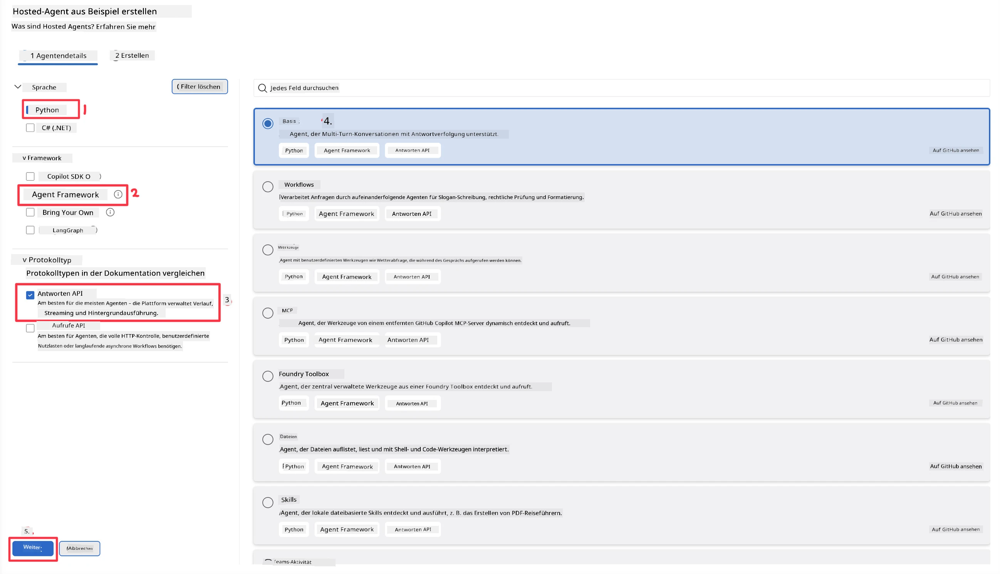
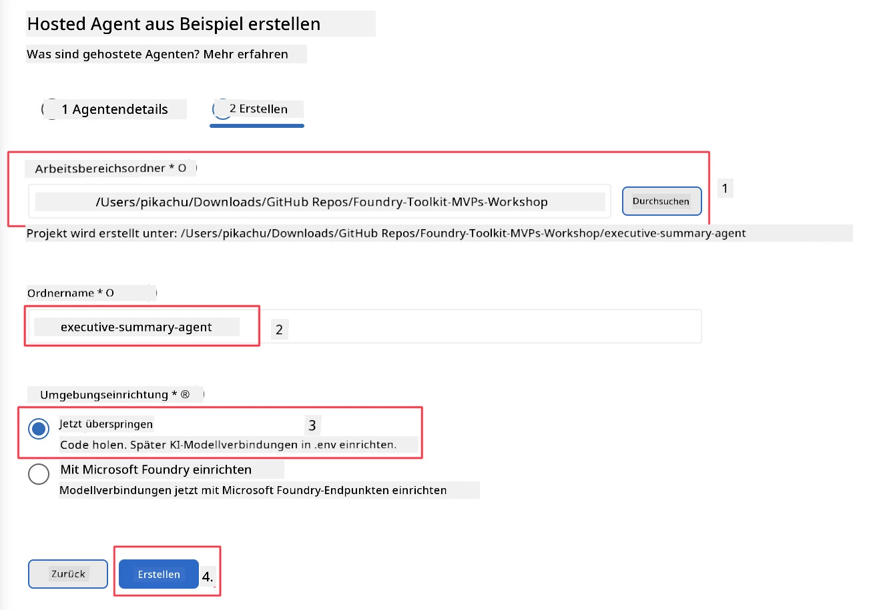

# Modul 2 - Erstellen eines neuen gehosteten Agents

⏱️ ~5 min

In diesem Modul verwenden Sie das Foundry Toolkit, um ein **Projekt für einen gehosteten Agenten zu erstellen**. Das Gerüst erzeugt die vollständige Projektstruktur - `agent.yaml`, `main.py`, `Dockerfile`, `requirements.txt` und die VS Code-Debug-Konfiguration -, sodass Sie sich auf die Anpassung des Agentenverhaltens konzentrieren können.

> **Schlüsselkonzept:** Der Ordner `agent/` in diesem Labor ist ein Beispiel dafür, was das Foundry Toolkit erzeugt. Sie schreiben diese Dateien nicht von Grund auf neu.

### Ablauf des Scaffold-Assistenten

```mermaid
flowchart LR
    A["Command Palette:
    Create new Hosted Agent"] --> B["Language:
    Python"]
    B --> C["API type:
    Response API"]
    C --> D["Template:
    Basic - Agent Framework"]
    D --> E["Modell auswählen"]
    E --> F["Workspace folder
    & agent name"]
    F --> G["Generiertes Projekt"]

    style A fill:#4A90D9,color:#fff
    style B fill:#7B68EE,color:#fff
    style C fill:#7B68EE,color:#fff
    style D fill:#7B68EE,color:#fff
    style E fill:#7B68EE,color:#fff
    style F fill:#7B68EE,color:#fff
    style G fill:#27AE60,color:#fff
```



---

## Schritt 1: Öffnen Sie den Assistenten zum Erstellen eines gehosteten Agents

1. Drücken Sie `Ctrl+Shift+P`, um die **Befehlspalette** zu öffnen.
2. Geben Sie ein: **Foundry Toolkit: Create new Hosted Agent** und wählen Sie es aus.

> **Alternative: Erstellung über das Foundry-Portal**
> Wenn Sie lieber den Browser verwenden, können Sie Ihr Projekt unter [https://ai.azure.com](https://ai.azure.com) erstellen. Sobald das Projekt bereitgestellt ist, kehren Sie zu VS Code zurück und verwenden die **Foundry Toolkit**-Seitenleiste, um eine Verbindung herzustellen.

> **Alternative:** Klicken Sie neben **Hosted Agents (Preview)** in der Foundry Toolkit-Seitenleiste auf das **+**-Symbol.

## Schritt 2: Einstellungen auswählen



1. Wählen Sie im linken Navigations-/Optionsbereich Folgendes aus:

| Menü | Auswahl | Hinweise |
|--------|-----------|-------|
| **Sprache** | Python | C# wird ebenfalls unterstützt |
| **Framework** | Agent Framework | Einfacher Einstieg mit dem Agent Framework SDK |
| **API-Typ** | Response API | `POST /responses` - konversationell, mit plattformverwaltetem Verlauf |
| **Vorlage** | Basic | Einfacher Einstieg mit dem Agent Framework SDK |

2. Nach der Auswahl klicken Sie auf **Weiter**



3. Wählen Sie im nächsten Fenster Folgendes aus:

| Menü | Auswahl | Hinweise |
|--------|-----------|-------|
| **Arbeitsbereichsordner** | Wählen Sie einen Zielordner | z.B. `/workspace/Foundry_Toolkit_for_VSCode_Lab/` oder einen Unterordner in diesem Repo |
| **Agentenname** | Geben Sie einen Namen ein | z.B. `executive-summary-agent` |
| **Umgebungseinrichtung** | Einrichtung vorerst überspringen |  |

Klicken Sie auf **erstellen**, um unseren Agenten zu erzeugen. Ein neuer Ordner wird mit dem Namen des gehosteten Agenten erstellt.

## Schritt 3: Überprüfen Sie das generierte Projekt

Nach Abschluss des Scaffoldings überprüfen Sie im Explorer (`Ctrl+Shift+E`), ob Sie diese Dateien sehen:

```
📂 my-agent/
├── .env                ← Environment variables (placeholders)
├── .vscode/
│   ├── launch.json     ← Debug config (F5 → run + Agent Inspector)
│   └── tasks.json      ← VS Code task definitions
├── agent.yaml          ← Agent definition (kind: hosted)
├── Dockerfile          ← Container config for deployment
├── main.py             ← Agent entry point (your main code)
└── requirements.txt    ← Python dependencies
```

### Wichtige Dateien erklärt

| Datei | Zweck |
|------|---------|
| `agent.yaml` | Deklariert den Agenten als `kind: hosted`, ordnet Umgebungsvariablen zu, definiert das `/responses`-Protokoll |
| `main.py` | Erstellt einen `FoundryChatClient` → umschließt ihn in einem `Agent` mit Anweisungen → stellt ihn über `ResponsesHostServer` auf Port 8088 bereit |
| `Dockerfile` | Verwendet `python:3.12-slim`, installiert Abhängigkeiten, legt Port 8088 offen, führt `main.py` aus |
| `requirements.txt` | `agent-framework-foundry`, `agent-framework-foundry-hosting`, `mcp`, `debugpy` |

> **Wichtig:** Öffnen Sie den gerüsteten Agentenordner direkt in VS Code (den `agent/`-Ordner selbst), damit `.vscode/launch.json` und `tasks.json` für das F5-Debugging korrekt funktionieren.

---

### ✅ Checkpoint

- [ ] Gerüstetes Projekt mit allen erwarteten Dateien erstellt
- [ ] `agent.yaml` zeigt `kind: hosted` und `protocol: responses`
- [ ] `main.py` importiert `Agent`, `FoundryChatClient`, `ResponsesHostServer`
- [ ] Der Agentenordner ist in VS Code als Arbeitsbereichs-Root geöffnet

---

**Zurück:** [01 - Setup](01-setup.md) · **Weiter:** [03 - Konfigurieren & Codieren →](03-configure-and-code.md)

---

<!-- CO-OP TRANSLATOR DISCLAIMER START -->
**Haftungsausschluss**:
Dieses Dokument wurde mit dem KI-Übersetzungsdienst [Co-op Translator](https://github.com/Azure/co-op-translator) übersetzt. Obwohl wir uns um Genauigkeit bemühen, beachten Sie bitte, dass automatisierte Übersetzungen Fehler oder Ungenauigkeiten enthalten können. Das Originaldokument in seiner Ursprungssprache gilt als maßgebliche Quelle. Bei kritischen Informationen wird eine professionelle menschliche Übersetzung empfohlen. Wir übernehmen keine Haftung für Missverständnisse oder Fehlinterpretationen, die aus der Verwendung dieser Übersetzung entstehen.
<!-- CO-OP TRANSLATOR DISCLAIMER END -->