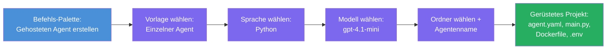

# Modul 3 - Erstellen eines neuen gehosteten Agents (Automatisch durch Foundry-Erweiterung erstellt)

In diesem Modul verwenden Sie die Microsoft Foundry-Erweiterung, um **ein neues [gehostetes Agentenprojekt](https://learn.microsoft.com/azure/foundry/agents/concepts/hosted-agents) zu erstellen**. Die Erweiterung generiert die gesamte Projektstruktur für Sie – einschließlich `agent.yaml`, `main.py`, `Dockerfile`, `requirements.txt`, einer `.env`-Datei und einer VS Code-Debugkonfiguration. Nach dem Erstellen passen Sie diese Dateien mit den Anweisungen, Werkzeugen und Konfigurationen Ihres Agenten an.

> **Wichtiges Konzept:** Der Ordner `agent/` in diesem Labor ist ein Beispiel für das, was die Foundry-Erweiterung generiert, wenn Sie diesen Scaffold-Befehl ausführen. Sie schreiben diese Dateien nicht von Grund auf neu – die Erweiterung erstellt sie, und Sie bearbeiten sie anschließend.

### Ablauf des Scaffold-Assistenten


---

## Schritt 1: Öffnen Sie den Assistenten zum Erstellen eines gehosteten Agents

1. Drücken Sie `Ctrl+Shift+P`, um die **Befehlspalette** zu öffnen.
2. Geben Sie ein: **Microsoft Foundry: Create a New Hosted Agent** und wählen Sie es aus.
3. Der Assistent zur Erstellung gehosteter Agents wird geöffnet.

> **Alternativer Weg:** Sie können diesen Assistenten auch über die Microsoft Foundry-Seitenleiste erreichen → Klicken Sie auf das **+**-Symbol neben **Agents** oder rechtsklicken Sie und wählen Sie **Create New Hosted Agent**.

---

## Schritt 2: Wählen Sie Ihre Vorlage aus

Der Assistent fordert Sie auf, eine Vorlage auszuwählen. Sie sehen Optionen wie:

| Vorlage | Beschreibung | Wann verwenden |
|----------|-------------|-------------|
| **Einzelagent** | Ein Agent mit eigenem Modell, Anweisungen und optionalen Werkzeugen | Für diesen Workshop (Lab 01) |
| **Multi-Agent Workflow** | Mehrere Agents, die sequenziell zusammenarbeiten | Lab 02 |

1. Wählen Sie **Einzelagent**.
2. Klicken Sie auf **Weiter** (oder die Auswahl wird automatisch fortgesetzt).

---

## Schritt 3: Wählen Sie die Programmiersprache

1. Wählen Sie **Python** (empfohlen für diesen Workshop).
2. Klicken Sie auf **Weiter**.

> **C# wird ebenfalls unterstützt**, wenn Sie .NET bevorzugen. Die Scaffold-Struktur ist ähnlich (verwendet `Program.cs` statt `main.py`).

---

## Schritt 4: Wählen Sie Ihr Modell

1. Der Assistent zeigt die Modelle an, die in Ihrem Foundry-Projekt bereitgestellt wurden (aus Modul 2).
2. Wählen Sie das bereitgestellte Modell aus – z. B. **gpt-4.1-mini**.
3. Klicken Sie auf **Weiter**.

> Wenn Sie keine Modelle sehen, gehen Sie zurück zu [Modul 2](02-create-foundry-project.md) und stellen Sie zuerst eines bereit.

---

## Schritt 5: Wählen Sie den Ordnerspeicherort und den Agentennamen

1. Es öffnet sich ein Datei-Dialog – wählen Sie einen **Zielordner** aus, in dem das Projekt erstellt wird. Für diesen Workshop:
   - Wenn Sie neu beginnen: wählen Sie einen beliebigen Ordner (z. B. `C:\Projects\my-agent`)
   - Wenn Sie im Workshop-Repository arbeiten: erstellen Sie einen neuen Unterordner unter `workshop/lab01-single-agent/agent/`
2. Geben Sie einen **Namen** für den gehosteten Agenten ein (z. B. `executive-summary-agent` oder `my-first-agent`).
3. Klicken Sie auf **Erstellen** (oder drücken Sie Enter).

---

## Schritt 6: Warten Sie, bis das Scaffold abgeschlossen ist

1. VS Code öffnet ein **neues Fenster** mit dem erstellten Projekt.
2. Warten Sie einige Sekunden, bis das Projekt vollständig geladen ist.
3. Sie sollten die folgenden Dateien im Explorer-Fenster (`Ctrl+Shift+E`) sehen:

```
📂 my-first-agent/
├── .env                ← Environment variables (auto-generated with placeholders)
├── .vscode/
│   └── launch.json     ← Debug configuration (F5 to run + Agent Inspector)
├── agent.yaml          ← Agent definition (kind: hosted)
├── Dockerfile          ← Container configuration for deployment
├── main.py             ← Agent entry point (your main code file)
└── requirements.txt    ← Python dependencies
```

> **Dies ist die gleiche Struktur wie der `agent/`-Ordner** in diesem Labor. Die Foundry-Erweiterung erstellt diese Dateien automatisch – Sie müssen sie nicht manuell anlegen.

> **Workshop-Hinweis:** In diesem Workshop-Repository befindet sich der `.vscode/`-Ordner im **Workspace-Stammverzeichnis** (nicht in einzelnen Projekten). Er enthält eine geteilte `launch.json` und `tasks.json` mit zwei Debug-Konfigurationen – **"Lab01 - Single Agent"** und **"Lab02 - Multi-Agent"** – jeweils mit dem für das Labor passenden `cwd`. Wenn Sie F5 drücken, wählen Sie die Konfiguration aus der Dropdown-Liste, die zum aktuellen Labor passt.

---

## Schritt 7: Verstehen Sie jede generierte Datei

Nehmen Sie sich einen Moment Zeit, um jede vom Assistenten generierte Datei anzuschauen. Das Verständnis ist wichtig für Modul 4 (Anpassung).

### 7.1 `agent.yaml` – Agent-Definition

Öffnen Sie `agent.yaml`. Sie sieht so aus:

```yaml
# yaml-language-server: $schema=https://raw.githubusercontent.com/microsoft/AgentSchema/refs/heads/main/schemas/v1.0/ContainerAgent.yaml

kind: hosted
name: my-first-agent
description: >
  A hosted agent deployed to Microsoft Foundry Agent Service.
metadata:
  authors:
    - Microsoft
  tags:
    - Azure AI AgentServer
    - Microsoft Agent Framework
    - Hosted Agent
protocols:
  - protocol: responses
    version: v1
environment_variables:
  - name: AZURE_AI_PROJECT_ENDPOINT
    value: ${PROJECT_ENDPOINT}
  - name: AZURE_AI_MODEL_DEPLOYMENT_NAME
    value: ${MODEL_DEPLOYMENT_NAME}
dockerfile_path: Dockerfile
resources:
  cpu: '0.25'
  memory: 0.5Gi
```

**Wichtige Felder:**

| Feld | Zweck |
|-------|---------|
| `kind: hosted` | Gibt an, dass es sich um einen gehosteten Agenten handelt (containerbasiert, bereitgestellt über den [Foundry Agent Service](https://learn.microsoft.com/azure/foundry/agents/overview)) |
| `protocols: responses v1` | Der Agent bietet den OpenAI-kompatiblen `/responses` HTTP-Endpunkt an |
| `environment_variables` | Ordnet `.env`-Werte zu Container-Umgebungsvariablen zur Bereitstellungszeit zu |
| `dockerfile_path` | Zeigt auf die Dockerfile, die zum Erstellen des Container-Images verwendet wird |
| `resources` | CPU- und Speicherzuweisung für den Container (0.25 CPU, 0.5Gi Speicher) |

### 7.2 `main.py` – Agent-Einstiegspunkt

Öffnen Sie `main.py`. Dies ist die Haupt-Python-Datei, in der die Logik Ihres Agenten lebt. Das Scaffold beinhaltet:

```python
from agent_framework.azure import AzureAIAgentClient
from azure.ai.agentserver.agentframework import from_agent_framework
from azure.identity.aio import DefaultAzureCredential
```

**Wichtige Importe:**

| Import | Zweck |
|--------|--------|
| `AzureAIAgentClient` | Verbindet zu Ihrem Foundry-Projekt und erstellt Agents via `.as_agent()` |
| [`DefaultAzureCredential`](https://learn.microsoft.com/azure/developer/python/sdk/authentication/credential-chains#defaultazurecredential-overview) | Handhabt die Authentifizierung (Azure CLI, VS Code Anmeldung, Managed Identity oder Dienstprinzipal) |
| `from_agent_framework` | Verpackt den Agenten als HTTP-Server, der den `/responses` Endpunkt bereitstellt |

Der Hauptablauf ist:
1. Erstelle eine Credential → erstelle einen Client → rufe `.as_agent()` auf, um einen Agenten (als async Kontextmanager) zu erhalten → verpacke ihn als Server → führe aus

### 7.3 `Dockerfile` – Container-Image

```dockerfile
FROM python:3.14-slim

WORKDIR /app

COPY ./ .

RUN pip install --upgrade pip && \
    if [ -f requirements.txt ]; then \
        pip install -r requirements.txt; \
    else \
        echo "No requirements.txt found" >&2; exit 1; \
    fi

EXPOSE 8088

CMD ["python", "main.py"]
```

**Wichtige Details:**
- Verwendet `python:3.14-slim` als Basis-Image.
- Kopiert alle Projektdateien in `/app`.
- Aktualisiert `pip`, installiert Abhängigkeiten aus `requirements.txt` und schlägt fehl, wenn diese Datei fehlt.
- **Öffnet Port 8088** – dies ist der erforderliche Port für gehostete Agents. Ändern Sie ihn nicht.
- Startet den Agenten mit `python main.py`.

### 7.4 `requirements.txt` – Abhängigkeiten

```
agent-framework-azure-ai==1.0.0rc3
agent-framework-core==1.0.0rc3
azure-ai-agentserver-agentframework==1.0.0b16
azure-ai-agentserver-core==1.0.0b16
debugpy
agent-dev-cli
```

| Paket | Zweck |
|---------|---------|
| `agent-framework-azure-ai` | Azure AI-Integration für das Microsoft Agent Framework |
| `agent-framework-core` | Kernlaufzeit zum Erstellen von Agents (enthält `python-dotenv`) |
| `azure-ai-agentserver-agentframework` | Runtime für gehostete Agenten-Server im Foundry Agent Service |
| `azure-ai-agentserver-core` | Kernabstraktionen für Agent-Server |
| `debugpy` | Python-Debugging-Unterstützung (ermöglicht F5-Debugging in VS Code) |
| `agent-dev-cli` | Lokale Entwicklungs-CLI zum Testen von Agents (wird von der Debug-/Ausführungskonfiguration verwendet) |

---

## Verständnis des Agentenprotokolls

Gehostete Agents kommunizieren über das **OpenAI Responses API**-Protokoll. Im Betrieb (lokal oder in der Cloud) stellt der Agent nur einen HTTP-Endpunkt bereit:

```
POST http://localhost:8088/responses
Content-Type: application/json

{
  "input": "Your prompt here",
  "stream": false
}
```

Der Foundry Agent Service ruft diesen Endpunkt auf, um Benutzer-Prompts zu senden und Agenten-Antworten zu empfangen. Dies ist dasselbe Protokoll wie bei der OpenAI API, sodass Ihr Agent mit jedem Client kompatibel ist, der das OpenAI Responses-Format spricht.

---

### Kontrollpunkt

- [ ] Der Scaffold-Assistent wurde erfolgreich abgeschlossen und ein **neues VS Code-Fenster** wurde geöffnet
- [ ] Sie sehen alle 5 Dateien: `agent.yaml`, `main.py`, `Dockerfile`, `requirements.txt`, `.env`
- [ ] Die Datei `.vscode/launch.json` existiert (ermöglicht F5-Debugging – in diesem Workshop im Workspace-Stamm mit laborspezifischen Konfigurationen)
- [ ] Sie haben jede Datei durchgelesen und verstehen deren Zweck
- [ ] Sie verstehen, dass Port `8088` erforderlich ist und der `/responses` Endpunkt das Protokoll ist

---

**Vorheriges:** [02 - Foundry-Projekt erstellen](02-create-foundry-project.md) · **Nächstes:** [04 - Konfigurieren & Codieren →](04-configure-and-code.md)

---

<!-- CO-OP TRANSLATOR DISCLAIMER START -->
**Haftungsausschluss**:  
Dieses Dokument wurde mit dem KI-Übersetzungsdienst [Co-op Translator](https://github.com/Azure/co-op-translator) übersetzt. Obwohl wir auf Genauigkeit achten, beachten Sie bitte, dass automatisierte Übersetzungen Fehler oder Ungenauigkeiten enthalten können. Das Originaldokument in seiner ursprünglichen Sprache sollte als maßgebliche Quelle betrachtet werden. Für kritische Informationen wird eine professionelle menschliche Übersetzung empfohlen. Wir übernehmen keine Haftung für Missverständnisse oder Fehlinterpretationen, die durch die Nutzung dieser Übersetzung entstehen.
<!-- CO-OP TRANSLATOR DISCLAIMER END -->