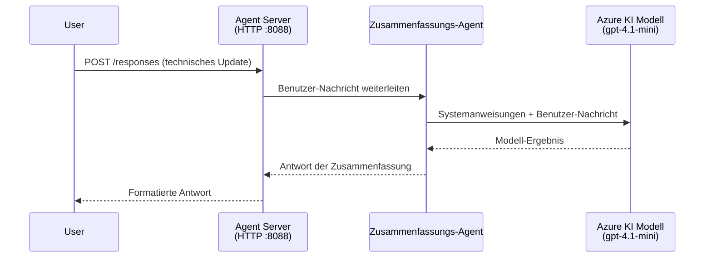
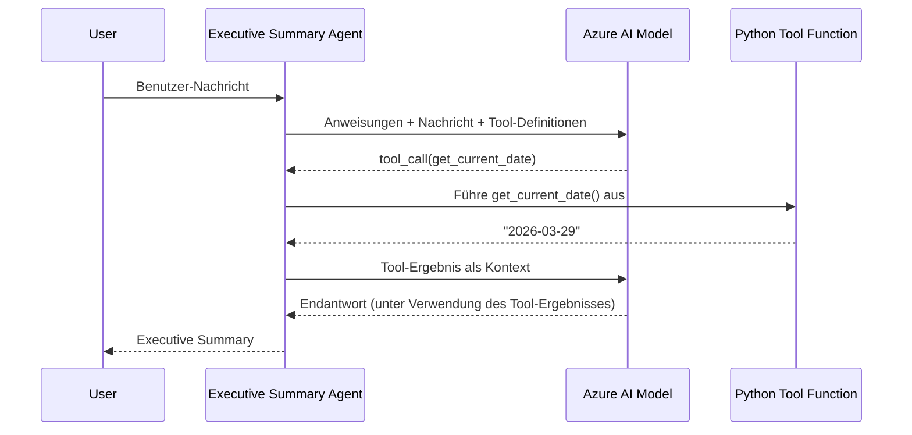

# Modul 4 - Anweisungen konfigurieren, Umgebung & Abhängigkeiten installieren

In diesem Modul passen Sie die automatisch generierten Agenten-Dateien aus Modul 3 an. Hier verwandeln Sie das generische Gerüst in **Ihren** Agenten - indem Sie Anweisungen schreiben, Umgebungsvariablen setzen, optional Werkzeuge hinzufügen und Abhängigkeiten installieren.

> **Erinnerung:** Die Foundry-Erweiterung hat Ihre Projektdateien automatisch erstellt. Jetzt modifizieren Sie sie. Siehe den Ordner [`agent/`](../../../../../workshop/lab01-single-agent/agent) für ein vollständiges, funktionierendes Beispiel eines angepassten Agenten.

---

## Wie die Komponenten zusammenpassen

### Anforderungsablauf (einzelner Agent)


> **Mit Werkzeugen:** Wenn der Agent Werkzeuge registriert hat, kann das Modell statt einer direkten Antwort einen Werkzeugaufruf zurückgeben. Das Framework führt das Werkzeug lokal aus, gibt das Ergebnis an das Modell zurück, und das Modell generiert dann die finale Antwort.


---

## Schritt 1: Umgebungsvariablen konfigurieren

Das Gerüst hat eine `.env`-Datei mit Platzhalterwerten erstellt. Sie müssen die echten Werte aus Modul 2 eintragen.

1. Öffnen Sie im Gerüstprojekt die **`.env`**-Datei (im Projektstamm).
2. Ersetzen Sie die Platzhalterwerte durch Ihre tatsächlichen Foundry-Projektdaten:

   ```env
   PROJECT_ENDPOINT=https://<your-account>.services.ai.azure.com/api/projects/<your-project>
   MODEL_DEPLOYMENT_NAME=gpt-4.1-mini
   ```

3. Speichern Sie die Datei.

### Wo Sie diese Werte finden

| Wert | Wie finden |
|-------|-----------|
| **Projekt-Endpunkt** | Öffnen Sie die **Microsoft Foundry**-Sidebar in VS Code → klicken Sie Ihr Projekt an → die Endpunkt-URL wird in der Detailansicht angezeigt. Sie sieht aus wie `https://<account-name>.services.ai.azure.com/api/projects/<project-name>` |
| **Name der Modellbereitstellung** | In der Foundry-Sidebar, klappen Sie Ihr Projekt auf → unter **Models + endpoints** → der Name steht neben dem bereitgestellten Modell (z.B. `gpt-4.1-mini`) |

> **Sicherheit:** Übergeben Sie die `.env`-Datei niemals an die Versionskontrolle. Sie ist standardmäßig in `.gitignore` eingetragen. Falls nicht, fügen Sie sie hinzu:
> ```
> .env
> ```

### Wie Umgebungsvariablen fließen

Die Reihenfolge ist: `.env` → `main.py` (liest mit `os.getenv`) → `agent.yaml` (mappt auf Container-Umgebungsvariablen zur Bereitstellungszeit).

In `main.py` liest das Gerüst diese Werte so aus:

```python
PROJECT_ENDPOINT = os.getenv("AZURE_AI_PROJECT_ENDPOINT") or os.getenv("PROJECT_ENDPOINT")
MODEL_DEPLOYMENT_NAME = os.getenv("AZURE_AI_MODEL_DEPLOYMENT_NAME", os.getenv("MODEL_DEPLOYMENT_NAME", "gpt-4.1-mini"))
```

Sowohl `AZURE_AI_PROJECT_ENDPOINT` als auch `PROJECT_ENDPOINT` werden akzeptiert (das `agent.yaml` verwendet das Präfix `AZURE_AI_*`).

---

## Schritt 2: Agent-Anweisungen schreiben

Dies ist der wichtigste Anpassungsschritt. Die Anweisungen definieren Persönlichkeit, Verhalten, Ausgabeformat und Sicherheitsbedingungen Ihres Agenten.

1. Öffnen Sie `main.py` in Ihrem Projekt.
2. Finden Sie den Anweisungs-String (das Gerüst enthält eine Standard-/generische Version).
3. Ersetzen Sie ihn durch ausführliche, strukturierte Anweisungen.

### Was gute Anweisungen enthalten

| Komponente | Zweck | Beispiel |
|------------|-------|----------|
| **Rolle** | Was der Agent ist und macht | „Sie sind ein Executive Summary Agent“ |
| **Zielgruppe** | Für wen die Antworten sind | „Führungskräfte mit begrenztem technischem Hintergrund“ |
| **Eingabedefinition** | Welche Arten von Eingaben bearbeitet werden | „Technische Vorfallberichte, operative Updates“ |
| **Ausgabeformat** | Exakte Struktur der Antworten | „Executive Summary: - Was passiert ist: ... - Geschäftliche Auswirkungen: ... - Nächster Schritt: ...“ |
| **Regeln** | Einschränkungen und Ablehnungsbedingungen | „Fügen Sie KEINE Informationen hinzu, die nicht gegeben wurden“ |
| **Sicherheit** | Missbrauch und Halluzination vermeiden | „Bei unklarer Eingabe nachfragen“ |
| **Beispiele** | Eingab-/Ausgabe-Paare zur Steuerung des Verhaltens | 2-3 Beispiele mit unterschiedlichen Eingaben hinzufügen |

### Beispiel: Executive Summary Agent-Anweisungen

Hier sind die Anweisungen aus dem Workshop-`agent/main.py` [`agent/main.py`](../../../../../workshop/lab01-single-agent/agent/main.py):

```python
AGENT_INSTRUCTIONS = """You are an "Explain Like I'm an Executive" agent.

Purpose:
Your job is to translate complex technical or operational information into
clear, concise, and outcome-focused summaries that can be easily understood
by non-technical executives.

Audience:
Senior leaders with limited technical background who care about impact,
risk, and what happens next.

What you must do:
- Rephrase the input so it is understandable to a non-technical audience
- Prioritize clarity, brevity, and outcomes over technical accuracy
- Remove technical jargon, logs, metrics, stack traces, and deep root-cause details
- Translate technical causes into simple cause-and-effect statements
- Explicitly call out business impact
- Always include a clear next step or action
- Maintain a neutral, factual, and calm executive tone
- Do NOT add new facts or speculate beyond the input

Standard Output Structure (always use this wording):

Executive Summary:
- What happened: <plain-language description>
- Business impact: <clear, non-technical impact>
- Next step: <clear action or mitigation>

Rules:
- Keep responses under 100 words
- Do NOT add facts beyond the input
- If input is unclear, ask for clarification
"""
```

4. Ersetzen Sie den bestehenden Anweisungs-String in `main.py` durch Ihre eigenen Anweisungen.
5. Speichern Sie die Datei.

---

## Schritt 3: (Optional) Eigene Werkzeuge hinzufügen

Gehostete Agenten können **lokale Python-Funktionen** als [Tools](https://learn.microsoft.com/azure/foundry/agents/concepts/tool-catalog) ausführen. Das ist ein großer Vorteil codebasierter gehosteter Agenten gegenüber promptbasierten Agenten – Ihr Agent kann beliebige serverseitige Logik ausführen.

### 3.1 Definieren Sie eine Werkzeugfunktion

Fügen Sie `main.py` eine Werkzeugfunktion hinzu:

```python
from agent_framework import tool

@tool
def get_current_date() -> str:
    """Returns the current date in YYYY-MM-DD format."""
    from datetime import date
    return str(date.today())
```

Der `@tool`-Decorator macht aus einer normalen Python-Funktion ein Agenten-Tool. Die Docstring wird zur Toolbeschreibung, die das Modell sieht.

### 3.2 Registrieren Sie das Werkzeug beim Agenten

Beim Erstellen des Agenten via `.as_agent()` Kontextmanager geben Sie das Tool im Parameter `tools` an:

```python
async with AzureAIAgentClient(
    project_endpoint=PROJECT_ENDPOINT,
    model_deployment_name=MODEL_DEPLOYMENT_NAME,
    credential=credential,
).as_agent(
    name="my-agent",
    instructions=AGENT_INSTRUCTIONS,
    tools=[get_current_date],
) as agent:
    server = from_agent_framework(agent)
    await server.run_async()
```

### 3.3 Wie Werkzeugaufrufe funktionieren

1. Der Benutzer sendet eine Eingabe.
2. Das Modell entscheidet, ob ein Werkzeug benötigt wird (basierend auf Eingabe, Anweisungen und Tool-Beschreibungen).
3. Wenn ein Werkzeug gebraucht wird, ruft das Framework Ihre lokale Python-Funktion auf (im Container).
4. Der Rückgabewert des Werkzeugs wird als Kontext an das Modell übergeben.
5. Das Modell generiert die finale Antwort.

> **Werkzeuge laufen serverseitig** - sie laufen im Container, nicht im Browser des Benutzers oder im Modell. So haben Sie Zugriff auf Datenbanken, APIs, Dateisysteme oder beliebige Python-Bibliotheken.

---

## Schritt 4: Erstellen und Aktivieren einer virtuellen Umgebung

Vor der Installation der Abhängigkeiten erstellen Sie eine isolierte Python-Umgebung.

### 4.1 Virtuelle Umgebung erstellen

Öffnen Sie in VS Code ein Terminal (`` Ctrl+` ``) und führen Sie aus:

```powershell
python -m venv .venv
```

Dies erstellt einen `.venv`-Ordner in Ihrem Projektverzeichnis.

### 4.2 Virtuelle Umgebung aktivieren

**PowerShell (Windows):**

```powershell
.\.venv\Scripts\Activate.ps1
```

**Eingabeaufforderung (Windows):**

```cmd
.venv\Scripts\activate.bat
```

**macOS/Linux (Bash):**

```bash
source .venv/bin/activate
```

Sie sollten `(.venv)` vor Ihrer Eingabeaufforderung sehen, was anzeigt, dass die virtuelle Umgebung aktiv ist.

### 4.3 Abhängigkeiten installieren

Mit aktivierter virtueller Umgebung installieren Sie die benötigten Pakete:

```powershell
pip install -r requirements.txt
```

Dies installiert:

| Paket | Zweck |
|--------|-------|
| `agent-framework-azure-ai==1.0.0rc3` | Azure AI Integration für das [Microsoft Agent Framework](https://learn.microsoft.com/agent-framework/overview/) |
| `agent-framework-core==1.0.0rc3` | Core-Laufzeit für Agentenbau (enthält `python-dotenv`) |
| `azure-ai-agentserver-agentframework==1.0.0b16` | Laufzeit für gehostete Agenten im [Foundry Agent Service](https://learn.microsoft.com/azure/foundry/agents/overview) |
| `azure-ai-agentserver-core==1.0.0b16` | Core-Abstraktionen für Agent-Server |
| `debugpy` | Python-Debugging (ermöglicht das F5-Debuggen in VS Code) |
| `agent-dev-cli` | Lokales CLI zur Agententests und -entwicklung |

### 4.4 Installation prüfen

```powershell
pip list | Select-String "agent-framework|agentserver"
```

Erwartete Ausgabe:
```
agent-framework-azure-ai   1.0.0rc3
agent-framework-core       1.0.0rc3
azure-ai-agentserver-agentframework 1.0.0b16
azure-ai-agentserver-core  1.0.0b16
```

---

## Schritt 5: Authentifizierung prüfen

Der Agent verwendet [`DefaultAzureCredential`](https://learn.microsoft.com/azure/developer/python/sdk/authentication/credential-chains#defaultazurecredential-overview), das mehrere Authentifizierungsmethoden in dieser Reihenfolge versucht:

1. **Umgebungsvariablen** - `AZURE_CLIENT_ID`, `AZURE_TENANT_ID`, `AZURE_CLIENT_SECRET` (Service Principal)
2. **Azure CLI** - nutzt Ihre `az login`-Sitzung
3. **VS Code** - verwendet das Konto, mit dem Sie sich in VS Code angemeldet haben
4. **Managed Identity** - genutzt beim Ausführen in Azure (zur Bereitstellungszeit)

### 5.1 Für lokale Entwicklung prüfen

Mindestens eine dieser Methoden sollte funktionieren:

**Option A: Azure CLI (empfohlen)**

```powershell
az account show --query "{name:name, id:id}" --output table
```

Erwartet: Zeigt ihren Abonnementnamen und die ID.

**Option B: VS Code-Anmeldung**

1. Unten links in VS Code befindet sich das **Accounts**-Symbol.
2. Wenn Ihr Konto angezeigt wird, sind Sie angemeldet.
3. Falls nicht, klicken Sie das Symbol → **Anmelden für Microsoft Foundry verwenden**.

**Option C: Service Principal (für CI/CD)**

```powershell
$env:AZURE_TENANT_ID = "<your-tenant-id>"
$env:AZURE_CLIENT_ID = "<your-client-id>"
$env:AZURE_CLIENT_SECRET = "<your-client-secret>"
```

### 5.2 Häufiges Authentifizierungsproblem

Wenn Sie in mehrere Azure-Konten eingeloggt sind, stellen Sie sicher, dass das richtige Abonnement ausgewählt ist:

```powershell
az account set --subscription "<your-subscription-id>"
```

---

### Checkpoint

- [ ] Die `.env`-Datei enthält gültige Werte für `PROJECT_ENDPOINT` und `MODEL_DEPLOYMENT_NAME` (keine Platzhalter)
- [ ] Die Agent-Anweisungen sind in `main.py` angepasst – sie definieren Rolle, Zielgruppe, Ausgabeformat, Regeln und Sicherheitsbeschränkungen
- [ ] (Optional) Eigene Werkzeuge sind definiert und registriert
- [ ] Virtuelle Umgebung ist erstellt und aktiviert (`(.venv)` in der Terminal-Eingabeaufforderung sichtbar)
- [ ] `pip install -r requirements.txt` läuft erfolgreich ohne Fehler durch
- [ ] `pip list | Select-String "azure-ai-agentserver"` zeigt, dass das Paket installiert ist
- [ ] Authentifizierung ist gültig – `az account show` gibt Ihr Abonnement zurück ODER Sie sind in VS Code angemeldet

---

**Vorher:** [03 - Gehosteten Agenten erstellen](03-create-hosted-agent.md) · **Nächster:** [05 - Lokal testen →](05-test-locally.md)

---

<!-- CO-OP TRANSLATOR DISCLAIMER START -->
**Haftungsausschluss**:  
Dieses Dokument wurde mit dem KI-Übersetzungsdienst [Co-op Translator](https://github.com/Azure/co-op-translator) übersetzt. Obwohl wir uns um Genauigkeit bemühen, beachten Sie bitte, dass automatisierte Übersetzungen Fehler oder Ungenauigkeiten enthalten können. Das Originaldokument in seiner Ursprungssprache gilt als maßgebliche Quelle. Für kritische Informationen wird eine professionelle menschliche Übersetzung empfohlen. Wir übernehmen keine Haftung für Missverständnisse oder Fehlinterpretationen, die aus der Nutzung dieser Übersetzung entstehen.
<!-- CO-OP TRANSLATOR DISCLAIMER END -->