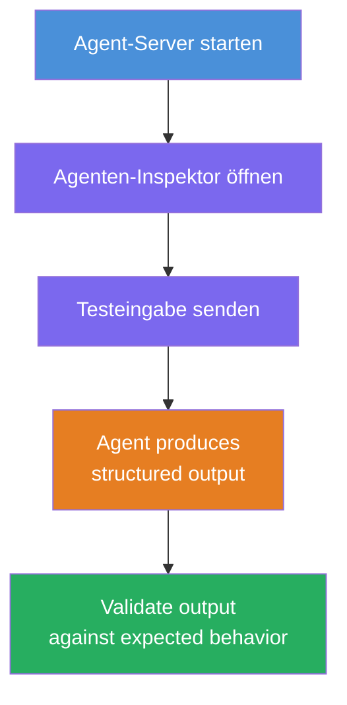
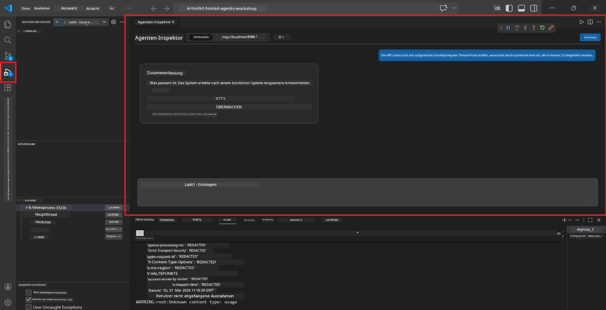
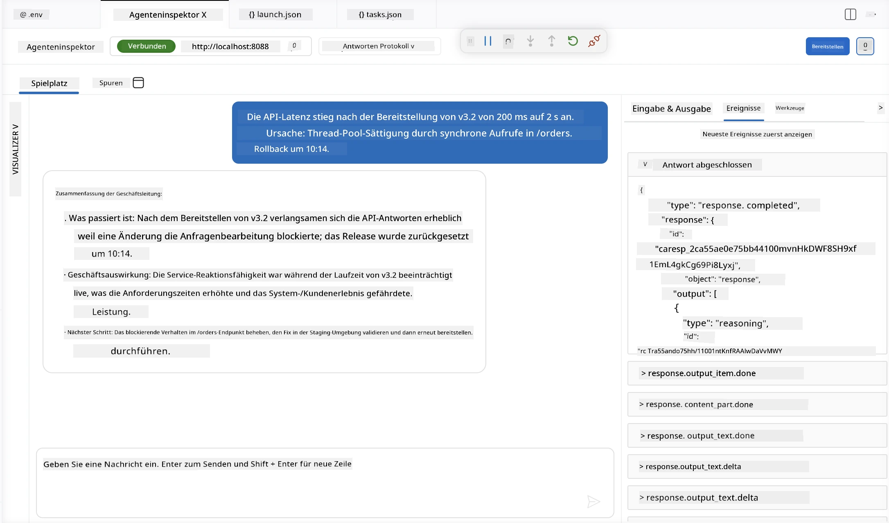

# Modul 4 - Lokal testen

⏱️ ~10 Minuten

In diesem Modul führst du deinen Agenten lokal aus und überprüfst, ob er korrekt funktioniert, indem du **Happy-Path-Funktionstests** anwendest. Du verwendest den Agent Inspector (visuelle UI) oder direkte HTTP-Aufrufe, um zu bestätigen, dass der Agent strukturierte, genaue Antworten liefert.

### Ablauf des lokalen Tests



---

## Option 1: Drücke F5 – Debuggen mit Agent Inspector (empfohlen)

### Starte den Debugger

1. Öffne direkt den Ordner **executive-summary-agent/** in VS Code (`Datei → Ordner öffnen`).
2. Öffne das **Ausführen und Debuggen**-Panel (`Strg+Shift+D`).
3. Wähle **Debug Local Agent Server** aus dem Dropdown-Menü.
4. Drücke **F5** (oder klicke auf ▶ Debugging starten).

> ⚠️ **Wichtig: Wähle deinen Python-Interpreter aus**
> Wenn du "ModuleNotFoundError" erhältst oder der Debugger nicht startet, musst du VS Code mitteilen, deine virtuelle Umgebung zu verwenden:
  > 1. Drücke `Strg+Shift+P` → tippe **Python: Interpreter auswählen**.
  > 2. Wähle den Interpreter aus, der sich im `.venv`-Ordner deines Projekts befindet (z. B. `.\.venv\Scripts\python.exe` unter Windows).
  > 3. Starte die Debug-Sitzung neu.
> Wenn weiterhin Fehler auftreten, aktualisiere manuell deine Datei `tasks.json` wie folgt:
  > 1. Öffne die Datei `.vscode/tasks.json`
  > 2. Gehe zum Befehl mit der Bezeichnung: `Run Agent/Workflow HTTP Server`
  > 3. Aktualisiere den Wert des Befehls wie folgt: `"value": "${workspaceFolder}/.venv/bin/python",`

### Was passiert

1. Der HTTP-Server startet unter `http://localhost:8088/responses`.
2. Das **Agent Inspector**-Panel öffnet sich automatisch – eine visuelle Chat-Oberfläche zum Testen.
3. Haltepunkte sind in `main.py` aktiviert.

Beobachte das Terminal auf:
```
Starting executive summary hosted agent
Executive agent server running on http://localhost:8088
```

> **Wenn sich der Agent Inspector nicht öffnet:** Drücke `Strg+Shift+P` → **Foundry Toolkit: Agent Inspector öffnen**.



> *Der Screenshot zeigt möglicherweise ältere 'AI TOOLKIT'-Marken aus einer früheren Erweiterungsversion.*

---

## Option 2: Test via Terminal (Alternative)

Starte den Agenten in einem Terminal, sende Anfragen von einem anderen:

```bash
# Terminal 1: Agent starten
cd executive-summary-agent/
source .venv/bin/activate
python main.py
```

```bash
# Terminal 2: Test senden (curl)
curl -sS -X POST http://localhost:8088/responses \
  -H "Content-Type: application/json" \
  -d '{"input": "The API latency increased due to thread pool exhaustion caused by sync calls in v3.2.", "stream": false}'
```

---

## Szenariotests: Happy-Path-Funktionsvalidierung

Führe **alle drei** untenstehenden Szenarien aus. Diese validieren, dass dein Agent korrekte, strukturierte Ausgaben für realistische Eingaben erzeugt.



### Szenario 1: IT-Vorfall – API-Latenzspitze

**Eingabe:**
```
The API latency increased from 200ms to 2s after deploying v3.2.
Root cause: thread pool starvation from synchronous calls in /orders.
Rolled back at 10:14.
```

**Erwartetes Verhalten:**
- ✅ Folgt der "Executive Summary"-Struktur (Was ist passiert / Geschäftliche Auswirkung / Nächster Schritt)
- ✅ Keine Fachbegriffe (kein "Thread Pool", kein "/orders", kein "v3.2")
- ✅ Geschäftliche Auswirkung klar benannt (z.B. Benutzer erlebten Verzögerungen)
- ✅ Einschließlich eines nächsten Schrittes (z.B. Fehlerbehebung durchgeführt, Monitoring eingerichtet)

---

### Szenario 2: Datenpipeline – ETL-Fehler

**Eingabe:**
```
The nightly ETL job failed because the upstream schema changed. APAC dashboards show missing data.
```

**Erwartetes Verhalten:**
- ✅ Fasst den Datenaktualisierungsfehler in einfacher Sprache zusammen
- ✅ Erwähnt die Auswirkungen auf das APAC-Dashboard
- ✅ Enthält einen Behebungsschritt
- ✅ Erwähnt NICHT "ETL", "Schema" oder andere Fachbegriffe

---

### Szenario 3: Sicherheit – Offenlegung von Zugangsdaten

**Eingabe:**
```
Static analysis flagged a hardcoded secret in the repository.
The secret may have been exposed in commit history.
```

**Erwartetes Verhalten:**
- ✅ Beschreibt ein Zugangsdaten-/Sicherheitsproblem verständlich für Führungskräfte
- ✅ Weist auf potenzielles Risiko hin (unbefugter Zugriff)
- ✅ Nennt Behebungsmaßnahme (Zugangsdatenrotation, Audit)
- ✅ Enthält KEINE Begriffe wie "statische Analyse", "Commit-Historie" oder "Hardcoded"

---

## Validierungskriterien

Prüfe für jedes Szenario:

| # | Kriterium | Bestehensbedingung |
|---|----------|------------------|
| 1 | **Struktur** | Antwort verwendet das "Executive Summary"-Format mit allen drei Aufzählungspunkten |
| 2 | **Einfache Sprache** | Keine Fachbegriffe, die ein Führungskraft nicht verstehen würde |
| 3 | **Genauigkeit** | Zusammenfassung spiegelt die Eingabe wider – keine erfundenen Details |
| 4 | **Knappheit** | Antwort enthält weniger als 100 Wörter |
| 5 | **Nächster Schritt** | Es wird eine klare Aktion oder Abmilderung angegeben |

---

## Debugging-Tipps

| Problem | Lösung |
|---------|--------|
| Agent startet nicht | Prüfe die `.env`-Werte, verifiziere, dass venv aktiviert ist, führe `pip install -r requirements.txt` aus |
| Leere oder generische Antwort | Überprüfe die Anweisungen in `main.py` – stelle sicher, dass das Ausgabeformat angegeben ist |
| Antwort enthält Fachbegriffe | Verstärke die Regeln zum „Entfernen technischer Begriffe“ in den Anweisungen |
| Agent Inspector öffnet sich nicht | `Strg+Shift+P` → **Foundry Toolkit: Agent Inspector öffnen** |
| Modellfehler im Terminal | Verifiziere, dass `AZURE_AI_MODEL_DEPLOYMENT_NAME` exakt übereinstimmt (Groß-/Kleinschreibung beachten) |

---

### ✅ Kontrollpunkt

- [ ] Agent startet lokal fehlerfrei
- [ ] Agent Inspector öffnet sich und zeigt eine Chat-Oberfläche (wenn du F5 nutzt)
- [ ] **Szenario 1** (IT-Vorfall) – strukturierte Executive Summary, keine Fachbegriffe
- [ ] **Szenario 2** (Datenpipeline) – relevante Zusammenfassung mit Geschäftsauswirkung
- [ ] **Szenario 3** (Sicherheitswarnung) – angemessene Risiko-Kommunikation
- [ ] Alle Antworten folgen der definierten Ausgabestruktur

> **Speichere deine Antworten** (kopiere oder mache Screenshots) – du wirst sie in Modul 06 mit den Cloud-Ergebnissen vergleichen.

---

**Vorheriges:** [03 - Konfigurieren & Codieren](03-configure-and-code.md) · **Nächstes:** [05 - Deployment in Foundry →](05-deploy-to-foundry.md)

---

<!-- CO-OP TRANSLATOR DISCLAIMER START -->
**Haftungsausschluss**:
Dieses Dokument wurde mit dem KI-Übersetzungsdienst [Co-op Translator](https://github.com/Azure/co-op-translator) übersetzt. Obwohl wir uns um Genauigkeit bemühen, beachten Sie bitte, dass automatisierte Übersetzungen Fehler oder Ungenauigkeiten enthalten können. Das Originaldokument in seiner Ursprungssprache gilt als maßgebliche Quelle. Bei kritischen Informationen wird eine professionelle menschliche Übersetzung empfohlen. Wir übernehmen keine Haftung für Missverständnisse oder Fehlinterpretationen, die aus der Verwendung dieser Übersetzung entstehen.
<!-- CO-OP TRANSLATOR DISCLAIMER END -->