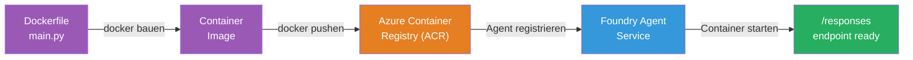
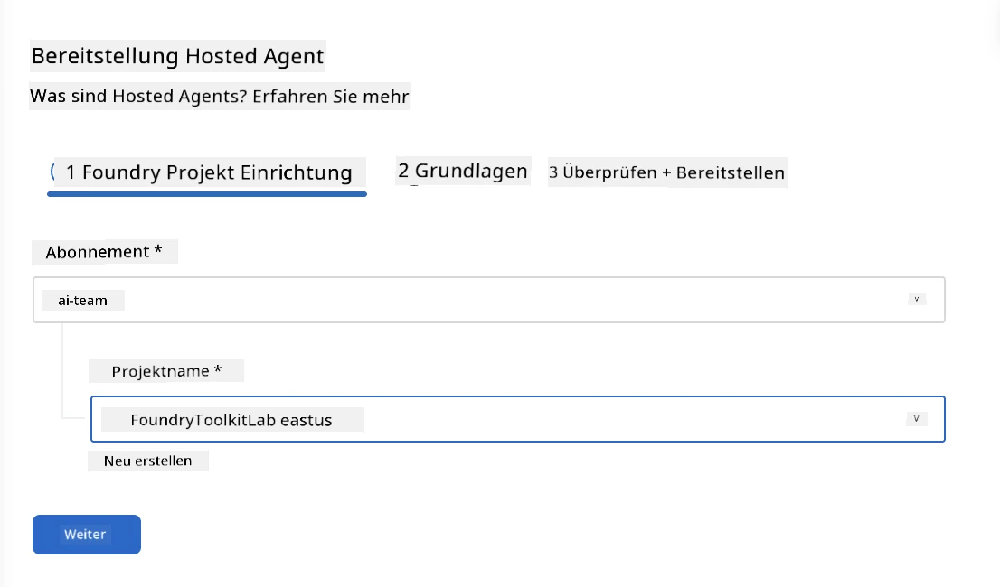
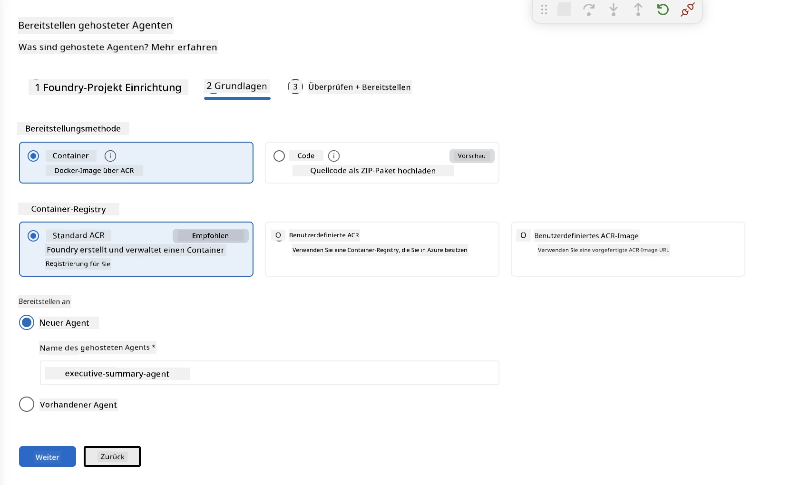
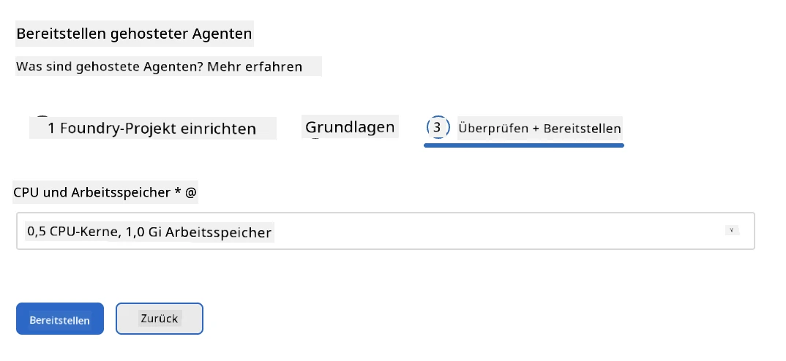
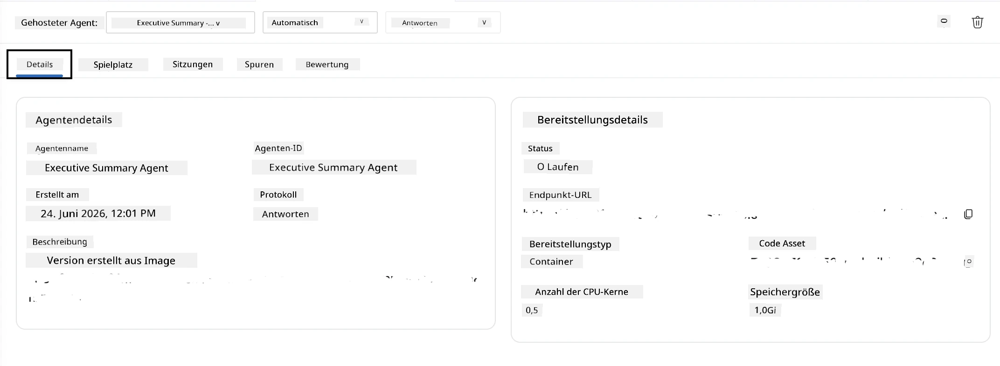

# Modul 5 - Deployment zum Foundry Agent Service

⏱️ ~10 Min.

> ⚠️ **Benutzer von Pfad B:** Dieses Modul erfordert ein Foundry-Abonnement. Wenn Sie Foundry Local verwenden, überspringen Sie zu [Modul 07 - Zusammenfassung](07-summary.md). Sie haben den lokalen Entwicklungsworkflow erfolgreich abgeschlossen!

In diesem Modul stellen Sie Ihren lokal getesteten Agent als **Hosted Agent** bei Microsoft Foundry bereit. Das Deployment erstellt ein Container-Image, lädt es in das Azure Container Registry hoch und startet den Agent in der verwalteten Infrastruktur von Foundry.

### Deployment-Pipeline

---

## Voraussetzungen überprüfen

Überprüfen Sie vor dem Deployment:

- [ ] Der Agent besteht alle 3 lokalen Testszenarien aus [Modul 04](04-test-locally.md)
- [ ] Sie haben die **Azure AI User**-Rolle auf Projektebene ([Modul 01, RBAC zuweisen](01-setup.md#deploy-a-model--assign-rbac))
- [ ] Sie sind in VS Code bei Azure angemeldet (Kontosymbol zeigt Ihren Namen)

---

## Schritt 1: Deployment starten

### Option A: Deployment über Agent Inspector (empfohlen)

Wenn der Agent Inspector geöffnet ist (vom Testen):
1. Klicken Sie auf die Schaltfläche **Deploy** oben rechts (Cloud-Symbol ↑).

### Option B: Deployment über Befehls-Palette

1. Drücken Sie `Ctrl+Shift+P` → **Foundry Toolkit: Deploy Hosted Agent**.

---

## Schritt 2: Deployment konfigurieren

Der Assistent fragt Sie nach:

| Eingabe | Auswahl |
|--------|----------|
| **Abonnement** | Ihr Azure-Abonnement |
| **Zielprojekt** | Ihr Foundry-Projekt (z. B. `workshop-agents`) |

Klicken Sie auf **Weiter**, um Ihren Agent zu konfigurieren.

| Eingabe | Auswahl |
|--------|----------|
| **Deploy-Methode** | Container |
| **Container-Registry** | **Standard-ACR** (Microsoft Foundry erstellt und verwaltet eine für Sie) |
| **Deployment nach** | Neuer Agent (Name, `executive-summary-agent`) |

Klicken Sie auf **Weiter**, um Ihren Agent zu überprüfen und bereitzustellen.

| Eingabe | Auswahl |
|--------|----------|
| **CPU und Speicher** | **0,25 CPU-Kerne, 0,5 Gi Speicher** (ausreichend für Workshop) |

---

## Schritt 3: Deployment und Überwachung

1. Klicken Sie auf **Deploy**.
2. Beobachten Sie das **Ausgabe**-Fenster (wählen Sie **Microsoft Foundry** aus dem Dropdown).
3. Das Deployment durchläuft diese Phasen:
   - **Docker Build** - baut den Container aus Ihrer Dockerfile
   - **Docker Push** - lädt Image in ACR hoch (1–3 Min. beim ersten Deployment)
   - **Agent-Registrierung** - erstellt den Hosted Agent in Foundry
   - **Container-Start** - startet mit systemverwalteter Identität

4. Nach Abschluss erscheint eine Benachrichtigung:
   > **my-agent wurde erfolgreich bereitgestellt.** `Logs anzeigen` `Agent starten`

5. Klicken Sie auf **Agent starten**, um die Agent-Spielwiese zu öffnen.

### Werte für Deployment-Status

| Status | Bedeutung |
|--------|----------|
| **Running** | Container bereit, Agent antwortet |
| **Pending** | Container startet – bitte 30–60 Sekunden warten |
| **Failed** | Protokolle überprüfen (siehe Fehlerbehebung unten) |

---

## Häufige Deployment-Fehler

| Fehler | Ursache | Lösung |
|--------|---------|--------|
| `agents/write` Berechtigung verweigert | Fehlende **Azure AI User**-Rolle auf Projektebene | [Modul 01, RBAC zuweisen](01-setup.md#deploy-a-model--assign-rbac) |
| Docker läuft nicht | Docker Desktop nicht gestartet | Docker Desktop starten → `docker info` prüfen |
| ACR-Autorisierung | Verwaltete Identität kann Image nicht ziehen | Siehe [Modul 08 - Fehlerbehebung](08-troubleshooting.md) |

---

### ✅ Kontrollpunkt

- [ ] Deployment ohne Fehler abgeschlossen
- [ ] Agent erscheint unter **Hosted Agents (Preview)** in der Foundry-Seitenleiste
- [ ] Container-Status zeigt **Running**
- [ ] Agent-Spielwiese-Tab geöffnet mit Agent-Details und Endpunkt-URL

---

**Vorheriges:** [04 - Lokal testen](04-test-locally.md) · **Nächstes:** [06 - Im Playground überprüfen →](06-verify-in-playground.md)

---

<!-- CO-OP TRANSLATOR DISCLAIMER START -->
**Haftungsausschluss**:
Dieses Dokument wurde mit dem KI-Übersetzungsdienst [Co-op Translator](https://github.com/Azure/co-op-translator) übersetzt. Obwohl wir uns um Genauigkeit bemühen, beachten Sie bitte, dass automatisierte Übersetzungen Fehler oder Ungenauigkeiten enthalten können. Das Originaldokument in seiner Ursprungssprache gilt als maßgebliche Quelle. Bei kritischen Informationen wird eine professionelle menschliche Übersetzung empfohlen. Wir übernehmen keine Haftung für Missverständnisse oder Fehlinterpretationen, die aus der Verwendung dieser Übersetzung entstehen.
<!-- CO-OP TRANSLATOR DISCLAIMER END -->