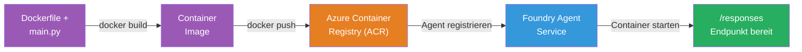
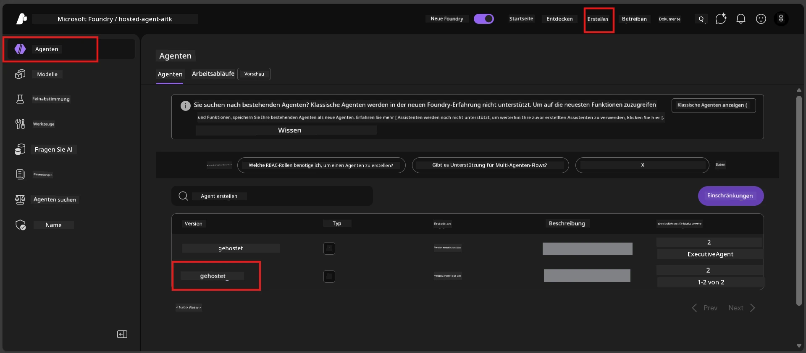

# Modul 6 - Bereitstellung im Foundry Agent Service

In diesem Modul stellen Sie Ihren lokal getesteten Agenten als [**Hosted Agent**](https://learn.microsoft.com/azure/foundry/agents/concepts/hosted-agents) in Microsoft Foundry bereit. Der Bereitstellungsprozess erstellt ein Docker-Container-Image aus Ihrem Projekt, pusht es zu [Azure Container Registry (ACR)](https://learn.microsoft.com/azure/container-registry/container-registry-intro) und erstellt eine gehostete Agentenversion im [Foundry Agent Service](https://learn.microsoft.com/azure/foundry/agents/overview).

### Bereitstellungspipeline


---

## Voraussetzungen prüfen

Vor der Bereitstellung prüfen Sie jeden untenstehenden Punkt. Das Auslassen dieser ist die häufigste Ursache für Bereitstellungsfehler.

1. **Agent besteht lokale Smoke-Tests:**
   - Sie haben alle 4 Tests in [Modul 5](05-test-locally.md) abgeschlossen und der Agent hat korrekt reagiert.

2. **Sie haben die Rolle [Azure AI User](https://learn.microsoft.com/azure/foundry/concepts/rbac-foundry#built-in-roles):**
   - Diese wurde in [Modul 2, Schritt 3](02-create-foundry-project.md) zugewiesen. Wenn Sie unsicher sind, prüfen Sie jetzt:
   - Azure-Portal → Ihre Foundry-**Projekt**-Ressource → **Zugriffssteuerung (IAM)** → Registerkarte **Rollen-Zuweisungen** → nach Ihrem Namen suchen → bestätigten, dass **Azure AI User** aufgeführt ist.

3. **Sie sind in VS Code bei Azure angemeldet:**
   - Prüfen Sie das Kontosymbol unten links in VS Code. Ihr Kontoname sollte sichtbar sein.

4. **(Optional) Docker Desktop läuft:**
   - Docker wird nur benötigt, wenn die Foundry-Erweiterung Sie zu einem lokalen Build auffordert. In den meisten Fällen übernimmt die Erweiterung Container-Builds während der Bereitstellung automatisch.
   - Wenn Docker installiert ist, prüfen Sie, ob es läuft: `docker info`

---

## Schritt 1: Starten Sie die Bereitstellung

Sie haben zwei Möglichkeiten zur Bereitstellung – beide führen zum selben Ergebnis.

### Option A: Bereitstellung über den Agent Inspector (empfohlen)

Wenn Sie den Agenten mit dem Debugger (F5) ausführen und der Agent Inspector geöffnet ist:

1. Schauen Sie in die **obere rechte Ecke** des Agent Inspector Panels.
2. Klicken Sie auf den **Bereitstellen**-Button (Wolken-Symbol mit nach oben zeigendem Pfeil ↑).
3. Der Bereitstellungsassistent öffnet sich.

### Option B: Bereitstellung über die Command Palette

1. Drücken Sie `Ctrl+Shift+P`, um die **Command Palette** zu öffnen.
2. Geben Sie ein: **Microsoft Foundry: Deploy Hosted Agent** und wählen Sie es aus.
3. Der Bereitstellungsassistent öffnet sich.

---

## Schritt 2: Konfigurieren Sie die Bereitstellung

Der Bereitstellungsassistent führt Sie durch die Konfiguration. Füllen Sie jede Eingabeaufforderung aus:

### 2.1 Zielprojekt auswählen

1. Ein Dropdown zeigt Ihre Foundry-Projekte an.
2. Wählen Sie das Projekt aus, das Sie in Modul 2 erstellt haben (z. B. `workshop-agents`).

### 2.2 Container-Agent-Datei auswählen

1. Sie werden aufgefordert, den Einstiegspunkt des Agenten auszuwählen.
2. Wählen Sie **`main.py`** (Python) – dies ist die Datei, die der Assistent verwendet, um Ihr Agentenprojekt zu identifizieren.

### 2.3 Ressourcen konfigurieren

| Einstellung | Empfohlener Wert | Anmerkungen |
|------------|------------------|-------------|
| **CPU** | `0.25` | Standard, ausreichend für Workshop. Für produktive Workloads erhöhen |
| **Speicher** | `0.5Gi` | Standard, ausreichend für Workshop |

Diese Werte entsprechen denen in `agent.yaml`. Sie können die Standardwerte übernehmen.

---

## Schritt 3: Bestätigen und Bereitstellen

1. Der Assistent zeigt eine Bereitstellungsübersicht mit:
   - Zielprojektname
   - Agentenname (aus `agent.yaml`)
   - Container-Datei und Ressourcen
2. Überprüfen Sie die Zusammenfassung und klicken Sie auf **Bestätigen und Bereitstellen** (oder **Deploy**).
3. Beobachten Sie den Fortschritt in VS Code.

### Was während der Bereitstellung passiert (Schritt für Schritt)

Die Bereitstellung ist ein mehrstufiger Prozess. Beobachten Sie im VS Code das **Ausgabe**-Panel (wählen Sie "Microsoft Foundry" aus dem Dropdown), um mitzuvollziehen:

1. **Docker Build** – VS Code baut aus Ihrer `Dockerfile` ein Docker-Container-Image. Sie sehen Meldungen zu Docker-Layern:
   ```
   Step 1/6 : FROM python:<version>-slim
   Step 2/6 : WORKDIR /app
   ...
   Successfully built abc123def456
   ```

2. **Docker Push** – Das Image wird in das mit Ihrem Foundry-Projekt verknüpfte **Azure Container Registry (ACR)** geladen. Die erste Bereitstellung dauert 1–3 Minuten (das Basis-Image ist >100MB).

3. **Agent Registrierung** – Foundry Agent Service erstellt einen neuen gehosteten Agenten (oder eine neue Version, falls der Agent bereits existiert). Die Agenten-Metadaten aus `agent.yaml` werden verwendet.

4. **Container Start** – Der Container startet in der von Foundry verwalteten Infrastruktur. Die Plattform weist eine [systemverwaltete Identität](https://learn.microsoft.com/azure/foundry/agents/concepts/agent-identity) zu und exponiert den `/responses`-Endpunkt.

> **Erste Bereitstellung ist langsamer** (Docker muss alle Layer pushen). Folgebereitstellungen sind schneller, da Docker unveränderte Layer cached.

---

## Schritt 4: Überprüfen Sie den Bereitstellungsstatus

Nach Abschluss des Bereitstellungsbefehls:

1. Öffnen Sie die **Microsoft Foundry**-Seitenleiste durch Klicken auf das Foundry-Symbol in der Aktivitätsleiste.
2. Erweitern Sie den Abschnitt **Hosted Agents (Preview)** unter Ihrem Projekt.
3. Sie sollten Ihren Agentennamen sehen (z. B. `ExecutiveAgent` oder den Namen aus `agent.yaml`).
4. **Klicken Sie auf den Agentennamen**, um ihn zu erweitern.
5. Sie sehen eine oder mehrere **Versionen** (z. B. `v1`).
6. Klicken Sie auf die Version, um die **Container-Details** zu sehen.
7. Prüfen Sie das Feld **Status**:

   | Status | Bedeutung |
   |--------|-----------|
   | **Started** oder **Running** | Der Container läuft und der Agent ist bereit |
   | **Pending** | Container startet noch (warten Sie 30–60 Sekunden) |
   | **Failed** | Container konnte nicht gestartet werden (prüfen Sie die Logs – siehe Fehlerbehebung unten) |



> **Wenn "Pending" länger als 2 Minuten angezeigt wird:** Der Container zieht möglicherweise noch das Basis-Image. Warten Sie etwas länger. Falls es weiterhin auf Pending bleibt, prüfen Sie die Container-Logs.

---

## Häufige Bereitstellungsfehler und deren Behebung

### Fehler 1: Permission denied - `agents/write`

```
Error: lacks the required data action 
Microsoft.CognitiveServices/accounts/AIServices/agents/write 
to perform POST /api/projects/{projectName}/assistants operation.
```

**Ursache:** Ihnen fehlt die Rolle `Azure AI User` auf **Projektebene**.

**Schritt-für-Schritt-Lösung:**

1. Öffnen Sie [https://portal.azure.com](https://portal.azure.com).
2. Geben Sie im Suchfeld den Namen Ihres Foundry-**Projekts** ein und klicken Sie darauf.
   - **Wichtig:** Navigieren Sie zur **Projekt**-Ressource (Typ: "Microsoft Foundry project"), NICHT zur übergeordneten Konto-/Hub-Ressource.
3. Klicken Sie links auf **Zugriffssteuerung (IAM)**.
4. Klicken Sie auf **+ Hinzufügen** → **Rollen-Zuweisung hinzufügen**.
5. Suchen und wählen Sie im Tab **Rolle** die Rolle [**Azure AI User**](https://learn.microsoft.com/azure/foundry/concepts/rbac-foundry#built-in-roles). Klicken Sie auf **Weiter**.
6. Im Tab **Mitglieder** wählen Sie **Benutzer, Gruppe oder Dienstprinzipal**.
7. Klicken Sie auf **+ Mitglieder auswählen**, suchen Sie nach Ihrem Namen/E-Mail, wählen Sie sich aus, klicken Sie auf **Auswählen**.
8. Klicken Sie auf **Überprüfen + zuweisen** → nochmals **Überprüfen + zuweisen**.
9. Warten Sie 1–2 Minuten, bis die Rollen-Zuweisung wirksam wird.
10. **Starten Sie die Bereitstellung** ab Schritt 1 neu.

> Die Rolle muss auf **Projektebene** zugewiesen sein, nicht nur auf Kontoebene. Das ist die häufigste Ursache für Bereitstellungsfehler.

### Fehler 2: Docker läuft nicht

```
Error: Docker build failed / Cannot connect to Docker daemon
```

**Lösung:**
1. Starten Sie Docker Desktop (finden Sie im Startmenü oder der Taskleiste).
2. Warten Sie, bis die Meldung "Docker Desktop läuft" erscheint (30–60 Sekunden).
3. Prüfen Sie: `docker info` im Terminal.
4. **Windows-spezifisch:** Stellen Sie sicher, dass im Docker Desktop unter Einstellungen → **Allgemein** → **WSL 2 basierte Engine verwenden** aktiviert ist.
5. Versuchen Sie die Bereitstellung erneut.

### Fehler 3: ACR-Authentifizierung - `AcrPullUnauthorized`

```
Error: AcrPullUnauthorized
```

**Ursache:** Die verwaltete Identität des Foundry-Projekts hat keinen Pull-Zugriff auf das Container-Registry.

**Lösung:**
1. Navigieren Sie im Azure Portal zu Ihrem **[Container Registry](https://learn.microsoft.com/azure/container-registry/container-registry-intro)** (befindet sich in derselben Ressourcengruppe wie Ihr Foundry-Projekt).
2. Gehen Sie zu **Zugriffssteuerung (IAM)** → **Hinzufügen** → **Rollen-Zuweisung hinzufügen**.
3. Wählen Sie die Rolle **[AcrPull](https://learn.microsoft.com/azure/container-registry/container-registry-roles)** aus.
4. Unter Mitglieder wählen Sie **Verwaltete Identität** → suchen Sie die verwaltete Identität des Foundry-Projekts.
5. **Überprüfen + zuweisen**.

> Dies wird normalerweise automatisch von der Foundry-Erweiterung eingerichtet. Wenn Sie diesen Fehler sehen, deutet dies auf ein fehlgeschlagenes automatisches Setup hin.

### Fehler 4: Container-Plattform nicht passend (Apple Silicon)

Wenn Sie von einem Apple Silicon Mac (M1/M2/M3) bereitstellen, muss der Container für `linux/amd64` gebaut sein:

```bash
docker build --platform linux/amd64 -t myagent:v1 .
```

> Die Foundry-Erweiterung regelt dies für die meisten Nutzer automatisch.

---

### Checkpoint

- [ ] Der Bereitstellungsbefehl wurde ohne Fehler in VS Code abgeschlossen
- [ ] Der Agent erscheint unter **Hosted Agents (Preview)** in der Foundry-Seitenleiste
- [ ] Sie haben den Agenten ausgewählt → eine Version gewählt → **Container-Details** angesehen
- [ ] Der Container-Status zeigt **Started** oder **Running**
- [ ] (Falls Fehler auftraten) Sie haben den Fehler identifiziert, behoben und erfolgreich neu bereitgestellt

---

**Zurück:** [05 - Lokal testen](05-test-locally.md) · **Weiter:** [07 - Prüfung im Playground →](07-verify-in-playground.md)

---

<!-- CO-OP TRANSLATOR DISCLAIMER START -->
**Haftungsausschluss**:
Dieses Dokument wurde mit dem KI-Übersetzungsdienst [Co-op Translator](https://github.com/Azure/co-op-translator) übersetzt. Obwohl wir auf Genauigkeit achten, sollten Sie beachten, dass automatisierte Übersetzungen Fehler oder Ungenauigkeiten enthalten können. Das Originaldokument in der Ursprache gilt als maßgebliche Quelle. Für wichtige Informationen wird eine professionelle menschliche Übersetzung empfohlen. Wir übernehmen keine Haftung für Missverständnisse oder Fehlinterpretationen, die durch die Verwendung dieser Übersetzung entstehen.
<!-- CO-OP TRANSLATOR DISCLAIMER END -->