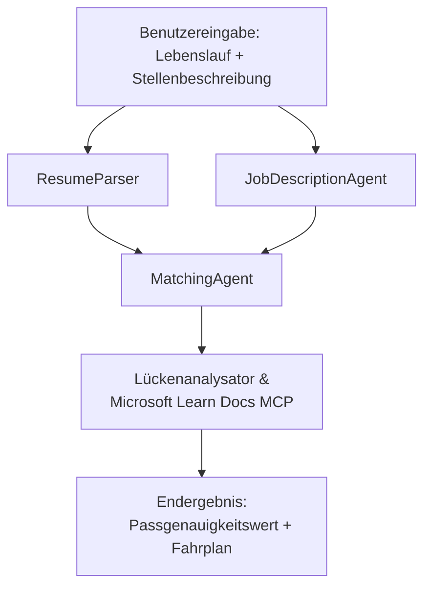

# PersonalCareerCopilot - Lebenslauf → Job-Fit-Bewerter

Ein Multi-Agenten-Workflow, der bewertet, wie gut ein Lebenslauf zu einer Stellenbeschreibung passt, und dann eine personalisierte Lernroadmap erstellt, um die Lücken zu schließen.

---

## Agenten

| Agent | Rolle | Werkzeuge |
|-------|-------|-----------|
| **ResumeParser** | Extrahiert strukturierte Fähigkeiten, Erfahrungen, Zertifizierungen aus Lebenslauftext | - |
| **JobDescriptionAgent** | Extrahiert notwendige/bevorzugte Fähigkeiten, Erfahrungen, Zertifizierungen aus einer Stellenbeschreibung | - |
| **MatchingAgent** | Vergleicht Profil mit Anforderungen → Fit-Score (0-100) + übereinstimmende/fehlende Fähigkeiten | - |
| **GapAnalyzer** | Erstellt eine personalisierte Lernroadmap mit Microsoft Learn Ressourcen | `search_microsoft_learn_for_plan` (MCP) |

## Workflow


---

## Schneller Start

### 1. Umgebung einrichten

```powershell
cd workshop\lab02-multi-agent\PersonalCareerCopilot
python -m venv .venv
.\.venv\Scripts\Activate.ps1          # Windows PowerShell
# source .venv/bin/activate            # macOS / Linux
pip install -r requirements.txt
```

### 2. Zugangsdaten konfigurieren

Kopieren Sie die Beispiel-Umgebungsdatei und füllen Sie Ihre Foundry-Projektdetails aus:

```powershell
cp .env.example .env
```

Bearbeiten Sie `.env`:

```env
PROJECT_ENDPOINT=https://<your-account>.services.ai.azure.com/api/projects/<your-project>
MODEL_DEPLOYMENT_NAME=gpt-4.1-mini
```

| Wert | Wo zu finden |
|-------|--------------|
| `PROJECT_ENDPOINT` | Microsoft Foundry Seitenleiste in VS Code → Rechtsklick auf Ihr Projekt → **Projekt-Endpunkt kopieren** |
| `MODEL_DEPLOYMENT_NAME` | Foundry Seitenleiste → Projekt erweitern → **Modelle + Endpunkte** → Bereitstellungsname |

### 3. Lokal ausführen

```powershell
python -m debugpy --listen 127.0.0.1:5679 -m agentdev run main.py --verbose --port 8088
```

Oder verwenden Sie die VS Code Aufgabe: `Ctrl+Shift+P` → **Tasks: Aufgabe ausführen** → **Run Lab02 HTTP Server**.

### 4. Testen mit Agent Inspector

Öffnen Sie Agent Inspector: `Ctrl+Shift+P` → **Foundry Toolkit: Agent Inspector öffnen**.

Fügen Sie diese Test-Eingabe ein:

```
Resume:
Jane Doe
Senior Software Engineer with 5 years of experience in Python, Django, and AWS.
Built microservices handling 10K+ requests/second. Led a team of 4 developers.
Certifications: AWS Solutions Architect Associate.
Education: B.S. Computer Science, State University.

Job Description:
Senior Cloud Engineer at Contoso Ltd.
Required: Python, Azure, Kubernetes, Terraform, CI/CD pipelines.
Preferred: Go, monitoring (Prometheus/Grafana), cost optimization.
Experience: 5+ years in cloud infrastructure.
Certifications: Azure Solutions Architect Expert preferred.
```

**Erwartet:** Ein Fit-Score (0-100), übereinstimmende/fehlende Fähigkeiten und eine personalisierte Lernroadmap mit Microsoft Learn URLs.

### 5. In Foundry bereitstellen

`Ctrl+Shift+P` → **Microsoft Foundry: Gehosteten Agent bereitstellen** → wählen Sie Ihr Projekt → bestätigen.

---

## Projektstruktur

```
PersonalCareerCopilot/
├── .env.example        ← Template for environment variables
├── .env                ← Your credentials (git-ignored)
├── agent.yaml          ← Hosted agent definition (name, resources, env vars)
├── Dockerfile          ← Container image for Foundry deployment
├── main.py             ← 4-agent workflow (instructions, MCP tool, WorkflowBuilder)
└── requirements.txt    ← Python dependencies
```

## Wichtige Dateien

### `agent.yaml`

Definiert den gehosteten Agenten für Foundry Agent Service:
- `kind: hosted` - läuft als verwalteter Container
- `protocols: [responses v1]` - stellt den HTTP-Endpunkt `/responses` bereit
- `environment_variables` - `PROJECT_ENDPOINT` und `MODEL_DEPLOYMENT_NAME` werden beim Deployment injiziert

### `main.py`

Enthält:
- **Agenten-Anweisungen** - vier `*_INSTRUCTIONS` Konstanten, je eine pro Agent
- **MCP-Tool** - `search_microsoft_learn_for_plan()` ruft `https://learn.microsoft.com/api/mcp` über Streamable HTTP auf
- **Agentenerstellung** - `create_agents()` Kontextmanager mit `AzureAIAgentClient.as_agent()`
- **Workflow-Graph** - `create_workflow()` verwendet `WorkflowBuilder`, um Agenten mit Fan-out/Fan-in/sequenziellen Mustern zu verbinden
- **Serverstart** - `from_agent_framework(agent).run_async()` auf Port 8088

### `requirements.txt`

| Paket | Version | Zweck |
|--------|---------|-------|
| `agent-framework-azure-ai` | `1.0.0rc3` | Azure AI-Integration für Microsoft Agent Framework |
| `agent-framework-core` | `1.0.0rc3` | Kernlaufzeit (inkl. WorkflowBuilder) |
| `azure-ai-agentserver-agentframework` | `1.0.0b16` | Gehosteter Agent-Server Laufzeit |
| `azure-ai-agentserver-core` | `1.0.0b16` | Kernabstraktionen des Agent-Servers |
| `debugpy` | neueste | Python-Debugging (F5 in VS Code) |
| `agent-dev-cli` | `--pre` | Lokaler Entwicklungs-CLI + Agent Inspector Backend |

---

## Fehlerbehebung

| Problem | Lösung |
|---------|---------|
| `RuntimeError: Missing required environment variable(s)` | Erstellen Sie `.env` mit `PROJECT_ENDPOINT` und `MODEL_DEPLOYMENT_NAME` |
| `ModuleNotFoundError: No module named 'agent_framework'` | Aktivieren Sie venv und führen Sie `pip install -r requirements.txt` aus |
| Keine Microsoft Learn URLs im Output | Prüfen Sie die Internetverbindung zu `https://learn.microsoft.com/api/mcp` |
| Nur 1 Gap-Karte (abgeschnitten) | Überprüfen Sie, ob `GAP_ANALYZER_INSTRUCTIONS` den `CRITICAL:` Block enthält |
| Port 8088 in Benutzung | Beenden Sie andere Server: `netstat -ano \| findstr :8088` |

Für ausführliche Fehlerbehebung siehe [Modul 8 - Fehlerbehebung](../docs/08-troubleshooting.md).

---

**Vollständige Anleitung:** [Lab 02 Docs](../docs/README.md) · **Zurück zu:** [Lab 02 README](../README.md) · [Workshop Startseite](../../../README.md)

---

<!-- CO-OP TRANSLATOR DISCLAIMER START -->
**Haftungsausschluss**:  
Dieses Dokument wurde mit dem KI-Übersetzungsdienst [Co-op Translator](https://github.com/Azure/co-op-translator) übersetzt. Obwohl wir uns um Genauigkeit bemühen, beachten Sie bitte, dass automatisierte Übersetzungen Fehler oder Ungenauigkeiten enthalten können. Das Originaldokument in seiner ursprünglichen Sprache ist als maßgebliche Quelle anzusehen. Für kritische Informationen wird eine professionelle menschliche Übersetzung empfohlen. Wir übernehmen keine Haftung für Missverständnisse oder Fehlinterpretationen, die aus der Nutzung dieser Übersetzung entstehen.
<!-- CO-OP TRANSLATOR DISCLAIMER END -->