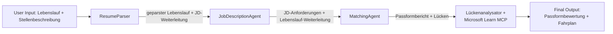

# PersonalCareerCopilot - Lebenslauf → Job-Matching-Bewerter

Eine Workflow-zentrierte Multi-Agenten-App, die bewertet, wie gut ein Lebenslauf zu einer Stellenbeschreibung passt, und dann eine personalisierte Lernroadmap erstellt, um die Lücken zu schließen.

---

## Agenten

| Agent | Rolle | Tools |
|-------|------|-------|
| **ResumeParser** | Extrahiert strukturierte Fähigkeiten, Erfahrungen, Zertifikate aus dem Lebenslauftext | - |
| **JobDescriptionAgent** | Extrahiert erforderliche/bevorzugte Fähigkeiten, Erfahrungen, Zertifikate aus einer Stellenbeschreibung | - |
| **MatchingAgent** | Vergleicht Profil vs Anforderungen → Passgenauigkeitsbewertung (0-100) + übereinstimmende/fehlende Fähigkeiten | - |
| **GapAnalyzer** | Erstellt eine personalisierte Lernroadmap mit Microsoft Learn-Ressourcen | `search_microsoft_learn_for_plan` (MCP) |

## Workflow


```mermaid
flowchart LR
    UserInput["User Input: Lebenslauf + Stellenbeschreibung"] --> ResumeParser
    ResumeParser -- "geparster Lebenslauf + JD-Weiterleitung" --> JobDescriptionAgent
    JobDescriptionAgent -- "JD-Anforderungen + Lebenslauf-Weiterleitung" --> MatchingAgent
    MatchingAgent -- "Passformbericht + Lücken" --> GapAnalyzerMCP["Lückenanalysator +\nMicrosoft Learn MCP"]
    GapAnalyzerMCP --> FinalOutput["Final Output:\nPassformbewertung + Fahrplan"]
```

---

## Schnellstart

### 1. Umgebung einrichten

Dieser Ordner ist die Referenzimplementierung für das workflow-basierte Lab 02 Gerüst. Die `main.py` verwendet die vorhandenen Prompt-Blöcke plus `WorkflowBuilder`, um die vier Agenten zu verbinden.

```powershell
cd workshop\lab02-multi-agent\PersonalCareerCopilot
python -m venv .venv
.\.venv\Scripts\Activate.ps1          # Windows PowerShell
# source .venv/bin/activate            # macOS / Linux
pip install -r requirements.txt
```

### 2. Anmeldedaten konfigurieren

Erstellen Sie in diesem Ordner eine `.env`-Datei:

```powershell
copy .env .env.bak 2>$null; echo $null > .env
```

Bearbeiten Sie `.env`:

```env
FOUNDRY_PROJECT_ENDPOINT=https://<your-account>.services.ai.azure.com/api/projects/<your-project>
AZURE_AI_MODEL_DEPLOYMENT_NAME=gpt-4.1-mini
```

| Wert | Wo finden Sie ihn |
|-------|------------------|
| `FOUNDRY_PROJECT_ENDPOINT` | Foundry Toolkit-Sidebar → Rechtsklick auf Ihr Projekt → **Projektendpunkt kopieren** |
| `AZURE_AI_MODEL_DEPLOYMENT_NAME` | Foundry Sidebar → Projekt erweitern → **Modelle + Endpunkte** → Bereitstellungsname |

### 3. Lokal ausführen

```powershell
python -m debugpy --listen 127.0.0.1:5679 main.py --port 8088
```

Oder verwenden Sie die VS Code-Task: `Strg+Shift+P` → **Tasks: Aufgabe ausführen** → **Agent HTTP Server ausführen**.

Für F5-Debugging verwenden Sie **Debug Local Agent HTTP Server**.

### 4. Testen mit Agent Inspector

Öffnen Sie den Agent Inspector: `Strg+Shift+P` → **Foundry Toolkit: Agent Inspector öffnen**.

Fügen Sie diese Testabfrage ein:

```
Resume:
Jane Doe
Senior Software Engineer with 5 years of experience in Python, Django, and AWS.
Built microservices handling 10K+ requests/second. Led a team of 4 developers.
Certifications: AWS Solutions Architect Associate.
Education: B.S. Computer Science, State University.

Job Description:
Senior Cloud Engineer at Contoso Ltd.
Required: Python, Azure, Kubernetes, Terraform, CI/CD pipelines.
Preferred: Go, monitoring (Prometheus/Grafana), cost optimization.
Experience: 5+ years in cloud infrastructure.
Certifications: Azure Solutions Architect Expert preferred.
```

**Erwartet:** Eine Passgenauigkeitsbewertung (0-100), übereinstimmende/fehlende Fähigkeiten und eine personalisierte Lernroadmap mit Microsoft Learn-URLs.

### 5. Zu Foundry bereitstellen

`Strg+Shift+P` → **Foundry Toolkit: Gehosteten Agent bereitstellen** → Projekt auswählen → bestätigen.

---

## Projektstruktur

```
PersonalCareerCopilot/
├── .env                ← Your credentials (git-ignored)
├── agent.yaml          ← Hosted agent definition (name, resources, env vars)
├── Dockerfile          ← Container image for Foundry deployment
├── main.py             ← 4-agent workflow (instructions, MCP tool, WorkflowBuilder)
└── requirements.txt    ← Python dependencies
```

## Wichtige Dateien

### `agent.yaml`

Definiert den gehosteten Agent für Foundry Agent Service:
- `kind: hosted` - läuft als verwalteter Container
- `protocols` - `responses`-Protokoll mit `version: 1.0.0`, exponiert den HTTP-Endpunkt `/responses`
- `environment_variables` - `AZURE_AI_MODEL_DEPLOYMENT_NAME` wird hier deklariert; `FOUNDRY_PROJECT_ENDPOINT` wird zur Bereitstellungszeit automatisch injiziert

### `main.py`

Enthält:
- **Agent-Anweisungen** - vier `*_INSTRUCTIONS` Konstanten, je eine pro Agent
- **MCP-Tool** - `search_microsoft_learn_for_plan()` ruft `https://learn.microsoft.com/api/mcp` über Streamable HTTP auf
- **Agent-Erstellung** - vier `Agent()` + `AgentExecutor()` Instanzen teilen sich einen `FoundryChatClient`
- **Workflow-Diagramm** - `WorkflowBuilder` verbindet Agenten als sequentielle Pipeline: ResumeParser → JD Agent → MatchingAgent → GapAnalyzer
- **Server-Start** - `ResponsesHostServer` läuft auf Port 8088

### `requirements.txt`

| Paket | Zweck |
|---------|----------|
| `agent-framework-foundry` | Kern-Laufzeit: `Agent`, `AgentExecutor`, `WorkflowBuilder`, `@tool`, `FoundryChatClient` |
| `agent-framework-foundry-hosting` | `ResponsesHostServer` + Foundry-Hosting-Integration |
| `mcp<2,>=1.24.0` | MCP-Client für GapAnalyzer (`streamable_http_client`) |
| `debugpy` | Python-Debugging (F5 in VS Code) |

---

## Problembehandlung

| Problem | Lösung |
|-------|-----|
| `KeyError: 'FOUNDRY_PROJECT_ENDPOINT'` oder `KeyError: 'AZURE_AI_MODEL_DEPLOYMENT_NAME'` | Erstellen Sie `.env` mit beiden `FOUNDRY_PROJECT_ENDPOINT` und `AZURE_AI_MODEL_DEPLOYMENT_NAME` gesetzt |
| `ModuleNotFoundError: No module named 'agent_framework'` | Aktivieren Sie das virtuelle Umfeld und führen Sie `pip install -r requirements.txt` aus |
| Keine Microsoft Learn-URLs in der Ausgabe | Überprüfen Sie die Internetverbindung zu `https://learn.microsoft.com/api/mcp` |
| Nur 1 Gap-Karte (abgeschnitten) | Vergewissern Sie sich, dass `GAP_ANALYZER_INSTRUCTIONS` den `CRITICAL:`-Block enthält |
| Port 8088 ist belegt | Stoppen Sie andere Server: `netstat -ano \| findstr :8088` |

Für detaillierte Problembehandlung siehe [Modul 8 - Problembehandlung](../docs/08-troubleshooting.md).

---

**Komplette Anleitung:** [Lab 02 Dokumentation](../docs/README.md) · **Zurück zu:** [Lab 02 README](../README.md) · [Workshop Startseite](../../../README.md)

---

<!-- CO-OP TRANSLATOR DISCLAIMER START -->
**Haftungsausschluss**:
Dieses Dokument wurde mit dem KI-Übersetzungsdienst [Co-op Translator](https://github.com/Azure/co-op-translator) übersetzt. Obwohl wir uns um Genauigkeit bemühen, beachten Sie bitte, dass automatisierte Übersetzungen Fehler oder Ungenauigkeiten enthalten können. Das Originaldokument in seiner Ursprungssprache gilt als maßgebliche Quelle. Bei kritischen Informationen wird eine professionelle menschliche Übersetzung empfohlen. Wir übernehmen keine Haftung für Missverständnisse oder Fehlinterpretationen, die aus der Verwendung dieser Übersetzung entstehen.
<!-- CO-OP TRANSLATOR DISCLAIMER END -->