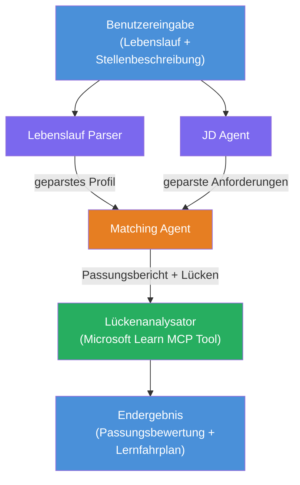

# Lab 02 - Multi-Agent Workflow: Lebenslauf → Job-Fit-Bewerter

---

## Was Sie bauen werden

Ein **Lebenslauf → Job-Fit-Bewerter** – ein Multi-Agent-Workflow, bei dem vier spezialisierte Agenten zusammenarbeiten, um zu bewerten, wie gut der Lebenslauf eines Kandidaten zur Stellenbeschreibung passt, und anschließend einen personalisierten Lernplan erstellen, um die Lücken zu schließen.

### Die Agenten

| Agent | Rolle |
|-------|------|
| **Lebenslauf-Parser** | Extrahiert strukturierte Fähigkeiten, Erfahrung, Zertifizierungen aus dem Lebenslauftext |
| **Stellenbeschreibung-Agent** | Extrahiert erforderliche/bevorzugte Fähigkeiten, Erfahrung, Zertifizierungen aus einer Stellenbeschreibung |
| **Matching-Agent** | Vergleicht Profil mit Anforderungen → Fit-Score (0-100) + abgeglichene/fehlende Fähigkeiten |
| **Lückenanalysator** | Erstellt eine personalisierte Lernroadmap mit Ressourcen, Zeitplänen und Quick-Win-Projekten |

### Demo-Ablauf

Laden Sie einen **Lebenslauf + Stellenbeschreibung** hoch → erhalten Sie einen **Fit-Score + fehlende Fähigkeiten** → erhalten Sie eine **personalisierte Lernroadmap**.

### Workflow-Architektur

> Lila = parallele Agenten | Orange = Aggregationspunkt | Grün = finaler Agent mit Werkzeugen. Siehe [Modul 1 - Architektur verstehen](docs/01-understand-multi-agent.md) und [Modul 4 - Orchestrierungsmuster](docs/04-orchestration-patterns.md) für detaillierte Diagramme und Datenfluss.

### Abgedeckte Themen

- Erstellung eines Multi-Agent-Workflows mit **WorkflowBuilder**
- Definition von Agentenrollen und Orchestrierungsabläufen (parallel + sequenziell)
- Kommunikationsmuster zwischen Agenten
- Lokale Tests mit dem Agent Inspector
- Bereitstellung von Multi-Agent-Workflows im Foundry Agent Service

---

## Voraussetzungen

Schließen Sie zuerst Lab 01 ab:

- [Lab 01 - Ein einzelner Agent](../lab01-single-agent/README.md)

---

## Erste Schritte

Siehe die vollständigen Einrichtungshinweise, Code-Erklärungen und Testbefehle in:

- [Lab 2 Docs - Voraussetzungen](docs/00-prerequisites.md)
- [Lab 2 Docs - Vollständiger Lernpfad](docs/README.md)
- [PersonalCareerCopilot Anleitung](PersonalCareerCopilot/README.md)

## Orchestrierungsmuster (agentische Alternativen)

Lab 2 beinhaltet den Standardablauf **parallel → Aggregator → Planer**, und die Dokumentation beschreibt 
zusätzlich alternative Muster, um stärkere agentische Verhaltensweisen zu demonstrieren:

- **Fan-out/Fan-in mit gewichteter Konsensbildung**
- **Reviewer/Kritiker-Durchgang vor der finalen Roadmap**
- **Konditionaler Router** (Pfadauswahl basierend auf Fit-Score und fehlenden Fähigkeiten)

Siehe [docs/04-orchestration-patterns.md](docs/04-orchestration-patterns.md).

---

**Vorher:** [Lab 01 - Ein einzelner Agent](../lab01-single-agent/README.md) · **Zurück zu:** [Workshop-Startseite](../../README.md)

---

<!-- CO-OP TRANSLATOR DISCLAIMER START -->
**Haftungsausschluss**:  
Dieses Dokument wurde mit dem KI-Übersetzungsdienst [Co-op Translator](https://github.com/Azure/co-op-translator) übersetzt. Obwohl wir auf Genauigkeit achten, beachten Sie bitte, dass automatische Übersetzungen Fehler oder Ungenauigkeiten enthalten können. Das Originaldokument in seiner ursprünglichen Sprache gilt als maßgebliche Quelle. Für wichtige Informationen wird eine professionelle menschliche Übersetzung empfohlen. Wir übernehmen keine Haftung für Missverständnisse oder Fehlinterpretationen, die aus der Verwendung dieser Übersetzung entstehen.
<!-- CO-OP TRANSLATOR DISCLAIMER END -->