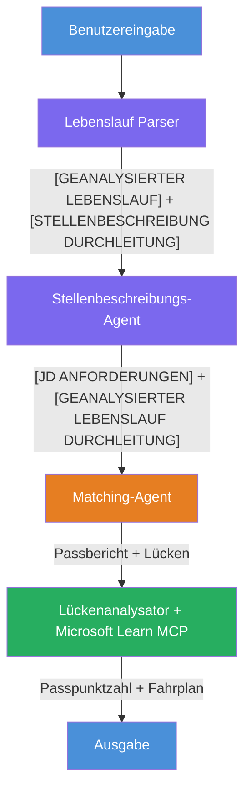

# Labor 02 - Multi-Agent Workflow: Lebenslauf → Job-Fit-Bewertung

## Übersicht

In diesem praxisnahen Labor erstellen Sie eine **Workflow-First Multi-Agent-Anwendung** mit dem Foundry Toolkit in VS Code und stellen diese beim Microsoft Foundry Agent Service bereit.

**Was Sie bauen werden:** Ein Lebenslauf → Job-Fit-Bewerter, der einen Lebenslauf und eine Stellenbeschreibung analysiert, die Übereinstimmung bewertet und eine personalisierte Lern-Roadmap mit Microsoft Learn-Ressourcen erstellt.

---

## Architektur

```mermaid
flowchart TD
    A["Benutzereingabe"] --> B["Lebenslauf Parser"]
    B -->|"[GEANALYSIERTER LEBENSLAUF] + [STELLENBESCHREIBUNG DURCHLEITUNG]"| C["Stellenbeschreibungs-Agent"]
    C -->|"[JD ANFORDERUNGEN] + [GEANALYSIERTER LEBENSLAUF DURCHLEITUNG]"| D["Matching-Agent"]
    D -->|Passbericht + Lücken| E["Lückenanalysator + Microsoft Learn MCP"]
    E -->|Passpunktzahl + Fahrplan| F["Ausgabe"]

    style A fill:#4A90D9,color:#fff
    style B fill:#7B68EE,color:#fff
    style C fill:#7B68EE,color:#fff
    style D fill:#E67E22,color:#fff
    style E fill:#27AE60,color:#fff
    style F fill:#4A90D9,color:#fff
```

**So funktioniert es:**
1. Der Benutzer fügt einen Lebenslauf und eine Stellenbeschreibung ein.
2. **ResumeParser** analysiert den Lebenslauf und kopiert die Stellenbeschreibung wortwörtlich in einen `[JOB DESCRIPTION PASS-THROUGH]` Abschnitt.
3. **JD Agent** extrahiert strukturierte Anforderungen aus dem Pass-Through und leitet dann den `[PARSED RESUME]` weiter als `[PARSED RESUME PASS-THROUGH]`.
4. **MatchingAgent** vergleicht `[PARSED RESUME PASS-THROUGH]` mit `[JD REQUIREMENTS]` und erstellt eine Passgenauigkeitsbewertung.
5. **GapAnalyzer** wandelt die Lücken in eine praktische Roadmap um und holt echte Microsoft Learn-Links über MCP.

---

## Voraussetzungen

Abschließen Sie zuerst Labor 01:

- [Labor 01 - Einzelner Agent](../lab01-single-agent/README.md)

---

## Teil 1: Lesen Sie die Module der Reihenfolge nach

Sehen Sie sich den vollständigen Lernpfad an unter:

- [Labor 2 Docs - Voraussetzungen](docs/00-prerequisites.md)
- [Labor 2 Docs - Vollständiger Lernpfad](docs/README.md)
- [PersonalCareerCopilot Anleitung](PersonalCareerCopilot/README.md)

---

## Teil 2: Workflow erstellen und testen

1. Verwenden Sie den Foundry Toolkit Assistenten, um das workflow-basierte Projekt zu erstellen.
2. Kopieren Sie die Prompt-Blöcke und den Workflow-Graph aus `PersonalCareerCopilot/main.py` in Ihren Arbeitsbereich.
3. Führen Sie lokal mit dem Agent Inspector aus und verifizieren Sie alle vier Agenten sowie das MCP-Tool.
4. Stellen Sie den gehosteten Agenten in Foundry bereit, wenn der lokale Test erfolgreich war.

---

## Orchestrierungsmuster

Labor 02 enthält den Standard **Fan-out → Fan-in → sequentiellen** Ablauf, und die Dokumentation beschreibt auch alternative Orchestrierungsmuster zur Experimentierung.

- **Fan-out/Fan-in mit gewichteter Konsensbildung**
- **Reviewer/Kritiker Durchgang vor der finalen Roadmap**
- **Bedingter Router** basierend auf Passgenauigkeitsbewertung und fehlenden Fähigkeiten

Siehe [docs/04-orchestration-patterns.md](docs/04-orchestration-patterns.md).

---

**Vorher:** [Labor 01 - Einzelner Agent](../lab01-single-agent/README.md) · **Zurück zu:** [Workshop Home](../../README.md)

---

<!-- CO-OP TRANSLATOR DISCLAIMER START -->
**Haftungsausschluss**:
Dieses Dokument wurde mit dem KI-Übersetzungsdienst [Co-op Translator](https://github.com/Azure/co-op-translator) übersetzt. Obwohl wir uns um Genauigkeit bemühen, beachten Sie bitte, dass automatisierte Übersetzungen Fehler oder Ungenauigkeiten enthalten können. Das Originaldokument in seiner Ursprungssprache gilt als maßgebliche Quelle. Bei kritischen Informationen wird eine professionelle menschliche Übersetzung empfohlen. Wir übernehmen keine Haftung für Missverständnisse oder Fehlinterpretationen, die aus der Verwendung dieser Übersetzung entstehen.
<!-- CO-OP TRANSLATOR DISCLAIMER END -->