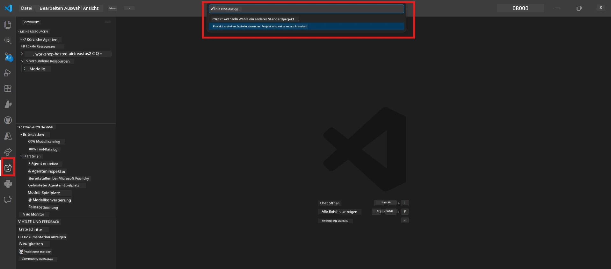

# Modul 0 - Voraussetzungen

Bevor Sie mit Labor 02 beginnen, stellen Sie sicher, dass Sie Folgendes abgeschlossen haben. Dieses Labor baut direkt auf Labor 01 auf – überspringen Sie es nicht.

---

## 1. Labor 01 abschließen

Labor 02 setzt voraus, dass Sie bereits:

- [x] Alle 8 Module von [Labor 01 - Einzelagent](../../lab01-single-agent/README.md) abgeschlossen haben
- [x] Erfolgreich einen einzelnen Agenten im Foundry Agent Service bereitgestellt haben
- [x] Verifiziert haben, dass der Agent sowohl im lokalen Agent Inspector als auch im Foundry Playground funktioniert

Wenn Sie Labor 01 noch nicht abgeschlossen haben, gehen Sie zurück und beenden Sie es jetzt: [Labor 01 Dokumentation](../../lab01-single-agent/docs/00-prerequisites.md)

---

## 2. Bestehende Einrichtung überprüfen

Alle Werkzeuge aus Labor 01 sollten noch installiert und funktionsfähig sein. Führen Sie diese Schnellprüfungen durch:

### 2.1 Azure CLI

```powershell
az account show --query "{name:name, id:id}" --output table
```

Erwartet: Zeigt Ihren Abonnementnamen und Ihre ID an. Falls dies fehlschlägt, führen Sie [`az login`](https://learn.microsoft.com/cli/azure/authenticate-azure-cli-interactively) aus.

### 2.2 VS Code Erweiterungen

1. Drücken Sie `Ctrl+Shift+P` → geben Sie **"Microsoft Foundry"** ein → bestätigen Sie, dass Sie Befehle sehen (z. B. `Microsoft Foundry: Create a New Hosted Agent`).
2. Drücken Sie `Ctrl+Shift+P` → geben Sie **"Foundry Toolkit"** ein → bestätigen Sie, dass Sie Befehle sehen (z. B. `Foundry Toolkit: Open Agent Inspector`).

### 2.3 Foundry-Projekt & Modell

1. Klicken Sie auf das **Microsoft Foundry**-Symbol in der VS Code Aktivitätsleiste.
2. Stellen Sie sicher, dass Ihr Projekt aufgeführt ist (z. B. `workshop-agents`).
3. Erweitern Sie das Projekt → prüfen Sie, ob ein bereitgestelltes Modell vorhanden ist (z. B. `gpt-4.1-mini`) mit dem Status **Succeeded**.

> **Falls Ihre Modellbereitstellung abgelaufen ist:** Einige Free-Tier-Bereitstellungen laufen automatisch ab. Stellen Sie es erneut aus dem [Model Catalog](https://learn.microsoft.com/azure/foundry/foundry-models/concepts/models-sold-directly-by-azure) bereit (`Ctrl+Shift+P` → **Microsoft Foundry: Open Model Catalog**).



### 2.4 RBAC-Rollen

Verifizieren Sie, dass Sie die Rolle **Azure AI User** in Ihrem Foundry-Projekt haben:

1. [Azure Portal](https://portal.azure.com) → Ihre Foundry-**Projekt**-Ressource → **Zugriffssteuerung (IAM)** → **[Rollen-Zuweisungen](https://learn.microsoft.com/azure/foundry/concepts/rbac-foundry)** Reiter.
2. Suchen Sie nach Ihrem Namen → bestätigen Sie, dass **[Azure AI User](https://aka.ms/foundry-ext-project-role)** aufgeführt ist.

---

## 3. Multi-Agenten-Konzepte verstehen (neu für Labor 02)

Labor 02 führt Konzepte ein, die in Labor 01 nicht behandelt wurden. Lesen Sie diese vor dem Fortfahren:

### 3.1 Was ist ein Multi-Agenten-Workflow?

Statt dass ein einzelner Agent alles übernimmt, teilt ein **Multi-Agenten-Workflow** die Arbeit auf mehrere spezialisierte Agenten auf. Jeder Agent hat:

- Eigene **Anweisungen** (Systemprompt)
- Eigene **Rolle** (wofür er verantwortlich ist)
- Optionale **Werkzeuge** (Funktionen, die er aufrufen kann)

Die Agenten kommunizieren über einen **Orchestrierungsgraphen**, der definiert, wie Daten zwischen ihnen fließen.

### 3.2 WorkflowBuilder

Die [`WorkflowBuilder`](https://learn.microsoft.com/agent-framework/workflows/agents-in-workflows) Klasse aus `agent_framework` ist die SDK-Komponente, die Agenten miteinander verbindet:

```python
from agent_framework import WorkflowBuilder

workflow = (
    WorkflowBuilder(
        name="MyWorkflow",
        start_executor=agent_a,
        output_executors=[agent_d],
    )
    .add_edge(agent_a, agent_b)
    .add_edge(agent_a, agent_c)
    .add_edge(agent_b, agent_d)
    .add_edge(agent_c, agent_d)
    .build()
)
```

- **`start_executor`** – Der erste Agent, der Benutzereingaben empfängt
- **`output_executors`** – Der/Die Agent(en), dessen/deren Ausgabe die endgültige Antwort wird
- **`add_edge(source, target)`** – Definiert, dass `target` die Ausgabe von `source` empfängt

### 3.3 MCP (Model Context Protocol) Werkzeuge

Labor 02 verwendet ein **MCP-Werkzeug**, das die Microsoft Learn API aufruft, um Lernressourcen abzurufen. [MCP (Model Context Protocol)](https://modelcontextprotocol.io/introduction) ist ein standardisiertes Protokoll zum Verbinden von KI-Modellen mit externen Datenquellen und Werkzeugen.

| Begriff | Definition |
|------|-----------|
| **MCP-Server** | Ein Dienst, der Werkzeuge/Ressourcen über das [MCP-Protokoll](https://learn.microsoft.com/azure/foundry/agents/how-to/tools/model-context-protocol) bereitstellt |
| **MCP-Client** | Ihr Agentencode, der eine Verbindung zu einem MCP-Server herstellt und dessen Werkzeuge aufruft |
| **[Streamable HTTP](https://learn.microsoft.com/agent-framework/agents/tools/hosted-mcp-tools)** | Das Transportverfahren zur Kommunikation mit dem MCP-Server |

### 3.4 Wie sich Labor 02 von Labor 01 unterscheidet

| Aspekt | Labor 01 (Einzelagent) | Labor 02 (Multi-Agent) |
|--------|------------------------|------------------------|
| Agenten | 1 | 4 (spezialisierte Rollen) |
| Orchestrierung | Keine | WorkflowBuilder (parallel + sequenziell) |
| Werkzeuge | Optional `@tool` Funktion | MCP-Werkzeug (externer API-Aufruf) |
| Komplexität | Einfaches Prompt → Antwort | Lebenslauf + Stellenbeschreibung → Passgenauigkeitsbewertung → Roadmap |
| Kontextfluss | Direkt | Agent-zu-Agent Übergabe |

---

## 4. Workshop-Repository-Struktur für Labor 02

Stellen Sie sicher, dass Sie wissen, wo sich die Dateien für Labor 02 befinden:

```
workshop/
└── lab02-multi-agent/
    ├── README.md                       ← Lab overview
    ├── docs/                           ← You are here
    │   ├── README.md                   ← Learning path index
    │   ├── 00-prerequisites.md         ← This file
    │   ├── 01-understand-multi-agent.md
    │   ├── ...
    │   └── 08-troubleshooting.md
    └── PersonalCareerCopilot/          ← The agent project
        ├── agent.yaml                  ← Agent definition
        ├── main.py                     ← 4-agent workflow code
        ├── Dockerfile                  ← Container configuration
        └── requirements.txt            ← Python dependencies
```

---

### Checkpoint

- [ ] Labor 01 ist vollständig abgeschlossen (alle 8 Module, Agent bereitgestellt und verifiziert)
- [ ] `az account show` zeigt Ihr Abonnement an
- [ ] Microsoft Foundry und Foundry Toolkit Erweiterungen sind installiert und reagieren
- [ ] Foundry-Projekt hat ein bereitgestelltes Modell (z. B. `gpt-4.1-mini`)
- [ ] Sie haben die Rolle **Azure AI User** im Projekt
- [ ] Sie haben den Abschnitt zu Multi-Agenten-Konzepte oben gelesen und verstehen WorkflowBuilder, MCP und Agenten-Orchestrierung

---

**Weiter:** [01 - Multi-Agenten-Architektur verstehen →](01-understand-multi-agent.md)

---

<!-- CO-OP TRANSLATOR DISCLAIMER START -->
**Haftungsausschluss**:  
Dieses Dokument wurde mit dem KI-Übersetzungsdienst [Co-op Translator](https://github.com/Azure/co-op-translator) übersetzt. Obwohl wir uns um Genauigkeit bemühen, sollten Sie beachten, dass automatisierte Übersetzungen Fehler oder Ungenauigkeiten enthalten können. Das Originaldokument in seiner Ursprungssprache ist als maßgebliche Quelle zu betrachten. Für kritische Informationen wird eine professionelle menschliche Übersetzung empfohlen. Wir übernehmen keine Haftung für Missverständnisse oder Fehlinterpretationen, die aus der Verwendung dieser Übersetzung entstehen.
<!-- CO-OP TRANSLATOR DISCLAIMER END -->