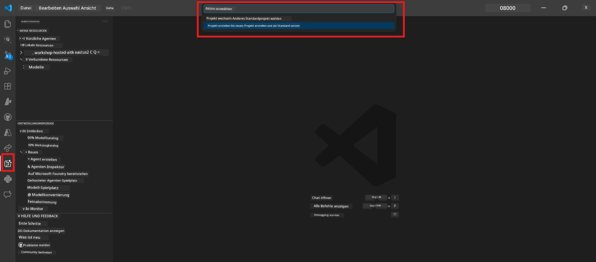

# Modul 0 - Einführung

⏱️ ~10 Min.

> [!WARNING]
> **Vorschau & Einschränkungen:** [Hosted Agents](https://learn.microsoft.com/azure/foundry/agents/concepts/hosted-agents) befinden sich derzeit in der **öffentlichen Vorschau** – nicht für produktive Workloads empfohlen. Einige Funktionen, die in diesem Workshop gezeigt werden, können sich ändern, wenn der Dienst den GA-Status erreicht.

## Was Sie bauen werden

In diesem Labor erweitern Sie die Single-Agent-Fähigkeiten aus Labor 01, um einen **Multi-Agent-Workflow** zu erstellen – den Lebenslauf → Job-Fit-Bewerter.

Sie fügen einen **Lebenslauf** und eine **Stellenbeschreibung** ein. Vier spezialisierte Agenten bearbeiten die Eingabe nacheinander und liefern:
- Eine Fit-Score (0–100 mit einer Scoring-Aufschlüsselung)
- Eine Liste der fehlenden Fähigkeiten und Zertifizierungen
- Einen personalisierten Lernfahrplan mit echten Microsoft Learn-Links für jede Lücke

**Der Workflow verwendet:**
- **Microsoft Agent Framework** - `WorkflowBuilder` für sequentielle Pipeline-Orchestrierung
- **Foundry Toolkit für VS Code** - Gerüst, lokal testen, bereitstellen
- **Ein KI-Modell** (z.B. `gpt-4.1-mini`) - von allen vier Agenten verwendet
- **Microsoft Learn MCP-Server** - liefert echte Lernressourcen-Links für jede Fähigkeitslücke

---

## Wähle deinen Pfad

> ⚠️ **Fahre mit demselben Pfad fort, den du in Labor 01 verwendet hast.**

<details open>
<summary><strong>🅰️ Pfad A - Azure-Cloud (erfordert Azure-Abonnement)</strong></summary>

| | Details |
|---|---|
| **Für wen ist das?** | Du hast Labor 01 mit einem Azure-Abonnement abgeschlossen |
| **Modell** | Azure OpenAI via Foundry (z.B. `gpt-4.1-mini`) |
| **Abgedeckte Module** | Alle Module (00–09) |
| **In die Cloud bereitstellen?** | ✅ Ja – vollständige Ende-zu-Ende-Bereitstellung |

</details>

<details open>
<summary><strong>🅱️ Pfad B - Foundry Local (kein Azure-Abonnement erforderlich)</strong></summary>

| | Details |
|---|---|
| **Für wen ist das?** | Du hast Labor 01 mit Foundry Local abgeschlossen |
| **Modell** | Foundry Local (kostenlos, läuft auf deinem Rechner) |
| **Abgedeckte Module** | Module 00–05 (überspringe 06–07 – Bereitstellung & Cloud-Verifizierung) |
| **In die Cloud bereitstellen?** | ❌ Nein – nur lokale Tests via Agent Inspector |

</details>

---

## Labor 01 Check

Labor 02 baut direkt auf Labor 01 auf. Schließe Labor 01 zuerst ab, bevor du hier beginnst.

Habe Labor 01 noch nicht gemacht? Starte hier: [Labor 01 - Einführung](../../lab01-single-agent/docs/00-prerequisites.md)

<details open>
<summary><strong>🅰️ Pfad A - Azure Cloud</strong></summary>

```powershell
az account show --query "{name:name, id:id}" --output table
```

Falls dies fehlschlägt, führe `az login` aus. Überprüfe dann in VS Code:

1. `Ctrl+Shift+P` → gebe **Foundry Toolkit** ein → bestätige, dass Befehle erscheinen.
2. Klicke auf das **Foundry Toolkit**-Symbol → dein Projekt und das bereitgestellte Modell zeigen **Erfolgreich** an.



> **RBAC:** Du hast in Labor 01 die Rolle **Foundry User** zugewiesen. Falls du sie neu zuweisen musst, siehe [Labor 01, Modul 1](../../lab01-single-agent/docs/01-setup.md#deploy-a-model--assign-rbac). Die Rolle hieß früher **Azure AI User** – gleiche Berechtigungen.

</details>

<details open>
<summary><strong>🅱️ Pfad B - Foundry Local</strong></summary>

```powershell
Invoke-WebRequest -Uri "http://localhost:5273/v1/health" -UseBasicParsing | Select-Object StatusCode
```

Erwartet: `StatusCode: 200`. Falls nicht, starte Foundry Local über die Foundry Toolkit-Seitenleiste neu.

> Alle Inferenz läuft auf deinem Rechner. Der einzige ausgehende Aufruf ist das MCP-Tool zu `https://learn.microsoft.com/api/mcp`.

</details>

---

## Was ist neu in Labor 02

| | Labor 01 | Labor 02 |
|--|--------|--------|
| Agenten | 1 | 4 (verkettet mit WorkflowBuilder) |
| Gerüstvorlage | Basic - Agent Framework | Workflows - Agent Framework |
| Neues Paket | - | `mcp` |
| Orchestrierung | Einzelner Gesprächsagent | Sequentielle Pipeline (WorkflowBuilder) |
| Neues Werkzeug | - | `search_microsoft_learn_for_plan` (MCP) |

---

**Weiter:** [01 - Architektur verstehen →](01-understand-multi-agent.md)

---

<!-- CO-OP TRANSLATOR DISCLAIMER START -->
**Haftungsausschluss**:
Dieses Dokument wurde mit dem KI-Übersetzungsdienst [Co-op Translator](https://github.com/Azure/co-op-translator) übersetzt. Obwohl wir uns um Genauigkeit bemühen, beachten Sie bitte, dass automatisierte Übersetzungen Fehler oder Ungenauigkeiten enthalten können. Das Originaldokument in seiner Ursprungssprache gilt als maßgebliche Quelle. Bei kritischen Informationen wird eine professionelle menschliche Übersetzung empfohlen. Wir übernehmen keine Haftung für Missverständnisse oder Fehlinterpretationen, die aus der Verwendung dieser Übersetzung entstehen.
<!-- CO-OP TRANSLATOR DISCLAIMER END -->