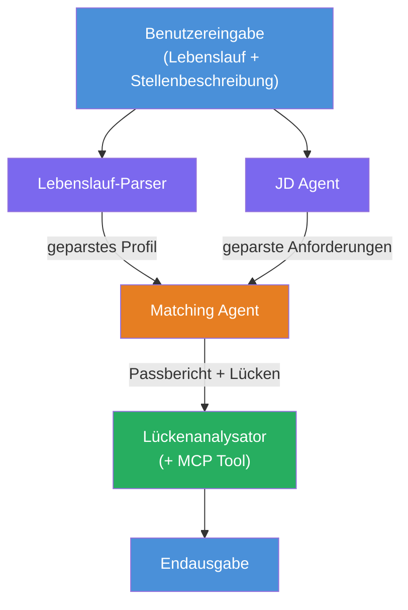
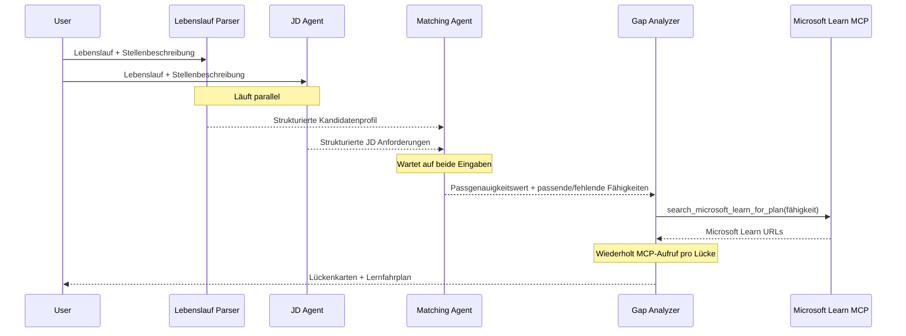
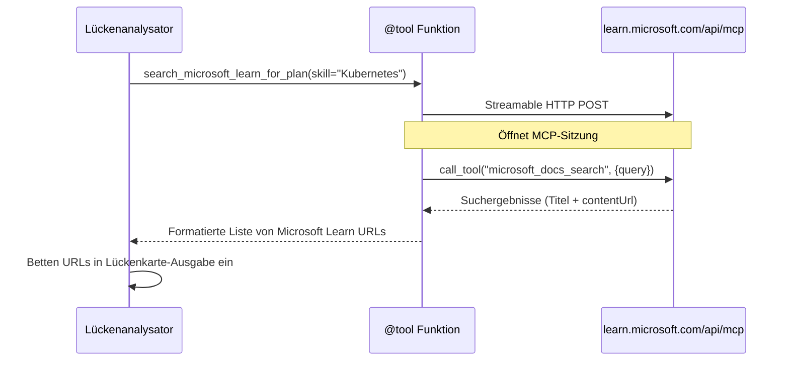

# Modul 1 – Verstehen der Multi-Agenten-Architektur

In diesem Modul lernen Sie die Architektur des Lebenslauf → Job-Fit-Evaluators, bevor Sie Code schreiben. Das Verständnis des Orchestrierungsdiagramms, der Agentenrollen und des Datenflusses ist entscheidend für das Debuggen und die Erweiterung von [Multi-Agenten-Workflows](https://learn.microsoft.com/azure/architecture/ai-ml/idea/multiple-agent-workflow-automation).

---

## Das Problem, das gelöst wird

Die Zuordnung eines Lebenslaufs zu einer Stellenbeschreibung erfordert mehrere unterschiedliche Fähigkeiten:

1. **Parsing** – Strukturierte Daten aus unstrukturiertem Text (Lebenslauf) extrahieren
2. **Analyse** – Anforderungen aus einer Stellenbeschreibung extrahieren
3. **Vergleich** – Die Übereinstimmung zwischen beiden bewerten
4. **Planung** – Einen Lernfahrplan zum Schließen von Lücken erstellen

Ein einzelner Agent, der alle vier Aufgaben in einem Prompt ausführt, erzeugt oft:
- Unvollständige Extraktion (er hetzt durch das Parsing, um zur Bewertung zu gelangen)
- Oberflächliche Bewertungen (keine evidenzbasierte Aufschlüsselung)
- Generische Lernpläne (nicht auf die spezifischen Lücken abgestimmt)

Indem man in **vier spezialisierte Agenten** aufteilt, konzentriert sich jeder mit spezifischen Anweisungen auf seine Aufgabe und erzeugt in jeder Phase eine qualitativ hochwertigere Ausgabe.

---

## Die vier Agenten

Jeder Agent ist ein vollständiger [Microsoft Foundry](https://learn.microsoft.com/azure/foundry/agents/concepts/hosted-agents) Agent, der über `AzureAIAgentClient.as_agent()` erstellt wurde. Sie verwenden das gleiche Modell, haben aber unterschiedliche Anweisungen und (optional) verschiedene Werkzeuge.

| # | Agentenname | Rolle | Eingabe | Ausgabe |
|---|-------------|-------|---------|---------|
| 1 | **ResumeParser** | Extrahiert ein strukturiertes Profil aus dem Lebenslauftext | Rohtext des Lebenslaufs (vom Nutzer) | Kandidatenprofil, technische Fähigkeiten, Soft Skills, Zertifikate, Branchenerfahrung, Erfolge |
| 2 | **JobDescriptionAgent** | Extrahiert strukturierte Anforderungen aus einer Stellenbeschreibung | Rohtext der Stellenbeschreibung (vom Nutzer, weitergeleitet vom ResumeParser) | Rollenübersicht, erforderliche Fähigkeiten, bevorzugte Fähigkeiten, Erfahrung, Zertifikate, Ausbildung, Verantwortlichkeiten |
| 3 | **MatchingAgent** | Berechnet evidenzbasierte Fit-Bewertung | Ausgaben von ResumeParser + JobDescriptionAgent | Fit Score (0-100 mit Aufschlüsselung), passende Fähigkeiten, fehlende Fähigkeiten, Lücken |
| 4 | **GapAnalyzer** | Erstellt einen personalisierten Lernfahrplan | Ausgabe von MatchingAgent | Lückenkarten (pro Fähigkeit), Lernreihenfolge, Zeitplan, Ressourcen von Microsoft Learn |

---

## Das Orchestrierungsdiagramm

Der Workflow verwendet **parallelen Fan-out**, gefolgt von **sequentieller Aggregation**:


> **Legende:** Lila = parallele Agenten, Orange = Aggregationspunkt, Grün = finaler Agent mit Werkzeugen

### Wie die Daten fließen


1. **Der Nutzer sendet** eine Nachricht mit Lebenslauf und Stellenbeschreibung.
2. **ResumeParser** erhält den vollständigen Nutzerinput und extrahiert ein strukturiertes Kandidatenprofil.
3. **JobDescriptionAgent** erhält parallel den Nutzerinput und extrahiert strukturierte Anforderungen.
4. **MatchingAgent** erhält Ausgaben von **beiden** ResumeParser und JobDescriptionAgent (das Framework wartet, bis beide abgeschlossen sind, bevor MatchingAgent ausgeführt wird).
5. **GapAnalyzer** erhält die Ausgabe von MatchingAgent und ruft das **Microsoft Learn MCP Tool** auf, um echte Lernressourcen für jede Lücke abzurufen.
6. Die **Endausgabe** ist die Antwort von GapAnalyzer, die den Fit Score, die Lückenkarten und einen vollständigen Lernfahrplan enthält.

### Warum paralleler Fan-out wichtig ist

ResumeParser und JobDescriptionAgent laufen **parallel**, da keiner vom anderen abhängt. Dies:
- Reduziert die Gesamtlatenz (beide laufen gleichzeitig statt nacheinander)
- Ist eine natürliche Aufteilung (Parsing Lebenslauf vs. Parsing Stellenbeschreibung sind unabhängige Aufgaben)
- Demonstriert ein häufiges Multi-Agenten-Muster: **fan-out → aggregieren → agieren**

---

## WorkflowBuilder im Code

So wird das obige Diagramm auf die [`WorkflowBuilder`](https://learn.microsoft.com/agent-framework/workflows/agents-in-workflows) API-Aufrufe in `main.py` abgebildet:

```python
from agent_framework import WorkflowBuilder

workflow = (
    WorkflowBuilder(
        name="ResumeJobFitEvaluator",
        start_executor=resume_parser,       # Erster Agent, der Benutzereingaben erhält
        output_executors=[gap_analyzer],     # Letzter Agent, dessen Ausgabe zurückgegeben wird
    )
    .add_edge(resume_parser, jd_agent)      # ResumeParser → Stellenbeschreibungs-Agent
    .add_edge(resume_parser, matching_agent) # ResumeParser → MatchingAgent
    .add_edge(jd_agent, matching_agent)      # Stellenbeschreibungs-Agent → MatchingAgent
    .add_edge(matching_agent, gap_analyzer)  # MatchingAgent → Lückenanalysator
    .build()
)
```

**Verstehen der Verbindungen:**

| Verbindung | Bedeutung |
|------------|-----------|
| `resume_parser → jd_agent` | JD Agent erhält die Ausgabe von ResumeParser |
| `resume_parser → matching_agent` | MatchingAgent erhält die Ausgabe von ResumeParser |
| `jd_agent → matching_agent` | MatchingAgent erhält auch die Ausgabe vom JD Agent (wartet auf beide) |
| `matching_agent → gap_analyzer` | GapAnalyzer erhält die Ausgabe von MatchingAgent |

Da `matching_agent` **zwei eingehende Verbindungen** hat (`resume_parser` und `jd_agent`), wartet das Framework automatisch, bis beide abgeschlossen sind, bevor der Matching Agent ausgeführt wird.

---

## Das MCP Tool

Der GapAnalyzer Agent hat ein Werkzeug: `search_microsoft_learn_for_plan`. Dies ist ein **[MCP Tool](https://learn.microsoft.com/agent-framework/agents/tools/hosted-mcp-tools)**, das die Microsoft Learn API aufruft, um kuratierte Lernressourcen abzurufen.

### So funktioniert es

```python
@tool
async def search_microsoft_learn_for_plan(
    skill: str, role: str = "", max_results: int = 5
) -> str:
    """Search Microsoft Learn MCP and return curated official links."""
    # Verbindet sich über Streamable HTTP mit https://learn.microsoft.com/api/mcp
    # Ruft das Tool 'microsoft_docs_search' auf dem MCP-Server auf
    # Gibt eine formatierte Liste von Microsoft Learn URLs zurück
```

### MCP Aufrufablauf


1. GapAnalyzer entscheidet, dass Lernressourcen für eine Fähigkeit benötigt werden (z.B. "Kubernetes")
2. Das Framework ruft `search_microsoft_learn_for_plan(skill="Kubernetes")` auf
3. Die Funktion öffnet eine [Streamable HTTP](https://learn.microsoft.com/agent-framework/agents/tools/hosted-mcp-tools)-Verbindung zu `https://learn.microsoft.com/api/mcp`
4. Sie ruft das `microsoft_docs_search` Tool auf dem [MCP Server](https://learn.microsoft.com/azure/foundry/agents/how-to/tools/model-context-protocol) auf
5. Der MCP Server gibt Suchergebnisse zurück (Titel + URL)
6. Die Funktion formatiert die Ergebnisse und gibt sie als String zurück
7. GapAnalyzer nutzt die zurückgegebenen URLs in seiner Lückenkartenausgabe

### Erwartete MCP Logs

Wenn das Tool ausgeführt wird, sehen Sie Logeinträge wie:

```
GET https://learn.microsoft.com/api/mcp → 405 (Method Not Allowed)
POST https://learn.microsoft.com/api/mcp → 200
DELETE https://learn.microsoft.com/api/mcp → 405 (Method Not Allowed)
```

**Das ist normal.** Der MCP Client sendet während der Initialisierung Probes mit GET und DELETE – dass diese mit 405 antworten, ist erwartetes Verhalten. Der eigentliche Toolaufruf verwendet POST und gibt 200 zurück. Nur wenn POST-Aufrufe fehlschlagen, müssen Sie sich sorgen.

---

## Muster für die Agentenerstellung

Jeder Agent wird unter Verwendung des **[`AzureAIAgentClient.as_agent()`](https://learn.microsoft.com/python/api/overview/azure/ai-agents-readme) asynchronen Kontextmanagers** erstellt. Dies ist das Foundry SDK-Muster, um Agenten zu erstellen, die automatisch bereinigt werden:

```python
async with (
    get_credential() as credential,
    AzureAIAgentClient(
        project_endpoint=PROJECT_ENDPOINT,
        model_deployment_name=MODEL_DEPLOYMENT_NAME,
        credential=credential,
    ).as_agent(
        name="ResumeParser",
        instructions=RESUME_PARSER_INSTRUCTIONS,
    ) as resume_parser,
    # ... für jeden Agenten wiederholen ...
):
    # Alle 4 Agenten sind hier vorhanden
    workflow = create_workflow(resume_parser, jd_agent, matching_agent, gap_analyzer)
```

**Wichtige Punkte:**
- Jeder Agent erhält eine eigene `AzureAIAgentClient` Instanz (das SDK verlangt, dass der Agentenname auf den Client bezogen ist)
- Alle Agenten teilen sich dieselben `credential`, `PROJECT_ENDPOINT` und `MODEL_DEPLOYMENT_NAME`
- Der `async with`-Block stellt sicher, dass alle Agenten bereinigt werden, wenn der Server herunterfährt
- Der GapAnalyzer erhält zusätzlich `tools=[search_microsoft_learn_for_plan]`

---

## Serverstart

Nach Erstellung der Agenten und Aufbau des Workflows, startet der Server:

```python
from azure.ai.agentserver.agentframework import from_agent_framework

agent = create_workflow(resume_parser, jd_agent, matching_agent, gap_analyzer)
await from_agent_framework(agent).run_async()
```

`from_agent_framework()` kapselt den Workflow als HTTP-Server, der den `/responses` Endpunkt auf Port 8088 bereitstellt. Dies ist dasselbe Muster wie in Lab 01, aber der „Agent“ ist nun der gesamte [Workflow-Graph](https://learn.microsoft.com/agent-framework/workflows/as-agents).

---

### Checkpoint

- [ ] Sie verstehen die Architektur mit 4 Agenten und die Rolle jedes Agenten
- [ ] Sie können den Datenfluss nachvollziehen: Nutzer → ResumeParser → (parallel) JD Agent + MatchingAgent → GapAnalyzer → Ausgabe
- [ ] Sie verstehen, warum MatchingAgent auf ResumeParser und JD Agent wartet (zwei eingehende Verbindungen)
- [ ] Sie verstehen das MCP Tool: was es tut, wie es aufgerufen wird, und dass GET 405-Logs normal sind
- [ ] Sie verstehen das `AzureAIAgentClient.as_agent()` Muster und warum jeder Agent seine eigene Client-Instanz hat
- [ ] Sie können den `WorkflowBuilder`-Code lesen und mit dem visuellen Diagramm verknüpfen

---

**Vorheriges:** [00 - Voraussetzungen](00-prerequisites.md) · **Nächstes:** [02 - Scaffold des Multi-Agent Projekts →](02-scaffold-multi-agent.md)

---

<!-- CO-OP TRANSLATOR DISCLAIMER START -->
**Haftungsausschluss**:  
Dieses Dokument wurde mit dem KI-Übersetzungsdienst [Co-op Translator](https://github.com/Azure/co-op-translator) übersetzt. Obwohl wir uns um Genauigkeit bemühen, beachten Sie bitte, dass automatisierte Übersetzungen Fehler oder Ungenauigkeiten enthalten können. Das Originaldokument in seiner Ursprungssprache ist als maßgebliche Quelle zu betrachten. Für wichtige Informationen wird eine professionelle menschliche Übersetzung empfohlen. Wir übernehmen keine Haftung für Missverständnisse oder Fehlinterpretationen, die durch die Nutzung dieser Übersetzung entstehen.
<!-- CO-OP TRANSLATOR DISCLAIMER END -->