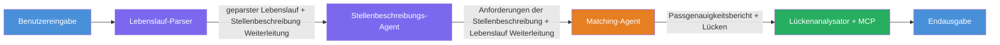

# Modul 1 - Verstehe die Architektur

⏱️ ~5 Min.

Bevor du Code schreibst, hier eine kurze Übersicht darüber, was du baust und wie es funktioniert.

---

## Was du baust

Du fügst einen **Lebenslauf** und eine **Stellenbeschreibung** ein. Der Workflow liefert zurück:

- Einen Passgenauigkeitswert (0–100 mit Details)
- Eine Liste von Fähigkeits- und Zertifikatslücken
- Einen personalisierten Lernfahrplan mit Links zu Microsoft Learn für jede Lücke

---

## Die vier Agenten

Ein einzelner Agent, der versucht, alles auf einmal zu parsen, bewerten und planen, neigt dazu, zu hetzen und oberflächliche Ergebnisse zu liefern. Die Arbeit auf vier spezialisierte Agenten aufzuteilen, liefert bessere Resultate:

| Agent | Was er macht |
|-------|--------------|
| **ResumeParser** | Parst den Lebenslauf; kopiert die Stellenbeschreibung wortwörtlich in `[JOB DESCRIPTION PASS-THROUGH]` für nachgelagerte Agenten |
| **JobDescriptionAgent** | Extrahiert Anforderungen aus der Stellenbeschreibung; leitet `[PARSED RESUME]` als `[PARSED RESUME PASS-THROUGH]` weiter |
| **MatchingAgent** | Vergleicht beide beschrifteten Abschnitte; erstellt einen Passgenauigkeitswert von 0–100 und eine Lückenliste |
| **GapAnalyzer** | Erstellt einen Lernfahrplan; sucht für jede Lücke auf Microsoft Learn |

---

## Das Orchestrierungsdiagramm

Der Workflow ist eine **sequentielle Pipeline** – jeder Agent gibt seine Ausgabe an den nächsten weiter:


```mermaid
flowchart LR
    A["Benutzereingabe"] --> B["Lebenslauf-Parser"]
    B -- "geparster Lebenslauf + Stellenbeschreibung Weiterleitung" --> C["Stellenbeschreibungs-Agent"]
    C -- "Anforderungen der Stellenbeschreibung + Lebenslauf Weiterleitung" --> D["Matching-Agent"]
    D -- "Passgenauigkeitsbericht + Lücken" --> E["Lückenanalysator + MCP"]
    E --> F["Endausgabe"]

    style A fill:#4A90D9,color:#fff
    style B fill:#7B68EE,color:#fff
    style C fill:#7B68EE,color:#fff
    style D fill:#E67E22,color:#fff
    style E fill:#27AE60,color:#fff
    style F fill:#4A90D9,color:#fff
```

1. **ResumeParser** erhält die Benutzereingabe, parst den Lebenslauf und kopiert die Stellenbeschreibung in `[JOB DESCRIPTION PASS-THROUGH]`.
2. **JD Agent** extrahiert strukturierte Anforderungen und leitet `[PARSED RESUME PASS-THROUGH]` weiter.
3. **MatchingAgent** vergleicht beide Abschnitte und erstellt einen Passgenauigkeitswert und eine Lückenliste.
4. **GapAnalyzer** erstellt den Lernfahrplan und ruft für jede Lücke das Microsoft Learn MCP-Tool auf.

---

## Wie sich das im Code abbildet

In `main.py` beschreibst du dieses Diagramm mit `WorkflowBuilder`:

```python
workflow_agent = (
    WorkflowBuilder(
        start_executor=resume_executor,       # erster Agent, der Benutzereingaben erhält
        output_executors=[gap_executor],      # letzter Agent - seine Ausgabe ist die Antwort
    )
    .add_edge(resume_executor, jd_executor)       # ResumeParser → JD-Agent
    .add_edge(jd_executor, matching_executor)     # JD-Agent → MatchingAgent
    .add_edge(matching_executor, gap_executor)    # MatchingAgent → GapAnalyzer
    .build()
    .as_agent()
)
```

Jeder `Agent` ist in einem `AgentExecutor` eingebettet. Die `add_edge()`-Aufrufe definieren eine strikt sequentielle Pipeline – jeder Agent erhält nur die Ausgabe seines direkten Vorgängers.

> `context_mode="last_agent"` bedeutet, dass jeder Executor nur die Ausgabe seines direkten Vorgängers sieht. ResumeParser und JD Agent leiten Daten in beschrifteten Abschnitten weiter, sodass jeder nachgelagerte Agent genau das bekommt, was er braucht.

---

## Das MCP-Tool

GapAnalyzer hat ein Tool: `search_microsoft_learn_for_plan`. Es verbindet sich mit `https://learn.microsoft.com/api/mcp` und liefert echte Microsoft Learn Links für jede Fähigkeitslücke zurück.

Wenn das Tool ausgeführt wird, siehst du diese Logs – alles erwartet:

```
GET  https://learn.microsoft.com/api/mcp → 405   ← connection probe, normal
POST https://learn.microsoft.com/api/mcp → 200   ← actual tool call
DELETE https://learn.microsoft.com/api/mcp → 405 ← cleanup probe, normal
```

Du musst dir nur Sorgen machen, wenn der `POST`-Aufruf einen Fehler zurückgibt.

---

**Vorheriger:** [00 - Voraussetzungen](00-prerequisites.md) · **Nächster:** [02 - Projekt strukturieren →](02-scaffold-multi-agent.md)

---

<!-- CO-OP TRANSLATOR DISCLAIMER START -->
**Haftungsausschluss**:
Dieses Dokument wurde mit dem KI-Übersetzungsdienst [Co-op Translator](https://github.com/Azure/co-op-translator) übersetzt. Obwohl wir uns um Genauigkeit bemühen, beachten Sie bitte, dass automatisierte Übersetzungen Fehler oder Ungenauigkeiten enthalten können. Das Originaldokument in seiner Ursprungssprache gilt als maßgebliche Quelle. Bei kritischen Informationen wird eine professionelle menschliche Übersetzung empfohlen. Wir übernehmen keine Haftung für Missverständnisse oder Fehlinterpretationen, die aus der Verwendung dieser Übersetzung entstehen.
<!-- CO-OP TRANSLATOR DISCLAIMER END -->