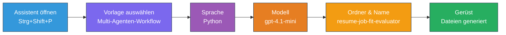
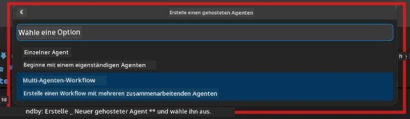

# Modul 2 - Gerüst für das Multi-Agent-Projekt erstellen

In diesem Modul verwenden Sie die [Microsoft Foundry-Erweiterung](https://marketplace.visualstudio.com/items?itemName=TeamsDevApp.vscode-ai-foundry), um **ein Multi-Agent-Workflow-Projekt zu erstellen**. Die Erweiterung generiert die gesamte Projektstruktur – `agent.yaml`, `main.py`, `Dockerfile`, `requirements.txt`, `.env` und Debug-Konfiguration. Diese Dateien passen Sie dann in den Modulen 3 und 4 an.

> **Hinweis:** Der Ordner `PersonalCareerCopilot/` in diesem Labor ist ein vollständiges, funktionierendes Beispiel eines angepassten Multi-Agent-Projekts. Sie können entweder ein neues Projekt erstellen (empfohlen zum Lernen) oder direkt den vorhandenen Code studieren.

---

## Schritt 1: Öffnen Sie den „Hosted Agent erstellen“-Assistenten


1. Drücken Sie `Ctrl+Shift+P`, um die **Befehlspalette** zu öffnen.
2. Geben Sie ein: **Microsoft Foundry: Create a New Hosted Agent** und wählen Sie diesen Befehl aus.
3. Der Assistent zur Erstellung eines gehosteten Agenten öffnet sich.

> **Alternative:** Klicken Sie auf das Symbol **Microsoft Foundry** in der Aktivitätsleiste → klicken Sie auf das **+**-Symbol neben **Agents** → **Create New Hosted Agent**.

---

## Schritt 2: Wählen Sie die Vorlage für den Multi-Agent-Workflow

Der Assistent fordert Sie auf, eine Vorlage auszuwählen:

| Vorlage | Beschreibung | Anwendungsfall |
|----------|-------------|-------------|
| Single Agent | Ein Agent mit Anweisungen und optionalen Tools | Labor 01 |
| **Multi-Agent Workflow** | Mehrere Agenten, die über WorkflowBuilder zusammenarbeiten | **Dieses Labor (Lab 02)** |

1. Wählen Sie **Multi-Agent Workflow**.
2. Klicken Sie auf **Next**.



---

## Schritt 3: Wählen Sie die Programmiersprache

1. Wählen Sie **Python** aus.
2. Klicken Sie auf **Next**.

---

## Schritt 4: Wählen Sie Ihr Modell aus

1. Der Assistent zeigt Modelle, die in Ihrem Foundry-Projekt bereitgestellt sind.
2. Wählen Sie dasselbe Modell, das Sie in Labor 01 verwendet haben (z. B. **gpt-4.1-mini**).
3. Klicken Sie auf **Next**.

> **Tipp:** [`gpt-4.1-mini`](https://learn.microsoft.com/azure/foundry/foundry-models/concepts/models-sold-directly-by-azure#gpt-41-series) ist für die Entwicklung zu empfehlen – es ist schnell, günstig und gut für Multi-Agent-Workflows geeignet. Wechseln Sie für den finalen Produktionseinsatz zu `gpt-4.1`, wenn Sie qualitativ hochwertige Ergebnisse wünschen.

---

## Schritt 5: Wählen Sie Ordnerort und Agentennamen

1. Ein Datei-Dialog öffnet sich. Wählen Sie einen Zielordner:
   - Wenn Sie dem Workshop-Repo folgen: navigieren Sie zu `workshop/lab02-multi-agent/` und erstellen Sie einen neuen Unterordner
   - Wenn Sie neu starten: Wählen Sie einen beliebigen Ordner aus
2. Geben Sie einen **Namen** für den gehosteten Agenten ein (z. B. `resume-job-fit-evaluator`).
3. Klicken Sie auf **Create**.

---

## Schritt 6: Warten Sie, bis das Gerüst fertig ist

1. VS Code öffnet ein neues Fenster (oder aktualisiert das aktuelle Fenster) mit dem erstellten Projekt.
2. Sie sollten diese Datei-Struktur sehen:

```
resume-job-fit-evaluator/
├── .env                ← Environment variables (placeholders)
├── .vscode/
│   └── launch.json     ← Debug configuration
├── agent.yaml          ← Agent definition (kind: hosted)
├── Dockerfile          ← Container configuration
├── main.py             ← Multi-agent workflow code (scaffold)
└── requirements.txt    ← Python dependencies
```

> **Workshop-Hinweis:** Im Workshop-Repository befindet sich der `.vscode/`-Ordner im **Arbeitsbereichs-Root** mit gemeinsamen `launch.json` und `tasks.json`. Die Debug-Konfigurationen für Labor 01 und Labor 02 sind beide enthalten. Wenn Sie F5 drücken, wählen Sie **"Lab02 - Multi-Agent"** aus dem Dropdown-Menü.

---

## Schritt 7: Verstehen Sie die erstellten Dateien (Multi-Agent-spezifisch)

Das Multi-Agent-Gerüst unterscheidet sich in mehreren wichtigen Punkten vom Single-Agent-Gerüst:

### 7.1 `agent.yaml` – Agent-Definition

```yaml
kind: hosted
name: resume-job-fit-evaluator
description: >
  A multi-agent workflow that evaluates resume-to-job fit.
metadata:
  authors:
    - Microsoft
  tags:
    - Multi-Agent Workflow
    - Resume Evaluator
protocols:
  - protocol: responses
    version: v1
environment_variables:
  - name: PROJECT_ENDPOINT
    value: ${PROJECT_ENDPOINT}
  - name: MODEL_DEPLOYMENT_NAME
    value: ${MODEL_DEPLOYMENT_NAME}
```

**Wesentlicher Unterschied zu Labor 01:** Der Abschnitt `environment_variables` kann zusätzliche Variablen für MCP-Endpunkte oder andere Tool-Konfigurationen enthalten. Der `name` und die `description` spiegeln den Multi-Agent-Einsatzfall wider.

### 7.2 `main.py` – Multi-Agent-Workflow-Code

Das Gerüst enthält:
- **Mehrere Anweisungs-Strings, je eine Konstante pro Agent**
- **Mehrere [`AzureAIAgentClient.as_agent()`](https://learn.microsoft.com/python/api/overview/azure/ai-agents-readme) Kontextmanager** (jeweils einer pro Agent)
- **[`WorkflowBuilder`](https://learn.microsoft.com/agent-framework/workflows/agents-in-workflows)** zum Verbinden der Agenten
- **`from_agent_framework()`**, um den Workflow als HTTP-Endpunkt bereitzustellen

```python
from agent_framework import WorkflowBuilder, tool
from agent_framework.azure import AzureAIAgentClient
from azure.ai.agentserver.agentframework import from_agent_framework
```

Der zusätzliche Import [`WorkflowBuilder`](https://learn.microsoft.com/agent-framework/workflows/agents-in-workflows) ist neu im Vergleich zu Labor 01.

### 7.3 `requirements.txt` – Zusätzliche Abhängigkeiten

Das Multi-Agent-Projekt verwendet dieselben Basispakete wie Labor 01 plus alle MCP-bezogenen Pakete:

```
agent-framework-azure-ai==1.0.0rc3
agent-framework-core==1.0.0rc3
azure-ai-agentserver-agentframework==1.0.0b16
azure-ai-agentserver-core==1.0.0b16
debugpy
agent-dev-cli --pre
```

> **Wichtiger Versionshinweis:** Das Paket `agent-dev-cli` benötigt die `--pre`-Option in `requirements.txt`, um die neueste Vorschauversion zu installieren. Dies ist erforderlich für die Kompatibilität des Agent Inspector mit `agent-framework-core==1.0.0rc3`. Weitere Versionsdetails finden Sie in [Modul 8 - Fehlerbehebung](08-troubleshooting.md).

| Paket | Version | Zweck |
|---------|---------|---------|
| [`agent-framework-azure-ai`](https://learn.microsoft.com/agent-framework/overview/) | `1.0.0rc3` | Azure AI-Integration für das [Microsoft Agent Framework](https://github.com/microsoft/agent-framework) |
| [`agent-framework-core`](https://learn.microsoft.com/agent-framework/overview/) | `1.0.0rc3` | Core Runtime (inklusive WorkflowBuilder) |
| `azure-ai-agentserver-agentframework` | `1.0.0b16` | Runtime für gehostete Agenten-Server |
| `azure-ai-agentserver-core` | `1.0.0b16` | Kernabstraktionen des Agent-Servers |
| `debugpy` | neueste Version | Python-Debugging (F5 in VS Code) |
| `agent-dev-cli` | `--pre` | Lokale Entwicklungs-CLI + Agent Inspector Backend |

### 7.4 `Dockerfile` – Gleich wie in Labor 01

Das Dockerfile ist identisch mit dem aus Labor 01 – es kopiert Dateien, installiert Abhängigkeiten aus `requirements.txt`, legt Port 8088 frei und führt `python main.py` aus.

```dockerfile
FROM python:3.14-slim
WORKDIR /app
COPY ./ .
RUN pip install --upgrade pip && \
    if [ -f requirements.txt ]; then \
        pip install -r requirements.txt; \
    else \
      echo "No requirements.txt found" >&2; exit 1; \
    fi
EXPOSE 8088
CMD ["python", "main.py"]
```

---

### Kontrollpunkt

- [ ] Gerüst-Assistent wurde abgeschlossen → neue Projektstruktur ist sichtbar
- [ ] Sie sehen alle Dateien: `agent.yaml`, `main.py`, `Dockerfile`, `requirements.txt`, `.env`
- [ ] `main.py` enthält den Import `WorkflowBuilder` (bestätigt, dass die Multi-Agent-Vorlage gewählt wurde)
- [ ] `requirements.txt` enthält sowohl `agent-framework-core` als auch `agent-framework-azure-ai`
- [ ] Sie verstehen, wie sich das Multi-Agent-Gerüst vom Single-Agent-Gerüst unterscheidet (mehrere Agenten, WorkflowBuilder, MCP-Tools)

---

**Vorheriges:** [01 - Multi-Agent-Architektur verstehen](01-understand-multi-agent.md) · **Nächstes:** [03 - Agenten & Umgebung konfigurieren →](03-configure-agents.md)

---

<!-- CO-OP TRANSLATOR DISCLAIMER START -->
**Haftungsausschluss**:  
Dieses Dokument wurde mit dem KI-Übersetzungsdienst [Co-op Translator](https://github.com/Azure/co-op-translator) übersetzt. Obwohl wir uns um Genauigkeit bemühen, beachten Sie bitte, dass automatisierte Übersetzungen Fehler oder Ungenauigkeiten enthalten können. Das Originaldokument in seiner Originalsprache ist als maßgebliche Quelle zu betrachten. Für wichtige Informationen wird eine professionelle menschliche Übersetzung empfohlen. Wir übernehmen keine Haftung für Missverständnisse oder Fehlinterpretationen, die aus der Verwendung dieser Übersetzung entstehen.
<!-- CO-OP TRANSLATOR DISCLAIMER END -->