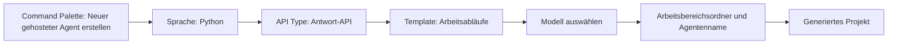
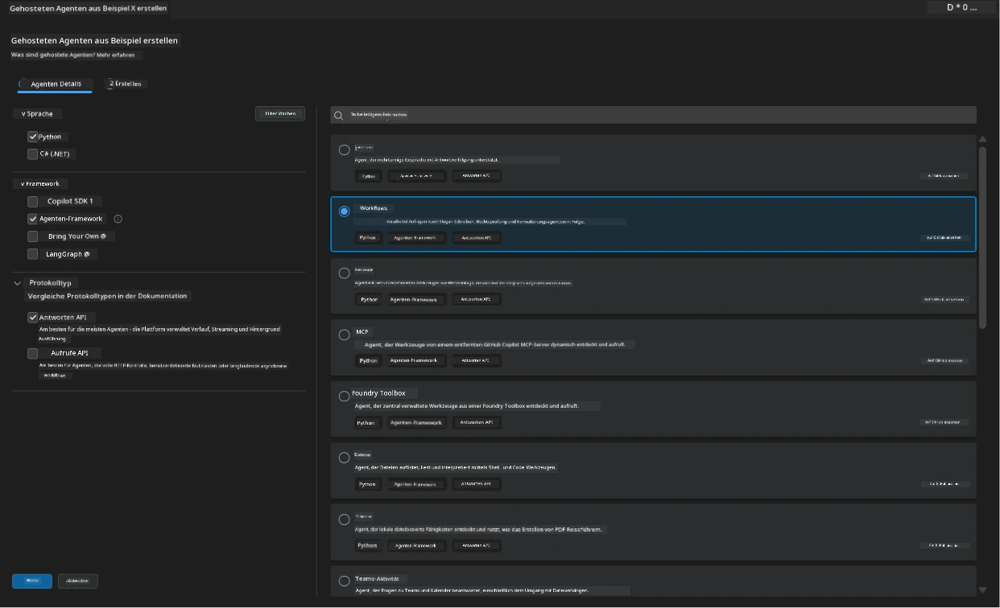
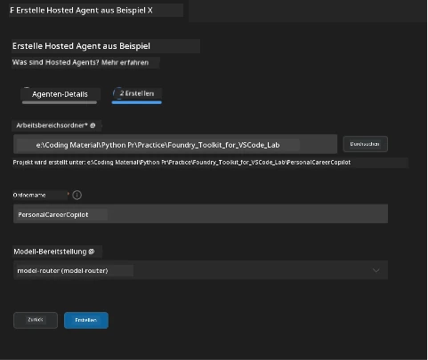

# Modul 2 - Das Multi-Agenten-Projekt aufsetzen

⏱️ ~5 min

In diesem Modul verwendest du das [Foundry Toolkit für VS Code](https://aka.ms/foundrytk), um **ein Multi-Agenten-Projekt zu erstellen**. Der Assistent generiert `agent.yaml`, `main.py`, `Dockerfile`, `requirements.txt`, `.env` und die VS Code-Debug-Konfiguration – sodass du dich im Modul 3 auf die Vernetzung des Workflows mit 4 Agenten konzentrieren kannst.

> **Wichtiges Konzept:** Das Gerüst ist eine funktionierende Vorlage mit einem Agenten. Du ersetzt die Platzhalter-Logik durch den `WorkflowBuilder`-Graphen im Modul 3. Du musst den Boilerplate-Code nicht von Grund auf neu schreiben.

> **Referenzimplementation:** [`PersonalCareerCopilot/`](../../../../../workshop/lab02-multi-agent/PersonalCareerCopilot) ist ein vollständiges, funktionierendes Beispiel. Nutze es, um deine Arbeit während des Fortschreitens zu vergleichen.

### Ablauf des Scaffold-Assistenten


```mermaid
flowchart LR
    A[Command Palette: Neuer gehosteter Agent erstellen] --> B[Sprache: Python]
    B --> C[API Type: Antwort-API]
    C --> D[Template: Arbeitsabläufe]
    D --> E[Modell auswählen]
    E --> F[Arbeitsbereichsordner und Agentenname]
    F --> G[Generiertes Projekt]
```

---

## Schritt 1: Öffne den Assistenten „Hosted Agent erstellen“

1. Drücke `Ctrl+Shift+P`, um die **Befehls-Palette** zu öffnen.
2. Tippe: **Foundry Toolkit: Create a New Hosted Agent** und wähle diesen Eintrag aus.
3. Der Assistent öffnet sich auf der Registerkarte **Agent Details**.

> **Alternative:** Klicke auf das **Foundry Toolkit**-Symbol in der Aktivitätsleiste → klicke auf das **+**-Symbol neben **Hosted Agents** → **Create New Hosted Agent**.

---

## Schritt 2: Einstellungen wählen



1. Wähle im linken Navigations-/Optionsbereich Folgendes aus:

| Menü | Auswahl | Anmerkungen |
|--------|-----------|-------|
| **Sprache** | Python | C# (.NET) wird ebenfalls unterstützt |
| **Framework** | Agent Framework | Stellt `Agent`, `AgentExecutor`, `WorkflowBuilder` bereit |
| **API-Typ** | Response API | `POST /responses` – Plattformverwaltete Historie, Streaming-Unterstützung |
| **Vorlage** | **Workflows** | Verarbeitet Anfragen sequentiell durch mehrere Agenten |

2. Nachdem du die Auswahl getroffen hast, klicke auf **Next**



3. Im nächsten Fenster wähle Folgendes:

| Menü | Auswahl | Anmerkungen |
|--------|-----------|-------|
| **Arbeitsbereichsordner** | Navigiere zum Zielordner | z. B. `workshop/lab02-multi-agent/` in diesem Repository |
| **Agentenname** | `PersonalCareerCopilot` | Wird zum Projektordnernamen |
| **Modelldeployment** | Wähle dein bereitgestelltes Modell | z. B. `gpt-4.1-mini` aus Lab 01 |

4. Klicke auf **Create**, um das Projekt zu scaffolden. VS Code generiert die Dateien und öffnet den Ordner.

> **Tipp:** [`gpt-4.1-mini`](https://learn.microsoft.com/azure/foundry/foundry-models/concepts/models-sold-directly-by-azure#gpt-41-series) bietet eine gute Balance zwischen Geschwindigkeit und Qualität für die Multi-Agenten-Entwicklung.

---

## Schritt 3: Betrachte das generierte Projekt

Überprüfe nach Abschluss des Scaffoldings, ob du diese Dateien im Explorer (`Ctrl+Shift+E`) sehen kannst:

```
📂 <your-agent-name>/
├── .azdignore          ← Files excluded from Azure Developer CLI deployments
├── .dockerignore       ← Files excluded from Docker builds
├── .env                ← Environment variables (placeholders - fill in Module 3)
├── .vscode/
│   ├── launch.json     ← Debug config (F5 → run + Agent Inspector)
│   └── tasks.json      ← VS Code task definitions
├── agent.yaml          ← Agent definition (kind: hosted, protocol: responses)
├── Dockerfile          ← Container config for deployment
├── main.py             ← Stub agent entry point (replace with WorkflowBuilder in Module 3)
└── requirements.txt    ← Python dependencies
```

> **Wichtig:** Öffne diesen scaffoldeten Ordner direkt in VS Code, damit `.vscode/launch.json` und `tasks.json` korrekt für das F5-Debugging angewendet werden.

### Wichtige Dateien erklärt

| Datei | Zweck |
|------|---------|
| `agent.yaml` | Deklariert `kind: hosted`, mappt Umgebungsvariablen, definiert das `/responses`-Protokoll |
| `main.py` | Stub: ein `FoundryChatClient` → `Agent` → `ResponsesHostServer`. Dies ersetzt du im Modul 3 durch 4 Agenten + `WorkflowBuilder` |
| `Dockerfile` | `python:3.12-slim`, installiert `requirements.txt`, öffnet Port 8088, führt `python main.py` aus |
| `requirements.txt` | `agent-framework-foundry`, `agent-framework-foundry-hosting`, `mcp<2,>=1.24.0`, `debugpy` |

> **Referenz:** Siehe [`PersonalCareerCopilot/agent.yaml`](../../../../../workshop/lab02-multi-agent/PersonalCareerCopilot/agent.yaml) und [`PersonalCareerCopilot/requirements.txt`](../../../../../workshop/lab02-multi-agent/PersonalCareerCopilot/requirements.txt) für den vollständigen generierten Inhalt.

---

### ✅ Checkpunkt

- [ ] Scaffold-Assistent abgeschlossen – neuer Projektordner ist im Explorer sichtbar
- [ ] Alle erwarteten Dateien vorhanden: `agent.yaml`, `main.py`, `Dockerfile`, `requirements.txt`, `.env`
- [ ] `agent.yaml` zeigt `kind: hosted` und `protocol: responses`
- [ ] `main.py` importiert `Agent`, `FoundryChatClient`, `ResponsesHostServer`
- [ ] Scaffoldeter Ordner ist als VS Code-Arbeitsbereichs-Root geöffnet
- [ ] Du verstehst, dass `main.py` ein Stub ist – `WorkflowBuilder` wird in Modul 3 ergänzt

---

**Vorheriges:** [01 - Multi-Agenten-Architektur verstehen](01-understand-multi-agent.md) · **Nächstes:** [03 - Agenten & Umgebung konfigurieren →](03-configure-agents.md)

---

<!-- CO-OP TRANSLATOR DISCLAIMER START -->
**Haftungsausschluss**:
Dieses Dokument wurde mit dem KI-Übersetzungsdienst [Co-op Translator](https://github.com/Azure/co-op-translator) übersetzt. Obwohl wir uns um Genauigkeit bemühen, beachten Sie bitte, dass automatisierte Übersetzungen Fehler oder Ungenauigkeiten enthalten können. Das Originaldokument in seiner Ursprungssprache gilt als maßgebliche Quelle. Bei kritischen Informationen wird eine professionelle menschliche Übersetzung empfohlen. Wir übernehmen keine Haftung für Missverständnisse oder Fehlinterpretationen, die aus der Verwendung dieser Übersetzung entstehen.
<!-- CO-OP TRANSLATOR DISCLAIMER END -->