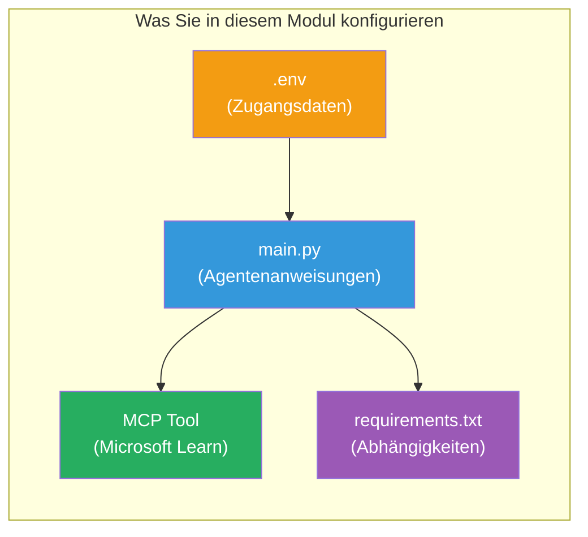

# Modul 3 - Agenten, MCP-Tool & Umgebung konfigurieren

In diesem Modul passen Sie das bereitgestellte Multi-Agenten-Projekt an. Sie schreiben Anweisungen für alle vier Agenten, richten das MCP-Tool für Microsoft Learn ein, konfigurieren Umgebungsvariablen und installieren Abhängigkeiten.


> **Referenz:** Der vollständige funktionierende Code befindet sich in [`PersonalCareerCopilot/main.py`](../../../../../workshop/lab02-multi-agent/PersonalCareerCopilot/main.py). Verwenden Sie ihn als Referenz beim Erstellen Ihres eigenen Codes.

---

## Schritt 1: Umgebungsvariablen konfigurieren

1. Öffnen Sie die **`.env`**-Datei im Stammverzeichnis Ihres Projekts.
2. Füllen Sie Ihre Foundry-Projektdetails aus:

   ```env
   PROJECT_ENDPOINT=https://<your-account>.services.ai.azure.com/api/projects/<your-project>
   MODEL_DEPLOYMENT_NAME=gpt-4.1-mini
   ```

3. Speichern Sie die Datei.

### Wo Sie diese Werte finden

| Wert | Wo finden? |
|-------|---------------|
| **Projekt-Endpunkt** | Microsoft Foundry Seitenleiste → Ihr Projekt anklicken → Endpunkt-URL in der Detailansicht |
| **Name der Modellausführung** | Foundry Seitenleiste → Projekt ausklappen → **Modelle + Endpunkte** → Name neben dem bereitgestellten Modell |

> **Sicherheit:** Veröffentlichen Sie `.env` niemals im Versionskontrollsystem. Fügen Sie die Datei zu `.gitignore` hinzu, falls noch nicht vorhanden.

### Zuordnung der Umgebungsvariablen

Das Multi-Agent `main.py` liest sowohl Standard- als auch Workshop-spezifische Umgebungsvariablennamen:

```python
PROJECT_ENDPOINT = os.getenv("AZURE_AI_PROJECT_ENDPOINT") or os.getenv("PROJECT_ENDPOINT")
MODEL_DEPLOYMENT_NAME = os.getenv(
    "AZURE_AI_MODEL_DEPLOYMENT_NAME",
    os.getenv("MODEL_DEPLOYMENT_NAME", "gpt-4.1-mini"),
)
MICROSOFT_LEARN_MCP_ENDPOINT = os.getenv(
    "MICROSOFT_LEARN_MCP_ENDPOINT", "https://learn.microsoft.com/api/mcp"
)
```

Der MCP-Endpunkt hat einen sinnvollen Standard - Sie müssen ihn in `.env` nicht setzen, es sei denn, Sie möchten ihn überschreiben.

---

## Schritt 2: Agenten-Anweisungen schreiben

Dies ist der wichtigste Schritt. Jeder Agent benötigt sorgfältig gestaltete Anweisungen, die seine Rolle, Ausgabeformat und Regeln definieren. Öffnen Sie `main.py` und erstellen (oder ändern) Sie die Anweisungskonstanten.

### 2.1 Resume Parser Agent

```python
RESUME_PARSER_INSTRUCTIONS = """\
You are the Resume Parser.
Extract resume text into a compact, structured profile for downstream matching.

Output exactly these sections:
1) Candidate Profile
2) Technical Skills (grouped categories)
3) Soft Skills
4) Certifications & Awards
5) Domain Experience
6) Notable Achievements

Rules:
- Use only explicit or strongly implied evidence.
- Do not invent skills, titles, or experience.
- Keep concise bullets; no long paragraphs.
- If input is not a resume, return a short warning and request resume text.
"""
```

**Warum diese Abschnitte?** Der MatchingAgent benötigt strukturierte Daten für die Bewertung. Einheitliche Abschnitte sorgen für eine zuverlässige Übergabe zwischen den Agenten.

### 2.2 Job Description Agent

```python
JOB_DESCRIPTION_INSTRUCTIONS = """\
You are the Job Description Analyst.
Extract a structured requirement profile from a JD.

Output exactly these sections:
1) Role Overview
2) Required Skills
3) Preferred Skills
4) Experience Required
5) Certifications Required
6) Education
7) Domain / Industry
8) Key Responsibilities

Rules:
- Keep required vs preferred clearly separated.
- Only use what the JD states; do not invent hidden requirements.
- Flag vague requirements briefly.
- If input is not a JD, return a short warning and request JD text.
"""
```

**Warum unterscheiden zwischen Pflicht- und Wunschkriterien?** Der MatchingAgent verwendet unterschiedliche Gewichtungen (Pflichtfähigkeiten = 40 Punkte, Wunschfähigkeiten = 10 Punkte).

### 2.3 Matching Agent

```python
MATCHING_AGENT_INSTRUCTIONS = """\
You are the Matching Agent.
Compare parsed resume output vs JD output and produce an evidence-based fit report.

Scoring (100 total):
- Required Skills 40
- Experience 25
- Certifications 15
- Preferred Skills 10
- Domain Alignment 10

Output exactly these sections:
1) Fit Score (with breakdown math)
2) Matched Skills
3) Missing Skills
4) Partially Matched
5) Experience Alignment
6) Certification Gaps
7) Overall Assessment

Rules:
- Be objective and evidence-only.
- Keep partial vs missing separate.
- Keep Missing Skills precise; it feeds roadmap planning.
"""
```

**Warum explizite Bewertung?** Reproduzierbare Bewertungen ermöglichen Vergleich von Durchläufen und das Debugging. Die 100-Punkte-Skala ist für Endnutzer einfach zu interpretieren.

### 2.4 Gap Analyzer Agent

```python
GAP_ANALYZER_INSTRUCTIONS = """\
You are the Gap Analyzer and Roadmap Planner.
Create a practical upskilling plan from the matching report.

Microsoft Learn MCP usage (required):
- For EVERY High and Medium priority gap, call tool `search_microsoft_learn_for_plan`.
- Use returned Learn links in Suggested Resources.
- Prefer Microsoft Learn for free resources.

CRITICAL: You MUST produce a SEPARATE detailed gap card for EVERY skill listed in
the Missing Skills and Certification Gaps sections of the matching report. Do NOT
skip or combine gaps. Do NOT summarize multiple gaps into one card.

Output format:
1) Personalized Learning Roadmap for [Role Title]
2) One DETAILED card per gap (produce ALL cards, not just the first):
   - Skill
   - Priority (High/Medium/Low)
   - Current Level
   - Target Level
   - Suggested Resources (include Learn URL from tool results)
   - Estimated Time
   - Quick Win Project
3) Recommended Learning Order (numbered list)
4) Timeline Summary (week-by-week)
5) Motivational Note

Rules:
- Produce every gap card before writing the summary sections.
- Keep it specific, realistic, and actionable.
- Tailor to candidate's existing stack.
- If fit >= 80, focus on polish/interview readiness.
- If fit < 40, be honest and provide a staged path.
"""
```

**Warum "CRITICAL"-Betonung?** Ohne explizite Anweisung, ALLE Lücken-Karten zu erzeugen, neigt das Modell dazu, nur 1-2 Karten zu generieren und den Rest zusammenzufassen. Der "CRITICAL"-Block verhindert diese Kürzung.

---

## Schritt 3: Das MCP-Tool definieren

Der GapAnalyzer nutzt ein Tool, das den [Microsoft Learn MCP-Server](https://learn.microsoft.com/azure/foundry/agents/how-to/tools/model-context-protocol) aufruft. Fügen Sie dies zu `main.py` hinzu:

```python
import json
from agent_framework import tool
from mcp.client.session import ClientSession
from mcp.client.streamable_http import streamable_http_client

@tool
async def search_microsoft_learn_for_plan(
    skill: str, role: str = "", max_results: int = 5
) -> str:
    """Search Microsoft Learn MCP and return curated official links for roadmap planning."""
    query = " ".join(part for part in [skill, role, "learning path module"] if part).strip()
    query = query or "job skills learning path"

    try:
        async with streamable_http_client(MICROSOFT_LEARN_MCP_ENDPOINT) as (
            read_stream, write_stream, _,
        ):
            async with ClientSession(read_stream, write_stream) as session:
                await session.initialize()
                result = await session.call_tool(
                    "microsoft_docs_search", {"query": query}
                )

        if not result.content:
            return (
                "No results returned from Microsoft Learn MCP. "
                "Fallback: https://learn.microsoft.com/training/support/catalog-api"
            )

        payload_text = getattr(result.content[0], "text", "")
        data = json.loads(payload_text) if payload_text else {}
        items = data.get("results", [])[:max(1, min(max_results, 10))]

        if not items:
            return f"No direct Microsoft Learn results found for '{skill}'."

        lines = [f"Microsoft Learn resources for '{skill}':"]
        for i, item in enumerate(items, start=1):
            title = item.get("title") or item.get("url") or "Microsoft Learn Resource"
            url = item.get("url") or item.get("link") or ""
            lines.append(f"{i}. {title} - {url}".rstrip(" -"))
        return "\n".join(lines)
    except Exception as ex:
        return (
            f"Microsoft Learn MCP lookup unavailable. Reason: {ex}. "
            "Fallbacks: https://learn.microsoft.com/api/mcp"
        )
```

### So funktioniert das Tool

| Schritt | Was passiert |
|------|-------------|
| 1 | GapAnalyzer entscheidet, dass Ressourcen für eine Fähigkeit benötigt werden (z. B. "Kubernetes") |
| 2 | Framework ruft `search_microsoft_learn_for_plan(skill="Kubernetes")` auf |
| 3 | Funktion öffnet [Streamable HTTP](https://learn.microsoft.com/agent-framework/agents/tools/hosted-mcp-tools)-Verbindung zu `https://learn.microsoft.com/api/mcp` |
| 4 | Ruft `microsoft_docs_search` auf dem [MCP-Server](https://learn.microsoft.com/azure/foundry/agents/how-to/tools/model-context-protocol) auf |
| 5 | MCP-Server liefert Suchergebnisse (Titel + URL) zurück |
| 6 | Funktion formatiert Ergebnisse als nummerierte Liste |
| 7 | GapAnalyzer integriert die URLs in die Lückenkarte |

### MCP-Abhängigkeiten

Die MCP-Client-Bibliotheken sind transitiv über [`agent-framework-core`](https://learn.microsoft.com/agent-framework/overview/) enthalten. Sie müssen sie **nicht** separat in `requirements.txt` hinzufügen. Wenn Sie Importfehler erhalten, überprüfen Sie:

```powershell
pip list | Select-String "mcp"
```

Erwartet: Das `mcp`-Paket ist installiert (Version 1.x oder höher).

---

## Schritt 4: Agenten und Workflow verbinden

### 4.1 Agenten mit Kontextmanagern erstellen

```python
from contextlib import asynccontextmanager

@asynccontextmanager
async def create_agents():
    async with (
        get_credential() as credential,
        AzureAIAgentClient(
            project_endpoint=PROJECT_ENDPOINT,
            model_deployment_name=MODEL_DEPLOYMENT_NAME,
            credential=credential,
        ).as_agent(
            name="ResumeParser",
            instructions=RESUME_PARSER_INSTRUCTIONS,
        ) as resume_parser,
        AzureAIAgentClient(
            project_endpoint=PROJECT_ENDPOINT,
            model_deployment_name=MODEL_DEPLOYMENT_NAME,
            credential=credential,
        ).as_agent(
            name="JobDescriptionAgent",
            instructions=JOB_DESCRIPTION_INSTRUCTIONS,
        ) as jd_agent,
        AzureAIAgentClient(
            project_endpoint=PROJECT_ENDPOINT,
            model_deployment_name=MODEL_DEPLOYMENT_NAME,
            credential=credential,
        ).as_agent(
            name="MatchingAgent",
            instructions=MATCHING_AGENT_INSTRUCTIONS,
        ) as matching_agent,
        AzureAIAgentClient(
            project_endpoint=PROJECT_ENDPOINT,
            model_deployment_name=MODEL_DEPLOYMENT_NAME,
            credential=credential,
        ).as_agent(
            name="GapAnalyzer",
            instructions=GAP_ANALYZER_INSTRUCTIONS,
            tools=[search_microsoft_learn_for_plan],
        ) as gap_analyzer,
    ):
        yield resume_parser, jd_agent, matching_agent, gap_analyzer
```

**Wichtige Punkte:**
- Jeder Agent hat seine **eigene** `AzureAIAgentClient`-Instanz
- Nur der GapAnalyzer erhält `tools=[search_microsoft_learn_for_plan]`
- `get_credential()` gibt [`ManagedIdentityCredential`](https://learn.microsoft.com/python/api/overview/azure/identity-readme#managed-identity-support) in Azure zurück, lokal [`DefaultAzureCredential`](https://learn.microsoft.com/azure/developer/python/sdk/authentication/credential-chains#defaultazurecredential-overview)

### 4.2 Workflow-Graph erstellen

```python
def create_workflow(resume_parser, jd_agent, matching_agent, gap_analyzer):
    workflow = (
        WorkflowBuilder(
            name="ResumeJobFitEvaluator",
            start_executor=resume_parser,
            output_executors=[gap_analyzer],
        )
        .add_edge(resume_parser, jd_agent)
        .add_edge(resume_parser, matching_agent)
        .add_edge(jd_agent, matching_agent)
        .add_edge(matching_agent, gap_analyzer)
        .build()
    )
    return workflow.as_agent()
```

> Siehe [Workflows als Agenten](https://learn.microsoft.com/agent-framework/workflows/as-agents) für die Funktionsweise des `.as_agent()`-Musters.

### 4.3 Server starten

```python
async def main() -> None:
    validate_configuration()
    async with create_agents() as (resume_parser, jd_agent, matching_agent, gap_analyzer):
        agent = create_workflow(resume_parser, jd_agent, matching_agent, gap_analyzer)
        from azure.ai.agentserver.agentframework import from_agent_framework
        await from_agent_framework(agent).run_async()

if __name__ == "__main__":
    asyncio.run(main())
```

---

## Schritt 5: Virtuelle Umgebung erstellen und aktivieren

### 5.1 Umgebung erstellen

```powershell
cd workshop\lab02-multi-agent\PersonalCareerCopilot
python -m venv .venv
```

### 5.2 Aktivieren

**PowerShell (Windows):**
```powershell
.\.venv\Scripts\Activate.ps1
```

**macOS/Linux:**
```bash
source .venv/bin/activate
```

### 5.3 Abhängigkeiten installieren

```powershell
pip install -r requirements.txt
```

> **Hinweis:** Die Zeile `agent-dev-cli --pre` in `requirements.txt` stellt sicher, dass die neueste Preview-Version installiert wird. Diese wird für die Kompatibilität mit `agent-framework-core==1.0.0rc3` benötigt.

### 5.4 Installation überprüfen

```powershell
pip list | Select-String "agent-framework|agentserver|agent-dev"
```

Erwartete Ausgabe:
```
agent-dev-cli                  0.0.1b260316
agent-framework-azure-ai       1.0.0rc3
agent-framework-core            1.0.0rc3
azure-ai-agentserver-agentframework 1.0.0b16
azure-ai-agentserver-core      1.0.0b16
```

> **Wenn `agent-dev-cli` eine ältere Version anzeigt** (z. B. `0.0.1b260119`), schlägt der Agent Inspector mit 403/404-Fehlern fehl. Upgrade: `pip install agent-dev-cli --pre --upgrade`

---

## Schritt 6: Authentifizierung überprüfen

Führen Sie die gleiche Authentifizierungsprüfung wie in Lab 01 durch:

```powershell
az account show --query "{name:name, id:id}" --output table
```

Wenn dies fehlschlägt, führen Sie [`az login`](https://learn.microsoft.com/cli/azure/authenticate-azure-cli-interactively) aus.

Für Multi-Agent-Workflows teilen sich alle vier Agenten dieselben Anmeldedaten. Wenn die Authentifizierung bei einem funktioniert, funktioniert sie bei allen.

---

### Kontrollpunkt

- [ ] `.env` enthält gültige Werte für `PROJECT_ENDPOINT` und `MODEL_DEPLOYMENT_NAME`
- [ ] Alle 4 Agentenanweisungskonstanten sind in `main.py` definiert (ResumeParser, JD Agent, MatchingAgent, GapAnalyzer)
- [ ] Das MCP-Tool `search_microsoft_learn_for_plan` ist definiert und beim GapAnalyzer registriert
- [ ] `create_agents()` erzeugt alle 4 Agenten mit individuellen `AzureAIAgentClient`-Instanzen
- [ ] `create_workflow()` erstellt den korrekten Graph mit `WorkflowBuilder`
- [ ] Virtuelle Umgebung wurde erstellt und aktiviert (`(.venv)` sichtbar)
- [ ] `pip install -r requirements.txt` läuft fehlerfrei durch
- [ ] `pip list` zeigt alle erwarteten Pakete in den richtigen Versionen (rc3 / b16)
- [ ] `az account show` gibt Ihr Abonnement zurück

---

**Vorheriges:** [02 - Scaffold Multi-Agent Project](02-scaffold-multi-agent.md) · **Nächstes:** [04 - Orchestrierungsmuster →](04-orchestration-patterns.md)

---

<!-- CO-OP TRANSLATOR DISCLAIMER START -->
**Haftungsausschluss**:  
Dieses Dokument wurde mithilfe des KI-Übersetzungsdienstes [Co-op Translator](https://github.com/Azure/co-op-translator) übersetzt. Obwohl wir uns um Genauigkeit bemühen, beachten Sie bitte, dass automatisierte Übersetzungen Fehler oder Ungenauigkeiten enthalten können. Das Originaldokument in seiner Originalsprache gilt als maßgebliche Quelle. Für kritische Informationen wird eine professionelle menschliche Übersetzung empfohlen. Wir übernehmen keine Haftung für Missverständnisse oder Fehlinterpretationen, die aus der Verwendung dieser Übersetzung resultieren.
<!-- CO-OP TRANSLATOR DISCLAIMER END -->