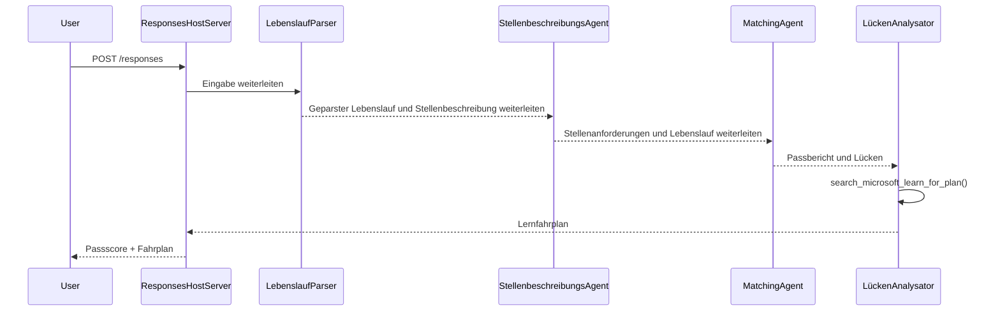

# Modul 3 - Anweisungen konfigurieren, Umgebung & Abhängigkeiten installieren

⏱️ ~15 Min.

In diesem Modul verwandelst du das erstellte Gerüst in **deinen** Multi-Agenten-Workflow – indem du Umgebungsvariablen setzt, Agentenanweisungen schreibst, das MCP-Tool hinzufügst, den Workflow-Graphen verdrahtest und Abhängigkeiten installierst.

> **Referenz:** Der vollständige funktionierende Code befindet sich in [`PersonalCareerCopilot/main.py`](../../../../../workshop/lab02-multi-agent/PersonalCareerCopilot/main.py). Nutze ihn als Referenz beim Aufbau deines eigenen Workflow-Graphs und der Prompt-Blöcke.

---

## Wie die vier Agenten zusammenpassen


```mermaid
sequenceDiagram
    participant User
    participant Server as ResponsesHostServer
    participant RP as LebenslaufParser
    participant JD as StellenbeschreibungsAgent
    participant MA as MatchingAgent
    participant GA as LückenAnalysator

    User->>Server: POST /responses
    Server->>RP: Eingabe weiterleiten
    RP-->>JD: Geparster Lebenslauf und Stellenbeschreibung weiterleiten
    JD-->>MA: Stellenanforderungen und Lebenslauf weiterleiten
    MA-->>GA: Passbericht und Lücken
    GA->>GA: search_microsoft_learn_for_plan()
    GA-->>Server: Lernfahrplan
    Server-->>User: Passscore + Fahrplan
```

---

## Schritt 1: Umgebungsvariablen konfigurieren

1. Öffne die **`.env`**-Datei im Projektstammverzeichnis (erstellt vom Scaffold-Wizard).
2. Ersetze die Platzhalter durch deine tatsächlichen Werte aus Lab 01.

<details open>
<summary><strong>🅰️ Pfad A - Foundry-Abonnement</strong></summary>

```env
FOUNDRY_PROJECT_ENDPOINT=https://<your-account>.services.ai.azure.com/api/projects/<your-project>
AZURE_AI_MODEL_DEPLOYMENT_NAME=gpt-4.1-mini
```

> **Wo Werte zu finden sind:** Siehe [Lab 01, Modul 1](../../lab01-single-agent/docs/01-setup.md#deploy-a-model--assign-rbac).

</details>

<details open>
<summary><strong>🅱️ Pfad B - Foundry Lokal</strong></summary>

```env
FOUNDRY_PROJECT_ENDPOINT=http://localhost:5273/v1
AZURE_AI_MODEL_DEPLOYMENT_NAME=phi-4-mini
```

> Alle Inferenz läuft auf deinem Gerät – keine Daten verlassen dein Gerät. Führe `foundry model list` aus, um den genauen Modell-Alias zu bestätigen. Die einzige ausgehende Anfrage ist der MCP-Tool-Aufruf an `https://learn.microsoft.com/api/mcp`.

> **Wo Werte zu finden sind:** Siehe [Lab 01, Modul 1 - lokaler Pfad](../../lab01-single-agent/docs/01-setup.md#step-2-set-up-based-on-your-access).

</details>

> **Sicherheit:** `.env` niemals in die Versionskontrolle einchecken. Es sollte bereits in `.gitignore` enthalten sein.

---

## Schritt 2: Agentenanweisungen schreiben

Anweisungen definieren die Rolle, das Ausgabeformat und die Regeln jedes Agenten. Öffne `main.py` und definiere (oder ersetze) die vier Anweisungskonstanten – die vollständigen Strings sind in [`PersonalCareerCopilot/main.py`](../../../../../workshop/lab02-multi-agent/PersonalCareerCopilot/main.py).

### 2.1 `RESUME_PARSER_INSTRUCTIONS`
Analysiert den Lebenslauf in ein strukturiertes Kandidatenprofil **und** kopiert die Stellenbeschreibung wortwörtlich in `[JOB DESCRIPTION PASS-THROUGH]`. Beide mit Labels versehene Abschnitte müssen in der Ausgabe erscheinen.

> **Warum der Pass-Through?** Mit `context_mode="last_agent"` ist ResumeParser der **einzige** Agent, der die ursprüngliche Benutzeranfrage sieht. Wenn er die JD nicht weiterkopiert, sehen die nachfolgenden Agenten sie nie.

### 2.2 `JOB_DESCRIPTION_INSTRUCTIONS`
Liest `[PARSED RESUME]` und `[JOB DESCRIPTION PASS-THROUGH]` aus der Ausgabe von ResumeParser. Gibt `[JD REQUIREMENTS]` (strukturierte Anforderungen) und `[PARSED RESUME PASS-THROUGH]` (wortwörtliche Kopie des Lebenslaufs für MatchingAgent) aus.

### 2.3 `MATCHING_AGENT_INSTRUCTIONS`
Liest `[JD REQUIREMENTS]` und `[PARSED RESUME PASS-THROUGH]`. Erstellt einen bewerteten Passungsbericht (0–100) mit Rechenaufschlüsselung, abgeglichenen Fähigkeiten, fehlenden Fähigkeiten und Erfahrungsabgleich.

### 2.4 `GAP_ANALYZER_INSTRUCTIONS`
Liest den Passungsbericht. Für **jede** fehlende Fähigkeit ruft er `search_microsoft_learn_for_plan` auf, um Microsoft Learn-Ressourcen abzurufen. Erstellt eine detaillierte Gap-Karte pro Fähigkeit plus einen Lernfahrplan Woche für Woche.

---

## Schritt 3: Das MCP-Tool hinzufügen

Der GapAnalyzer ruft den [Microsoft Learn MCP Server](https://learn.microsoft.com/azure/foundry/agents/how-to/tools/model-context-protocol) auf, um echte Lernressourcen für jede Fähigkeitslücke abzurufen. Die vollständige Funktion `search_microsoft_learn_for_plan` befindet sich in [`PersonalCareerCopilot/main.py`](../../../../../workshop/lab02-multi-agent/PersonalCareerCopilot/main.py).

Registriere das Tool beim GapAnalyzer beim Erstellen des Agenten:

```python
gap_analyzer = Agent(
    client=client,
    instructions=GAP_ANALYZER_INSTRUCTIONS,
    name="GapAnalyzer",
    tools=[search_microsoft_learn_for_plan],
)
```

> Siehe [`PersonalCareerCopilot/main.py`](../../../../../workshop/lab02-multi-agent/PersonalCareerCopilot/main.py) für den vollständigen `WorkflowBuilder`-Graph mit `FoundryChatClient`, `AgentExecutor` und allen `add_edge()`-Aufrufen.

---

## Schritt 4: Virtuelle Umgebung erstellen & Abhängigkeiten installieren

> ⚠️ **Diesen Schritt nicht überspringen.** Ohne installierte Abhängigkeiten funktioniert das Debugging mit F5 nicht.

### 4.1 Erstelle die virtuelle Umgebung

```powershell
python -m venv .venv
```

### 4.2 Aktiviere sie

| Betriebssystem | Befehl |
|----|---------|
| **Windows (PowerShell)** | `.\.venv\Scripts\Activate.ps1` |
| **Windows (CMD)** | `.venv\Scripts\activate.bat` |
| **macOS / Linux** | `source .venv/bin/activate` |

Du solltest `(.venv)` in deinem Terminal-Prompt sehen.

### 4.3 Installiere die Abhängigkeiten

```powershell
pip install -r requirements.txt
```

### 4.4 Überprüfe

```powershell
pip list | Select-String "agent-framework|mcp|debugpy"
```

Erwartet: `agent-framework-foundry`, `agent-framework-foundry-hosting`, `mcp` und `debugpy` sind aufgeführt.

---

## Schritt 5: Authentifizierung überprüfen

<details open>
<summary><strong>🅰️ Pfad A - Azure-Zugangsdaten</strong></summary>

```powershell
az account show --query "{name:name, id:id}" --output table
```

Wenn dies fehlschlägt, führe [`az login`](https://learn.microsoft.com/cli/azure/authenticate-azure-cli-interactively) aus.

Alle vier Agenten teilen sich einen `FoundryChatClient` und eine `DefaultAzureCredential`. Wenn die Authentifizierung bei einem funktioniert, funktioniert sie bei allen.

</details>

<details open>
<summary><strong>🅱️ Pfad B - Foundry Lokal</strong></summary>

Keine Authentifizierung für lokale Tests erforderlich.

</details>

---

### ✅ Kontrollpunkt

> Fahre **nicht** mit Modul 04 fort, bevor: **(1)** `(.venv)` im Prompt sichtbar ist UND **(2)** `pip install -r requirements.txt` erfolgreich abgeschlossen wurde.

- [ ] `.env` enthält gültigen Endpunkt und Modellbereitstellungsnamen (keine Platzhalter)
- [ ] Alle 4 Anweisungskonstanten für Agenten in `main.py` definiert (ResumeParser, JD Agent, MatchingAgent, GapAnalyzer)
- [ ] `search_microsoft_learn_for_plan` MCP-Tool definiert und beim GapAnalyzer registriert
- [ ] `FoundryChatClient` + 4 `Agent` + 4 `AgentExecutor` Objekte in `main()` erstellt
- [ ] `WorkflowBuilder` erstellt den korrekten sequentiellen Graph mit allen 3 `add_edge()` Aufrufen
- [ ] Virtuelle Umgebung erstellt und aktiviert (`(.venv)` im Prompt sichtbar)
- [ ] `pip install -r requirements.txt` ohne Fehler abgeschlossen
- [ ] **Pfad A:** `az account show` erfolgreich ODER VS Code Accounts Icon zeigt angemeldeten Account

---

**Vorheriges:** [02 - Scaffold Multi-Agent Projekt](02-scaffold-multi-agent.md) · **Nächstes:** [04 - Orchestrierungsmuster →](04-orchestration-patterns.md)

---

<!-- CO-OP TRANSLATOR DISCLAIMER START -->
**Haftungsausschluss**:
Dieses Dokument wurde mit dem KI-Übersetzungsdienst [Co-op Translator](https://github.com/Azure/co-op-translator) übersetzt. Obwohl wir uns um Genauigkeit bemühen, beachten Sie bitte, dass automatisierte Übersetzungen Fehler oder Ungenauigkeiten enthalten können. Das Originaldokument in seiner Ursprungssprache gilt als maßgebliche Quelle. Bei kritischen Informationen wird eine professionelle menschliche Übersetzung empfohlen. Wir übernehmen keine Haftung für Missverständnisse oder Fehlinterpretationen, die aus der Verwendung dieser Übersetzung entstehen.
<!-- CO-OP TRANSLATOR DISCLAIMER END -->