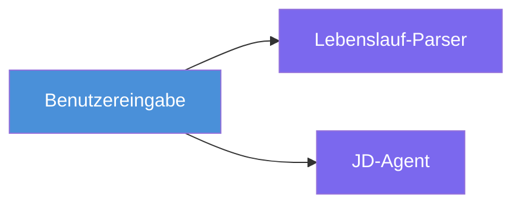
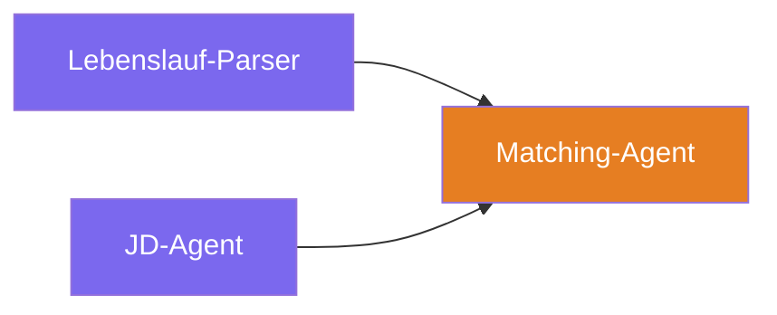
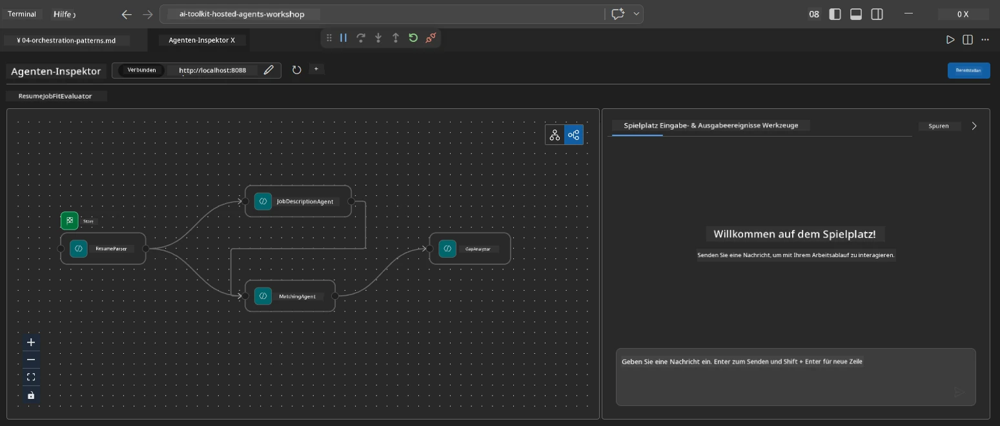
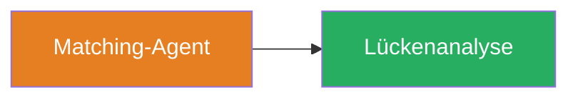
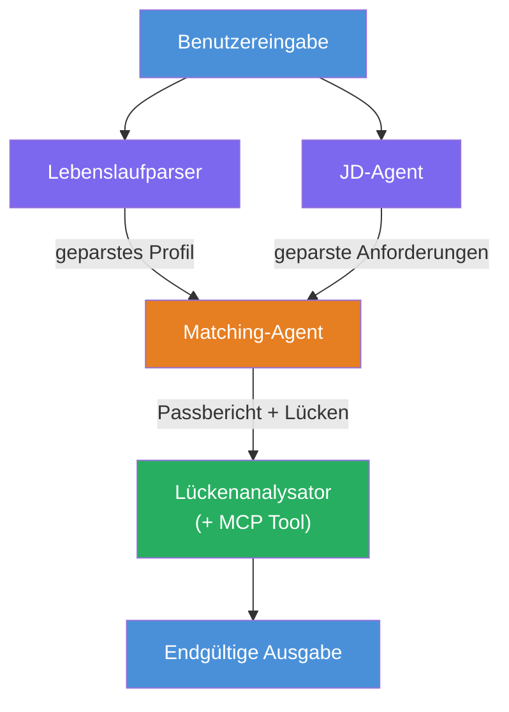
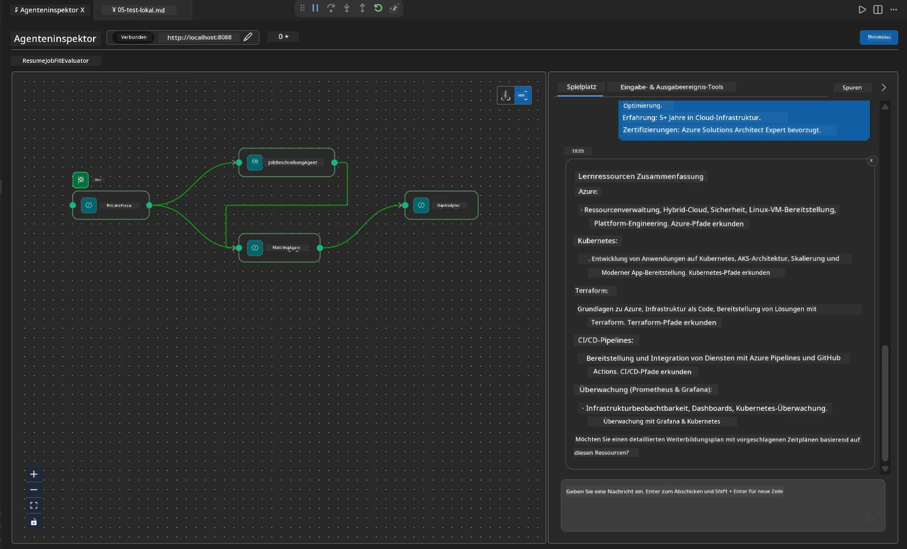

# Modul 4 - Orchestrierungsmuster

In diesem Modul erkunden Sie die Orchestrierungsmuster, die im Resume Job Fit Evaluator verwendet werden, und lernen, wie Sie den Workflow-Graph lesen, ändern und erweitern können. Das Verständnis dieser Muster ist entscheidend, um Probleme mit dem Datenfluss zu debuggen und Ihre eigenen [Multi-Agent-Workflows](https://learn.microsoft.com/agent-framework/workflows/) zu erstellen.

---

## Muster 1: Fan-out (parallele Aufteilung)

Das erste Muster im Workflow ist **Fan-out** – eine einzelne Eingabe wird gleichzeitig an mehrere Agenten gesendet.


Im Code geschieht dies, weil `resume_parser` der `start_executor` ist – er empfängt die Benutzernachricht zuerst. Dann, weil sowohl `jd_agent` als auch `matching_agent` Kanten von `resume_parser` haben, leitet das Framework die Ausgabe von `resume_parser` an beide Agenten weiter:

```python
.add_edge(resume_parser, jd_agent)         # ResumeParser-Ausgabe → JD Agent
.add_edge(resume_parser, matching_agent)   # ResumeParser-Ausgabe → MatchingAgent
```

**Warum das funktioniert:** ResumeParser und JD Agent verarbeiten unterschiedliche Aspekte derselben Eingabe. Das parallele Ausführen reduziert die Gesamtlatenz im Vergleich zur sequenziellen Ausführung.

### Wann Fan-out verwenden

| Anwendungsfall | Beispiel |
|---------------|----------|
| Unabhängige Teilaufgaben | Lebenslauf parsen vs. JD parsen |
| Redundanz / Abstimmung | Zwei Agenten analysieren dieselben Daten, ein dritter wählt die beste Antwort |
| Ausgabe im Multi-Format | Ein Agent generiert Text, ein anderer strukturiertes JSON |

---

## Muster 2: Fan-in (Aggregation)

Das zweite Muster ist **Fan-in** – mehrere Agentenausgaben werden gesammelt und an einen einzelnen nachgelagerten Agenten gesendet.


Im Code:

```python
.add_edge(resume_parser, matching_agent)   # ResumeParser-Ausgabe → MatchingAgent
.add_edge(jd_agent, matching_agent)        # JD-Agent-Ausgabe → MatchingAgent
```

**Wichtiges Verhalten:** Wenn ein Agent **zwei oder mehr eingehende Kanten** hat, wartet das Framework automatisch, bis **alle** vorgelagerten Agenten fertig sind, bevor es den nachgelagerten Agenten ausführt. MatchingAgent startet erst, wenn sowohl ResumeParser als auch JD Agent abgeschlossen sind.

### Was MatchingAgent erhält

Das Framework verkettet die Ausgaben aller vorgelagerten Agenten. Die Eingabe von MatchingAgent sieht wie folgt aus:

```
[ResumeParser output]
---
Candidate Profile:
  Name: Jane Doe
  Technical Skills: Python, Azure, Kubernetes, ...
  ...

[JobDescriptionAgent output]
---
Role Overview: Senior Cloud Engineer
Required Skills: Python, Azure, Terraform, ...
...
```

> **Hinweis:** Das genaue Verkettungsformat hängt von der Framework-Version ab. Die Anweisungen des Agenten sollten so geschrieben sein, dass sie sowohl strukturierte als auch unstrukturierte vorgelagerte Ausgaben verarbeiten können.



---

## Muster 3: Sequenzielle Kette

Das dritte Muster ist **sequenzielle Verkettung** – die Ausgabe eines Agenten fließt direkt in den nächsten ein.


Im Code:

```python
.add_edge(matching_agent, gap_analyzer)    # MatchingAgent-Ausgabe → GapAnalyzer
```

Dies ist das einfachste Muster. GapAnalyzer erhält von MatchingAgent den Fit-Score, die gefundenen/fehlenden Fähigkeiten und die Lücken. Er ruft dann für jede Lücke das [MCP-Tool](https://learn.microsoft.com/azure/foundry/agents/how-to/tools/model-context-protocol) auf, um Microsoft Learn Ressourcen abzurufen.

---

## Der vollständige Graph

Die Kombination aller drei Muster ergibt den vollständigen Workflow:


### Ausführungszeitachse

```mermaid
gantt
    title Agentenausführungszeitplan
    dateFormat X
    axisFormat %s

    section Parallel
    Lebenslauf Parser       :rp, 0, 3
    JD Agent            :jd, 0, 2

    section Sequenziell
    Matching Agent      :ma, 3, 5
    Lückenanalyse      :ga, 5, 9
```


> Die gesamte Wanduhrzeit beträgt ungefähr `max(ResumeParser, JD Agent) + MatchingAgent + GapAnalyzer`. GapAnalyzer ist typischerweise am langsamsten, da er mehrere MCP-Tool-Aufrufe (einen pro Lücke) durchführt.

---

## Den WorkflowBuilder-Code lesen

Hier ist die vollständige Funktion `create_workflow()` aus `main.py`, kommentiert:

```python
def create_workflow(resume_parser, jd_agent, matching_agent, gap_analyzer):
    workflow = (
        WorkflowBuilder(
            name="ResumeJobFitEvaluator",

            # Der erste Agent, der Benutzereingaben erhält
            start_executor=resume_parser,

            # Der Agent/die Agenten, deren Ausgabe zur endgültigen Antwort wird
            output_executors=[gap_analyzer],
        )
        # Verzweigung: Die Ausgabe von ResumeParser geht sowohl an den JD Agent als auch an den MatchingAgent
        .add_edge(resume_parser, jd_agent)
        .add_edge(resume_parser, matching_agent)

        # Zusammenführung: MatchingAgent wartet auf ResumeParser und JD Agent
        .add_edge(jd_agent, matching_agent)

        # Sequenziell: Die Ausgabe von MatchingAgent speist den GapAnalyzer
        .add_edge(matching_agent, gap_analyzer)

        .build()
    )
    return workflow.as_agent()
```

### Zusammenfassungstabelle der Kanten

| Nr. | Kante | Muster | Wirkung |
|-----|--------|--------|---------|
| 1 | `resume_parser → jd_agent` | Fan-out | JD Agent erhält die Ausgabe von ResumeParser (plus die ursprüngliche Nutzereingabe) |
| 2 | `resume_parser → matching_agent` | Fan-out | MatchingAgent erhält die Ausgabe von ResumeParser |
| 3 | `jd_agent → matching_agent` | Fan-in | MatchingAgent erhält auch die Ausgabe von JD Agent (wartet auf beide) |
| 4 | `matching_agent → gap_analyzer` | Sequenziell | GapAnalyzer erhält Fit-Bericht + Lückenliste |

---

## Den Graph ändern

### Einen neuen Agent hinzufügen

Um einen fünften Agenten hinzuzufügen (z. B. einen **InterviewPrepAgent**, der basierend auf der Lückenanalyse Interviewfragen generiert):

```python
# 1. Anweisungen definieren
INTERVIEW_PREP_INSTRUCTIONS = """\
You are the Interview Prep Agent.
Given a gap analysis and fit report, generate 10 targeted interview questions
the candidate should prepare for.
"""

# 2. Agent erstellen (innerhalb des async with Blocks)
AzureAIAgentClient(
    project_endpoint=PROJECT_ENDPOINT,
    model_deployment_name=MODEL_DEPLOYMENT_NAME,
    credential=credential,
).as_agent(
    name="InterviewPrepAgent",
    instructions=INTERVIEW_PREP_INSTRUCTIONS,
) as interview_prep,

# 3. Kanten in create_workflow() hinzufügen
.add_edge(matching_agent, interview_prep)   # erhält Fit-Bericht
.add_edge(gap_analyzer, interview_prep)     # erhält auch Gap-Karten

# 4. output_executors aktualisieren
output_executors=[interview_prep],  # jetzt der finale Agent
```

### Ausführungsreihenfolge ändern

Um JD Agent **nach** ResumeParser auszuführen (sequenziell statt parallel):

```python
# Entfernen: .add_edge(resume_parser, jd_agent)  ← existiert bereits, beibehalten
# Entfernen Sie die implizite Parallelität, indem jd_agent den Benutzereingaben nicht direkt erhält
# Der start_executor sendet zuerst an resume_parser, und jd_agent erhält
# die Ausgabe von resume_parser nur über die Kante. Dadurch werden sie sequenziell.
```

> **Wichtig:** Der `start_executor` ist der einzige Agent, der die rohe Nutzereingabe erhält. Alle anderen Agenten erhalten die Ausgabe ihrer vorgelagerten Kanten. Wenn ein Agent die rohe Nutzereingabe ebenfalls erhalten soll, muss er eine Kante vom `start_executor` haben.

---

## Häufige Fehler im Graph

| Fehler | Symptom | Lösung |
|--------|---------|--------|
| Fehlende Kante zu `output_executors` | Agent läuft, aber Ausgabe ist leer | Sicherstellen, dass es einen Pfad vom `start_executor` zu jedem Agent in `output_executors` gibt |
| Zirkuläre Abhängigkeit | Endlosschleife oder Timeout | Prüfen, dass kein Agent zurück zu einem vorgelagerten Agenten führt |
| Agent in `output_executors` ohne eingehende Kante | Leere Ausgabe | Mindestens eine `add_edge(source, der_agent)` hinzufügen |
| Mehrere `output_executors` ohne Fan-in | Ausgabe enthält nur die Antwort eines Agenten | Einen einzigen Ausgabe-Agenten verwenden, der aggregiert, oder mehrere Ausgaben akzeptieren |
| Fehlender `start_executor` | `ValueError` während des Builds | Immer `start_executor` beim `WorkflowBuilder()` angeben |

---

## Den Graph debuggen

### Agent Inspector verwenden

1. Starten Sie den Agent lokal (F5 oder Terminal – siehe [Modul 5](05-test-locally.md)).
2. Öffnen Sie den Agent Inspector (`Ctrl+Shift+P` → **Foundry Toolkit: Open Agent Inspector**).
3. Senden Sie eine Testnachricht.
4. Im Antwortpanel des Inspectors suchen Sie nach der **Streaming-Ausgabe** – sie zeigt die Beiträge jedes Agenten in Folge.



### Logging verwenden

Fügen Sie `main.py` Logging hinzu, um den Datenfluss zu verfolgen:

```python
import logging
logger = logging.getLogger("resume-job-fit")

# In create_workflow(), nach dem Erstellen:
logger.info("Workflow graph built with edges: RP→JD, RP→MA, JD→MA, MA→GA")
```

Die Server-Logs zeigen die Ausführungsreihenfolge der Agenten und die MCP-Tool-Aufrufe:

```
INFO:resume-job-fit:Starting Resume -> Job Fit Evaluator HTTP server...
INFO:resume-job-fit:Server running on http://localhost:8088
INFO:agent_framework:Executing agent: ResumeParser
INFO:agent_framework:Executing agent: JobDescriptionAgent
INFO:agent_framework:Waiting for upstream agents: ResumeParser, JobDescriptionAgent
INFO:agent_framework:Executing agent: MatchingAgent
INFO:agent_framework:Executing agent: GapAnalyzer
INFO:agent_framework:Tool call: search_microsoft_learn_for_plan(skill="Kubernetes")
POST https://learn.microsoft.com/api/mcp → 200
INFO:agent_framework:Tool call: search_microsoft_learn_for_plan(skill="Terraform")
POST https://learn.microsoft.com/api/mcp → 200
```

---

### Checkliste

- [ ] Sie können die drei Orchestrierungsmuster im Workflow erkennen: Fan-out, Fan-in und sequenzielle Kette
- [ ] Sie verstehen, dass Agenten mit mehreren eingehenden Kanten auf den Abschluss aller vorgelagerten Agenten warten
- [ ] Sie können den `WorkflowBuilder`-Code lesen und jeden `add_edge()`-Aufruf im visuellen Graph zuordnen
- [ ] Sie verstehen die Ausführungszeitachse: parallele Agenten laufen zuerst, dann Aggregation, dann Sequenziell
- [ ] Sie wissen, wie man einen neuen Agenten zum Graph hinzufügt (Anweisungen definieren, Agent erstellen, Kanten hinzufügen, Ausgabe aktualisieren)
- [ ] Sie können häufige Fehler im Graph und deren Symptome erkennen

---

**Zurück:** [03 - Agents & Environment konfigurieren](03-configure-agents.md) · **Weiter:** [05 - Lokal testen →](05-test-locally.md)

---

<!-- CO-OP TRANSLATOR DISCLAIMER START -->
**Haftungsausschluss**:  
Dieses Dokument wurde mithilfe des KI-Übersetzungsdienstes [Co-op Translator](https://github.com/Azure/co-op-translator) übersetzt. Obwohl wir uns um Genauigkeit bemühen, beachten Sie bitte, dass automatisierte Übersetzungen Fehler oder Ungenauigkeiten enthalten können. Das Originaldokument in seiner ursprünglichen Sprache gilt als maßgebliche Quelle. Für kritische Informationen wird eine professionelle menschliche Übersetzung empfohlen. Wir übernehmen keine Haftung für Missverständnisse oder Fehlinterpretationen, die sich aus der Verwendung dieser Übersetzung ergeben.
<!-- CO-OP TRANSLATOR DISCLAIMER END -->