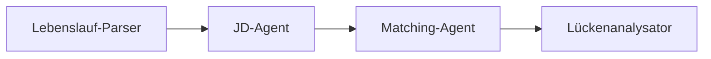
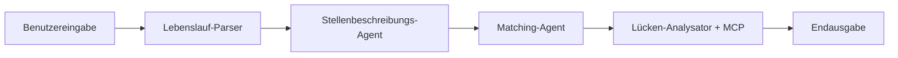

# Modul 4 - Orchestrierungsmuster

⏱️ ~10 min

In diesem Modul erkunden Sie die Orchestrierungsmuster, die im Resume Job Fit Evaluator verwendet werden, und lernen, wie Sie den Workflow-Graph lesen, ändern und erweitern können. Das Verständnis dieser Muster ist entscheidend, um Probleme im Datenfluss zu beheben und eigene [Multi-Agenten-Workflows](https://learn.microsoft.com/agent-framework/workflows/) zu erstellen.

---

## Muster 1: Sequenzielle Kette

Das grundlegende Muster im Workflow ist eine **sequenzielle Kette** – die Ausgabe jedes Agenten fließt direkt in den nächsten.


```mermaid
flowchart LR
    RP[Lebenslauf-Parser] --> JD[JD-Agent]
    JD --> MA[Matching-Agent]
    MA --> GA[Lückenanalysator]
```

Im Code erzeugt jeder `add_edge()`-Aufruf einen Schritt in der Kette:

```python
.add_edge(resume_executor, jd_executor)       # ResumeParser Ausgabe → JD Agent
.add_edge(jd_executor, matching_executor)     # JD Agent Ausgabe → MatchingAgent
.add_edge(matching_executor, gap_executor)    # MatchingAgent Ausgabe → GapAnalyzer
```

> **Warum sequenziell und nicht Fan-out/Fan-in?** `WorkflowBuilder` verwendet **ODER-Semantik** für eingehende Kanten: Ein nachgelagerter Executor wird ausgelöst, sobald **irgendein** Vorgänger abgeschlossen ist. Wenn `matching_executor` zwei eingehende Kanten hätte (von sowohl `resume_executor` als auch `jd_executor`), würde es zweimal getriggert - einmal wenn ResumeParser fertig ist und nochmals, wenn der JD-Agent fertig ist - wodurch GapAnalyzer ebenfalls zweimal läuft und die Ausgabe zweimal erscheint. Die sequenzielle Pipeline vermeidet dies vollständig.

## Muster 2: Inhaltsweiterleitung

Da `context_mode="last_agent"` bedeutet, dass jeder Executor nur die Ausgabe seines **direkten Vorgängers** sieht, müssen Agenten in einer sequenziellen Kette explizit die Daten weitergeben, die nachgelagerte Agenten benötigen.

In diesem Workflow:
- **ResumeParser** kopiert die JD unverändert in `[JOB DESCRIPTION PASS-THROUGH]` (damit der JD-Agent sie finden kann).
- **JD Agent** kopiert das `[PARSED RESUME]` unverändert in `[PARSED RESUME PASS-THROUGH]` (damit MatchingAgent beide Profile vergleichen kann).

```
ResumeParser output
└─ [PARSED RESUME]               ← extracted by JD Agent
└─ [JOB DESCRIPTION PASS-THROUGH] ← extracted by JD Agent

JD Agent output
└─ [JD REQUIREMENTS]             ← extracted by MatchingAgent
└─ [PARSED RESUME PASS-THROUGH]  ← extracted by MatchingAgent
```

Jeder Weiterleitungsabschnitt muss **wortwörtlich** kopiert werden – eine Zusammenfassung oder Paraphrasierung zerstört den nachgelagerten Agenten, der darauf angewiesen ist.

---

## Der vollständige Graph

Die Kombination der Muster sequenzielle Kette und Inhaltsweiterleitung ergibt den vollständigen Workflow:


```mermaid
flowchart LR
    U[Benutzereingabe] --> RP[Lebenslauf-Parser]
    RP --> JD[Stellenbeschreibungs-Agent]
    JD --> MA[Matching-Agent]
    MA --> GA[Lücken-Analysator + MCP]
    GA --> O[Endausgabe]
```

Der Agent Inspector zeigt diese gleiche Graphstruktur, wenn der Agent lokal läuft. Siehe [Modul 5 - Lokal testen](05-test-locally.md) für Screenshots.

---

## Den WorkflowBuilder-Code lesen

Die komplette `create_workflow()`-Funktion befindet sich in [`PersonalCareerCopilot/main.py`](../../../../../workshop/lab02-multi-agent/PersonalCareerCopilot/main.py). Die drei `add_edge()`-Aufrufe bauen die sequenzielle Pipeline:

| # | Kante | Effekt |
|---|-------|---------|
| 1 | `resume_executor → jd_executor` | JD Agent erhält `[PARSED RESUME]` + `[JOB DESCRIPTION PASS-THROUGH]` |
| 2 | `jd_executor → matching_executor` | MatchingAgent erhält `[JD REQUIREMENTS]` + `[PARSED RESUME PASS-THROUGH]` |
| 3 | `matching_executor → gap_executor` | GapAnalyzer erhält Fit-Report + Lückenliste |

---

## Graph ändern

### Einen neuen Agenten hinzufügen

Um einen fünften Agenten hinzuzufügen (z. B. einen **InterviewPrepAgent** nach GapAnalyzer):

1. Definieren Sie eine Konstante `INTERVIEW_PREP_INSTRUCTIONS`.
2. Erstellen Sie `Agent`- und `AgentExecutor`-Objekte (gleiches Muster wie bei den vorhandenen vieren).
3. Fügen Sie `.add_edge(gap_executor, interview_exec)` in `WorkflowBuilder` hinzu.
4. Aktualisieren Sie `output_executors=[interview_exec]`.

> **Wichtig:** `start_executor` ist der einzige Agent, der rohe Benutzereingaben erhält. Alle anderen Agenten erhalten die Ausgabe von ihrer vorgelagerten Kante.

---

## Häufige Graph-Fehler

| Fehler | Symptom | Lösung |
|--------|---------|--------|
| Fehlende Kante zu `output_executors` | Agent läuft, Ausgabe ist aber leer | Sicherstellen, dass ein Pfad von `start_executor` zu jedem Agenten in `output_executors` existiert |
| Zyklische Abhängigkeit | Endlosschleife oder Zeitüberschreitung | Prüfen, dass kein Agent rückwärts auf einen vorgelagerten Agenten verweist |
| Agent in `output_executors` ohne eingehende Kante | Leere Ausgabe | Mindestens eine `add_edge(source, that_agent)` hinzufügen |
| Mehrere `output_executors` ohne Fan-in | Ausgabe enthält nur die Antwort eines Agenten | Einen einzelnen Ausgabeagenten verwenden, der aggregiert, oder mehrere Ausgaben akzeptieren |
| Fehlender `start_executor` | `ValueError` zur Build-Zeit | Immer `start_executor` in `WorkflowBuilder()` angeben |

---

## Graph debuggen

### Agent Inspector verwenden

1. Starten Sie den Agenten lokal mit F5.
2. Öffnen Sie den Agent Inspector (`Strg+Shift+P` → **Foundry Toolkit: Agent Inspector öffnen**).
3. Senden Sie eine Testnachricht.
4. Im Antwortbereich des Inspectors sehen Sie die **Streaming-Ausgabe** - sie zeigt die Beiträge jedes Agenten in der Reihenfolge.


### Logging verwenden

Fügen Sie Logging in `main.py` hinzu, um den Datenfluss nachzuverfolgen:

```python
import logging
logger = logging.getLogger("resume-job-fit")

# In main(), nach dem Erstellen des Workflows:
logger.info("Workflow graph built with edges: RP→JD, JD→MA, MA→GA")
```

Die Server-Logs zeigen die Reihenfolge der Agent-Ausführung und die MCP-Tool-Aufrufe:

```
INFO:agent_framework:Executing agent: ResumeParser
INFO:agent_framework:Executing agent: JobDescriptionAgent
INFO:agent_framework:Executing agent: MatchingAgent
INFO:agent_framework:Executing agent: GapAnalyzer
INFO:agent_framework:Tool call: search_microsoft_learn_for_plan(skill="Kubernetes")
POST https://learn.microsoft.com/api/mcp → 200
INFO:agent_framework:Tool call: search_microsoft_learn_for_plan(skill="Terraform")
POST https://learn.microsoft.com/api/mcp → 200
```

---

### Checkpoint

- [ ] Sie können die zwei Orchestrierungsmuster im Workflow identifizieren: sequenzielle Kette und Inhaltsweiterleitung
- [ ] Sie verstehen, warum `context_mode="last_agent"` eine explizite Weiterleitung der Daten zwischen den Agenten erfordert
- [ ] Sie können den `WorkflowBuilder`-Code lesen und jeden `add_edge()`-Aufruf dem visuellen Graph zuordnen
- [ ] Sie wissen, wie man einen neuen Agenten ans Ende der Pipeline hinzufügt
- [ ] Sie können häufige Graph-Fehler und ihre Symptome erkennen

---

**Vorheriges:** [03 - Agenten & Umgebung konfigurieren](03-configure-agents.md) · **Nächstes:** [05 - Lokal testen →](05-test-locally.md)

---

<!-- CO-OP TRANSLATOR DISCLAIMER START -->
**Haftungsausschluss**:
Dieses Dokument wurde mit dem KI-Übersetzungsdienst [Co-op Translator](https://github.com/Azure/co-op-translator) übersetzt. Obwohl wir uns um Genauigkeit bemühen, beachten Sie bitte, dass automatisierte Übersetzungen Fehler oder Ungenauigkeiten enthalten können. Das Originaldokument in seiner Ursprungssprache gilt als maßgebliche Quelle. Bei kritischen Informationen wird eine professionelle menschliche Übersetzung empfohlen. Wir übernehmen keine Haftung für Missverständnisse oder Fehlinterpretationen, die aus der Verwendung dieser Übersetzung entstehen.
<!-- CO-OP TRANSLATOR DISCLAIMER END -->