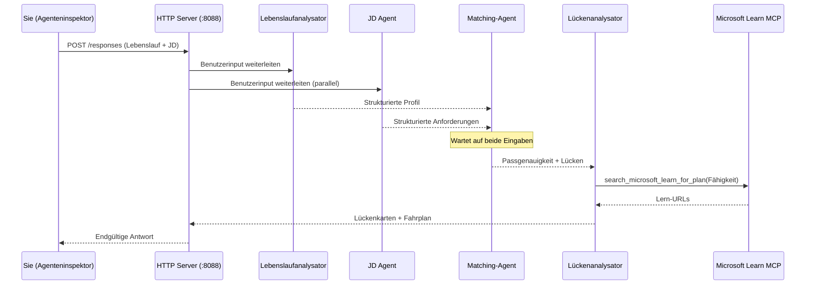
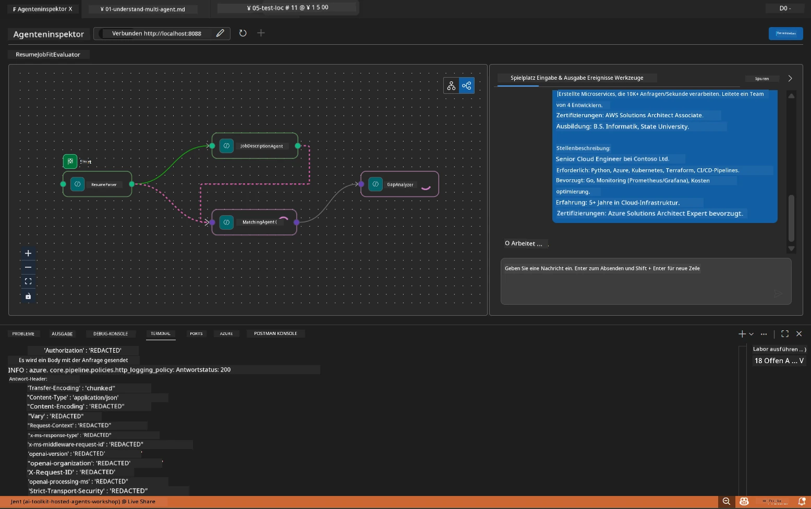

# Modul 5 - Lokal testen (Multi-Agent)

In diesem Modul führen Sie den Multi-Agent-Workflow lokal aus, testen ihn mit dem Agent Inspector und überprüfen, dass alle vier Agents und das MCP-Tool korrekt funktionieren, bevor Sie in Foundry bereitstellen.

### Was während eines lokalen Testlaufs passiert


---

## Schritt 1: Starten Sie den Agent-Server

### Option A: Verwendung der VS Code-Task (empfohlen)

1. Drücken Sie `Ctrl+Shift+P` → tippen Sie **Tasks: Run Task** → wählen Sie **Run Lab02 HTTP Server**.
2. Die Task startet den Server mit debugpy angehängt auf Port `5679` und den Agenten auf Port `8088`.
3. Warten Sie, bis die Ausgabe Folgendes anzeigt:

```
INFO:resume-job-fit:Starting Resume -> Job Fit Evaluator HTTP server...
INFO:resume-job-fit:Server running on http://localhost:8088
```

### Option B: Manuelle Verwendung des Terminals

```powershell
cd workshop\lab02-multi-agent\PersonalCareerCopilot
```

Aktivieren Sie die virtuelle Umgebung:

**PowerShell (Windows):**
```powershell
.\.venv\Scripts\Activate.ps1
```

**macOS/Linux:**
```bash
source .venv/bin/activate
```

Starten Sie den Server:

```powershell
python -m debugpy --listen 127.0.0.1:5679 -m agentdev run main.py --verbose --port 8088
```

### Option C: Verwendung von F5 (Debugmodus)

1. Drücken Sie `F5` oder gehen Sie zu **Ausführen und Debuggen** (`Ctrl+Shift+D`).
2. Wählen Sie aus dem Dropdown die Startkonfiguration **Lab02 - Multi-Agent**.
3. Der Server startet mit voller Breakpoint-Unterstützung.

> **Tipp:** Im Debugmodus können Sie Breakpoints in `search_microsoft_learn_for_plan()` setzen, um MCP-Antworten zu inspizieren, oder in den Agenten-Anweisungsstrings, um zu sehen, was jeder Agent erhält.

---

## Schritt 2: Öffnen Sie den Agent Inspector

1. Drücken Sie `Ctrl+Shift+P` → tippen Sie **Foundry Toolkit: Open Agent Inspector**.
2. Der Agent Inspector öffnet sich in einem Browser-Tab unter `http://localhost:5679`.
3. Sie sollten die Agenten-Oberfläche sehen, die bereit ist, Nachrichten zu empfangen.

> **Wenn der Agent Inspector sich nicht öffnet:** Stellen Sie sicher, dass der Server vollständig gestartet ist (Sie sehen das Log „Server running“). Wenn Port 5679 belegt ist, siehe [Modul 8 - Fehlersuche](08-troubleshooting.md).

---

## Schritt 3: Führen Sie Smoke-Tests durch

Führen Sie diese drei Tests der Reihe nach aus. Jeder testet schrittweise mehr vom Workflow.

### Test 1: Einfacher Lebenslauf + Stellenbeschreibung

Fügen Sie Folgendes in den Agent Inspector ein:

```
Resume:
Jane Doe
Senior Software Engineer with 5 years of experience in Python, Django, and AWS.
Built microservices handling 10K+ requests/second. Led a team of 4 developers.
Certifications: AWS Solutions Architect Associate.
Education: B.S. Computer Science, State University.

Job Description:
Senior Cloud Engineer at Contoso Ltd.
Required: Python, Azure, Kubernetes, Terraform, CI/CD pipelines.
Preferred: Go, monitoring (Prometheus/Grafana), cost optimization.
Experience: 5+ years in cloud infrastructure.
Certifications: Azure Solutions Architect Expert preferred.
```

**Erwartete Ausgabestruktur:**

Die Antwort sollte Ausgaben aller vier Agents in der Reihenfolge enthalten:

1. **Resume Parser Ausgabe** - Strukturierte Kandidatenprofil mit nach Kategorien gruppierten Fähigkeiten
2. **JD Agent Ausgabe** - Strukturierte Anforderungen mit getrennten Pflicht- vs. Präferenzfähigkeiten
3. **Matching Agent Ausgabe** - Passgenauigkeitswert (0-100) mit Aufschlüsselung, passende Fähigkeiten, fehlende Fähigkeiten, Lücken
4. **Gap Analyzer Ausgabe** - Einzelne Lückenkarten für jede fehlende Fähigkeit, jeweils mit Microsoft Learn-URLs



### Was in Test 1 zu überprüfen ist

| Prüfung | Erwartet | Bestanden? |
|---------|----------|-----------|
| Antwort enthält Passgenauigkeitswert | Zahl zwischen 0-100 mit Aufschlüsselung | |
| Aufgelistete passende Fähigkeiten | Python, CI/CD (teilweise), etc. | |
| Aufgelistete fehlende Fähigkeiten | Azure, Kubernetes, Terraform, etc. | |
| Lückenkarten für jede fehlende Fähigkeit vorhanden | Eine Karte pro Fähigkeit | |
| Microsoft Learn-URLs sind vorhanden | Echte `learn.microsoft.com` Links | |
| Keine Fehlermeldungen in Antwort | Saubere strukturierte Ausgabe | |

### Test 2: Prüfung der MCP-Tool-Ausführung

Während Test 1 läuft, prüfen Sie das **Server-Terminal** auf MCP-Protokolleinträge:

```
GET https://learn.microsoft.com/api/mcp → 405 (Method Not Allowed)
POST https://learn.microsoft.com/api/mcp → 200
DELETE https://learn.microsoft.com/api/mcp → 405 (Method Not Allowed)
```

| Protokolleintrag | Bedeutung | Erwartet? |
|------------------|-----------|-----------|
| `GET ... → 405` | MCP-Client sondiert mit GET während der Initialisierung | Ja – normal |
| `POST ... → 200` | Tatsächlicher Tool-Aufruf am Microsoft Learn MCP-Server | Ja – dies ist der echte Aufruf |
| `DELETE ... → 405` | MCP-Client sondiert mit DELETE während der Bereinigung | Ja – normal |
| `POST ... → 4xx/5xx` | Tool-Aufruf fehlgeschlagen | Nein – siehe [Fehlersuche](08-troubleshooting.md) |

> **Wichtig:** Die `GET 405` und `DELETE 405` Zeilen sind **erwartetes Verhalten**. Sorgen Sie sich nur, wenn `POST`-Aufrufe nicht den Status 200 zurückgeben.

### Test 3: Randfall - Kandidat mit hoher Passgenauigkeit

Fügen Sie einen Lebenslauf ein, der der Stellenbeschreibung sehr ähnlich ist, um zu überprüfen, ob der GapAnalyzer hohe Passgenauigkeitsfälle richtig behandelt:

```
Resume:
Alex Chen
Senior Cloud Engineer with 7 years of experience.
Skills: Python, Azure (AKS, Functions, DevOps), Kubernetes, Terraform, CI/CD (GitHub Actions, Azure Pipelines), Go, Prometheus, Grafana, cost optimization.
Certifications: Azure Solutions Architect Expert, Azure DevOps Engineer Expert.
Led infrastructure migration to Azure for 3 enterprise clients.
Education: M.S. Computer Science, Tech University.

Job Description:
Senior Cloud Engineer at Contoso Ltd.
Required: Python, Azure, Kubernetes, Terraform, CI/CD pipelines.
Preferred: Go, monitoring (Prometheus/Grafana), cost optimization.
Experience: 5+ years in cloud infrastructure.
Certifications: Azure Solutions Architect Expert preferred.
```

**Erwartetes Verhalten:**
- Passgenauigkeitswert sollte **80+** sein (die meisten Fähigkeiten stimmen überein)
- Lückenkarten konzentrieren sich auf Feinschliff/Interviewvorbereitung statt grundlegendes Lernen
- Die Anweisungen des GapAnalyzers sagen: „Wenn fit >= 80, Fokus auf Feinschliff/Interviewvorbereitung“

---

## Schritt 4: Überprüfen Sie die Vollständigkeit der Ausgabe

Nach den Tests überprüfen Sie, ob die Ausgabe diese Kriterien erfüllt:

### Checkliste zur Ausgabestruktur

| Abschnitt | Agent | Vorhanden? |
|-----------|-------|------------|
| Kandidatenprofil | Resume Parser | |
| Technische Fähigkeiten (gruppiert) | Resume Parser | |
| Rollenübersicht | JD Agent | |
| Pflicht- vs. Präferenzfähigkeiten | JD Agent | |
| Passgenauigkeitswert mit Aufschlüsselung | Matching Agent | |
| Passende / fehlende / teilweise Fähigkeiten | Matching Agent | |
| Lückenkarten je fehlender Fähigkeit | Gap Analyzer | |
| Microsoft Learn-URLs in Lückenkarten | Gap Analyzer (MCP) | |
| Lernreihenfolge (nummeriert) | Gap Analyzer | |
| Zeitachsenübersicht | Gap Analyzer | |

### Häufige Probleme in diesem Stadium

| Problem | Ursache | Lösung |
|---------|---------|--------|
| Nur 1 Lückenkarte (Rest abgeschnitten) | GapAnalyzer-Anweisungen ohne CRITICAL-Block | Fügen Sie den `CRITICAL:` Absatz zu `GAP_ANALYZER_INSTRUCTIONS` hinzu – siehe [Modul 3](03-configure-agents.md) |
| Keine Microsoft Learn URLs | MCP-Endpunkt nicht erreichbar | Prüfen Sie die Internetverbindung. Verifizieren Sie, dass `MICROSOFT_LEARN_MCP_ENDPOINT` in `.env` auf `https://learn.microsoft.com/api/mcp` gesetzt ist |
| Leere Antwort | `PROJECT_ENDPOINT` oder `MODEL_DEPLOYMENT_NAME` nicht gesetzt | Prüfen Sie Werte in `.env`. Führen Sie `echo $env:PROJECT_ENDPOINT` im Terminal aus |
| Passgenauigkeitswert ist 0 oder fehlt | MatchingAgent erhielt keine Eingabedaten | Prüfen Sie, dass `add_edge(resume_parser, matching_agent)` und `add_edge(jd_agent, matching_agent)` in `create_workflow()` existieren |
| Agent startet, beendet sich aber sofort | Importfehler oder fehlende Abhängigkeit | Führen Sie erneut `pip install -r requirements.txt` aus. Prüfen Sie das Terminal auf Stacktraces |
| Fehler `validate_configuration` | Fehlende Umgebungsvariablen | Erstellen Sie `.env` mit `PROJECT_ENDPOINT=<your-endpoint>` und `MODEL_DEPLOYMENT_NAME=<your-model>` |

---

## Schritt 5: Testen mit eigenen Daten (optional)

Versuchen Sie, Ihren eigenen Lebenslauf und eine reale Stellenbeschreibung einzufügen. Das hilft zu überprüfen:

- Die Agents verarbeiten unterschiedliche Lebenslauf-Formate (chronologisch, funktional, hybrid)
- Der JD Agent verarbeitet unterschiedliche JD-Stile (Aufzählungen, Absätze, strukturiert)
- Das MCP-Tool liefert relevante Ressourcen für echte Fähigkeiten
- Die Lückenkarten sind auf Ihren spezifischen Hintergrund personalisiert

> **Datenschutz-Hinweis:** Beim lokalen Testen bleiben Ihre Daten auf Ihrem Gerät und werden nur an Ihre Azure OpenAI-Bereitstellung gesendet. Sie werden nicht von der Workshop-Infrastruktur protokolliert oder gespeichert. Verwenden Sie bei Bedarf Platzhalternamen (z.B. „Jane Doe“ statt Ihres echten Namens).

---

### Checkpoint

- [ ] Server erfolgreich auf Port `8088` gestartet (Log zeigt „Server running“)
- [ ] Agent Inspector geöffnet und mit dem Agent verbunden
- [ ] Test 1: Vollständige Antwort mit Passgenauigkeitswert, passenden/fehlenden Fähigkeiten, Lückenkarten und Microsoft Learn URLs
- [ ] Test 2: MCP-Logs zeigen `POST ... → 200` (Tool-Aufrufe erfolgreich)
- [ ] Test 3: Kandidat mit hoher Passgenauigkeit erhält Wert 80+ mit feinschlifforientierten Empfehlungen
- [ ] Alle Lückenkarten vorhanden (eine pro fehlender Fähigkeit, keine Kürzungen)
- [ ] Keine Fehler oder Stacktraces im Server-Terminal

---

**Vorherige:** [04 - Orchestrierungsmuster](04-orchestration-patterns.md) · **Nächste:** [06 - In Foundry bereitstellen →](06-deploy-to-foundry.md)

---

<!-- CO-OP TRANSLATOR DISCLAIMER START -->
**Haftungsausschluss**:  
Dieses Dokument wurde mit dem KI-Übersetzungsdienst [Co-op Translator](https://github.com/Azure/co-op-translator) übersetzt. Obwohl wir auf Genauigkeit achten, beachten Sie bitte, dass automatisierte Übersetzungen Fehler oder Ungenauigkeiten enthalten können. Das Originaldokument in seiner Ursprungssprache ist als maßgebliche Quelle zu betrachten. Für kritische Informationen wird eine professionelle menschliche Übersetzung empfohlen. Wir übernehmen keine Haftung für etwaige Missverständnisse oder Fehlinterpretationen, die aus der Nutzung dieser Übersetzung entstehen.
<!-- CO-OP TRANSLATOR DISCLAIMER END -->