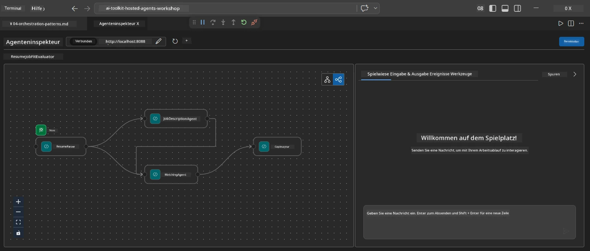
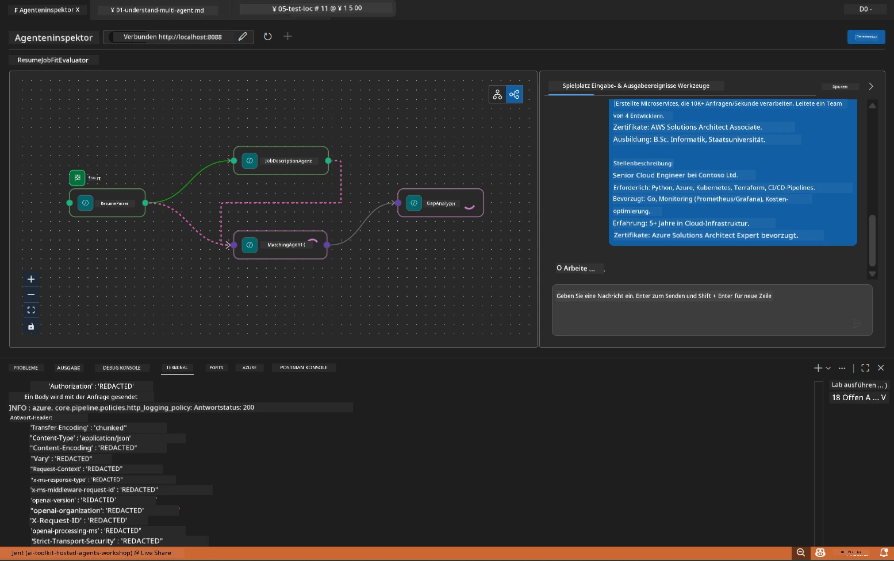
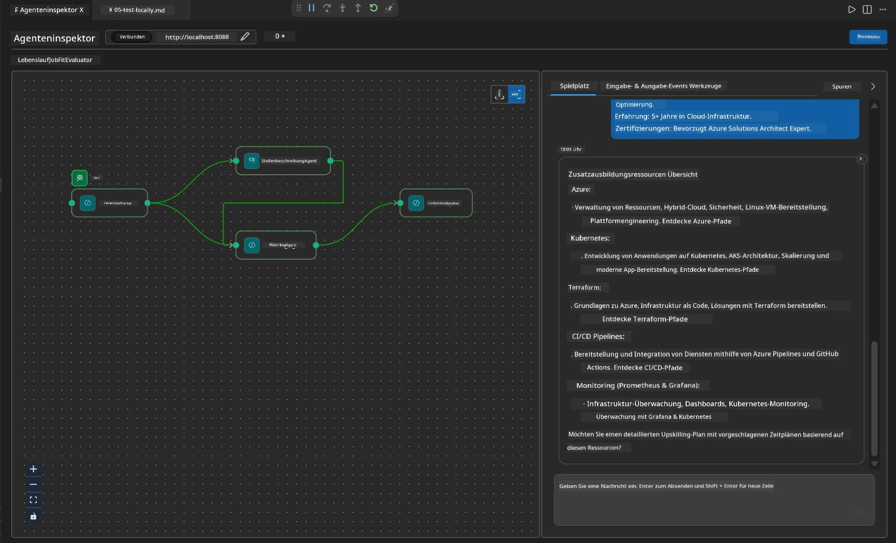

# Modul 5 - Lokal testen

⏱️ ~15 min

In diesem Modul führst du den Multi-Agent-Workflow lokal aus, testest ihn mit dem Agent Inspector und überprüfst, ob alle vier Agenten und das MCP-Tool korrekt funktionieren, bevor du sie bereitstellst.

---

## Schritt 1: Starte den Agenten-Server

### Option A: Verwendung der VS Code-Aufgabe (empfohlen)

1. Öffne `workshop/lab02-multi-agent/PersonalCareerCopilot/` als deinen VS Code-Ordner.
2. Drücke `Ctrl+Shift+P` → tippe **Tasks: Run Task** → wähle **Run Agent HTTP Server**.
3. Die Aufgabe startet den Server mit angehängtem debugpy auf Port `5679` und den Agent auf Port `8088`.
4. Warte, bis folgende Ausgabe erscheint:

```
INFO:resume-job-fit:Starting Resume -> Job Fit Evaluator HTTP server...
INFO:resume-job-fit:Server running on http://localhost:8088
```

### Option B: Verwendung von F5 (Debug-Modus)

1. Drücke `F5` → wähle **Debug Local Agent HTTP Server**.
2. Der Server startet mit voller Breakpoint-Unterstützung – nützlich, um MCP-Antworten oder Agent-Ausgaben zu inspizieren.

---

## Schritt 2: Öffne den Agent Inspector

1. Drücke `Ctrl+Shift+P` → tippe **Foundry Toolkit: Open Agent Inspector**.
2. Agent Inspector öffnet sich als VS Code-Panel, verbunden mit `http://localhost:8088`.
3. Du solltest die Agentenoberfläche sehen, die bereit ist, Nachrichten zu empfangen.



> **Falls sich der Agent Inspector nicht öffnet:** Stelle sicher, dass der Server vollständig gestartet ist (du siehst die Logmeldung „Server running“). Falls der Port 5679 belegt ist, siehe [Modul 8 - Fehlersuche](08-troubleshooting.md).

---

## Schritt 2b: (Optional) Öffne den Workflow-Visualizer

Das Foundry Toolkit enthält einen Echtzeit-**Workflow-Visualizer**, der zeigt, wie Agenten interagieren, während der Graph ausgeführt wird. Dies ist besonders nützlich beim Debuggen von Multi-Agenten.

1. Drücke `Ctrl+Shift+P` → tippe **Foundry Toolkit: Open Visualizer for Hosted Agents**.
2. Ein neuer VS Code-Tab öffnet sich und zeigt den Live-Ausführungsgraphen.
3. Während du im Agent Inspector Nachrichten sendest, aktualisiert sich der Visualizer automatisch – grüne Knoten zeigen abgeschlossene Agenten, animierte Kanten zeigen den Datenfluss zwischen ihnen an.

> **Portkonflikt:** Falls der Port für den Visualizer bereits belegt ist, ändere ihn in den VS Code-Einstellungen → **Erweiterungen** → **Microsoft Foundry Configuration** → **Hosted Agents: Visualizer Port**.

---

## Schritt 3: Führe Smoke-Tests aus

Führe diese drei Tests der Reihe nach aus. Jeder testet einen größeren Teil des Workflows.

### Test 1: Einfacher Lebenslauf + Stellenbeschreibung

Füge Folgendes in den Agent Inspector ein:

```
Resume:
Jane Doe
Senior Software Engineer with 5 years of experience in Python, Django, and AWS.
Built microservices handling 10K+ requests/second. Led a team of 4 developers.
Certifications: AWS Solutions Architect Associate.
Education: B.S. Computer Science, State University.

Job Description:
Senior Cloud Engineer at Contoso Ltd.
Required: Python, Azure, Kubernetes, Terraform, CI/CD pipelines.
Preferred: Go, monitoring (Prometheus/Grafana), cost optimization.
Experience: 5+ years in cloud infrastructure.
Certifications: Azure Solutions Architect Expert preferred.
```

**Erwartete Ausgabestruktur:**

Die Antwort sollte Ausgaben aller vier Agenten nacheinander enthalten:

1. **Output vom Lebenslauf-Parser** – Zwei bezeichnete Abschnitte: `[PARSED RESUME]` (Kandidatenprofil mit gruppierten Fähigkeiten) und `[JOB DESCRIPTION PASS-THROUGH]` (wörtlicher Stellenbeschreibungstext, der den JD-Agenten versorgt)
2. **Output vom JD-Agenten** – Strukturierte Anforderungen mit Trennung von Pflicht- und Wunschfähigkeiten
3. **Output vom Matching-Agenten** – Fit-Score (0-100) mit Aufschlüsselung, abgeglichene Fähigkeiten, fehlende Fähigkeiten, Lücken
4. **Output vom Gap Analyzer** – Einzelne Gap-Karten für jede fehlende Fähigkeit, jede mit Microsoft Learn-URLs





### Was bei Test 1 zu überprüfen ist

| Prüfen | Erwartet | Bestanden? |
|-------|----------|-------------|
| Antwort enthält einen Fit-Score | Zahl zwischen 0-100 mit Aufschlüsselung | |
| Abgeglichene Fähigkeiten sind aufgeführt | Python, CI/CD (teilweise), etc. | |
| Fehlende Fähigkeiten sind aufgeführt | Azure, Kubernetes, Terraform, etc. | |
| Gap-Karten existieren für jede fehlende Fähigkeit | Eine Karte pro Fähigkeit | |
| Microsoft Learn URLs sind vorhanden | Echte `learn.microsoft.com` Links | |
| Keine Fehlermeldungen in der Antwort | Saubere, strukturierte Ausgabe | |

### Test 2: Grenzfall – Kandidat mit hohem Fit

Füge einen Lebenslauf ein, der der Stellenbeschreibung sehr ähnlich ist, um zu prüfen, ob der GapAnalyzer Hoch-Fit-Szenarien korrekt behandelt:

```
Resume:
Alex Chen
Senior Cloud Engineer with 7 years of experience.
Skills: Python, Azure (AKS, Functions, DevOps), Kubernetes, Terraform, CI/CD (GitHub Actions, Azure Pipelines), Go, Prometheus, Grafana, cost optimization.
Certifications: Azure Solutions Architect Expert, Azure DevOps Engineer Expert.
Led infrastructure migration to Azure for 3 enterprise clients.
Education: M.S. Computer Science, Tech University.

Job Description:
Senior Cloud Engineer at Contoso Ltd.
Required: Python, Azure, Kubernetes, Terraform, CI/CD pipelines.
Preferred: Go, monitoring (Prometheus/Grafana), cost optimization.
Experience: 5+ years in cloud infrastructure.
Certifications: Azure Solutions Architect Expert preferred.
```

**Erwartetes Verhalten:**
- Der Fit-Score sollte **80+** sein (die meisten Fähigkeiten stimmen überein)
- Die Gap-Karten sollten sich auf Feinschliff/Interviewvorbereitung konzentrieren, statt auf grundlegendes Lernen
- Die Anweisungen des GapAnalyzers lauten: „Wenn Fit >= 80, liegt der Fokus auf Feinschliff/Interviewvorbereitung“

---

## Schritt 4: Teste mit eigenen Daten (optional)

Versuche, deinen eigenen Lebenslauf und eine echte Stellenbeschreibung einzufügen. Das hilft zu überprüfen:

- Die Agenten verschiedene Lebenslauf-Formate verarbeiten (chronologisch, funktional, hybrid)
- Der JD-Agent verschiedene JD-Stile verarbeitet (Aufzählungen, Absätze, strukturiert)
- Das MCP-Tool relevante Ressourcen für echte Fähigkeiten zurückgibt
- Die Gap-Karten auf deinen spezifischen Hintergrund personalisiert sind

> **Datenschutz – Pfad A (Foundry Cloud):** Lebenslauf- und JD-Text wird zur Inferenz an deine Azure OpenAI-Bereitstellung gesendet. Er wird von der Workshop-Infrastruktur nicht protokolliert oder gespeichert. Verwende Platzhalternamen (z.B. „Jane Doe“), wenn du möchtest.
>
> **Datenschutz – Pfad B (Foundry Lokal):** Alle vier Agenteninferenzen laufen vollständig auf deinem Gerät. Dein Lebenslauf- und Stellenbeschreibungstext **verlässt niemals dein Gerät**. Der einzige ausgehende Aufruf ist, dass das MCP-Tool Ressourcen von `https://learn.microsoft.com/api/mcp` abruft; diese Anfrage enthält nur den Fähigkeitsnamen, nicht deine persönlichen Daten.

---

### Kontrollpunkt

- [ ] Server wurde erfolgreich auf Port `8088` gestartet (Log zeigt „Server running“)
- [ ] Agent Inspector wurde geöffnet und mit dem Agenten verbunden
- [ ] Test 1: Komplett-Antwort mit Fit-Score, abgeglichenen/fehlenden Fähigkeiten, Gap-Karten und Microsoft Learn URLs
- [ ] Test 2: Kandidat mit hohem Fit erhält Score 80+ mit Empfehlungen für Feinschliff
- [ ] Alle Gap-Karten vorhanden (eine pro fehlender Fähigkeit, keine Kürzung)
- [ ] Keine Fehler oder Stack Traces im Server-Terminal

---

**Vorher:** [04 - Orchestrierungsmuster](04-orchestration-patterns.md) · **Nächster:** [06 - Bereitstellen in Foundry →](06-deploy-to-foundry.md)

---

<!-- CO-OP TRANSLATOR DISCLAIMER START -->
**Haftungsausschluss**:
Dieses Dokument wurde mit dem KI-Übersetzungsdienst [Co-op Translator](https://github.com/Azure/co-op-translator) übersetzt. Obwohl wir uns um Genauigkeit bemühen, beachten Sie bitte, dass automatisierte Übersetzungen Fehler oder Ungenauigkeiten enthalten können. Das Originaldokument in seiner Ursprungssprache gilt als maßgebliche Quelle. Bei kritischen Informationen wird eine professionelle menschliche Übersetzung empfohlen. Wir übernehmen keine Haftung für Missverständnisse oder Fehlinterpretationen, die aus der Verwendung dieser Übersetzung entstehen.
<!-- CO-OP TRANSLATOR DISCLAIMER END -->