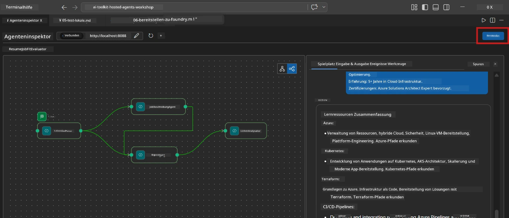
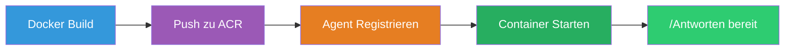
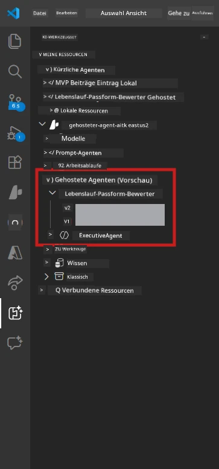

# Modul 6 - Bereitstellung bei Foundry Agent Service

In diesem Modul stellen Sie Ihren lokal getesteten Multi-Agent-Workflow bei [Microsoft Foundry](https://learn.microsoft.com/azure/foundry/agents/concepts/hosted-agents) als **Hosted Agent** bereit. Der Bereitstellungsprozess erstellt ein Docker-Container-Image, schiebt es in das [Azure Container Registry (ACR)](https://learn.microsoft.com/azure/container-registry/container-registry-intro) und erstellt eine gehostete Agent-Version im [Foundry Agent Service](https://learn.microsoft.com/azure/foundry/agents/how-to/publish-agent).

> **Wesentlicher Unterschied zu Lab 01:** Der Bereitstellungsprozess ist identisch. Foundry behandelt Ihren Multi-Agent-Workflow als einen einzigen gehosteten Agent – die Komplexität liegt im Container, aber die Bereitstellungsoberfläche ist derselbe `/responses` Endpunkt.

---

## Voraussetzungen prüfen

Vor der Bereitstellung überprüfen Sie jeden Punkt unten:

1. **Agent besteht lokale Smoke-Tests:**
   - Sie haben alle 3 Tests in [Modul 5](05-test-locally.md) abgeschlossen und der Workflow hat vollständige Ausgaben mit Gap-Karten und Microsoft Learn URLs erzeugt.

2. **Sie haben die Rolle [Azure AI User](https://learn.microsoft.com/azure/foundry/concepts/rbac-foundry):**
   - Zugewiesen in [Lab 01, Modul 2](../../lab01-single-agent/docs/02-create-foundry-project.md). Prüfen Sie:
   - [Azure Portal](https://portal.azure.com) → Ihre Foundry **Projekt**-Ressource → **Zugriffskontrolle (IAM)** → **Rollen zuweisen** → bestätigen Sie, dass **[Azure AI User](https://aka.ms/foundry-ext-project-role)** für Ihr Konto gelistet ist.

3. **Sie sind in Azure in VS Code angemeldet:**
   - Prüfen Sie das Kontosymbol unten links in VS Code. Ihr Kontoname sollte sichtbar sein.

4. **`agent.yaml` hat korrekte Werte:**
   - Öffnen Sie `PersonalCareerCopilot/agent.yaml` und prüfen Sie:
     ```yaml
     environment_variables:
       - name: PROJECT_ENDPOINT
         value: ${PROJECT_ENDPOINT}
       - name: MODEL_DEPLOYMENT_NAME
         value: ${MODEL_DEPLOYMENT_NAME}
     ```
   - Diese müssen mit den Umgebungsvariablen übereinstimmen, die Ihr `main.py` liest.

5. **`requirements.txt` enthält korrekte Versionen:**
   ```
   agent-framework-azure-ai==1.0.0rc3
   agent-framework-core==1.0.0rc3
   azure-ai-agentserver-agentframework==1.0.0b16
   azure-ai-agentserver-core==1.0.0b16
   debugpy
   agent-dev-cli --pre
   ```

---

## Schritt 1: Starten Sie die Bereitstellung

### Option A: Bereitstellung über den Agent Inspector (empfohlen)

Wenn der Agent via F5 läuft und der Agent Inspector geöffnet ist:

1. Schauen Sie in die **obere rechte Ecke** des Agent Inspector-Panels.
2. Klicken Sie auf den **Deploy**-Button (Cloud-Symbol mit Pfeil nach oben ↑).
3. Der Bereitstellungsassistent öffnet sich.



### Option B: Bereitstellung über die Befehls-Palette

1. Drücken Sie `Ctrl+Shift+P` um die **Befehls-Palette** zu öffnen.
2. Tippen Sie: **Microsoft Foundry: Deploy Hosted Agent** und wählen Sie es aus.
3. Der Bereitstellungsassistent öffnet sich.

---

## Schritt 2: Konfigurieren Sie die Bereitstellung

### 2.1 Zielprojekt auswählen

1. Ein Dropdown zeigt Ihre Foundry-Projekte.
2. Wählen Sie das Projekt aus, das Sie im Workshop verwendet haben (z.B. `workshop-agents`).

### 2.2 Container-Agent-Datei auswählen

1. Sie werden gebeten, den Agent-Einstiegspunkt auszuwählen.
2. Navigieren Sie zu `workshop/lab02-multi-agent/PersonalCareerCopilot/` und wählen Sie **`main.py`**.

### 2.3 Ressourcen konfigurieren

| Einstellung | Empfohlener Wert | Hinweise |
|------------|------------------|----------|
| **CPU** | `0.25` | Standard. Multi-Agent-Workflows benötigen nicht mehr CPU, da Modellaufrufe I/O-gebunden sind |
| **Speicher** | `0.5Gi` | Standard. Erhöhen Sie auf `1Gi`, wenn Sie große Datenverarbeitungstools hinzufügen |

---

## Schritt 3: Bestätigen und bereitstellen

1. Der Assistent zeigt eine Zusammenfassung der Bereitstellung.
2. Überprüfen Sie diese und klicken Sie auf **Confirm and Deploy**.
3. Verfolgen Sie den Fortschritt in VS Code.

### Was passiert während der Bereitstellung

Beobachten Sie das VS Code **Output**-Panel (Dropdown "Microsoft Foundry" auswählen):


1. **Docker Build** – Baut den Container aus Ihrem `Dockerfile`:
   ```
   Step 1/6 : FROM python:3.14-slim
   Step 2/6 : WORKDIR /app
   ...
   Successfully built abc123def456
   ```

2. **Docker Push** – Schiebt das Image in ACR (1-3 Minuten beim ersten Mal).

3. **Agent-Registrierung** – Foundry erstellt einen gehosteten Agent mit den Metadaten aus `agent.yaml`. Der Agent-Name ist `resume-job-fit-evaluator`.

4. **Container-Start** – Der Container startet in Foundrys verwalteter Infrastruktur mit einer systemverwalteten Identität.

> **Die erste Bereitstellung dauert länger** (Docker schiebt alle Layer). Nachfolgende Bereitstellungen verwenden zwischengespeicherte Layer und sind schneller.

### Multi-Agent spezifische Hinweise

- **Alle vier Agenten sind in einem Container.** Foundry sieht nur einen einzigen gehosteten Agent. Der WorkflowBuilder-Graph läuft intern.
- **MCP-Aufrufe gehen nach außen.** Der Container benötigt Internetzugang zu `https://learn.microsoft.com/api/mcp`. Foundrys verwaltete Infrastruktur stellt dies standardmäßig bereit.
- **[Managed Identity](https://learn.microsoft.com/python/api/overview/azure/identity-readme#managed-identity-support).** In der gehosteten Umgebung gibt `get_credential()` in `main.py` ein `ManagedIdentityCredential()` zurück (weil `MSI_ENDPOINT` gesetzt ist). Das passiert automatisch.

---

## Schritt 4: Überprüfen Sie den Bereitstellungsstatus

1. Öffnen Sie die **Microsoft Foundry** Seitenleiste (klicken Sie auf das Foundry-Symbol in der Aktivitätsleiste).
2. Erweitern Sie **Hosted Agents (Preview)** unter Ihrem Projekt.
3. Finden Sie **resume-job-fit-evaluator** (oder Ihren Agent-Namen).
4. Klicken Sie auf den Agent-Namen → erweitern Sie Versionen (z. B. `v1`).
5. Klicken Sie auf die Version → prüfen Sie **Container Details** → **Status**:



| Status | Bedeutung |
|--------|-----------|
| **Started** / **Running** | Container läuft, Agent ist bereit |
| **Pending** | Container startet (warten Sie 30-60 Sekunden) |
| **Failed** | Container konnte nicht starten (Logs prüfen – siehe unten) |

> **Der Startup von Multi-Agent dauert länger** als bei Single-Agent, da der Container beim Start 4 Agent-Instanzen erzeugt. "Pending" für bis zu 2 Minuten ist normal.

---

## Häufige Bereitstellungsfehler und Lösungen

### Fehler 1: Zugriff verweigert - `agents/write`

```
Error: lacks the required data action 
Microsoft.CognitiveServices/accounts/AIServices/agents/write
```

**Lösung:** Weisen Sie die **[Azure AI User](https://learn.microsoft.com/azure/foundry/concepts/rbac-foundry)**-Rolle auf Projektebene zu. Siehe [Modul 8 - Fehlerbehebung](08-troubleshooting.md) für Schritt-für-Schritt-Anleitungen.

### Fehler 2: Docker läuft nicht

```
Error: Docker build failed / Cannot connect to Docker daemon
```

**Lösung:**
1. Starten Sie Docker Desktop.
2. Warten Sie auf „Docker Desktop is running“.
3. Prüfen Sie mit `docker info`.
4. **Windows:** Stellen Sie sicher, dass das WSL 2 Backend in den Docker Desktop Einstellungen aktiviert ist.
5. Erneut versuchen.

### Fehler 3: `pip install` schlägt während Docker-Build fehl

```
Error: Could not find a version that satisfies the requirement agent-dev-cli
```

**Lösung:** Die `--pre` Flag in `requirements.txt` wird in Docker anders gehandhabt. Stellen Sie sicher, dass Ihre `requirements.txt` Folgendes enthält:
```
agent-dev-cli --pre
```

Falls Docker weiterhin fehlschlägt, erstellen Sie eine `pip.conf` oder übergeben Sie `--pre` als Build-Argument. Siehe [Modul 8](08-troubleshooting.md).

### Fehler 4: MCP-Tool schlägt im gehosteten Agent fehl

Wenn der Gap Analyzer nach der Bereitstellung keine Microsoft Learn URLs mehr erzeugt:

**Ursache:** Netzwerkrichtlinie kann ausgehendes HTTPS vom Container blockieren.

**Lösung:**
1. Dies ist normalerweise kein Problem mit der Standardkonfiguration von Foundry.
2. Wenn es auftritt, prüfen Sie, ob das virtuelle Netzwerk des Foundry-Projekts eine NSG hat, die ausgehendes HTTPS blockiert.
3. Das MCP-Tool hat eingebaute Fallback-URLs, sodass der Agent weiterhin Ausgabe produziert (ohne Live-URLs).

---

### Checkpoint

- [ ] Bereitstellungsbefehl wurde ohne Fehler in VS Code abgeschlossen
- [ ] Agent erscheint unter **Hosted Agents (Preview)** in der Foundry-Seitenleiste
- [ ] Agent-Name ist `resume-job-fit-evaluator` (oder Ihr gewählter Name)
- [ ] Container-Status zeigt **Started** oder **Running**
- [ ] (Wenn Fehler) Sie haben den Fehler identifiziert, behoben und erfolgreich neu bereitgestellt

---

**Vorher:** [05 - Lokal testen](05-test-locally.md) · **Nächste:** [07 - Verifizieren im Playground →](07-verify-in-playground.md)

---

<!-- CO-OP TRANSLATOR DISCLAIMER START -->
**Haftungsausschluss**:  
Dieses Dokument wurde mit dem KI-Übersetzungsdienst [Co-op Translator](https://github.com/Azure/co-op-translator) übersetzt. Obwohl wir uns um Genauigkeit bemühen, beachten Sie bitte, dass automatisierte Übersetzungen Fehler oder Ungenauigkeiten enthalten können. Das Originaldokument in seiner Ursprungssprache ist als maßgebliche Quelle zu betrachten. Für wichtige Informationen wird eine professionelle menschliche Übersetzung empfohlen. Wir übernehmen keine Haftung für Missverständnisse oder Fehlinterpretationen, die aus der Verwendung dieser Übersetzung entstehen.
<!-- CO-OP TRANSLATOR DISCLAIMER END -->