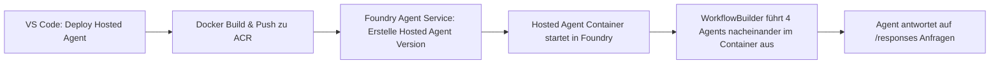
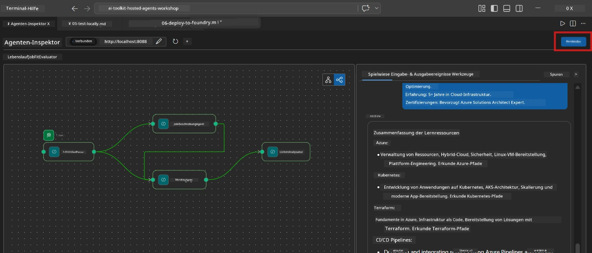

# Modul 6 - Bereitstellung für den Foundry Agent Service

⏱️ ~10 min

In diesem Modul stellen Sie Ihren lokal getesteten Multi-Agenten-Workflow als **Hosted Agent** bei [Microsoft Foundry](https://learn.microsoft.com/azure/foundry/agents/concepts/hosted-agents) bereit. Der Bereitstellungsprozess erstellt ein Docker-Container-Image, schiebt es zum [Azure Container Registry (ACR)](https://learn.microsoft.com/azure/container-registry/container-registry-intro) und erstellt eine Hosted Agent-Version im [Foundry Agent Service](https://learn.microsoft.com/azure/foundry/agents/how-to/publish-agent).

> **Wesentlicher Unterschied zu Labor 01:** Der Bereitstellungsprozess ist identisch. Foundry behandelt Ihren Multi-Agenten-Workflow als einzigen Hosted Agent – die Komplexität steckt im Container, die Bereitstellungsoberfläche ist jedoch derselbe `/responses` Endpunkt.

### Bereitstellungspipeline


```mermaid
flowchart LR
    A[VS Code: Deploy Hosted Agent] --> B[Docker Build & Push zu ACR]
    B --> C[Foundry Agent Service: Erstelle Hosted Agent Version]
    C --> D[Hosted Agent Container startet in Foundry]
    D --> E[WorkflowBuilder führt 4 Agents nacheinander im Container aus]
    E --> F[Agent antwortet auf /responses Anfragen]
```

---

## Voraussetzungen prüfen

Überprüfen Sie vor der Bereitstellung jeden der folgenden Punkte:

1. **Agent besteht lokale Rauchtests:**
   - Sie haben alle 3 Tests in [Modul 5](05-test-locally.md) abgeschlossen und der Workflow hat vollständige Ausgabe mit Gap Cards und Microsoft Learn URLs erzeugt.

2. **Sie haben die Rolle [Foundry User](https://learn.microsoft.com/azure/foundry/concepts/rbac-foundry)** (für Bereitstellung benötigen Sie mindestens **Foundry Project Manager** auf Projektebene):

   > **Hinweis:** Die Foundry RBAC-Rollen wurden kürzlich umbenannt – **Foundry User**, **Foundry Owner** und **Foundry Project Manager** hießen zuvor Azure AI User, Azure AI Owner und Azure AI Project Manager. Rollen-IDs und -Berechtigungen sind unverändert.

   - Prüfen Sie im [Azure Portal](https://portal.azure.com) → Ihre Foundry **Projekt**-Ressource → **Zugriffssteuerung (IAM)** → **Rollenzuweisungen** → bestätigen Sie, dass **Foundry User** (oder höher) für Ihr Konto angezeigt wird.

3. **Sie sind in Azure in VS Code angemeldet:**
   - Überprüfen Sie das Kontosymbol unten links in VS Code. Ihr Kontoname sollte sichtbar sein.

4. **`agent.yaml` enthält korrekte Werte:**
   - Öffnen Sie `PersonalCareerCopilot/agent.yaml` und überprüfen Sie:
     ```yaml
     environment_variables:
       - name: AZURE_AI_MODEL_DEPLOYMENT_NAME
         value: ${AZURE_AI_MODEL_DEPLOYMENT_NAME}
     ```
   - `FOUNDRY_PROJECT_ENDPOINT` ist **nicht** hier aufgelistet – Foundry injiziert das zur Laufzeit. Nur `AZURE_AI_MODEL_DEPLOYMENT_NAME` muss angegeben werden.

5. **`requirements.txt` enthält korrekte Versionen:**
   ```
   agent-framework-foundry
   agent-framework-foundry-hosting
   mcp<2,>=1.24.0
   debugpy
   ```

---

## Schritt 1: Starten der Bereitstellung

### Option A: Bereitstellung über den Agent Inspector (empfohlen)

Wenn der Agent über F5 läuft und der Agent Inspector geöffnet ist:

1. Betrachte die **obere rechte Ecke** des Agent Inspector Panels.
2. Klicke auf die **Bereitstellen**-Taste (Wolken-Symbol mit Pfeil nach oben ↑).
3. Der Bereitstellungsassistent öffnet sich.



### Option B: Bereitstellung über die Befehls-Palette

1. Drücken Sie `Ctrl+Shift+P`, um die **Befehls-Palette** zu öffnen.
2. Geben Sie ein: **Foundry Toolkit: Deploy Hosted Agent** und wählen Sie es aus.
3. Der Bereitstellungsassistent öffnet sich.

---

## Schritt 2: Konfigurieren der Bereitstellung

### 2.1 Zielprojekt auswählen

1. Ein Dropdown zeigt Ihre Foundry-Projekte.
2. Wählen Sie das Projekt, das Sie im Workshop verwendet haben (z.B. `workshop-agents`).

### 2.2 Container-Agent-Datei auswählen

1. Sie werden aufgefordert, den Einstiegspunkt des Agenten auszuwählen.
2. Navigieren Sie zu `workshop/lab02-multi-agent/PersonalCareerCopilot/` und wählen Sie **`main.py`** aus.

### 2.3 Ressourcen konfigurieren

| Einstellung | Empfohlener Wert | Hinweise |
|---------|------------------|-------|
| **Bereitstellungsmethode** | **Container** (empfohlen) oder **Code** | Container baut ein Docker-Image; Code lädt Quellcode als ZIP hoch (Vorschau) |
| **Container-Registry** | **Standard-ACR** | Foundry erstellt und verwaltet eine für Sie |
| **CPU** | `0.25` | Standard. Multi-Agenten-Workflows benötigen keine höhere CPU, da Modellaufrufe I/O-gebunden sind |
| **Speicher** | `0.5Gi` | Standard. Erhöhen auf `1Gi`, wenn große Datenverarbeitungstools hinzugefügt werden |

---

## Schritt 3: Bestätigen und Bereitstellen

1. Der Assistent zeigt eine Zusammenfassung der Bereitstellung.
2. Prüfen und **Bestätigen und Bereitstellen** klicken.
3. Verfolgen Sie den Fortschritt in VS Code.

### Was während der Bereitstellung passiert

Beobachten Sie das VS Code **Ausgabe**-Panel (Dropdown „Microsoft Foundry“ auswählen):

1. **Docker Build** – Baut den Container aus Ihrer `Dockerfile`
   ```
   Step 1/6 : FROM python:3.12-slim
   Step 2/6 : WORKDIR /app
   ...
   Successfully built abc123def456
   ```

2. **Docker Push** – Schiebt das Image zum ACR (1-3 Minuten bei Erstbereitstellung).

3. **Agent-Registrierung** – Foundry erstellt einen Hosted Agent mit `agent.yaml` Metadaten. Der Agentenname ist `resume-job-fit-evaluator`.

4. **Containerstart** – Der Container startet in Foundrys verwalteter Infrastruktur mit einer systemverwalteten Identität.

> **Erstbereitstellung ist langsamer** (Docker lädt alle Schichten hoch). Folgebereitstellungen verwenden zwischengespeicherte Schichten und sind schneller.

### Multi-Agent-spezifische Hinweise

- **Alle vier Agenten befinden sich in einem Container.** Foundry sieht nur einen einzelnen Hosted Agent. Der WorkflowBuilder-Graph läuft intern.
- **MCP-Aufrufe gehen nach außen.** Der Container benötigt Internetzugang, um `https://learn.microsoft.com/api/mcp` zu erreichen. Foundrys verwaltete Infrastruktur stellt das standardmäßig bereit.
- **[Managed Identity](https://learn.microsoft.com/azure/foundry/agents/concepts/agent-identity).** Foundry erstellt automatisch eine **dedizierte pro Agent Entra-Identität** für jeden Hosted Agent bei der Bereitstellung. In der gehosteten Umgebung löst `DefaultAzureCredential` automatisch auf diese Agentenidentität auf – keine manuelle Konfiguration der Managed Identity ist nötig.

---

## Schritt 4: Überprüfung des Bereitstellungsstatus

1. Öffnen Sie die **Microsoft Foundry** Seitenleiste (Klicken Sie im Aktivitätsbereich auf das Foundry-Symbol).
2. Erweitern Sie **Hosted Agents (Preview)** unter Ihrem Projekt.
3. Finden Sie **resume-job-fit-evaluator** (oder Ihren Agentennamen).
4. Klicken Sie auf den Agentennamen → erweitern Sie die Versionen (z.B. `v1`).
5. Klicken Sie auf die Version → prüfen Sie **Container-Details** → **Status**:


| Status | Bedeutung |
|--------|---------|
| **active** | Agent läuft und ist bereit, Anfragen zu akzeptieren |
| **creating** | Container startet (30–60 Sekunden warten) |
| **failed** | Container konnte nicht gestartet werden (Logs prüfen – siehe unten) |

> **Hinweis:** Die VS Code Seitenleiste zeigt eventuell Labels wie „Running“ oder „Started“, während der zugrundeliegende API-Status `active`/`creating` nutzt. Beide Anzeigen bedeuten denselben Zustand.

> **Multi-Agent-Start dauert länger** als bei einem einzelnen Agenten, da beim Start 4 Agenteninstanzen im Container erzeugt werden. `creating` für bis zu 2 Minuten ist normal.

---

## Häufige Bereitstellungsfehler und Lösungen

### Fehler 1: Zugriff verweigert – `agents/write`

```
Error: lacks the required data action 
Microsoft.CognitiveServices/accounts/AIServices/agents/write
```

**Lösung:** Weisen Sie die **[Foundry User](https://learn.microsoft.com/azure/foundry/concepts/rbac-foundry)**-Rolle (früher **Azure AI User**) auf **Projektebene** zu. Anleitungen finden Sie in [Modul 8 - Fehlerbehebung](08-troubleshooting.md).

### Fehler 2: Docker läuft nicht

```
Error: Docker build failed / Cannot connect to Docker daemon
```

**Lösung:**
1. Starten Sie Docker Desktop.
2. Warten Sie auf „Docker Desktop is running“.
3. Prüfen Sie: `docker info`
4. **Windows:** Stellen Sie sicher, dass das WSL 2 Backend in Docker Desktop aktiviert ist.
5. Versuchen Sie es erneut.

### Fehler 3: pip install schlägt beim Docker Build fehl

```
Error: Could not find a version that satisfies the requirement agent-framework-foundry
```

**Lösung:** Vergewissern Sie sich, dass `requirements.txt` übereinstimmt:
```
agent-framework-foundry
agent-framework-foundry-hosting
mcp<2,>=1.24.0
debugpy
```

Wenn der Build weiterhin fehlschlägt, blockiert Ihr Docker-Netzwerk womöglich PyPI. Prüfen Sie `docker info` auf Proxy-Einstellungen.

### Fehler 4: MCP-Tool schlägt im gehosteten Agent fehl

Wenn der Gap Analyzer nach der Bereitstellung keine Microsoft Learn URLs mehr erzeugt:

**Ursache:** Netzwerkpolitik blockiert womöglich ausgehendes HTTPS vom Container.

**Lösung:**
1. Dies ist normalerweise kein Problem mit Foundrys Standardkonfiguration.
2. Falls es auftritt, prüfen Sie, ob das virtuelle Netzwerk des Foundry-Projekts eine NSG für ausgehendes HTTPS blockiert.
3. Das MCP-Tool hat eingebaute Fallback-URLs, sodass der Agent weiterhin Ausgabe erzeugt (ohne Live-URLs).

---

### Checkpoint

- [ ] Bereitstellungsbefehl wurde ohne Fehler in VS Code abgeschlossen
- [ ] Agent erscheint unter **Hosted Agents (Preview)** in der Foundry-Seitenleiste
- [ ] Agentenname ist `resume-job-fit-evaluator` (oder gewählter Name)
- [ ] Containerstatus zeigt **Started** oder **Running**
- [ ] (Bei Fehlern) Fehler identifiziert, Lösung angewendet und erfolgreich erneut bereitgestellt

---

**Vorheriges:** [05 - Lokal testen](05-test-locally.md) · **Nächstes:** [07 - Im Playground verifizieren →](07-verify-in-playground.md)

---

<!-- CO-OP TRANSLATOR DISCLAIMER START -->
**Haftungsausschluss**:
Dieses Dokument wurde mit dem KI-Übersetzungsdienst [Co-op Translator](https://github.com/Azure/co-op-translator) übersetzt. Obwohl wir uns um Genauigkeit bemühen, beachten Sie bitte, dass automatisierte Übersetzungen Fehler oder Ungenauigkeiten enthalten können. Das Originaldokument in seiner Ursprungssprache gilt als maßgebliche Quelle. Bei kritischen Informationen wird eine professionelle menschliche Übersetzung empfohlen. Wir übernehmen keine Haftung für Missverständnisse oder Fehlinterpretationen, die aus der Verwendung dieser Übersetzung entstehen.
<!-- CO-OP TRANSLATOR DISCLAIMER END -->