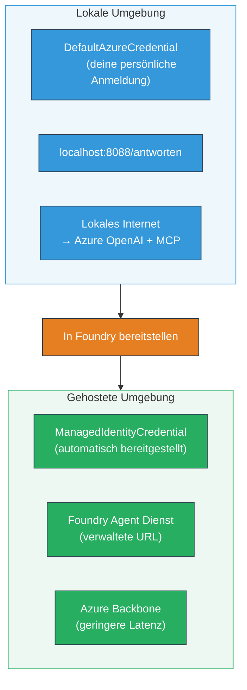

# Modul 7 - Überprüfung im Playground

In diesem Modul testen Sie Ihren bereitgestellten Multi-Agenten-Workflow sowohl in **VS Code** als auch im **[Foundry Portal](https://ai.azure.com)** und bestätigen, dass sich der Agent genauso verhält wie bei lokalen Tests.

---

## Warum nach der Bereitstellung überprüfen?

Ihr Multi-Agenten-Workflow lief lokal einwandfrei, warum also nochmals testen? Die gehostete Umgebung unterscheidet sich in mehreren Punkten:


| Unterschied | Lokal | Gehostet |
|-----------|-------|--------|
| **Identität** | [`DefaultAzureCredential`](https://learn.microsoft.com/azure/developer/python/sdk/authentication/credential-chains#defaultazurecredential-overview) (Ihre persönliche Anmeldung) | [`ManagedIdentityCredential`](https://learn.microsoft.com/python/api/overview/azure/identity-readme#managed-identity-support) (automatisch bereitgestellt) |
| **Endpunkt** | `http://localhost:8088/responses` | [Foundry Agent Service](https://learn.microsoft.com/azure/foundry/agents/concepts/hosted-agents) Endpunkt (verwaltete URL) |
| **Netzwerk** | Lokaler Rechner → Azure OpenAI + MCP ausgehend | Azure Backbone (geringere Latenz zwischen Diensten) |
| **MCP-Konnektivität** | Lokales Internet → `learn.microsoft.com/api/mcp` | Container ausgehend → `learn.microsoft.com/api/mcp` |

Wenn eine Umgebungsvariable falsch konfiguriert ist, RBAC abweicht oder MCP ausgehend blockiert ist, erkennen Sie das hier.

---

## Option A: Test im VS Code Playground (zuerst empfohlen)

Die [Foundry-Erweiterung](https://marketplace.visualstudio.com/items?itemName=TeamsDevApp.vscode-ai-foundry) beinhaltet einen integrierten Playground, mit dem Sie mit Ihrem bereitgestellten Agenten chatten können, ohne VS Code zu verlassen.

### Schritt 1: Navigieren Sie zu Ihrem gehosteten Agenten

1. Klicken Sie auf das **Microsoft Foundry**-Symbol in der VS Code **Aktivitätsleiste** (linke Seitenleiste), um das Foundry-Panel zu öffnen.
2. Erweitern Sie Ihr verbundenes Projekt (z. B. `workshop-agents`).
3. Erweitern Sie **Hosted Agents (Preview)**.
4. Sie sollten den Namen Ihres Agenten sehen (z. B. `resume-job-fit-evaluator`).

### Schritt 2: Wählen Sie eine Version aus

1. Klicken Sie auf den Agentennamen, um dessen Versionen anzuzeigen.
2. Klicken Sie auf die bereitgestellte Version (z. B. `v1`).
3. Ein **Detailbereich** öffnet sich und zeigt Container-Details.
4. Überprüfen Sie, ob der Status **Started** oder **Running** ist.

### Schritt 3: Öffnen Sie den Playground

1. Klicken Sie im Detailbereich auf die Schaltfläche **Playground** (oder Rechtsklick auf die Version → **Open in Playground**).
2. Eine Chat-Oberfläche öffnet sich in einem VS Code Tab.

### Schritt 4: Führen Sie Ihre Smoke-Tests aus

Verwenden Sie die gleichen 3 Tests aus [Modul 5](05-test-locally.md). Geben Sie jede Nachricht in das Eingabefeld des Playgrounds ein und drücken Sie **Send** (oder **Enter**).

#### Test 1 - Vollständiger Lebenslauf + Stellenbeschreibung (Standardablauf)

Fügen Sie den vollständigen Lebenslauf + JD-Prompt aus Modul 5, Test 1 ein (Jane Doe + Senior Cloud Engineer bei Contoso Ltd).

**Erwartet:**
- Fit-Score mit zerlegter Mathematik (100-Punkte-Skala)
- Abschnitt Übereinstimmende Fähigkeiten
- Abschnitt Fehlende Fähigkeiten
- **Eine Gap-Karte pro fehlender Fähigkeit** mit Microsoft Learn-URLs
- Lernfahrplan mit Zeitplan

#### Test 2 - Schneller kurzer Test (minimale Eingabe)

```
RESUME: 3 years Python developer, knows Django and PostgreSQL, no cloud experience.

JOB: Cloud DevOps Engineer requiring AWS, Kubernetes, Terraform, CI/CD. 5 years needed.
```

**Erwartet:**
- Niedriger Fit-Score (< 40)
- Ehrliche Einschätzung mit gestuftem Lernpfad
- Mehrere Gap-Karten (AWS, Kubernetes, Terraform, CI/CD, Erfahrungslücke)

#### Test 3 - Hochpassender Kandidat

```
RESUME:
10 years Azure Cloud Architect. AZ-305 certified. Expert in AKS, Terraform, Azure DevOps, 
Azure Functions, Helm, Prometheus, Grafana, Python, Go. Led platform team of 8.

JOB:
Senior Cloud Engineer. Required: AKS, Terraform, Azure DevOps, Python. Preferred: Helm, Go.
5+ years experience. AZ-305 preferred.
```

**Erwartet:**
- Hoher Fit-Score (≥ 80)
- Fokus auf Interviewvorbereitung und Feinschliff
- Wenige oder keine Gap-Karten
- Kurzfristiger Zeitplan mit Schwerpunkt auf Vorbereitung

### Schritt 5: Vergleich mit lokalen Ergebnissen

Öffnen Sie Ihre Notizen oder den Browser-Tab aus Modul 5, in dem Sie lokale Antworten gespeichert haben. Prüfen Sie für jeden Test:

- Hat die Antwort die **gleiche Struktur** (Fit-Score, Gap-Karten, Fahrplan)?
- Entspricht sie dem **gleichen Bewertungsschema** (100-Punkte-Zerlegung)?
- Sind **Microsoft Learn-URLs** noch in den Gap-Karten vorhanden?
- Gibt es **eine Gap-Karte pro fehlender Fähigkeit** (nicht abgeschnitten)?

> **Kleinere Formulierungsunterschiede sind normal** – das Modell ist nicht deterministisch. Konzentrieren Sie sich auf Struktur, Bewertungskonsistenz und MCP-Tool-Nutzung.

---

## Option B: Test im Foundry Portal

Das [Foundry Portal](https://ai.azure.com) bietet einen webbasierten Playground, der sich gut zum Teilen mit Teammitgliedern oder Stakeholdern eignet.

### Schritt 1: Öffnen Sie das Foundry Portal

1. Öffnen Sie Ihren Browser und navigieren Sie zu [https://ai.azure.com](https://ai.azure.com).
2. Melden Sie sich mit demselben Azure-Konto an, das Sie während des Workshops verwendet haben.

### Schritt 2: Navigieren Sie zu Ihrem Projekt

1. Suchen Sie auf der Startseite links in der Seitenleiste nach **Recent projects**.
2. Klicken Sie auf den Projektnamen (z. B. `workshop-agents`).
3. Wenn Sie es nicht sehen, klicken Sie auf **All projects** und suchen Sie danach.

### Schritt 3: Finden Sie Ihren bereitgestellten Agenten

1. Klicken Sie in der linken Navigation des Projekts auf **Build** → **Agents** (oder suchen Sie den Bereich **Agents**).
2. Sie sollten eine Liste von Agenten sehen. Finden Sie Ihren bereitgestellten Agenten (z. B. `resume-job-fit-evaluator`).
3. Klicken Sie auf den Agentennamen, um die Detailseite zu öffnen.

### Schritt 4: Öffnen Sie den Playground

1. Schauen Sie auf der Agent-Detailseite in der oberen Toolbar nach.
2. Klicken Sie auf **Open in playground** (oder **Try in playground**).
3. Eine Chat-Oberfläche öffnet sich.

### Schritt 5: Führen Sie dieselben Smoke-Tests aus

Wiederholen Sie alle 3 Tests aus dem VS Code Playground Abschnitt oben. Vergleichen Sie jede Antwort sowohl mit lokalen Ergebnissen (Modul 5) als auch mit den VS Code Playground Ergebnissen (Option A oben).

---

## Spezifische Überprüfung für Multi-Agenten

Neben der grundlegenden Korrektheit überprüfen Sie diese multi-agentenspezifischen Verhaltensweisen:

### MCP-Tool-Ausführung

| Überprüfung | Wie prüfen? | Bestehensbedingung |
|-------|---------------|----------------|
| MCP-Aufrufe gelingen | Gap-Karten enthalten `learn.microsoft.com` URLs | Echte URLs, keine Ersatznachrichten |
| Mehrere MCP-Aufrufe | Jede High/Medium-Prioritätslücke hat Ressourcen | Nicht nur die erste Gap-Karte |
| MCP-Fallback funktioniert | Wenn URLs fehlen, auf Fallback-Text prüfen | Agent generiert weiterhin Gap-Karten (mit oder ohne URLs) |

### Agenten-Koordination

| Überprüfung | Wie prüfen? | Bestehensbedingung |
|-------|---------------|----------------|
| Alle 4 Agenten liefen | Ausgabe enthält Fit-Score UND Gap-Karten | Score kommt von MatchingAgent, Karten von GapAnalyzer |
| Paralleler Fan-out | Antwortzeit ist angemessen (< 2 Min) | Falls > 3 Min, läuft parallele Ausführung evtl. nicht |
| Datenfluss-Integrität | Gap-Karten beziehen sich auf Fähigkeiten aus dem Matching-Bericht | Keine erfundenen Fähigkeiten, die nicht in der JD sind |

---

## Validierungs-Rubrik

Verwenden Sie diese Rubrik, um das Verhalten Ihres Multi-Agenten-Workflows im gehosteten Zustand zu bewerten:

| # | Kriterium | Bestehensbedingung | Bestanden? |
|---|----------|---------------|-------|
| 1 | **Funktionale Korrektheit** | Agent antwortet auf Lebenslauf + JD mit Fit-Score und Gap-Analyse | |
| 2 | **Bewertungskonsistenz** | Fit-Score basiert auf 100-Punkte-Skala mit Zerlegung | |
| 3 | **Vollständigkeit der Gap-Karten** | Eine Karte pro fehlender Fähigkeit (nicht abgeschnitten oder kombiniert) | |
| 4 | **MCP-Tool-Integration** | Gap-Karten enthalten echte Microsoft Learn-URLs | |
| 5 | **Strukturkonsistenz** | Ausgabe-Struktur entspricht lokalen und gehosteten Läufen | |
| 6 | **Antwortzeit** | Gehosteter Agent antwortet innerhalb von 2 Minuten für vollständige Bewertung | |
| 7 | **Keine Fehler** | Keine HTTP 500-Fehler, Timeouts oder leere Antworten | |

> Ein "Bestanden" bedeutet, dass alle 7 Kriterien für alle 3 Smoke-Tests in mindestens einem Playground (VS Code oder Portal) erfüllt sind.

---

## Fehlerbehebung bei Playground-Problemen

| Symptom | Wahrscheinliche Ursache | Lösung |
|---------|-------------|-----|
| Playground lädt nicht | Container-Status nicht „Started“ | Zurück zu [Modul 6](06-deploy-to-foundry.md), Bereitstellungsstatus prüfen. Warten bei „Pending“ |
| Agent gibt leere Antwort zurück | Modellbereitstellungsname stimmt nicht überein | `agent.yaml` → `environment_variables` → `MODEL_DEPLOYMENT_NAME` entspricht Ihrem bereitgestellten Modell prüfen |
| Agent gibt Fehlermeldung zurück | [RBAC](https://learn.microsoft.com/azure/foundry/concepts/rbac-foundry) Berechtigung fehlt | Weisen Sie **[Azure AI User](https://aka.ms/foundry-ext-project-role)** auf Projektebene zu |
| Keine Microsoft Learn URLs in Gap-Karten | MCP ausgehend blockiert oder MCP-Server nicht verfügbar | Prüfen, ob Container `learn.microsoft.com` erreichen kann. Siehe [Modul 8](08-troubleshooting.md) |
| Nur 1 Gap-Karte (abgeschnitten) | GapAnalyzer-Anweisungen fehlen "CRITICAL"-Block | Überprüfen Sie [Modul 3, Schritt 2.4](03-configure-agents.md) |
| Fit-Score stark unterschiedlich zu lokal | Anderes Modell oder andere Anweisungen bereitgestellt | `agent.yaml` Env-Variablen mit lokalem `.env` vergleichen. Bei Bedarf neu bereitstellen |
| „Agent nicht gefunden“ im Portal | Bereitstellung wird noch propagiert oder ist fehlgeschlagen | 2 Minuten warten, aktualisieren. Wenn weiterhin nicht vorhanden, erneut aus [Modul 6](06-deploy-to-foundry.md) bereitstellen |

---

### Kontrollpunkt

- [ ] Agent im VS Code Playground getestet – alle 3 Smoke-Tests bestanden
- [ ] Agent im [Foundry Portal](https://ai.azure.com) Playground getestet – alle 3 Smoke-Tests bestanden
- [ ] Antworten sind strukturell konsistent mit lokalem Test (Fit-Score, Gap-Karten, Fahrplan)
- [ ] Microsoft Learn-URLs sind in Gap-Karten vorhanden (MCP-Tool funktioniert in der gehosteten Umgebung)
- [ ] Eine Gap-Karte pro fehlender Fähigkeit (keine Abschneidung)
- [ ] Keine Fehler oder Timeouts während der Tests
- [ ] Validierungsrubrik abgeschlossen (alle 7 Kriterien bestanden)

---

**Vorher:** [06 - Deploy to Foundry](06-deploy-to-foundry.md) · **Weiter:** [08 - Fehlerbehebung →](08-troubleshooting.md)

---

<!-- CO-OP TRANSLATOR DISCLAIMER START -->
**Haftungsausschluss**:  
Dieses Dokument wurde mithilfe des KI-Übersetzungsdienstes [Co-op Translator](https://github.com/Azure/co-op-translator) übersetzt. Obwohl wir uns um Genauigkeit bemühen, sollten Sie beachten, dass automatisierte Übersetzungen Fehler oder Ungenauigkeiten enthalten können. Das Originaldokument in seiner Ursprungssprache gilt als maßgebliche Quelle. Für wichtige Informationen wird eine professionelle menschliche Übersetzung empfohlen. Wir übernehmen keine Haftung für Missverständnisse oder Fehlinterpretationen, die aus der Nutzung dieser Übersetzung entstehen.
<!-- CO-OP TRANSLATOR DISCLAIMER END -->