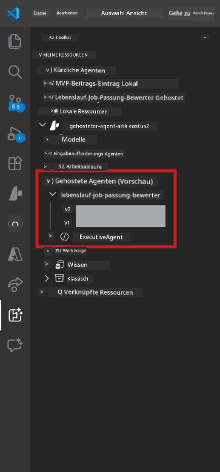

# Modul 7 - Überprüfung im Playground

⏱️ ~10 Min.

In diesem Modul testen Sie Ihren bereitgestellten Multi-Agent-Workflow in VS Code und dem Foundry-Portal, um zu bestätigen, dass sich der Agent genauso verhält wie bei lokalen Tests.

---

## Warum nach der Bereitstellung erneut testen?

Die gehostete Umgebung unterscheidet sich in einigen wichtigen Punkten von der lokalen:

| | Lokal | Gehostet |
|--|-------|--------|
| **Identität** | Ihre persönliche Anmeldung (`DefaultAzureCredential`) | Dedizierte pro-Agent Entra-Identität (wird automatisch bei der Bereitstellung bereitgestellt) |
| **Endpunkt** | `http://localhost:8088/responses` | Vom Foundry-Agent-Service verwaltete URL |
| **Netzwerk** | Ihr Rechner → Azure OpenAI + MCP | Azure Backbone (geringere Latenz) |

Eine falsch konfigurierte Umgebungsvariable, ein RBAC-Problem oder blockierter MCP-Ausgangsanruf würden hier zuerst sichtbar werden.

---

## Option A: Test im VS Code Playground (empfohlen als erstes)

### Schritt 1: Navigieren Sie zu Ihrem gehosteten Agent

1. Klicken Sie auf das **Foundry Toolkit** Symbol in der Aktivitätsleiste.
2. Erweitern Sie Ihr Projekt → **Hosted Agents (Preview)** → suchen Sie Ihren Agent.



### Schritt 2: Wählen Sie eine Version aus

1. Klicken Sie auf den Agenten, um seine Versionen zu erweitern.
2. Klicken Sie auf `v1` → überprüfen Sie, ob der Status **aktiv** ist (die Seitenleiste kann "Running" oder "Started" anzeigen - beides zeigt denselben Bereitschaftszustand an).

### Schritt 3: Öffnen Sie den Playground

1. Klicken Sie auf **Playground** (oder Rechtsklick auf Version → **Im Playground öffnen**).
2. Ein Chatfenster öffnet sich in einem VS Code-Tab.

### Schritt 4: Führen Sie Ihre Smoke-Tests aus

Verwenden Sie dieselben 3 Tests aus [Modul 5](05-test-locally.md). Geben Sie jede Nachricht in das Eingabefeld des Playgrounds ein und drücken Sie **Senden** (oder **Enter**).

#### Test 1 - Vollständiger Lebenslauf + JD (Standardablauf)

Fügen Sie den vollständigen Lebenslauf + JD Prompt aus Modul 5, Test 1 ein (Jane Doe + Senior Cloud Engineer bei Contoso Ltd).

**Erwartet:**
- Fit-Score mit Aufschlüsselungsmathematik (100-Punkte-Skala)
- Abschnitt Übereinstimmende Fähigkeiten
- Abschnitt Fehlende Fähigkeiten
- **Eine Gap-Karte pro fehlender Fähigkeit** mit Microsoft Learn URLs
- Lernplan mit Zeitachse

#### Test 2 - Schneller Kurztest (minimale Eingabe)

```
RESUME: 3 years Python developer, knows Django and PostgreSQL, no cloud experience.

JOB: Cloud DevOps Engineer requiring AWS, Kubernetes, Terraform, CI/CD. 5 years needed.
```

**Erwartet:**
- Niedrigerer Fit-Score (< 40)
- Ehrliche Bewertung mit stufenweiser Lernpfad
- Mehrere Gap-Karten (AWS, Kubernetes, Terraform, CI/CD, Erfahrungslücke)

#### Test 3 - Kandidat mit hoher Übereinstimmung

```
RESUME:
10 years Azure Cloud Architect. AZ-305 certified. Expert in AKS, Terraform, Azure DevOps, 
Azure Functions, Helm, Prometheus, Grafana, Python, Go. Led platform team of 8.

JOB:
Senior Cloud Engineer. Required: AKS, Terraform, Azure DevOps, Python. Preferred: Helm, Go.
5+ years experience. AZ-305 preferred.
```

**Erwartet:**
- Hoher Fit-Score (≥ 80)
- Schwerpunkt auf Interviewbereitschaft und Feinschliff
- Wenige oder keine Gap-Karten
- Kurze, auf Vorbereitung fokussierte Zeitachse

### Schritt 5: Vergleichen Sie mit den lokalen Ergebnissen

Öffnen Sie Ihre Notizen oder den Browser-Tab aus Modul 5, in dem Sie lokale Antworten gespeichert haben. Für jeden Test:

- Hat die Antwort die **gleiche Struktur** (Fit-Score, Gap-Karten, Lernplan)?
- Folgt sie der **gleichen Bewertungsskala** (100-Punkte-Aufschlüsselung)?
- Sind **Microsoft Learn URLs** noch in den Gap-Karten vorhanden?
- Gibt es **eine Gap-Karte pro fehlender Fähigkeit** (nicht abgeschnitten)?

> **Geringfügige Wortunterschiede sind normal** – das Modell ist nicht deterministisch. Konzentrieren Sie sich auf Struktur, Bewertungskonsistenz und Nutzung des MCP-Tools.

---

## Option B: Test im Foundry-Portal

Das [Foundry-Portal](https://ai.azure.com) bietet einen webbasierten Playground, der sich gut zum Teilen mit Teammitgliedern oder Stakeholdern eignet.

### Schritt 1: Öffnen Sie das Foundry-Portal

1. Öffnen Sie Ihren Browser und navigieren Sie zu [https://ai.azure.com](https://ai.azure.com).
2. Melden Sie sich mit demselben Azure-Konto an, das Sie im Workshop verwendet haben.

### Schritt 2: Navigieren Sie zu Ihrem Projekt

1. Suchen Sie auf der Startseite in der linken Seitenleiste nach **Letzte Projekte**.
2. Klicken Sie auf Ihren Projektnamen (z.B. `workshop-agents`).
3. Wenn Sie es nicht sehen, klicken Sie auf **Alle Projekte** und suchen danach.

### Schritt 3: Finden Sie Ihren bereitgestellten Agenten

1. Klicken Sie in der linken Navigation des Projekts auf **Erstellen** → **Agenten** (oder suchen Sie den Abschnitt **Agenten**).
2. Sie sollten eine Liste von Agenten sehen. Finden Sie Ihren bereitgestellten Agenten (z.B. `resume-job-fit-evaluator`).
3. Klicken Sie auf den Agentennamen, um die Detailseite zu öffnen.

### Schritt 4: Öffnen Sie den Playground

1. Sehen Sie in der Symbolleiste oben auf der Agentendetailseite nach.
2. Klicken Sie auf **Im Playground öffnen** (oder **Im Playground testen**).
3. Eine Chatoberfläche öffnet sich.

### Schritt 5: Führen Sie dieselben Smoke-Tests aus

Wiederholen Sie alle 3 Tests aus dem VS Code Playground Abschnitt oben. Vergleichen Sie jede Antwort mit den lokalen Ergebnissen (Modul 5) und den VS Code Playground-Ergebnissen (Option A oben).

---

## Spezifische Multi-Agenten-Verifizierung

Über die grundlegende Korrektheit hinaus verifizieren Sie folgende spezifische Multi-Agent-Verhaltensweisen:

### MCP-Tool-Ausführung

| Überprüfung | Wie verifizieren? | Bestehensbedingung |
|-------|---------------|----------------|
| MCP-Aufrufe erfolgreich | Gap-Karten enthalten `learn.microsoft.com` URLs | Echte URLs, keine Ersatznachrichten |
| Mehrere MCP-Aufrufe | Jede Lücke mit hoher/mittlerer Priorität hat Ressourcen | Nicht nur die erste Gap-Karte |
| MCP-Fallback funktioniert | Falls URLs fehlen, auf Fallback-Text prüfen | Agent erzeugt trotzdem Gap-Karten (mit oder ohne URLs) |

### Agenten-Koordination

| Überprüfung | Wie verifizieren? | Bestehensbedingung |
|-------|---------------|----------------|
| Alle 4 Agenten liefen | Ausgabe enthält Fit-Score UND Gap-Karten | Score kommt von MatchingAgent, Karten von GapAnalyzer |
| Sequenzielle Ausführung | Antwortzeit ist angemessen (< 2 Min.) | Falls > 3 Min., auf Fehler im Terminal-Log prüfen |
| Datenfluss-Integrität | Gap-Karten referenzieren Fähigkeiten aus dem Matching-Bericht | Keine halluzinierten Fähigkeiten, die nicht im JD sind |

---

## Bewertungsrubrik

Verwenden Sie diese Rubrik, um das gehostete Verhalten Ihres Multi-Agent-Workflows zu bewerten:

| # | Kriterium | Bestehensbedingung | Bestanden? |
|---|----------|---------------|-------|
| 1 | **Funktionale Korrektheit** | Agent antwortet auf Lebenslauf + JD mit Fit-Score und Gap-Analyse | |
| 2 | **Bewertungskonsistenz** | Fit-Score verwendet 100-Punkte-Skala mit Aufschlüsselungsmathematik | |
| 3 | **Vollständigkeit der Gap-Karten** | Eine Karte pro fehlender Fähigkeit (nicht abgeschnitten oder kombiniert) | |
| 4 | **MCP-Tool-Integration** | Gap-Karten enthalten reale Microsoft Learn URLs | |
| 5 | **Strukturelle Konsistenz** | Ausgabe-Struktur stimmt zwischen lokalen und gehosteten Läufen überein | |
| 6 | **Antwortzeit** | Gehosteter Agent antwortet innerhalb von 2 Minuten für vollständige Bewertung | |
| 7 | **Keine Fehler** | Keine HTTP 500 Fehler, Timeouts oder leere Antworten | |

> Ein "Bestanden" bedeutet, dass alle 7 Kriterien bei allen 3 Smoke-Tests in mindestens einem Playground (VS Code oder Portal) erfüllt sind.

---

## Fehlerbehebung bei Playground-Problemen

| Symptom | Wahrscheinliche Ursache | Lösung |
|---------|-------------|-----|
| Playground lädt nicht | Container nicht im `aktiv`-Status | Gehen Sie zurück zu [Modul 6](06-deploy-to-foundry.md), überprüfen Sie den Bereitstellungsstatus. Warten, wenn `creating` |
| Agent gibt leere Antwort zurück | Modell-Bereitstellungsname stimmt nicht überein | Überprüfen Sie `agent.yaml` → `environment_variables` → `AZURE_AI_MODEL_DEPLOYMENT_NAME` entspricht Ihrem bereitgestellten Modell |
| Agent gibt Fehlermeldung zurück | [RBAC](https://learn.microsoft.com/azure/foundry/concepts/rbac-foundry) Berechtigung fehlt | Weisen Sie **[Foundry User](https://aka.ms/foundry-ext-project-role)** (früher Azure AI User) auf Projektebene zu |
| Keine Microsoft Learn URLs in Gap-Karten | MCP-Ausgang blockiert oder MCP-Server nicht verfügbar | Prüfen Sie, ob der Container `learn.microsoft.com` erreichen kann. Siehe [Modul 8](08-troubleshooting.md) |
| Nur 1 Gap-Karte (abgeschnitten) | GapAnalyzer-Anweisungen fehlt der "CRITICAL"-Block | Überprüfen Sie [Modul 3, Schritt 2.4](03-configure-agents.md) |
| Fit-Score stark unterschiedlich zu lokal | Anderes Modell oder andere Anweisungen bereitgestellt | Vergleichen Sie `agent.yaml` Umgebungsvariablen mit lokalem `.env`. Gegebenenfalls neu bereitstellen |
| "Agent nicht gefunden" im Portal | Bereitstellung propagiert noch oder fehlgeschlagen | Warten Sie 2 Minuten, aktualisieren Sie. Falls weiterhin nicht sichtbar, erneut bereitstellen aus [Modul 6](06-deploy-to-foundry.md) |

---

### Checkpoint

- [ ] Agent im VS Code Playground getestet – alle 3 Smoke-Tests bestanden
- [ ] Agent im [Foundry Portal](https://ai.azure.com) Playground getestet – alle 3 Smoke-Tests bestanden
- [ ] Antworten sind strukturell konsistent mit lokalen Tests (Fit-Score, Gap-Karten, Lernplan)
- [ ] Microsoft Learn URLs sind in Gap-Karten vorhanden (MCP-Tool funktioniert in gehosteter Umgebung)
- [ ] Eine Gap-Karte pro fehlender Fähigkeit (keine Abkürzungen)
- [ ] Keine Fehler oder Timeouts während der Tests
- [ ] Bewertungsrubrik ausgefüllt (alle 7 Kriterien bestanden)

---

**Vorheriges:** [06 - Bereitstellung in Foundry](06-deploy-to-foundry.md) · **Nächstes:** [08 - Fehlerbehebung →](08-troubleshooting.md)

---

<!-- CO-OP TRANSLATOR DISCLAIMER START -->
**Haftungsausschluss**:
Dieses Dokument wurde mit dem KI-Übersetzungsdienst [Co-op Translator](https://github.com/Azure/co-op-translator) übersetzt. Obwohl wir uns um Genauigkeit bemühen, beachten Sie bitte, dass automatisierte Übersetzungen Fehler oder Ungenauigkeiten enthalten können. Das Originaldokument in seiner Ursprungssprache gilt als maßgebliche Quelle. Bei kritischen Informationen wird eine professionelle menschliche Übersetzung empfohlen. Wir übernehmen keine Haftung für Missverständnisse oder Fehlinterpretationen, die aus der Verwendung dieser Übersetzung entstehen.
<!-- CO-OP TRANSLATOR DISCLAIMER END -->