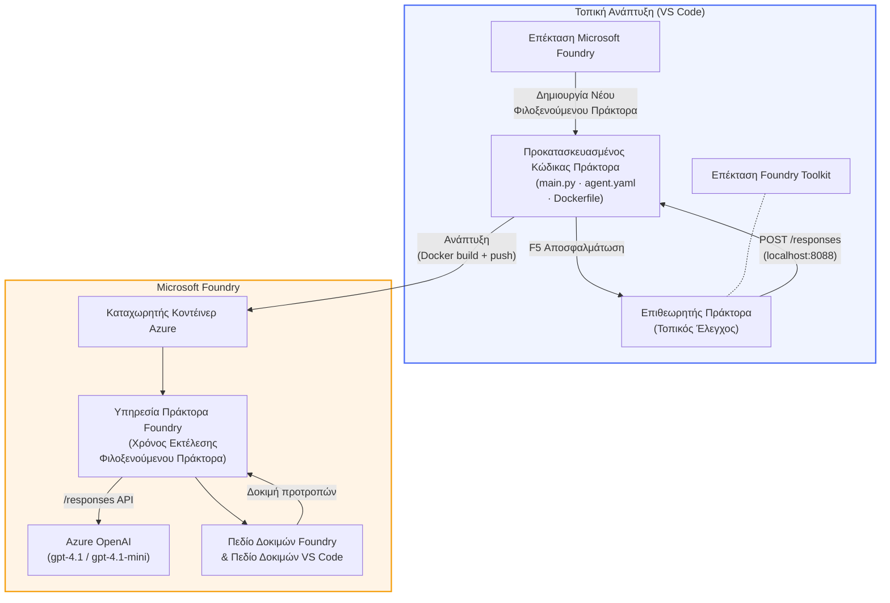

# Εργαστήριο Foundry Toolkit + Foundry Hosted Agents

[](https://www.python.org/)
[](https://github.com/microsoft/agents)
[](https://learn.microsoft.com/azure/ai-foundry/agents/concepts/hosted-agents/)
[](https://ai.azure.com/)
[](https://learn.microsoft.com/azure/ai-services/openai/)
[](https://learn.microsoft.com/cli/azure/install-azure-cli)
[](https://learn.microsoft.com/azure/developer/azure-developer-cli/install-azd)
[](https://www.docker.com/)
[](https://marketplace.visualstudio.com/items?itemName=ms-windows-ai-studio.windows-ai-studio)
[](LICENSE)

Δημιουργήστε, δοκιμάστε και αναπτύξτε πράκτορες AI στην **Microsoft Foundry Agent Service** ως **Hosted Agents** - ολοκληρωτικά από το VS Code χρησιμοποιώντας την **επέκταση Microsoft Foundry** και το **Foundry Toolkit**.

> **Οι Hosted Agents είναι αυτή τη στιγμή σε προεπισκόπηση.** Οι υποστηριζόμενες περιοχές είναι περιορισμένες - δείτε [διαθεσιμότητα περιοχής](https://learn.microsoft.com/azure/foundry/agents/concepts/hosted-agents#region-availability).

> Ο φάκελος `agent/` μέσα σε κάθε εργαστήριο δημιουργείται **αυτόματα** από την επέκταση Foundry - στη συνέχεια προσαρμόζετε τον κώδικα, δοκιμάζετε τοπικά και αναπτύσσετε.

<!-- CO-OP TRANSLATOR LANGUAGES TABLE START -->
[Arabic](../ar/README.md) | [Bengali](../bn/README.md) | [Bulgarian](../bg/README.md) | [Burmese (Myanmar)](../my/README.md) | [Chinese (Simplified)](../zh-CN/README.md) | [Chinese (Traditional, Hong Kong)](../zh-HK/README.md) | [Chinese (Traditional, Macau)](../zh-MO/README.md) | [Chinese (Traditional, Taiwan)](../zh-TW/README.md) | [Croatian](../hr/README.md) | [Czech](../cs/README.md) | [Danish](../da/README.md) | [Dutch](../nl/README.md) | [Estonian](../et/README.md) | [Finnish](../fi/README.md) | [French](../fr/README.md) | [German](../de/README.md) | [Greek](./README.md) | [Hebrew](../he/README.md) | [Hindi](../hi/README.md) | [Hungarian](../hu/README.md) | [Indonesian](../id/README.md) | [Italian](../it/README.md) | [Japanese](../ja/README.md) | [Kannada](../kn/README.md) | [Khmer](../km/README.md) | [Korean](../ko/README.md) | [Lithuanian](../lt/README.md) | [Malay](../ms/README.md) | [Malayalam](../ml/README.md) | [Marathi](../mr/README.md) | [Nepali](../ne/README.md) | [Nigerian Pidgin](../pcm/README.md) | [Norwegian](../no/README.md) | [Persian (Farsi)](../fa/README.md) | [Polish](../pl/README.md) | [Portuguese (Brazil)](../pt-BR/README.md) | [Portuguese (Portugal)](../pt-PT/README.md) | [Punjabi (Gurmukhi)](../pa/README.md) | [Romanian](../ro/README.md) | [Russian](../ru/README.md) | [Serbian (Cyrillic)](../sr/README.md) | [Slovak](../sk/README.md) | [Slovenian](../sl/README.md) | [Spanish](../es/README.md) | [Swahili](../sw/README.md) | [Swedish](../sv/README.md) | [Tagalog (Filipino)](../tl/README.md) | [Tamil](../ta/README.md) | [Telugu](../te/README.md) | [Thai](../th/README.md) | [Turkish](../tr/README.md) | [Ukrainian](../uk/README.md) | [Urdu](../ur/README.md) | [Vietnamese](../vi/README.md)

> **Προτιμάτε να Κλωνοποιήσετε τοπικά;**
>
> Αυτό το αποθετήριο περιλαμβάνει πάνω από 50 μεταφράσεις γλωσσών που αυξάνουν σημαντικά το μέγεθος λήψης. Για να κλωνοποιήσετε χωρίς τις μεταφράσεις, χρησιμοποιήστε sparse checkout:
>
> **Bash / macOS / Linux:**
> ```bash
> git clone --filter=blob:none --sparse https://github.com/microsoft-foundry/Foundry_Toolkit_for_VSCode_Lab.git
> cd Foundry_Toolkit_for_VSCode_Lab
> git sparse-checkout set --no-cone '/*' '!translations' '!translated_images'
> ```
>
> **CMD (Windows):**
> ```cmd
> git clone --filter=blob:none --sparse https://github.com/microsoft-foundry/Foundry_Toolkit_for_VSCode_Lab.git
> cd Foundry_Toolkit_for_VSCode_Lab
> git sparse-checkout set --no-cone "/*" "!translations" "!translated_images"
> ```
>
> Αυτό σας δίνει ό,τι χρειάζεστε για να ολοκληρώσετε το μάθημα με πολύ γρηγορότερη λήψη.
<!-- CO-OP TRANSLATOR LANGUAGES TABLE END -->

---

## Αρχιτεκτονική


**Ροή:** Η επέκταση Foundry δημιουργεί τον πράκτορα → προσαρμόζετε τον κώδικα & τις οδηγίες → δοκιμάζετε τοπικά με Agent Inspector → αναπτύσσετε στο Foundry (εικόνα Docker στέλνεται στο ACR) → επαληθεύετε στο Playground.

---

## Τι θα κατασκευάσετε

| Εργαστήριο | Περιγραφή | Κατάσταση |
|-----|-------------|--------|
| **Εργαστήριο 01 - Μοναδικός Πράκτορας** | Δημιουργήστε τον **"Explain Like I'm an Executive" πράκτορα**, δοκιμάστε το τοπικά και αναπτύξτε στο Foundry | ✅ Διαθέσιμο |
| **Εργαστήριο 02 - Ροή εργασίας πολλαπλών πρακτόρων** | Δημιουργήστε τον **"Resume → Job Fit Evaluator"** - 4 πράκτορες συνεργάζονται για να αξιολογήσουν το βιογραφικό και να δημιουργήσουν έναν χάρτη μάθησης | ✅ Διαθέσιμο |

---

## Γνωρίστε τον Executive Agent

Σε αυτό το εργαστήριο θα δημιουργήσετε τον **"Explain Like I'm an Executive" πράκτορα** - έναν πράκτορα AI που μεταφράζει τεχνική ορολογία σε ήρεμες, έτοιμες για συνεδριάσεις διοικητικού συμβουλίου, περιλήψεις. Γιατί ας είμαστε ειλικρινείς, κανείς στη διοίκηση δεν θέλει να ακούει για "εξάντληση του thread pool λόγω συγχρονισμένων κλήσεων που εισήχθησαν στην v3.2."

Έφτιαξα αυτόν τον πράκτορα μετά από πολλές περιπτώσεις όπου το τέλεια διαμορφωμένο post-mortem μου απαντούσαν: *"Λοιπόν... η ιστοσελίδα είναι κάτω ή όχι;"*

### Πώς λειτουργεί

Του δίνετε μια τεχνική ενημέρωση. Σας επιστρέφει μια εκτελεστική περίληψη - τρία σημεία κουκκίδας, χωρίς ορολογία, χωρίς stack traces, χωρίς υπαρξιακό άγχος. Απλώς **τι συνέβη**, **επιπτώσεις στην επιχείρηση**, και **επόμενο βήμα**.

### Δείτε το σε δράση

**Λέτε:**
> "Η καθυστέρηση του API αυξήθηκε λόγω εξάντλησης του thread pool που προκλήθηκε από συγχρονισμένες κλήσεις που εισήχθησαν στην v3.2."

**Ο πράκτορας απαντά:**

> **Εκτελεστική Περίληψη:**
> - **Τι συνέβη:** Μετά την τελευταία έκδοση, το σύστημα επιβραδύνθηκε.
> - **Επιπτώσεις στην επιχείρηση:** Κάποιοι χρήστες αντιμετώπισαν καθυστερήσεις κατά τη χρήση της υπηρεσίας.
> - **Επόμενο βήμα:** Η αλλαγή αποσύρθηκε και προετοιμάζεται διορθωτική ενέργεια πριν την επαναφορά.

### Γιατί αυτός ο πράκτορας;

Είναι ένας εξαιρετικά απλός, για έναν σκοπό πράκτορας - τέλειος για να μάθετε τη ροή εργασίας των hosted agents από την αρχή ως το τέλος χωρίς να μπλεχτείτε σε πολύπλοκα εργαλεία. Και ειλικρινά; Κάθε ομάδα μηχανικών θα μπορούσε να έχει έναν τέτοιο.

---

## Δομή εργαστηρίου

```
📂 Foundry_Toolkit_for_VSCode_Lab/
├── 📄 README.md                      ← You are here
├── 📂 ExecutiveAgent/                ← Standalone hosted agent project
│   ├── agent.yaml
│   ├── Dockerfile
│   ├── main.py
│   └── requirements.txt
└── 📂 workshop/
    ├── 📂 lab01-single-agent/        ← Full lab: docs + agent code
    │   ├── README.md                 ← Hands-on lab instructions
    │   ├── 📂 docs/                  ← Step-by-step tutorial modules
    │   │   ├── 00-prerequisites.md
    │   │   ├── 01-install-foundry-toolkit.md
    │   │   ├── 02-create-foundry-project.md
    │   │   ├── 03-create-hosted-agent.md
    │   │   ├── 04-configure-and-code.md
    │   │   ├── 05-test-locally.md
    │   │   ├── 06-deploy-to-foundry.md
    │   │   ├── 07-verify-in-playground.md
    │   │   └── 08-troubleshooting.md
    │   └── 📂 agent/                 ← Reference solution (auto-scaffolded by Foundry extension)
    │       ├── agent.yaml
    │       ├── Dockerfile
    │       ├── main.py
    │       └── requirements.txt
    └── 📂 lab02-multi-agent/         ← Resume → Job Fit Evaluator
        ├── README.md                 ← Hands-on lab instructions (end-to-end)
        ├── 📂 docs/                  ← Step-by-step tutorial modules
        │   ├── 00-prerequisites.md
        │   ├── 01-understand-multi-agent.md
        │   ├── 02-scaffold-multi-agent.md
        │   ├── 03-configure-agents.md
        │   ├── 04-orchestration-patterns.md
        │   ├── 05-test-locally.md
        │   ├── 06-deploy-to-foundry.md
        │   ├── 07-verify-in-playground.md
        │   └── 08-troubleshooting.md
        └── 📂 PersonalCareerCopilot/ ← Reference solution (multi-agent workflow)
            ├── agent.yaml
            ├── Dockerfile
            ├── main.py
            └── requirements.txt
```

> **Σημείωση:** Ο φάκελος `agent/` μέσα σε κάθε εργαστήριο είναι αυτό που η **επέκταση Microsoft Foundry** δημιουργεί όταν εκτελείτε `Microsoft Foundry: Create a New Hosted Agent` από την Command Palette. Τα αρχεία προσαρμόζονται έπειτα με τις οδηγίες, τα εργαλεία και τη ρύθμιση του πράκτορά σας. Το Εργαστήριο 01 σας καθοδηγεί να το ξαναδημιουργήσετε από την αρχή.

---

## Ξεκινώντας

### 1. Κλωνοποιήστε το αποθετήριο

```bash
git clone https://github.com/microsoft-foundry/Foundry_Toolkit_for_VSCode_Lab.git
cd Foundry_Toolkit_for_VSCode_Lab
```

### 2. Δημιουργήστε ένα Python virtual περιβάλλον

```bash
python -m venv venv
```

Ενεργοποιήστε το:

- **Windows (PowerShell):**
  ```powershell
  .\venv\Scripts\Activate.ps1
  ```
- **macOS / Linux:**
  ```bash
  source venv/bin/activate
  ```

### 3. Εγκαταστήστε τις εξαρτήσεις

```bash
pip install -r workshop/lab01-single-agent/agent/requirements.txt
```

### 4. Διαμορφώστε μεταβλητές περιβάλλοντος

Αντιγράψτε το αρχείο `.env` παραδείγματος μέσα στον φάκελο agent και συμπληρώστε τις τιμές σας:

```bash
cp workshop/lab01-single-agent/agent/.env.example workshop/lab01-single-agent/agent/.env
```

Επεξεργαστείτε το `workshop/lab01-single-agent/agent/.env`:

```env
AZURE_AI_PROJECT_ENDPOINT=https://<your-account>.services.ai.azure.com/api/projects/<your-project>
MODEL_DEPLOYMENT_NAME=<your-model-deployment-name>
```

### 5. Ακολουθήστε τα εργαστήρια

Κάθε εργαστήριο είναι αυτόνομο με τα δικά του modules. Ξεκινήστε με το **Εργαστήριο 01** για να μάθετε τα βασικά, μετά προχωρήστε στο **Εργαστήριο 02** για ροές πολλαπλών πρακτόρων.

#### Εργαστήριο 01 - Μοναδικός Πράκτορας ([πλήρεις οδηγίες](workshop/lab01-single-agent/README.md))

| # | Module | Σύνδεσμος |
|---|--------|------|
| 1 | Διαβάστε τις προαπαιτήσεις | [00-prerequisites.md](workshop/lab01-single-agent/docs/00-prerequisites.md) |
| 2 | Εγκαταστήστε το Foundry Toolkit & την επέκταση Foundry | [01-install-foundry-toolkit.md](workshop/lab01-single-agent/docs/01-install-foundry-toolkit.md) |
| 3 | Δημιουργήστε ένα έργο Foundry | [02-create-foundry-project.md](workshop/lab01-single-agent/docs/02-create-foundry-project.md) |
| 4 | Δημιουργήστε έναν hosted πράκτορα | [03-create-hosted-agent.md](workshop/lab01-single-agent/docs/03-create-hosted-agent.md) |
| 5 | Ρυθμίστε οδηγίες & περιβάλλον | [04-configure-and-code.md](workshop/lab01-single-agent/docs/04-configure-and-code.md) |
| 6 | Δοκιμάστε το τοπικά | [05-test-locally.md](workshop/lab01-single-agent/docs/05-test-locally.md) |
| 7 | Αναπτύξτε στο Foundry | [06-deploy-to-foundry.md](workshop/lab01-single-agent/docs/06-deploy-to-foundry.md) |
| 8 | Επαληθεύστε στο playground | [07-verify-in-playground.md](workshop/lab01-single-agent/docs/07-verify-in-playground.md) |
| 9 | Επίλυση προβλημάτων | [08-troubleshooting.md](workshop/lab01-single-agent/docs/08-troubleshooting.md) |

#### Εργαστήριο 02 - Ροή εργασίας πολλαπλών πρακτόρων ([πλήρεις οδηγίες](workshop/lab02-multi-agent/README.md))

| # | Module | Σύνδεσμος |
|---|--------|------|
| 1 | Προαπαιτήσεις (Εργαστήριο 02) | [00-prerequisites.md](workshop/lab02-multi-agent/docs/00-prerequisites.md) |
| 2 | Κατανοήστε την αρχιτεκτονική πολλαπλών πρακτόρων | [01-understand-multi-agent.md](workshop/lab02-multi-agent/docs/01-understand-multi-agent.md) |
| 3 | Δημιουργήστε το έργο πολλαπλών πρακτόρων | [02-scaffold-multi-agent.md](workshop/lab02-multi-agent/docs/02-scaffold-multi-agent.md) |
| 4 | Ρυθμίστε πράκτορες & περιβάλλον | [03-configure-agents.md](workshop/lab02-multi-agent/docs/03-configure-agents.md) |
| 5 | Πρότυπα ορχήστρωσης | [04-orchestration-patterns.md](workshop/lab02-multi-agent/docs/04-orchestration-patterns.md) |
| 6 | Δοκιμάστε το τοπικά (πολλαπλοί πράκτορες) | [05-test-locally.md](workshop/lab02-multi-agent/docs/05-test-locally.md) |
| 7 | Ανάπτυξη στο Foundry | [06-deploy-to-foundry.md](workshop/lab02-multi-agent/docs/06-deploy-to-foundry.md) |
| 8 | Επαλήθευση στο playground | [07-verify-in-playground.md](workshop/lab02-multi-agent/docs/07-verify-in-playground.md) |
| 9 | Αντιμετώπιση προβλημάτων (multi-agent) | [08-troubleshooting.md](workshop/lab02-multi-agent/docs/08-troubleshooting.md) |

---

## Διαχειριστής

<table>
<tr>
    <td align="center"><a href="https://github.com/ShivamGoyal03">
        <br />
        <sub><b>Shivam Goyal</b></sub>
    </a><br />
    </td>
</tr>
</table>

---

## Απαιτούμενες άδειες (γρήγορη αναφορά)

| Σενάριο | Απαιτούμενοι ρόλοι |
|----------|---------------|
| Δημιουργία νέου έργου Foundry | **Azure AI Owner** στον πόρο Foundry |
| Ανάπτυξη σε υπάρχον έργο (νέοι πόροι) | **Azure AI Owner** + **Contributor** στην συνδρομή |
| Ανάπτυξη σε πλήρως διαμορφωμένο έργο | **Reader** στον λογαριασμό + **Azure AI User** στο έργο |

> **Σημαντικό:** Οι ρόλοι Azure `Owner` και `Contributor` περιλαμβάνουν μόνο δικαιώματα *διαχείρισης*, όχι δικαιώματα *ανάπτυξης* (ενέργειες δεδομένων). Χρειάζεστε **Azure AI User** ή **Azure AI Owner** για να δημιουργήσετε και να αναπτύξετε agents.

---

## Αναφορές

- [Γρήγορη έναρξη: Αναπτύξτε τον πρώτο σας φιλοξενούμενο agent (VS Code)](https://learn.microsoft.com/azure/foundry/agents/quickstarts/quickstart-hosted-agent)
- [Τι είναι οι φιλοξενούμενοι agents;](https://learn.microsoft.com/azure/foundry/agents/concepts/hosted-agents)
- [Δημιουργία ροών εργασίας φιλοξενούμενων agents στο VS Code](https://learn.microsoft.com/azure/foundry/agents/how-to/vs-code-agents-workflow-pro-code)
- [Ανάπτυξη φιλοξενούμενου agent](https://learn.microsoft.com/azure/foundry/agents/how-to/deploy-hosted-agent)
- [RBAC για το Microsoft Foundry](https://learn.microsoft.com/azure/foundry/concepts/rbac-foundry)
- [Παράδειγμα Agent Architecture Review](https://github.com/Azure-Samples/agent-architecture-review-sample) - Πραγματικός φιλοξενούμενος agent με εργαλεία MCP, διαγράμματα Excalidraw και διπλή ανάπτυξη

---


## Άδεια

[MIT](../../LICENSE)

---

<!-- CO-OP TRANSLATOR DISCLAIMER START -->
**Αποποίηση ευθυνών**:  
Αυτό το έγγραφο έχει μεταφραστεί χρησιμοποιώντας την υπηρεσία μετάφρασης AI [Co-op Translator](https://github.com/Azure/co-op-translator). Παρόλο που επιδιώκουμε την ακρίβεια, παρακαλούμε να γνωρίζετε ότι οι αυτόματες μεταφράσεις μπορεί να περιέχουν λάθη ή ανακρίβειες. Το πρωτότυπο έγγραφο στη γλώσσα του θεωρείται η επίσημη πηγή. Για κρίσιμες πληροφορίες, συνιστάται επαγγελματική ανθρώπινη μετάφραση. Δεν φέρουμε ευθύνη για τυχόν παρεξηγήσεις ή λανθασμένες ερμηνείες που προκύπτουν από τη χρήση αυτής της μετάφρασης.
<!-- CO-OP TRANSLATOR DISCLAIMER END -->