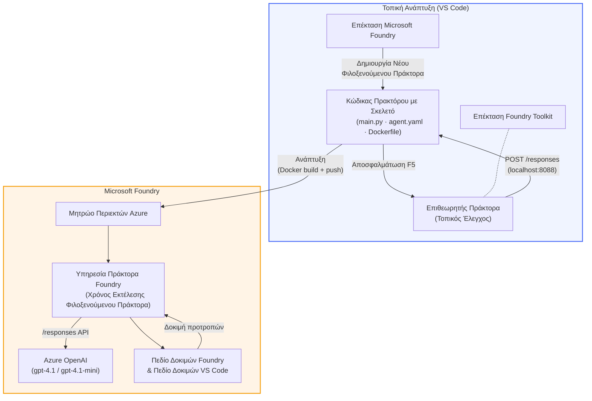

# Foundry Toolkit + Foundry Hosted Agents Workshop

[](https://www.python.org/)
[](https://github.com/microsoft/agents)
[](https://learn.microsoft.com/azure/ai-foundry/agents/concepts/hosted-agents/)
[](https://ai.azure.com/)
[](https://learn.microsoft.com/azure/ai-services/openai/)
[](https://learn.microsoft.com/cli/azure/install-azure-cli)
[](https://learn.microsoft.com/azure/developer/azure-developer-cli/install-azd)
[](https://www.docker.com/)
[](https://marketplace.visualstudio.com/items?itemName=ms-windows-ai-studio.windows-ai-studio)
[](LICENSE)

Δημιουργήστε, δοκιμάστε και αναπτύξτε πράκτορες AI στην **Υπηρεσία Πρακτόρων Microsoft Foundry** ως **Φιλοξενούμενοι Πράκτορες** - εξ ολοκλήρου από το VS Code χρησιμοποιώντας την **Επέκταση Microsoft Foundry** και το **Foundry Toolkit**.

> **Οι Φιλοξενούμενοι Πράκτορες βρίσκονται αυτή τη στιγμή σε προεπισκόπηση.** Οι υποστηριζόμενες περιοχές είναι περιορισμένες - δείτε την [διαθεσιμότητα περιοχών](https://learn.microsoft.com/azure/foundry/agents/concepts/hosted-agents#region-availability).

> Ο φάκελος `agent/` μέσα σε κάθε εργαστήριο **δημιουργείται αυτόματα** από την επέκταση Foundry - στη συνέχεια προσαρμόζετε τον κώδικα, δοκιμάζετε τοπικά και αναπτύσσετε.

### 🌐 Υποστήριξη Πολλών Γλωσσών

#### Υποστηρίζεται μέσω GitHub Action (Αυτοματοποιημένο & Πάντα Ενημερωμένο)

<!-- CO-OP TRANSLATOR LANGUAGES TABLE START -->
[Αραβικά](../ar/README.md) | [Μπενγκάλι](../bn/README.md) | [Βουλγαρικά](../bg/README.md) | [Βιρμανικά (Μυανμάρ)](../my/README.md) | [Κινέζικα (Απλοποιημένα)](../zh-CN/README.md) | [Κινέζικα (Παραδοσιακά, Χονγκ Κονγκ)](../zh-HK/README.md) | [Κινέζικα (Παραδοσιακά, Μακάο)](../zh-MO/README.md) | [Κινέζικα (Παραδοσιακά, Ταϊβάν)](../zh-TW/README.md) | [Κροατικά](../hr/README.md) | [Τσεχικά](../cs/README.md) | [Δανικά](../da/README.md) | [Ολλανδικά](../nl/README.md) | [Εσθονικά](../et/README.md) | [Φινλανδικά](../fi/README.md) | [Γαλλικά](../fr/README.md) | [Γερμανικά](../de/README.md) | [Ελληνικά](./README.md) | [Εβραϊκά](../he/README.md) | [Χίντι](../hi/README.md) | [Ουγγρικά](../hu/README.md) | [Ινδονησιακά](../id/README.md) | [Ιταλικά](../it/README.md) | [Ιαπωνικά](../ja/README.md) | [Κανάντα](../kn/README.md) | [Χμερ](../km/README.md) | [Κορεατικά](../ko/README.md) | [Λιθουανικά](../lt/README.md) | [Μαλαϊκά](../ms/README.md) | [Μαλαγιαλάμ](../ml/README.md) | [Μαραθί](../mr/README.md) | [Νεπαλικά](../ne/README.md) | [Νιγηριανό Πίντζιν](../pcm/README.md) | [Νορβηγικά](../no/README.md) | [Περσικά (Φαρσί)](../fa/README.md) | [Πολωνικά](../pl/README.md) | [Πορτογαλικά (Βραζιλίας)](../pt-BR/README.md) | [Πορτογαλικά (Πορτογαλίας)](../pt-PT/README.md) | [Πουντζάμπι (Γκουρμούχι)](../pa/README.md) | [Ρουμανικά](../ro/README.md) | [Ρωσικά](../ru/README.md) | [Σερβικά (Κυριλλικά)](../sr/README.md) | [Σλοβακικά](../sk/README.md) | [Σλοβενικά](../sl/README.md) | [Ισπανικά](../es/README.md) | [Σουαχίλι](../sw/README.md) | [Σουηδικά](../sv/README.md) | [Ταγκαλόγκ (Φιλιππινέζικα)](../tl/README.md) | [Ταμίλ](../ta/README.md) | [Τελούγκου](../te/README.md) | [Ταϊλανδικά](../th/README.md) | [Τουρκικά](../tr/README.md) | [Ουκρανικά](../uk/README.md) | [Ούρντου](../ur/README.md) | [Βιετναμέζικα](../vi/README.md)

> **Προτιμάτε να Κλωνοποιήσετε Τοπικά;**
>
> Αυτό το αποθετήριο περιλαμβάνει πάνω από 50 μεταφράσεις γλωσσών που αυξάνουν σημαντικά το μέγεθος λήψης. Για να κλωνοποιήσετε χωρίς τις μεταφράσεις, χρησιμοποιήστε το sparse checkout:
>
> **Bash / macOS / Linux:**
> ```bash
> git clone --filter=blob:none --sparse https://github.com/microsoft-foundry/Foundry_Toolkit_for_VSCode_Lab.git
> cd Foundry_Toolkit_for_VSCode_Lab
> git sparse-checkout set --no-cone '/*' '!translations' '!translated_images'
> ```
>
> **CMD (Windows):**
> ```cmd
> git clone --filter=blob:none --sparse https://github.com/microsoft-foundry/Foundry_Toolkit_for_VSCode_Lab.git
> cd Foundry_Toolkit_for_VSCode_Lab
> git sparse-checkout set --no-cone "/*" "!translations" "!translated_images"
> ```
>
> Αυτό σας δίνει όλα όσα χρειάζεστε για να ολοκληρώσετε το μάθημα με πολύ πιο γρήγορο κατέβασμα.
<!-- CO-OP TRANSLATOR LANGUAGES TABLE END -->

---

## Αρχιτεκτονική


**Ροή:** Η επέκταση Foundry δημιουργεί τη δομή του πράκτορα → προσαρμόζετε τον κώδικα & τις οδηγίες → δοκιμάζετε τοπικά με το Agent Inspector → αναπτύσσετε στο Foundry (εικόνα Docker προωθείται στο ACR) → επαληθεύετε στο Playground.

---

## Τι θα δημιουργήσετε

| Εργαστήριο | Περιγραφή | Κατάσταση |
|-----|-------------|--------|
| **Εργαστήριο 01 - Μονός Πράκτορας** | Δημιουργία του **"Εξήγησε το σαν να ήμουν Επιχειρηματίας" Πράκτορα**, δοκιμή τοπικά και ανάπτυξη στο Foundry | ✅ Διαθέσιμο |
| **Εργαστήριο 02 - Ροή Πολλαπλών Πρακτόρων** | Δημιουργία του **"Αξιολογητής Βιογραφικού → Κατάλληλης Θέσης"** - 4 πράκτορες συνεργάζονται για να βαθμολογήσουν την καταλληλότητα βιογραφικού και να δημιουργήσουν χάρτη μάθησης | ✅ Διαθέσιμο |

---

## Γνωρίστε τον Πράκτορα Επιχειρηματία

Σε αυτό το εργαστήριο θα δημιουργήσετε τον **"Εξήγησε το σαν να ήμουν Επιχειρηματίας" Πράκτορα** - έναν πράκτορα AI που παίρνει δύσκολη τεχνική ορολογία και τη μεταφράζει σε ήρεμες, έτοιμες για το διοικητικό συμβούλιο, περιλήψεις. Γιατί, ειλικρινά, κανείς στον C-suite δεν θέλει να ακούει για "εξαντλημένη δεξαμενή νημάτων που προκλήθηκε από σύγχρονες κλήσεις που εισήχθησαν στην έκδοση v3.2."

Έφτιαξα αυτόν τον πράκτορα μετά από πολλά περιστατικά όπου το τέλεια συντεταγμένο μεταθανάτιο μου έπαιρνε την απάντηση: *"Λοιπόν... η ιστοσελίδα είναι κάτω ή όχι;"*

### Πώς λειτουργεί

Του δίνετε μια τεχνική ενημέρωση. Σας επιστρέφει μια επιχειρηματική περίληψη - τρία σημεία, χωρίς ορολογίες, χωρίς ιχνηλάτηση στοίβας, χωρίς υπαρξιακό άγχος. Μόνο **τι συνέβη**, **επιχειρηματική επίδραση** και **επόμενο βήμα**.

### Δείτε το σε δράση

**Εσείς λέτε:**
> "Η καθυστέρηση του API αυξήθηκε λόγω εξάντλησης της δεξαμενής νημάτων που προκλήθηκε από σύγχρονες κλήσεις που εισήχθησαν στην έκδοση v3.2."

**Ο πράκτορας απαντά:**

> **Επιχειρηματική Περίληψη:**
> - **Τι συνέβη:** Μετά την τελευταία ενημέρωση, το σύστημα επιβράδυνε.
> - **Επιχειρηματική επίπτωση:** Ορισμένοι χρήστες αντιμετώπισαν καθυστερήσεις κατά τη χρήση της υπηρεσίας.
> - **Επόμενο βήμα:** Η αλλαγή επαναφέρθηκε και ετοιμάζεται διόρθωση πριν την επανανάπτυξη.

### Γιατί αυτός ο πράκτορας;

Είναι ένας απλός, μοναδικού σκοπού πράκτορας - τέλειος για να μάθετε τη διαδικασία των φιλοξενούμενων πρακτόρων από την αρχή μέχρι το τέλος χωρίς να μπλέκεστε σε περίπλοκες αλυσίδες εργαλείων. Και ειλικρινά; Κάθε ομάδα μηχανικών θα μπορούσε να χρησιμοποιήσει έναν τέτοιο.

---

## Δομή εργαστηρίου

```
📂 Foundry_Toolkit_for_VSCode_Lab/
├── 📄 README.md                      ← You are here
├── 📂 ExecutiveAgent/                ← Standalone hosted agent project
│   ├── agent.yaml
│   ├── Dockerfile
│   ├── main.py
│   └── requirements.txt
└── 📂 workshop/
    ├── 📂 lab01-single-agent/        ← Full lab: docs + agent code
    │   ├── README.md                 ← Hands-on lab instructions
    │   ├── 📂 docs/                  ← Step-by-step tutorial modules
    │   │   ├── 00-prerequisites.md
    │   │   ├── 01-install-foundry-toolkit.md
    │   │   ├── 02-create-foundry-project.md
    │   │   ├── 03-create-hosted-agent.md
    │   │   ├── 04-configure-and-code.md
    │   │   ├── 05-test-locally.md
    │   │   ├── 06-deploy-to-foundry.md
    │   │   ├── 07-verify-in-playground.md
    │   │   └── 08-troubleshooting.md
    │   └── 📂 agent/                 ← Reference solution (auto-scaffolded by Foundry extension)
    │       ├── agent.yaml
    │       ├── Dockerfile
    │       ├── main.py
    │       └── requirements.txt
    └── 📂 lab02-multi-agent/         ← Resume → Job Fit Evaluator
        ├── README.md                 ← Hands-on lab instructions (end-to-end)
        ├── 📂 docs/                  ← Step-by-step tutorial modules
        │   ├── 00-prerequisites.md
        │   ├── 01-understand-multi-agent.md
        │   ├── 02-scaffold-multi-agent.md
        │   ├── 03-configure-agents.md
        │   ├── 04-orchestration-patterns.md
        │   ├── 05-test-locally.md
        │   ├── 06-deploy-to-foundry.md
        │   ├── 07-verify-in-playground.md
        │   └── 08-troubleshooting.md
        └── 📂 PersonalCareerCopilot/ ← Reference solution (multi-agent workflow)
            ├── agent.yaml
            ├── Dockerfile
            ├── main.py
            └── requirements.txt
```

> **Σημείωση:** Ο φάκελος `agent/` μέσα σε κάθε εργαστήριο είναι αυτό που δημιουργεί η **επέκταση Microsoft Foundry** όταν εκτελείτε `Microsoft Foundry: Create a New Hosted Agent` από το Command Palette. Τα αρχεία προσαρμόζονται στη συνέχεια με τις οδηγίες, τα εργαλεία και τις ρυθμίσεις του πράκτορά σας. Το Εργαστήριο 01 σας καθοδηγεί να το δημιουργήσετε από την αρχή.

---

## Ξεκινώντας

### 1. Κλωνοποιήστε το αποθετήριο

```bash
git clone https://github.com/microsoft-foundry/Foundry_Toolkit_for_VSCode_Lab.git
cd Foundry_Toolkit_for_VSCode_Lab
```

### 2. Ρυθμίστε ένα εικονικό περιβάλλον Python

```bash
python -m venv venv
```

Ενεργοποιήστε το:

- **Windows (PowerShell):**
  ```powershell
  .\venv\Scripts\Activate.ps1
  ```
- **macOS / Linux:**
  ```bash
  source venv/bin/activate
  ```

### 3. Εγκαταστήστε τις εξαρτήσεις

```bash
pip install -r workshop/lab01-single-agent/agent/requirements.txt
```

### 4. Ρυθμίστε τις μεταβλητές περιβάλλοντος

Αντιγράψτε το παράδειγμα αρχείο `.env` μέσα στο φάκελο agent και συμπληρώστε τις τιμές σας:

```bash
cp workshop/lab01-single-agent/agent/.env.example workshop/lab01-single-agent/agent/.env
```

Επεξεργαστείτε το `workshop/lab01-single-agent/agent/.env`:

```env
AZURE_AI_PROJECT_ENDPOINT=https://<your-account>.services.ai.azure.com/api/projects/<your-project>
MODEL_DEPLOYMENT_NAME=<your-model-deployment-name>
```

### 5. Ακολουθήστε τα εργαστήρια

Κάθε εργαστήριο είναι αυτόνομο με τα δικά του modules. Ξεκινήστε με το **Εργαστήριο 01** για να μάθετε τα βασικά, έπειτα προχωρήστε στο **Εργαστήριο 02** για ροές πολλών πρακτόρων.

#### Εργαστήριο 01 - Μονός Πράκτορας ([πλήρεις οδηγίες](workshop/lab01-single-agent/README.md))

| # | Module | Link |
|---|--------|------|
| 1 | Διαβάστε τις προαπαιτήσεις | [00-prerequisites.md](workshop/lab01-single-agent/docs/00-prerequisites.md) |
| 2 | Εγκαταστήστε το Foundry Toolkit & την επέκταση Foundry | [01-install-foundry-toolkit.md](workshop/lab01-single-agent/docs/01-install-foundry-toolkit.md) |
| 3 | Δημιουργήστε ένα έργο Foundry | [02-create-foundry-project.md](workshop/lab01-single-agent/docs/02-create-foundry-project.md) |
| 4 | Δημιουργήστε έναν φιλοξενούμενο πράκτορα | [03-create-hosted-agent.md](workshop/lab01-single-agent/docs/03-create-hosted-agent.md) |
| 5 | Ρυθμίστε τις οδηγίες & το περιβάλλον | [04-configure-and-code.md](workshop/lab01-single-agent/docs/04-configure-and-code.md) |
| 6 | Δοκιμάστε το τοπικά | [05-test-locally.md](workshop/lab01-single-agent/docs/05-test-locally.md) |
| 7 | Αναπτύξτε στο Foundry | [06-deploy-to-foundry.md](workshop/lab01-single-agent/docs/06-deploy-to-foundry.md) |
| 8 | Επαληθεύστε στο playground | [07-verify-in-playground.md](workshop/lab01-single-agent/docs/07-verify-in-playground.md) |
| 9 | Αντιμετώπιση προβλημάτων | [08-troubleshooting.md](workshop/lab01-single-agent/docs/08-troubleshooting.md) |

#### Εργαστήριο 02 - Ροή Πολλαπλών Πρακτόρων ([πλήρεις οδηγίες](workshop/lab02-multi-agent/README.md))

| # | Module | Link |
|---|--------|------|
| 1 | Προαπαιτήσεις (Εργαστήριο 02) | [00-prerequisites.md](workshop/lab02-multi-agent/docs/00-prerequisites.md) |
| 2 | Κατανόηση αρχιτεκτονικής πολλών πρακτόρων | [01-understand-multi-agent.md](workshop/lab02-multi-agent/docs/01-understand-multi-agent.md) |
| 3 | Δημιουργία της δομής του έργου πολλών πρακτόρων | [02-scaffold-multi-agent.md](workshop/lab02-multi-agent/docs/02-scaffold-multi-agent.md) |
| 4 | Ρύθμιση πρακτόρων & περιβάλλοντος | [03-configure-agents.md](workshop/lab02-multi-agent/docs/03-configure-agents.md) |
| 5 | Πρότυπα ορχήστρωσης | [04-orchestration-patterns.md](workshop/lab02-multi-agent/docs/04-orchestration-patterns.md) |
| 6 | Δοκιμή τοπικά (πολλοί πράκτορες) | [05-test-locally.md](workshop/lab02-multi-agent/docs/05-test-locally.md) |
| 7 | Ανάπτυξη στο Foundry | [06-deploy-to-foundry.md](workshop/lab02-multi-agent/docs/06-deploy-to-foundry.md) |
| 8 | Επαλήθευση στο playground | [07-verify-in-playground.md](workshop/lab02-multi-agent/docs/07-verify-in-playground.md) |
| 9 | Επίλυση προβλημάτων (πολλαπλοί agents) | [08-troubleshooting.md](workshop/lab02-multi-agent/docs/08-troubleshooting.md) |

---

## Υπεύθυνος συντήρησης

<table>
<tr>
    <td align="center"><a href="https://github.com/ShivamGoyal03">
        <br />
        <sub><b>Shivam Goyal</b></sub>
    </a><br />
    </td>
</tr>
</table>

---

## Απαιτούμενες άδειες (γρήγορη αναφορά)

| Σενάριο | Απαιτούμενοι ρόλοι |
|----------|---------------|
| Δημιουργία νέου έργου Foundry | **Azure AI Owner** στην πηγή του Foundry |
| Ανάπτυξη σε υπάρχον έργο (νέοι πόροι) | **Azure AI Owner** + **Contributor** στη συνδρομή |
| Ανάπτυξη σε πλήρως ρυθμισμένο έργο | **Reader** στο λογαριασμό + **Azure AI User** στο έργο |

> **Σημαντικό:** Οι ρόλοι Azure `Owner` και `Contributor` περιλαμβάνουν μόνο δικαιώματα *διαχείρισης*, όχι δικαιώματα *ανάπτυξης* (ενέργειες δεδομένων). Χρειάζεστε **Azure AI User** ή **Azure AI Owner** για να κατασκευάσετε και να αναπτύξετε agents.

---

## Αναφορές

- [Γρήγορη εκκίνηση: Αναπτύξτε τον πρώτο σας φιλοξενούμενο agent (VS Code)](https://learn.microsoft.com/azure/foundry/agents/quickstarts/quickstart-hosted-agent)
- [Τι είναι οι φιλοξενούμενοι agents;](https://learn.microsoft.com/azure/foundry/agents/concepts/hosted-agents)
- [Δημιουργία ροών εργασίας φιλοξενούμενων agents στο VS Code](https://learn.microsoft.com/azure/foundry/agents/how-to/vs-code-agents-workflow-pro-code)
- [Ανάπτυξη φιλοξενούμενου agent](https://learn.microsoft.com/azure/foundry/agents/how-to/deploy-hosted-agent)
- [RBAC για το Microsoft Foundry](https://learn.microsoft.com/azure/foundry/concepts/rbac-foundry)
- [Δείγμα Agent Ανασκόπησης Αρχιτεκτονικής](https://github.com/Azure-Samples/agent-architecture-review-sample) - Ρεαλιστικός φιλοξενούμενος agent με εργαλεία MCP, διαγράμματα Excalidraw, και διπλή ανάπτυξη

---


## Άδεια

[MIT](../../LICENSE)

---

<!-- CO-OP TRANSLATOR DISCLAIMER START -->
**Αποποίηση Ευθυνών**:  
Αυτό το έγγραφο έχει μεταφραστεί χρησιμοποιώντας την υπηρεσία μηχανικής μετάφρασης AI [Co-op Translator](https://github.com/Azure/co-op-translator). Παρόλο που επιδιώκουμε την ακρίβεια, παρακαλούμε να έχετε υπόψη σας ότι οι αυτοματοποιημένες μεταφράσεις ενδέχεται να περιέχουν σφάλματα ή ανακρίβειες. Το πρωτότυπο έγγραφο στη μητρική του γλώσσα πρέπει να θεωρείται η αυθεντική πηγή. Για κρίσιμες πληροφορίες, συνιστάται η επαγγελματική ανθρώπινη μετάφραση. Δεν φέρουμε ευθύνη για τυχόν παρεξηγήσεις ή λανθασμένες ερμηνείες που προκύπτουν από τη χρήση αυτής της μετάφρασης.
<!-- CO-OP TRANSLATOR DISCLAIMER END -->