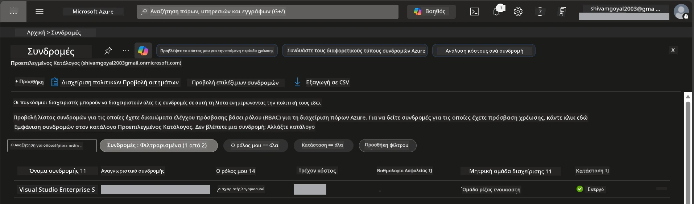

# Module 0 - Προϋποθέσεις

Πριν ξεκινήσετε το εργαστήριο, βεβαιωθείτε ότι έχετε τα ακόλουθα εργαλεία, πρόσβαση και περιβάλλον έτοιμα. Ακολουθήστε κάθε βήμα παρακάτω - μην προχωράτε παρακάτω παρακάμπτοντας.

---

## 1. Λογαριασμός & συνδρομή Azure

### 1.1 Δημιουργήστε ή επαληθεύστε τη συνδρομή Azure σας

1. Ανοίξτε ένα πρόγραμμα περιήγησης και μεταβείτε στη διεύθυνση [https://azure.microsoft.com/free/](https://azure.microsoft.com/free/).
2. Εάν δεν έχετε λογαριασμό Azure, κάντε κλικ στο **Ξεκινήστε δωρεάν** και ακολουθήστε τη διαδικασία εγγραφής. Θα χρειαστείτε έναν λογαριασμό Microsoft (ή να δημιουργήσετε έναν) και μια πιστωτική κάρτα για επαλήθευση ταυτότητας.
3. Εάν έχετε ήδη λογαριασμό, συνδεθείτε στο [https://portal.azure.com](https://portal.azure.com).
4. Στο Portal, κάντε κλικ στο παράθυρο **Συνδρομές** στην αριστερή πλοήγηση (ή αναζητήστε "Συνδρομές" στη γραμμή αναζήτησης στο πάνω μέρος).
5. Επιβεβαιώστε ότι βλέπετε τουλάχιστον μία **Ενεργή** συνδρομή. Σημειώστε το **Subscription ID** – θα το χρειαστείτε αργότερα.



### 1.2 Κατανοήστε τους απαιτούμενους ρόλους RBAC

Η ανάπτυξη [Hosted Agent](https://learn.microsoft.com/azure/foundry/agents/concepts/hosted-agents) απαιτεί δικαιώματα **ενέργειας δεδομένων** που οι τυπικοί ρόλοι Azure `Owner` και `Contributor` **δεν** περιλαμβάνουν. Θα χρειαστείτε έναν από αυτούς τους [συνδυασμούς ρόλων](https://learn.microsoft.com/azure/foundry/concepts/rbac-foundry#built-in-roles):

| Σενάριο | Απαιτούμενοι ρόλοι | Πού να τους αναθέσετε |
|----------|--------------------|-----------------------|
| Δημιουργία νέου έργου Foundry | **Azure AI Owner** στο πόρο Foundry | Πόρος Foundry στο Azure Portal |
| Ανάπτυξη σε υπάρχον έργο (νέοι πόροι) | **Azure AI Owner** + **Contributor** στη συνδρομή | Συνδρομή + Πόρος Foundry |
| Ανάπτυξη σε πλήρως διαμορφωμένο έργο | **Reader** στον λογαριασμό + **Azure AI User** στο έργο | Λογαριασμός + Έργο στο Azure Portal |

> **Σημείο κλειδί:** Οι ρόλοι Azure `Owner` και `Contributor` καλύπτουν μόνο δικαιώματα *διαχείρισης* (λειτουργίες ARM). Χρειάζεστε τον ρόλο [**Azure AI User**](https://learn.microsoft.com/azure/foundry/concepts/rbac-foundry#built-in-roles) (ή υψηλότερο) για *ενέργειες δεδομένων* όπως το `agents/write` που απαιτείται για τη δημιουργία και ανάπτυξη πρακτόρων. Θα αναθέσετε αυτούς τους ρόλους στο [Module 2](02-create-foundry-project.md).

---

## 2. Εγκατάσταση τοπικών εργαλείων

Εγκαταστήστε κάθε εργαλείο παρακάτω. Μετά την εγκατάσταση, επαληθεύστε ότι λειτουργεί εκτελώντας την εντολή ελέγχου.

### 2.1 Visual Studio Code

1. Μεταβείτε στη διεύθυνση [https://code.visualstudio.com/](https://code.visualstudio.com/).
2. Κατεβάστε τον εγκαταστάτη για το λειτουργικό σας σύστημα (Windows/macOS/Linux).
3. Εκτελέστε τον εγκαταστάτη με τις προεπιλεγμένες ρυθμίσεις.
4. Ανοίξτε το VS Code για να επιβεβαιώσετε ότι ξεκινάει.

### 2.2 Python 3.10+

1. Μεταβείτε στη διεύθυνση [https://www.python.org/downloads/](https://www.python.org/downloads/).
2. Κατεβάστε την Python 3.10 ή νεότερη (συνιστάται 3.12+).
3. **Windows:** Κατά την εγκατάσταση, επιλέξτε **"Add Python to PATH"** στην πρώτη οθόνη.
4. Ανοίξτε τερματικό και επαληθεύστε:

   ```powershell
   python --version
   ```
  
   Αναμενόμενη έξοδος: `Python 3.10.x` ή υψηλότερη.

### 2.3 Azure CLI

1. Μεταβείτε στη διεύθυνση [https://learn.microsoft.com/cli/azure/install-azure-cli](https://learn.microsoft.com/cli/azure/install-azure-cli).
2. Ακολουθήστε τις οδηγίες εγκατάστασης για το λειτουργικό σας σύστημα.
3. Επαληθεύστε:

   ```powershell
   az --version
   ```
  
   Αναμενόμενο: `azure-cli 2.80.0` ή υψηλότερο.

4. Συνδεθείτε:

   ```powershell
   az login
   ```
  
### 2.4 Azure Developer CLI (azd)

1. Μεταβείτε στη διεύθυνση [https://learn.microsoft.com/azure/developer/azure-developer-cli/install-azd](https://learn.microsoft.com/azure/developer/azure-developer-cli/install-azd).
2. Ακολουθήστε τις οδηγίες εγκατάστασης για το λειτουργικό σας σύστημα. Στα Windows:

   ```powershell
   winget install microsoft.azd
   ```
  
3. Επαληθεύστε:

   ```powershell
   azd version
   ```
  
   Αναμενόμενο: `azd version 1.x.x` ή υψηλότερο.

4. Συνδεθείτε:

   ```powershell
   azd auth login
   ```
  
### 2.5 Docker Desktop (προαιρετικό)

Το Docker χρειάζεται μόνο αν θέλετε να δημιουργήσετε και να δοκιμάσετε την εικόνα κοντέινερ τοπικά πριν την ανάπτυξη. Η επέκταση Foundry χειρίζεται αυτόματα τις δημιουργίες κοντέινερ κατά την ανάπτυξη.

1. Μεταβείτε στη διεύθυνση [https://docs.docker.com/get-docker/](https://docs.docker.com/get-docker/).
2. Κατεβάστε και εγκαταστήστε το Docker Desktop για το λειτουργικό σας σύστημα.
3. **Windows:** Βεβαιωθείτε ότι έχει επιλεγεί η υποδομή WSL 2 κατά την εγκατάσταση.
4. Εκκινήστε το Docker Desktop και περιμένετε το εικονίδιο στη γραμμή συστήματος να εμφανίσει **"Docker Desktop is running"**.
5. Ανοίξτε τερματικό και επαληθεύστε:

   ```powershell
   docker info
   ```
  
   Αυτό θα εμφανίσει πληροφορίες συστήματος Docker χωρίς σφάλματα. Εάν δείτε το μήνυμα `Cannot connect to the Docker daemon`, περιμένετε μερικά δευτερόλεπτα ακόμα για να ξεκινήσει πλήρως το Docker.

---

## 3. Εγκαταστήστε επεκτάσεις VS Code

Χρειάζεστε τρεις επεκτάσεις. Εγκαταστήστε τις **πριν** ξεκινήσει το εργαστήριο.

### 3.1 Microsoft Foundry για VS Code

1. Ανοίξτε το VS Code.
2. Πατήστε `Ctrl+Shift+X` για να ανοίξετε τον πίνακα Επεκτάσεων.
3. Στο πλαίσιο αναζήτησης, πληκτρολογήστε **"Microsoft Foundry"**.
4. Βρείτε το **Microsoft Foundry for Visual Studio Code** (εκδότης: Microsoft, ID: `TeamsDevApp.vscode-ai-foundry`).
5. Πατήστε **Εγκατάσταση**.
6. Μετά την εγκατάσταση, θα πρέπει να δείτε το εικονίδιο **Microsoft Foundry** να εμφανίζεται στη Γραμμή Δραστηριοτήτων (αριστερή πλαϊνή στήλη).

### 3.2 Foundry Toolkit

1. Στον πίνακα Επεκτάσεων (`Ctrl+Shift+X`), αναζητήστε **"Foundry Toolkit"**.
2. Βρείτε το **Foundry Toolkit** (εκδότης: Microsoft, ID: `ms-windows-ai-studio.windows-ai-studio`).
3. Πατήστε **Εγκατάσταση**.
4. Το εικονίδιο **Foundry Toolkit** θα πρέπει να εμφανιστεί στη Γραμμή Δραστηριοτήτων.

### 3.3 Python

1. Στον πίνακα Επεκτάσεων, αναζητήστε **"Python"**.
2. Βρείτε το **Python** (εκδότης: Microsoft, ID: `ms-python.python`).
3. Πατήστε **Εγκατάσταση**.

---

## 4. Συνδεθείτε στο Azure από VS Code

Το [Microsoft Agent Framework](https://learn.microsoft.com/agent-framework/overview/) χρησιμοποιεί [`DefaultAzureCredential`](https://learn.microsoft.com/azure/developer/python/sdk/authentication/credential-chains#defaultazurecredential-overview) για την αυθεντικοποίηση. Πρέπει να είστε συνδεδεμένοι στο Azure στο VS Code.

### 4.1 Σύνδεση μέσω VS Code

1. Κοιτάξτε στην κάτω αριστερή γωνία του VS Code και πατήστε το εικονίδιο **Λογαριασμοί** (φιγούρα ενός ατόμου).
2. Πατήστε **Σύνδεση για χρήση Microsoft Foundry** (ή **Σύνδεση με Azure**).
3. Θα ανοίξει ένα παράθυρο περιηγητή – συνδεθείτε με τον λογαριασμό Azure που έχει πρόσβαση στη συνδρομή σας.
4. Επιστρέψτε στο VS Code. Θα πρέπει να βλέπετε το όνομα του λογαριασμού σας κάτω αριστερά.

### 4.2 (Προαιρετικό) Σύνδεση μέσω Azure CLI

Εάν έχετε εγκαταστήσει το Azure CLI και προτιμάτε σύνδεση μέσω CLI:

```powershell
az login
```
  
Αυτό ανοίγει έναν περιηγητή για σύνδεση. Μετά τη σύνδεση, ορίστε τη σωστή συνδρομή:

```powershell
az account set --subscription "<your-subscription-id>"
```
  
Επαληθεύστε:

```powershell
az account show --query "{name:name, id:id, state:state}" --output table
```
  
Θα πρέπει να δείτε το όνομα συνδρομής, το ID και την κατάσταση = `Enabled`.

### 4.3 (Εναλλακτικά) Αυθεντικοποίηση με service principal

Για CI/CD ή κοινόχρηστα περιβάλλοντα, ορίστε αυτές τις μεταβλητές περιβάλλοντος αντί για άλλα μέσα:

```powershell
$env:AZURE_TENANT_ID = "<your-tenant-id>"
$env:AZURE_CLIENT_ID = "<your-client-id>"
$env:AZURE_CLIENT_SECRET = "<your-client-secret>"
```
  
---

## 5. Περιορισμοί προεπισκόπησης

Πριν προχωρήσετε, λάβετε υπόψη τους τρέχοντες περιορισμούς:

- Οι [**Hosted Agents**](https://learn.microsoft.com/azure/foundry/agents/concepts/hosted-agents) βρίσκονται αυτήν τη στιγμή σε **δημόσια προεπισκόπηση** – δεν συνιστώνται για παραγωγικά φορτία.
- Οι υποστηριζόμενες περιοχές είναι **περιορισμένες** – ελέγξτε τη [διαθεσιμότητα περιοχών](https://learn.microsoft.com/azure/foundry/agents/concepts/hosted-agents#region-availability) πριν δημιουργήσετε πόρους. Εάν επιλέξετε μη υποστηριζόμενη περιοχή, η ανάπτυξη θα αποτύχει.
- Το πακέτο `azure-ai-agentserver-agentframework` είναι σε προ-έκδοση (`1.0.0b16`) – οι API ενδέχεται να αλλάξουν.
- Όρια κλιμάκωσης: οι hosted agents υποστηρίζουν 0-5 αντίγραφα (συμπεριλαμβανομένου του scale-to-zero).

---

## 6. Λίστα προετοιμασίας

Εκτελέστε κάθε στοιχείο παρακάτω. Εάν κάποιο βήμα αποτύχει, επιστρέψτε και διορθώστε το πριν συνεχίσετε.

- [ ] Το VS Code ανοίγει χωρίς σφάλματα
- [ ] Η Python 3.10+ βρίσκεται στο PATH σας (`python --version` εμφανίζει `3.10.x` ή υψηλότερο)
- [ ] Το Azure CLI είναι εγκατεστημένο (`az --version` εμφανίζει `2.80.0` ή υψηλότερο)
- [ ] Το Azure Developer CLI είναι εγκατεστημένο (`azd version` εμφανίζει πληροφορίες έκδοσης)
- [ ] Η επέκταση Microsoft Foundry είναι εγκατεστημένη (το εικονίδιο φαίνεται στη Γραμμή Δραστηριοτήτων)
- [ ] Η επέκταση Foundry Toolkit είναι εγκατεστημένη (το εικονίδιο φαίνεται στη Γραμμή Δραστηριοτήτων)
- [ ] Η επέκταση Python είναι εγκατεστημένη
- [ ] Έχετε συνδεθεί στο Azure στο VS Code (ελέγξτε το εικονίδιο Λογαριασμών, κάτω αριστερά)
- [ ] Η εντολή `az account show` επιστρέφει τη συνδρομή σας
- [ ] (Προαιρετικό) Το Docker Desktop λειτουργεί (`docker info` επιστρέφει πληροφορίες συστήματος χωρίς σφάλματα)

### Σημείο ελέγχου

Ανοίξτε τη Γραμμή Δραστηριοτήτων του VS Code και επιβεβαιώστε ότι βλέπετε τόσο τις προβολές πλαϊνής γραμμής **Foundry Toolkit** όσο και **Microsoft Foundry**. Κάντε κλικ σε κάθε μία για να επαληθεύσετε ότι φορτώνουν χωρίς σφάλματα.

---

**Επόμενο:** [01 - Εγκατάσταση Foundry Toolkit & επέκτασης Foundry →](01-install-foundry-toolkit.md)

---

<!-- CO-OP TRANSLATOR DISCLAIMER START -->
**Αποποίηση ευθύνης**:
Αυτό το έγγραφο έχει μεταφραστεί χρησιμοποιώντας την υπηρεσία αυτόματης μετάφρασης [Co-op Translator](https://github.com/Azure/co-op-translator). Παρόλο που προσπαθούμε για ακρίβεια, παρακαλούμε να γνωρίζετε ότι οι αυτοματοποιημένες μεταφράσεις μπορεί να περιέχουν σφάλματα ή ανακρίβειες. Το αρχικό έγγραφο στη γλώσσα του πρέπει να θεωρείται η αυθεντική πηγή. Για κρίσιμες πληροφορίες, συνιστάται επαγγελματική ανθρώπινη μετάφραση. Δεν φέρουμε καμία ευθύνη για τυχόν παρεξηγήσεις ή λανθασμένες ερμηνείες που προκύπτουν από τη χρήση αυτής της μετάφρασης.
<!-- CO-OP TRANSLATOR DISCLAIMER END -->