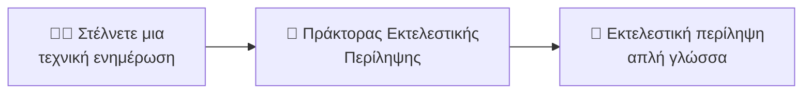

# Ενότητα 0 - Εισαγωγή

⏱️ ~10 λεπτά

> [!WARNING]
> **Προεπισκόπηση & Περιορισμοί:** Οι [Φιλοξενούμενοι Πράκτορες](https://learn.microsoft.com/azure/foundry/agents/concepts/hosted-agents) βρίσκονται επί του παρόντος σε **δημόσια προεπισκόπηση** - δεν συνιστώνται για παραγωγικά φορτία εργασίας. Να είστε ενήμεροι για τα ακόλουθα:
> - **Οι υποστηριζόμενες περιοχές είναι περιορισμένες** - ελέγξτε [διαθεσιμότητα περιοχής](https://learn.microsoft.com/azure/foundry/agents/concepts/hosted-agents#region-availability) πριν από τη δημιουργία πόρων. Αν επιλέξετε μη υποστηριζόμενη περιοχή, η ανάπτυξη θα αποτύχει.
> - Το πακέτο `azure-ai-agentserver-agentframework` είναι σε προ-έκδοση - τα API μπορεί να αλλάξουν ανάμεσα σε εκδόσεις.
> - Όρια κλιμάκωσης: οι φιλοξενούμενοι πράκτορες υποστηρίζουν 0–5 αντίγραφα (συμπεριλαμβανομένου του scale-to-zero).
> - Ορισμένα χαρακτηριστικά που εμφανίζονται σε αυτό το εργαστήριο μπορεί να αλλάξουν καθώς η υπηρεσία προχωρά προς GA.

## Τι θα δημιουργήσετε

Σε αυτό το εργαστήριο, θα δημιουργήσετε έναν πράκτορα **"Εξήγησέ το σαν να είμαι Διευθυντικό Στέλεχος"** - έναν φιλοξενούμενο AI πράκτορα που λαμβάνει σύνθετες τεχνικές ενημερώσεις και τις αναδιατυπώνει ως εκτελεστικές περιλήψεις σε απλή γλώσσα.

```mermaid
flowchart LR
    A["🧑‍💻 Στέλνετε μια\nτεχνική ενημέρωση"] --> B["🤖 Πράκτορας Εκτελεστικής\nΠερίληψης"]
    B --> C["📝 Εκτελεστική περίληψη\nαπλή γλώσσα"]
```

**Ο πράκτορας χρησιμοποιεί:**
- **Microsoft Agent Framework** - για τη λογική και τη δομή του πράκτορα
- **Foundry Toolkit για VS Code** - για σκελετοποίηση, τοπικό έλεγχο και ανάπτυξη
- **Ένα μοντέλο AI** (π.χ., `gpt-4.1-mini/gpt-5-mini`) - για τη δημιουργία των περιλήψεων

Μέχρι το τέλος αυτού του εργαστηρίου, θα έχετε έναν λειτουργικό πράκτορα που μπορείτε να δοκιμάσετε τοπικά μέσω του Agent Inspector, και προαιρετικά να αναπτύξετε στο cloud.

---

## Τι είναι οι φιλοξενούμενοι πράκτορες;

Ένας **φιλοξενούμενος πράκτορας** είναι ένας πράκτορας AI που λειτουργεί ως διαχειριζόμενη υπηρεσία στο Microsoft Foundry. Αντί να διαχειρίζεστε τη δική σας υποδομή, πακετάρετε τον κώδικα του πράκτορα σας σε ένα κοντέινερ και το Foundry αναλαμβάνει το κλιμάκωμα, τη φιλοξενία και την έκθεσή του μέσω ενός τυποποιημένου HTTP endpoint.

| Έννοια | Τι σημαίνει |
|---------|--------------|
| **Πράκτορας** | Ο κώδικας Python σας που λαμβάνει ένα μήνυμα χρήστη, καλεί ένα μοντέλο AI και επιστρέφει μια δομημένη απάντηση |
| **Φιλοξενούμενος** | Το Foundry τρέχει το κοντέινερ για εσάς - χωρίς VM, χωρίς Kubernetes, χωρίς υποδομή προς διαχείριση |
| **Πρωτόκολλο απαντήσεων** | Ένα τυποποιημένο HTTP API (`POST /responses`) που οποιοσδήποτε πελάτης μπορεί να καλέσει για αλληλεπίδραση με τον πράκτορα |
| **Agent Inspector** | Μια τοπική διεπαφή δοκιμής (ενσωματωμένη στο Foundry Toolkit) που σας επιτρέπει να συνομιλείτε με τον πράκτορα πριν την ανάπτυξη |

Σε αυτό το εργαστήριο, θα προχωρήσετε από το μηδέν σε έναν πλήρως φιλοξενούμενο πράκτορα - ή θα σταματήσετε στον τοπικό έλεγχο αν προτιμάτε.

---

## Επιλέξτε το μονοπάτι σας

> ⚠️ **Επιλέξτε ένα μονοπάτι πριν συνεχίσετε.** Η επιλογή σας καθορίζει τα εργαλεία προς εγκατάσταση και ποιες ενότητες ισχύουν. Μπορείτε να αλλάξετε από Μονοπάτι Β → Μονοπάτι Α αργότερα αν αποκτήσετε συνδρομή.

<strong>🅰️ Μονοπάτι Α - Azure cloud (απαιτεί συνδρομή Azure)</strong>

| | Λεπτομέρειες |
|---|---|
| **Για ποιον είναι;** | Έχετε ενεργή συνδρομή Azure και μπορείτε να δημιουργήσετε πόρους Foundry |
| **Μοντέλο** | Azure OpenAI μέσω Foundry (π.χ., `gpt-4.1-mini/gpt-5-mini`) |
| **Ενότητες που καλύπτονται** | Όλες οι ενότητες (00–07) |
| **Ανάπτυξη στο cloud;** | ✅ Ναι - πλήρης ανάπτυξη από άκρο σε άκρο |

<strong>🅱️ Μονοπάτι Β - Τοπικά / δωρεάν βαθμίδα (δεν απαιτείται συνδρομή Azure)</strong>

| | Λεπτομέρειες |
|---|---|
| **Για ποιον είναι;** | MVPs, φοιτητές ή ο καθένας χωρίς πρόσβαση στο Azure |
| **Μοντέλο** | **Foundry Local** (δωρεάν, τρέχει στον υπολογιστή σας) |
| **Ενότητες που καλύπτονται** | Ενότητες 00–04 (παραλείψτε ανάπτυξη & επιβεβαίωση cloud) |
| **Ανάπτυξη στο cloud;** | ❌ Όχι - μόνο τοπικός έλεγχος μέσω Agent Inspector |

---

## Όλα τα μονοπάτια: Απαραίτητα εργαλεία

Εγκαταστήστε κάθε εργαλείο παρακάτω. Μετά την εγκατάσταση, επαληθεύστε ότι λειτουργεί τρέχοντας την εντολή ελέγχου.

| # | Εργαλείο | Έκδοση | Εγκατάσταση | Επαλήθευση (Αναμενόμενο Αποτέλεσμα) |
|---|------|---------|---------|---------------------------|
| 1 | **Visual Studio Code** | Τελευταία | [code.visualstudio.com](https://code.visualstudio.com/) | Ανοίγει χωρίς λάθη |
| 2 | **Python** | 3.12 ή νεότερη | [python.org/downloads](https://www.python.org/downloads/) | `python --version` $\rightarrow$ `Python 3.12.x` |
| 3 | **Foundry Toolkit για VS Code** | Τελευταία | Αναγνωριστικό επέκτασης: `ms-windows-ai-studio.windows-ai-studio` | Εικονίδιο Foundry στη Γραμμή Δραστηριότητας |
| 4 | **Επέκταση Python για VS Code** | Τελευταία | Αναγνωριστικό επέκτασης: `ms-python.python` | Εγκατεστημένο στον πίνακα Επεκτάσεων |

> [!TIP]
> **Συμβουλές για εγκατάσταση:**
> - **Διαδρομή Python (Windows):** Πάντα ελέγξτε **"Add Python to PATH"** στην πρώτη οθόνη του εγκαταστάτη Python. Χωρίς αυτό, το `python` δεν θα αναγνωρίζεται στο τερματικό σας.
> - **Πολλαπλές εκδόσεις Python:** Αν έχετε εγκατεστημένα τόσο Python 3.10 όσο και 3.12, χρησιμοποιήστε `python3.12 -m venv .venv` για να διασφαλίσετε ότι θα χρησιμοποιηθεί η σωστή έκδοση για το εικονικό περιβάλλον σας.
> - **Docker WSL 2 (Windows):** Κατά την εγκατάσταση του Docker Desktop, βεβαιωθείτε ότι έχει επιλεγεί το **WSL 2 backend**. Το Docker με Hyper-V είναι πιο αργό και μπορεί να προκαλέσει προβλήματα με τη δημιουργία κοντέινερ Foundry.
> - **Το Docker δεν ξεκινάει;** Περιμένετε 30–60 δευτερόλεπτα μετά το άνοιγμα του Docker Desktop. Εκτελέστε `docker info` - αν δείτε "Cannot connect to the Docker daemon," το Docker εξακολουθεί να ξεκινάει.
> - **Οι επεκτάσεις VS Code δεν φορτώνονται;** Μετά την εγκατάσταση επεκτάσεων, επανεκκινήστε το παράθυρο: `Ctrl+Shift+P` → `Developer: Reload Window`.

> **Χρήστες Windows:** Επιβεβαιώστε την επιλογή **"Add Python to PATH"** κατά την εγκατάσταση της Python.

**Επόμενο:** [01 - Setup →](01-setup.md)

---

<!-- CO-OP TRANSLATOR DISCLAIMER START -->
**Αποποίηση ευθυνών**:
Αυτό το έγγραφο έχει μεταφραστεί χρησιμοποιώντας την υπηρεσία μετάφρασης με τεχνητή νοημοσύνη [Co-op Translator](https://github.com/Azure/co-op-translator). Ενώ επιδιώκουμε την ακρίβεια, παρακαλούμε να έχετε υπόψη ότι οι αυτοματοποιημένες μεταφράσεις ενδέχεται να περιέχουν λάθη ή ανακρίβειες. Το πρωτότυπο έγγραφο στη μητρική του γλώσσα πρέπει να θεωρείται η αυθεντική πηγή. Για κρίσιμες πληροφορίες, συνιστάται επαγγελματική ανθρώπινη μετάφραση. Δεν φέρουμε ευθύνη για τυχόν παρεξηγήσεις ή λανθασμένες ερμηνείες που προκύπτουν από τη χρήση αυτής της μετάφρασης.
<!-- CO-OP TRANSLATOR DISCLAIMER END -->