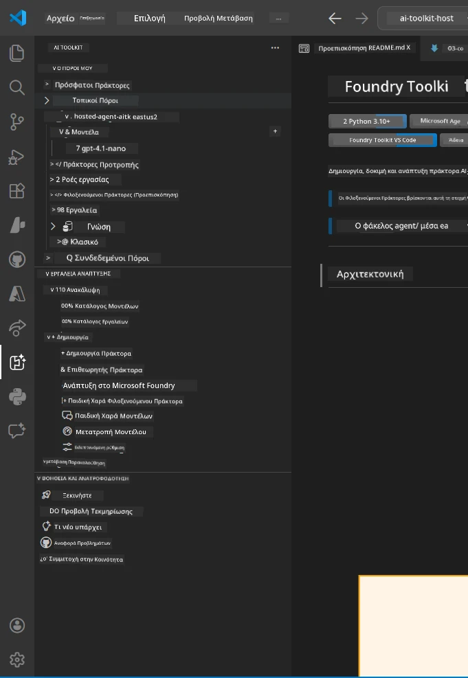
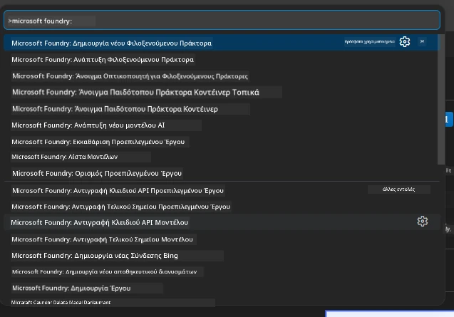

# Module 1 - Εγκατάσταση Foundry Toolkit & Foundry Extension

Αυτό το module σας καθοδηγεί στην εγκατάσταση και επαλήθευση των δύο βασικών επεκτάσεων VS Code για αυτό το εργαστήριο. Αν τις έχετε ήδη εγκαταστήσει κατά το [Module 0](00-prerequisites.md), χρησιμοποιήστε αυτό το module για να επιβεβαιώσετε ότι λειτουργούν σωστά.

---

## Βήμα 1: Εγκατάσταση της επέκτασης Microsoft Foundry

Η επέκταση **Microsoft Foundry για VS Code** είναι το κύριο εργαλείο σας για τη δημιουργία projects Foundry, την ανάπτυξη μοντέλων, τη δημιουργία hosted agents και την ανάπτυξη απευθείας από το VS Code.

1. Ανοίξτε το VS Code.
2. Πατήστε `Ctrl+Shift+X` για να ανοίξετε τον πίνακα **Extensions**.
3. Στο πλαίσιο αναζήτησης πάνω, πληκτρολογήστε: **Microsoft Foundry**
4. Βρείτε το αποτέλεσμα με τίτλο **Microsoft Foundry for Visual Studio Code**.
   - Εκδότης: **Microsoft**
   - Extension ID: `TeamsDevApp.vscode-ai-foundry`
5. Κάντε κλικ στο κουμπί **Install**.
6. Περιμένετε να ολοκληρωθεί η εγκατάσταση (θα δείτε έναν μικρό δείκτη προόδου).
7. Μετά την εγκατάσταση, κοιτάξτε στη **Γραμμή Δραστηριότητας** (το κάθετο εικονίδιο στην αριστερή πλευρά του VS Code). Θα πρέπει να δείτε ένα νέο εικονίδιο **Microsoft Foundry** (μοιάζει με διαμάντι/εικονίδιο AI).
8. Κάντε κλικ στο εικονίδιο **Microsoft Foundry** για να ανοίξετε το πλάγιο πάνελ. Θα δείτε ενότητες για:
   - **Resources** (ή Projects)
   - **Agents**
   - **Models**

> **Αν το εικονίδιο δεν εμφανίζεται:** Δοκιμάστε να φορτώσετε ξανά το VS Code (`Ctrl+Shift+P` → `Developer: Reload Window`).

---

## Βήμα 2: Εγκατάσταση της επέκτασης Foundry Toolkit

Η επέκταση **Foundry Toolkit** παρέχει το [**Agent Inspector**](https://learn.microsoft.com/azure/foundry/agents/how-to/vs-code-agents-workflow-pro-code) - μια οπτική διεπαφή για τοπικό έλεγχο και αποσφαλμάτωση agents - καθώς και εργαλεία playground, διαχείρισης μοντέλων και αξιολόγησης.

1. Στον πίνακα Extensions (`Ctrl+Shift+X`), καθαρίστε το πλαίσιο αναζήτησης και πληκτρολογήστε: **Foundry Toolkit**
2. Βρείτε το **Foundry Toolkit** στα αποτελέσματα.
   - Εκδότης: **Microsoft**
   - Extension ID: `ms-windows-ai-studio.windows-ai-studio`
3. Κάντε κλικ στο **Install**.
4. Μετά την εγκατάσταση, το εικονίδιο **Foundry Toolkit** εμφανίζεται στη Γραμμή Δραστηριότητας (μοιάζει με ρομπότ/εικονίδιο αστραφτερής λάμψης).
5. Κάντε κλικ στο εικονίδιο **Foundry Toolkit** για να ανοίξετε το πλάγιο πάνελ. Θα δείτε την οθόνη καλωσορίσματος του Foundry Toolkit με επιλογές για:
   - **Models**
   - **Playground**
   - **Agents**

---

## Βήμα 3: Επαλήθευση ότι και οι δύο επεκτάσεις λειτουργούν

### 3.1 Επαλήθευση επεκτάσης Microsoft Foundry

1. Κάντε κλικ στο εικονίδιο **Microsoft Foundry** στη Γραμμή Δραστηριότητας.
2. Αν είστε συνδεδεμένοι στο Azure (από το Module 0), θα πρέπει να δείτε τα έργα σας υπό την ενότητα **Resources**.
3. Αν ζητηθεί να συνδεθείτε, κάντε κλικ στο **Sign in** και ακολουθήστε τη ροή πιστοποίησης.
4. Επιβεβαιώστε ότι βλέπετε το πλάγιο πάνελ χωρίς σφάλματα.

### 3.2 Επαλήθευση επεκτάσης Foundry Toolkit

1. Κάντε κλικ στο εικονίδιο **Foundry Toolkit** στη Γραμμή Δραστηριότητας.
2. Επιβεβαιώστε ότι η οθόνη καλωσορίσματος ή το κύριο πάνελ φορτώνουν χωρίς σφάλματα.
3. Δεν χρειάζεται να διαμορφώσετε τίποτα ακόμα - θα χρησιμοποιήσουμε τον Agent Inspector στο [Module 5](05-test-locally.md).

### 3.3 Επαλήθευση μέσω Command Palette

1. Πατήστε `Ctrl+Shift+P` για να ανοίξετε το Command Palette.
2. Πληκτρολογήστε **"Microsoft Foundry"** - θα δείτε εντολές όπως:
   - `Microsoft Foundry: Create a New Hosted Agent`
   - `Microsoft Foundry: Deploy Hosted Agent`
   - `Microsoft Foundry: Open Model Catalog`
3. Πατήστε `Escape` για να κλείσετε το Command Palette.
4. Ανοίξτε ξανά το Command Palette και πληκτρολογήστε **"Foundry Toolkit"** - θα δείτε εντολές όπως:
   - `Foundry Toolkit: Open Agent Inspector`

> Αν δεν βλέπετε αυτές τις εντολές, οι επεκτάσεις μπορεί να μη έχουν εγκατασταθεί σωστά. Δοκιμάστε να τις απεγκαταστήσετε και να τις επανεγκαταστήσετε.

---

## Τι κάνουν αυτές οι επεκτάσεις σε αυτό το εργαστήριο

| Επέκταση | Τι κάνει | Πότε θα τη χρησιμοποιήσετε |
|-----------|-------------|-------------------|
| **Microsoft Foundry για VS Code** | Δημιουργεί projects Foundry, αναπτύσσει μοντέλα, **δημιουργεί [hosted agents](https://learn.microsoft.com/azure/foundry/agents/concepts/hosted-agents)** (αυτοματοποιημένη δημιουργία `agent.yaml`, `main.py`, `Dockerfile`, `requirements.txt`), αναπτύσσει σε [Foundry Agent Service](https://learn.microsoft.com/azure/foundry/agents/overview) | Modules 2, 3, 6, 7 |
| **Foundry Toolkit** | Agent Inspector για τοπικό έλεγχο/αποσφαλμάτωση, playground UI, διαχείριση μοντέλων | Modules 5, 7 |

> **Η επέκταση Foundry είναι το πιο σημαντικό εργαλείο σε αυτό το εργαστήριο.** Διαχειρίζεται ολόκληρο τον κύκλο ζωής: scaffold → διαμόρφωση → ανάπτυξη → επαλήθευση. Το Foundry Toolkit το συμπληρώνει παρέχοντας τον οπτικό Agent Inspector για τοπικές δοκιμές.

---

### Σημείο ελέγχου

- [ ] Το εικονίδιο Microsoft Foundry είναι ορατό στη Γραμμή Δραστηριότητας
- [ ] Κάνοντας κλικ ανοίγει το πλάγιο πάνελ χωρίς σφάλματα
- [ ] Το εικονίδιο Foundry Toolkit είναι ορατό στη Γραμμή Δραστηριότητας
- [ ] Κάνοντας κλικ ανοίγει το πλάγιο πάνελ χωρίς σφάλματα
- [ ] `Ctrl+Shift+P` → πληκτρολογώντας "Microsoft Foundry" εμφανίζονται διαθέσιμες εντολές
- [ ] `Ctrl+Shift+P` → πληκτρολογώντας "Foundry Toolkit" εμφανίζονται διαθέσιμες εντολές

---

**Προηγούμενο:** [00 - Προαπαιτούμενα](00-prerequisites.md) · **Επόμενο:** [02 - Δημιουργία Project Foundry →](02-create-foundry-project.md)

---

<!-- CO-OP TRANSLATOR DISCLAIMER START -->
**Αποποίηση ευθυνών**:  
Αυτό το έγγραφο έχει μεταφραστεί χρησιμοποιώντας την υπηρεσία αυτόματης μετάφρασης AI [Co-op Translator](https://github.com/Azure/co-op-translator). Ενώ προσπαθούμε για ακρίβεια, παρακαλούμε να γνωρίζετε ότι οι αυτόματες μεταφράσεις ενδέχεται να περιέχουν σφάλματα ή ανακρίβειες. Το πρωτότυπο έγγραφο στην μητρική του γλώσσα πρέπει να θεωρείται η αυθεντική πηγή. Για κρίσιμες πληροφορίες, συνιστάται επαγγελματική μετάφραση από ανθρώπους. Δεν φέρουμε ευθύνη για τυχόν παρεξηγήσεις ή λανθασμένες ερμηνείες που προκύπτουν από τη χρήση αυτής της μετάφρασης.
<!-- CO-OP TRANSLATOR DISCLAIMER END -->