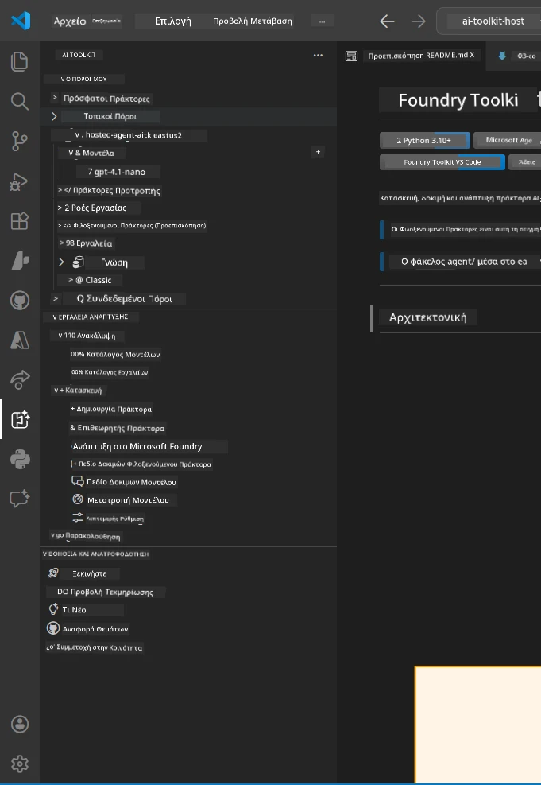
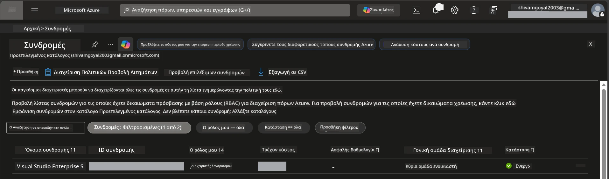
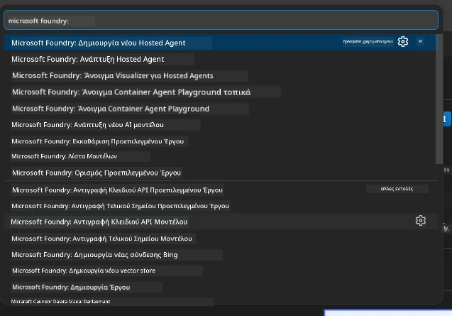
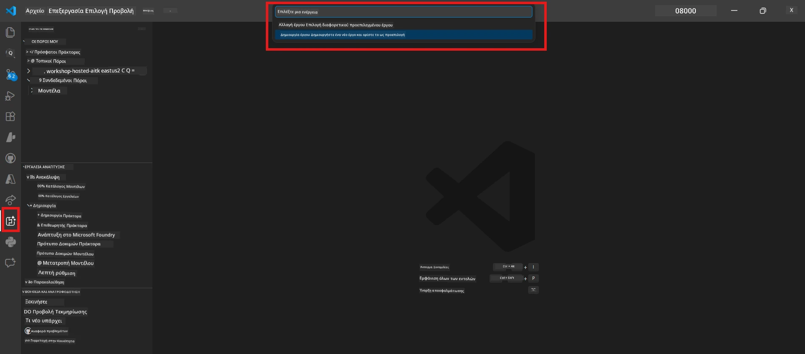
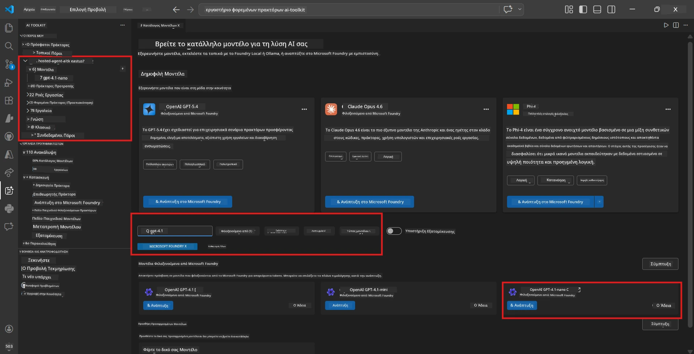
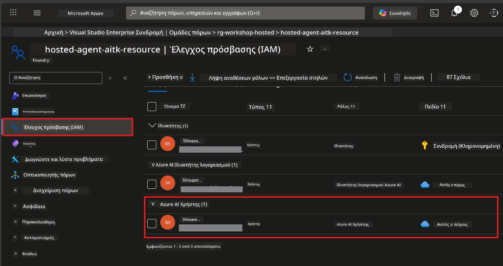

# Ρυθμίσεις: Επέκταση, Έργο & Μοντέλο

⏱️ ~15 λεπτά

Σε αυτό το модуль, εγκαθιστάτε και επαληθεύετε την επέκταση Foundry Toolkit, δημιουργείτε (ή συνδέεστε σε) ένα έργο Foundry και αναπτύσσετε ένα μοντέλο που θα χρησιμοποιεί ο πράκτοράς σας.

## Βήμα 1: Εγκατάσταση Foundry Toolkit

**Foundry Toolkit για VS Code** είναι η κύρια επέκταση για αυτό το εργαστήριο. Παρέχει δημιουργία έργων, ανάπτυξη μοντέλων, πλαίσιο για πράκτορες, τοπικές δοκιμές (Agent Inspector) και ανάπτυξη στο cloud — όλα από το VS Code.

1. Ανοίξτε το VS Code και πατήστε `Ctrl+Shift+X` για να ανοίξετε τον πίνακα **Extensions**.
2. Αναζητήστε το **Foundry Toolkit**.
3. Εγκαταστήστε το **Foundry Toolkit για VS Code** (Publisher: Microsoft, ID: `ms-windows-ai-studio.windows-ai-studio`).
4. Μετά την εγκατάσταση, το εικονίδιο **Foundry Toolkit** εμφανίζεται στη Γραμμή Δραστηριοτήτων (αριστερή γραμμή πλαϊνάς).

> *Σημείωση: Η Γραμμή Δραστηριοτήτων μπορεί να εμφανίζει "AI TOOLKIT" σε παλαιότερες εκδόσεις της επέκτασης. Η λειτουργικότητα είναι ίδια.*



## Βήμα 2: Ρύθμιση με βάση την πρόσβασή σας

> **Επιλέξτε την πορεία σας:** Αναπτύξτε την ενότητα που ταιριάζει στις ρυθμίσεις σας. Πρέπει να ολοκληρώσετε μόνο **μία** πορεία.

<details>
<summary><strong>🅰️ Πορεία Α - Azure cloud (απαιτείται συνδρομή Azure)</strong></summary>

### Azure CLI

1. Εγκαταστήστε από το [learn.microsoft.com/cli/azure/install-azure-cli](https://learn.microsoft.com/cli/azure/install-azure-cli).
2. Επαληθεύστε: `az --version` (αναμένεται 2.80.0+).
3. Συνδεθείτε: `az login`

### Επιλογές Ταυτοποίησης

Το [Microsoft Agent Framework](https://learn.microsoft.com/agent-framework/overview/) χρησιμοποιεί [`DefaultAzureCredential`](https://learn.microsoft.com/azure/developer/python/sdk/authentication/credential-chains#defaultazurecredential-overview) που δοκιμάζει πολλαπλές μεθόδους ταυτοποίησης με σειρά. Επιλέξτε αυτή που ταιριάζει στο περιβάλλον σας:

#### Επιλογή 1: Λογαριασμοί VS Code (συνιστάται για εργαστήρια)
1. Κάντε κλικ στο εικονίδιο **Accounts** (προφίλ χρήστη) στην κάτω αριστερή γωνία του VS Code.
2. Επιλέξτε **Sign in to use Microsoft Foundry** (ή **Sign in with Azure**).
3. Ανοίγει ένας περιηγητής — συνδεθείτε με τον λογαριασμό Azure που έχει πρόσβαση στη συνδρομή σας.
4. Επιστρέψτε στο VS Code. Θα πρέπει να δείτε το όνομα του λογαριασμού σας κάτω αριστερά.

#### Επιλογή 2: Azure CLI
```bash
az login
az account set --subscription "<your-subscription-id>"
```

#### Επιλογή 3: Service Principal (Enterprise/CI)
Για περιβάλλοντα με περιορισμένη πρόσβαση ή CI/CD pipelines, ορίστε αυτές τις μεταβλητές περιβάλλοντος στο αρχείο `.env` σας:
```env
AZURE_TENANT_ID=<your-tenant-id>
AZURE_CLIENT_ID=<your-client-id>
AZURE_CLIENT_SECRET=<your-client-secret>
```

> **Πώς λειτουργεί το `DefaultAzureCredential`:** Δοκιμάζει πρώτα τις μεταβλητές περιβάλλοντος, μετά τη διαχειριζόμενη ταυτότητα, μετά την είσοδο στο VS Code, μετά το Azure CLI — και χρησιμοποιεί όποια μέθοδο πετυχαίνει πρώτη. Δείτε [τα έγγραφα αλυσίδας διαπιστευτηρίων](https://learn.microsoft.com/azure/developer/python/sdk/authentication/credential-chains#defaultazurecredential-overview).

### Azure Developer CLI (azd)

1. Εγκατάσταση: `winget install microsoft.azd` (Windows) ή δείτε [τα έγγραφα εγκατάστασης](https://learn.microsoft.com/azure/developer/azure-developer-cli/install-azd).
2. Επαλήθευση: `azd version`
3. Σύνδεση: `azd auth login`

### Docker Desktop (προαιρετικό)

Το Docker χρειάζεται μόνο αν θέλετε να χτίζετε containers τοπικά. Η επέκταση Foundry χειρίζεται αυτόματα τα builds κατά την ανάπτυξη.

1. Εγκαταστήστε από [docs.docker.com/get-docker](https://docs.docker.com/get-docker/).
2. Επαλήθευση: `docker info`

### Συνδρομή Azure & RBAC

1. Συνδεθείτε στο [portal.azure.com](https://portal.azure.com).
2. Πλοηγηθείτε σε **Subscriptions** και επιβεβαιώστε ότι τουλάχιστον μία είναι **Ενεργή**.
3. Σημειώστε το **Subscription ID** — θα το χρειαστείτε στο Module 01.



#### Πίνακας Σεναρίων RBAC

Η ανάπτυξη [Hosted Agent](https://learn.microsoft.com/azure/foundry/agents/concepts/hosted-agents) απαιτεί δικαιώματα **data action** που δεν περιλαμβάνονται στους τυπικούς ρόλους Azure `Owner` και `Contributor`. Χρησιμοποιήστε τον παρακάτω πίνακα για να καθορίσετε ποιοι ρόλοι χρειάζονται:

| Σενάριο | Απαιτούμενοι ρόλοι | Που να τους αναθέσετε |
|----------|---------------|----------------------|
| Δημιουργία νέου έργου Foundry | **Azure AI Owner** στον πόρο Foundry | Πόρος Foundry στο Azure Portal |
| Ανάπτυξη σε υπάρχον έργο (νέοι πόροι) | **Azure AI Owner** + **Contributor** στη συνδρομή | Συνδρομή + πόρος Foundry |
| Ανάπτυξη σε πλήρως ρυθμισμένο έργο | **Reader** στον λογαριασμό + **Azure AI User** στο έργο | Λογαριασμός + Έργο στο Azure Portal |
| Μόνο τοπικός έλεγχος (χωρίς ανάπτυξη) | **Azure AI User** στο έργο | Έργο στο Azure Portal |

> **Βασικό σημείο:** Οι ρόλοι Azure `Owner` και `Contributor` καλύπτουν μόνο δικαιώματα *διαχείρισης* (ενέργειες ARM). Χρειάζεστε τον [**Azure AI User**](https://learn.microsoft.com/azure/foundry/concepts/rbac-foundry#built-in-roles) (ή ανώτερο) για *δράσεις δεδομένων* όπως `agents/write` που απαιτείται για τη δημιουργία και ανάπτυξη πρακτόρων.

## Συνδεθείτε ή δημιουργήστε ένα έργο Foundry



1. Πατήστε `Ctrl+Shift+P` → πληκτρολογήστε **Foundry Toolkit: Create Project** → επιλέξτε το.
2. Επιλέξτε τη **συνδρομή Azure** από το dropdown.
3. Επιλέξτε ή δημιουργήστε μια **ομάδα πόρων** (π.χ., `rg-hosted-agents-workshop`).
4. Επιλέξτε μια **περιοχή** που υποστηρίζει hosted agents: `East US`, `West US 2`, ή `Sweden Central`. Δείτε [διαθεσιμότητα περιοχών](https://learn.microsoft.com/azure/foundry/agents/concepts/hosted-agents#region-availability).
5. Εισάγετε ένα όνομα έργου (π.χ., `workshop-agents`).
6. Περιμένετε 2–5 λεπτά για την παροχή. Εμφανίζεται ειδοποίηση προόδου στο VS Code.
7. Όταν ολοκληρωθεί, το έργο σας εμφανίζεται στην πλαϊνή μπάρα **Foundry Toolkit** κάτω από το **MY RESOURCES**.



## Ανάπτυξη μοντέλου & ανάθεση RBAC

Ο hosted agent σας χρειάζεται ένα μοντέλο AI για να δημιουργεί απαντήσεις.

#### Πίνακας Επιλογής Μοντέλου
Ανάλογα με τις ανάγκες σας, μπορείτε να επιλέξετε από διαφορετικά επίπεδα μοντέλων:

| Μοντέλο | Κατάλληλο για | Κόστος | Σημειώσεις |
|-------|----------|------|-------|
| `gpt-4.1` | Υψηλής ποιότητας, λεπτομερείς απαντήσεις | Υψηλότερο | Καλύτερα αποτελέσματα, συνιστάται για τον τελικό έλεγχο |
| `gpt-4.1-mini/gpt-5-mini` | Γρήγορη επανάληψη, χαμηλότερο κόστος | Χαμηλότερο | Κατάλληλο για ανάπτυξη εργαστηρίου και γρήγορες δοκιμές |
| `gpt-4.1-nano` | Ελαφριές εργασίες | Χαμηλότερο | Πιο οικονομικό, αλλά απλούστερες απαντήσεις |

1. Πατήστε `Ctrl+Shift+P` → **Foundry Toolkit: Open Model Catalog** (ή κάντε κλικ στο **Model Catalog** στην πλαϊνή μπάρα κάτω από DEVELOPER TOOLS → Discover).
2. Αναζητήστε **gpt-4.1** στον κατάλογο.
3. Βρείτε το **OpenAI GPT-4.1-mini** (ή `gpt-5-mini` για καλύτερη ποιότητα) και κάντε κλικ στο **Deploy**.



4. Στη ρύθμιση ανάπτυξης:
   - **Όνομα ανάπτυξης:** Αφήστε το προεπιλεγμένο ή εισάγετε ένα προσαρμοσμένο όνομα. **Θυμηθείτε αυτό το όνομα.**
   - **Στόχος:** Επιλέξτε **Deploy to Foundry Toolkit** → επιλέξτε το έργο σας.
5. Κάντε κλικ στο **Deploy** και περιμένετε 1–3 λεπτά.

> **Συνιστάται:** Χρησιμοποιήστε `gpt-4.1-mini/gpt-5-mini` για το εργαστήριο — γρήγορο, προσιτό και με καλά αποτελέσματα.

### Σημειώστε τις τιμές σας

Μετά την ανάπτυξη, σημειώστε αυτές τις δύο τιμές (θα τις χρειαστείτε στο Module 03):

| Τιμή | Πού να τη βρείτε |
|-------|-----------------|
| **Τερματικό έργου** | Κάντε κλικ στο έργο σας στην πλαϊνή μπάρα → η λεπτομερής προβολή δείχνει το URL (π.χ., `https://<account>.services.ai.azure.com/api/projects/<project>`) |
| **Όνομα ανάπτυξης μοντέλου** | Αναπτύξτε το έργο → **Models** → το όνομα δίπλα στο αναπτυγμένο μοντέλο (π.χ., `gpt-4.1-mini/gpt-5-mini`) |

### Ανάθεση ρόλου RBAC

> ⚠️ **Αυτό είναι το πιο συνηθισμένο παραλειπόμενο βήμα.** Χωρίς τον σωστό ρόλο, η ανάπτυξη στο Module 05 θα αποτύχει.

#### Ποιος ρόλος χρειάζεται;
Ανάλογα με το σενάριό σας, χρειάζεστε τους εξής συνδυασμούς ρόλων:

| Σενάριο | Απαιτούμενοι ρόλοι | Που να τους αναθέσετε |
|----------|---------------|----------------------|
| Δημιουργία νέου έργου Foundry | **Azure AI Owner** στον πόρο Foundry | Πόρος Foundry στο Azure Portal |
| Ανάπτυξη σε υπάρχον έργο (νέοι πόροι) | **Azure AI Owner** + **Contributor** στη συνδρομή | Συνδρομή + πόρος Foundry |
| Ανάπτυξη σε πλήρως ρυθμισμένο έργο | **Reader** στον λογαριασμό + **Azure AI User** στο έργο | Λογαριασμός + Έργο στο Azure Portal |

**Βασικό σημείο:** Οι ρόλοι Azure `Owner` και `Contributor` καλύπτουν μόνο δικαιώματα *διαχείρισης*. Χρειάζεστε **Azure AI User** (ή ανώτερο) για *δράσεις δεδομένων* όπως `agents/write` που απαιτούνται για τη δημιουργία και ανάπτυξη πρακτόρων.

1. Ανοίξτε το [portal.azure.com](https://portal.azure.com).
2. Αναζητήστε το όνομα του **έργου Foundry** → κάντε κλικ στο αποτέλεσμα τύπου **"Foundry Toolkit project"** (ΟΧΙ ο γονικός λογαριασμός).
3. Κάντε κλικ στο **Access control (IAM)** στην αριστερή πλοήγηση.
4. Κάντε κλικ στο **+ Add** → **Add role assignment**.
5. **Καρτέλα ρόλων:** Αναζητήστε **Azure AI User**, επιλέξτε το, κάντε κλικ στο **Next**.
6. **Καρτέλα μελών:** Επιλέξτε **User, group, or service principal** → κάντε κλικ στο **+ Select members** → βρείτε και επιλέξτε τον εαυτό σας → κάντε κλικ στο **Select**.
7. Κάντε κλικ στο **Review + assign** → ξανά **Review + assign**.
8. **Περιμένετε 1–2 λεπτά** για τη διάδοση.

> **Γιατί αυτός ο ρόλος;** Οι ρόλοι Azure `Owner`/`Contributor` παρέχουν μόνο δικαιώματα διαχείρισης. Ο ρόλος **Azure AI User** παρέχει την ενέργεια δεδομένων `agents/write` που απαιτείται για τη δημιουργία και ανάπτυξη πρακτόρων. Δείτε τα [έγγραφα Foundry RBAC](https://learn.microsoft.com/azure/foundry/concepts/rbac-foundry#built-in-roles).



</details>

<details>
<summary><strong>🅱️ Πορεία Β - Τοπική / δωρεάν έκδοση (χωρίς συνδρομή Azure)</strong></summary>

### Foundry Local

Το Foundry Local σας επιτρέπει να τρέχετε μοντέλα AI στον δικό σας υπολογιστή — δεν χρειάζεται λογαριασμός στο cloud. Μπορείτε να αποκτήσετε πρόσβαση στα μοντέλα Foundry Local μέσω του Foundry Toolkit από τον κατάλογο μοντέλων ως εξής:

1. Πηγαίνετε στην επέκταση Foundry Toolkit.
2. Στην πλοήγηση του Foundry Toolkit, πηγαίνετε σε **Developer Tools** > και επιλέξτε **Model Catalog**
3. Στο νέο παράθυρο, επιλέξτε **local** από τη γραμμή πλοήγησης.
4. Κάντε κύλιση προς τα κάτω στο **Phi 4 Mini,** και κάντε κλικ στο **κουμπί προσθήκης** θα εμφανιστεί ένα παράθυρο που δείχνει ότι το μοντέλο κατεβάζεται.
5. Μόλις το μοντέλο κατέβει, μπορείτε να προχωρήσετε στο επόμενο βήμα.

</details>

### ✅ Σημείο Ελέγχου


- [ ] `Ctrl+Shift+P` → "Foundry Toolkit" εμφανίζει διαθέσιμες εντολές
- [ ] Επέκταση Foundry Toolkit εγκατεστημένη και η πλαϊνή μπάρα φορτώνει χωρίς σφάλματα
- [ ] Το VS Code ανοίγει και λειτουργεί σωστά
- [ ] `python --version` δείχνει 3.10+
- [ ] Εικονίδιο Foundry Toolkit ορατό στη Γραμμή Δραστηριοτήτων του VS Code
- [ ] **Πορεία Α:** `az login` επιτυγχάνει, η συνδρομή είναι Ενεργή
- [ ] **Πορεία Β:** Foundry Local τρέχει (`foundry local status`)
- [ ] **Πορεία Α:** Το έργο Foundry είναι ορατό στην πλαϊνή μπάρα, το μοντέλο αναπτύχθηκε, ο ρόλος Azure AI User ανατέθηκε
- [ ] **Πορεία Β:** Foundry Local τρέχει με μοντέλο
- [ ] Έχετε σημειώσει το **τερματικό** και το **όνομα ανάπτυξης μοντέλου**


**Προηγούμενο:** [00 - Απαιτούμενα](00-prerequisites.md) · **Επόμενο:** [02 - Δημιουργία Hosted Agent →](02-create-hosted-agent.md)

---

<!-- CO-OP TRANSLATOR DISCLAIMER START -->
**Αποποίηση ευθυνών**:
Αυτό το έγγραφο έχει μεταφραστεί χρησιμοποιώντας την υπηρεσία μετάφρασης με τεχνητή νοημοσύνη [Co-op Translator](https://github.com/Azure/co-op-translator). Ενώ επιδιώκουμε την ακρίβεια, παρακαλούμε να έχετε υπόψη ότι οι αυτοματοποιημένες μεταφράσεις ενδέχεται να περιέχουν λάθη ή ανακρίβειες. Το πρωτότυπο έγγραφο στη μητρική του γλώσσα πρέπει να θεωρείται η αυθεντική πηγή. Για κρίσιμες πληροφορίες, συνιστάται επαγγελματική ανθρώπινη μετάφραση. Δεν φέρουμε ευθύνη για τυχόν παρεξηγήσεις ή λανθασμένες ερμηνείες που προκύπτουν από τη χρήση αυτής της μετάφρασης.
<!-- CO-OP TRANSLATOR DISCLAIMER END -->