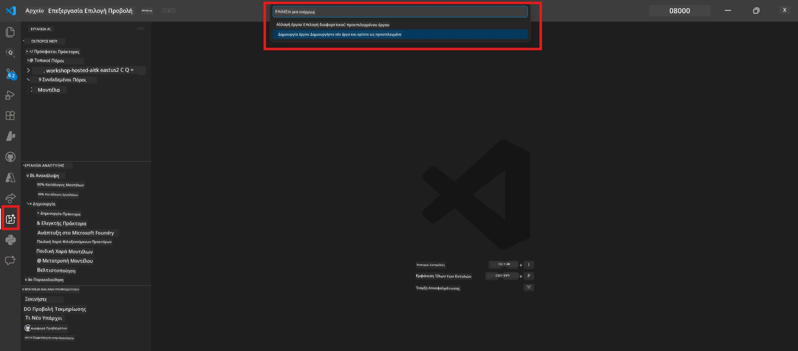
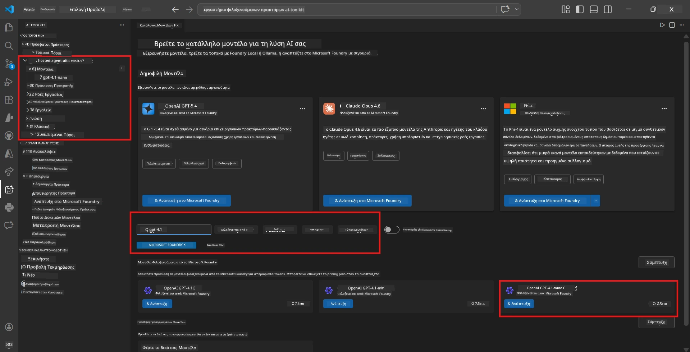
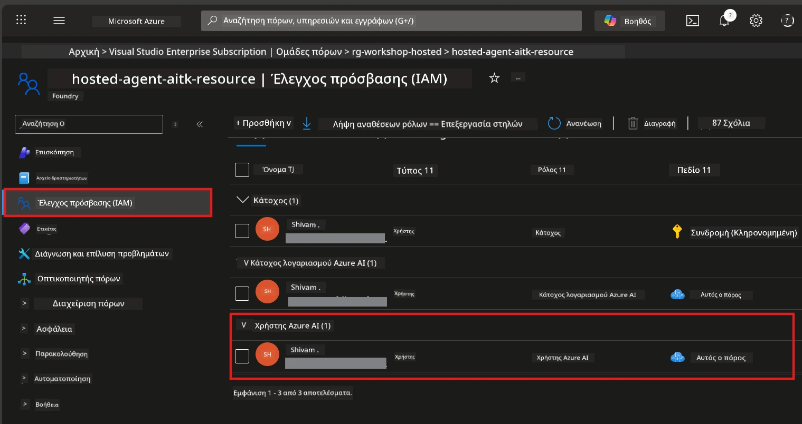

# Ενότητα 2 - Δημιουργία Έργου Foundry & Ανάπτυξη Μοντέλου

Σε αυτή την ενότητα, δημιουργείτε (ή επιλέγετε) ένα έργο Microsoft Foundry και αναπτύσσετε ένα μοντέλο που θα χρησιμοποιεί ο πράκτοράς σας. Κάθε βήμα περιγράφεται ρητά - ακολουθήστε τα με τη σειρά.

> Εάν έχετε ήδη ένα έργο Foundry με αναπτυγμένο μοντέλο, παραλείψτε στην [Ενότητα 3](03-create-hosted-agent.md).

---

## Βήμα 1: Δημιουργία έργου Foundry από το VS Code

Θα χρησιμοποιήσετε την επέκταση Microsoft Foundry για να δημιουργήσετε ένα έργο χωρίς να φύγετε από το VS Code.

1. Πατήστε `Ctrl+Shift+P` για να ανοίξετε την **Παλέτα Εντολών**.
2. Πληκτρολογήστε: **Microsoft Foundry: Create Project** και επιλέξτε το.
3. Εμφανίζεται ένα αναδυόμενο μενού - επιλέξτε την **εγγραφή Azure** από τη λίστα.
4. Θα σας ζητηθεί να επιλέξετε ή να δημιουργήσετε μια **ομάδα πόρων**:
   - Για να δημιουργήσετε νέα: πληκτρολογήστε ένα όνομα (π.χ., `rg-hosted-agents-workshop`) και πατήστε Enter.
   - Για να χρησιμοποιήσετε υπάρχουσα: επιλέξτε την από το αναδυόμενο μενού.
5. Επιλέξτε μια **περιοχή**. **Σημαντικό:** Επιλέξτε μια περιοχή που υποστηρίζει hosted agents. Ελέγξτε [διαθεσιμότητα περιοχής](https://learn.microsoft.com/azure/foundry/agents/concepts/hosted-agents#region-availability) - συνηθισμένες επιλογές είναι `East US`, `West US 2`, ή `Sweden Central`.
6. Εισάγετε ένα **όνομα** για το έργο Foundry (π.χ., `workshop-agents`).
7. Πατήστε Enter και περιμένετε να ολοκληρωθεί η παροχή πόρων.

> **Η παροχή πόρων διαρκεί 2-5 λεπτά.** Θα δείτε μια ειδοποίηση προόδου στην κάτω δεξιά γωνία του VS Code. Μην κλείσετε το VS Code κατά τη διάρκεια της παροχής.

8. Όταν ολοκληρωθεί, η πλαϊνή μπάρα **Microsoft Foundry** θα εμφανίσει το νέο σας έργο κάτω από το **Resources**.
9. Κάντε κλικ στο όνομα του έργου για να το αναπτύξετε και επιβεβαιώστε ότι εμφανίζει ενότητες όπως **Models + endpoints** και **Agents**.



### Εναλλακτικά: Δημιουργία μέσω του Foundry Portal

Εάν προτιμάτε με το πρόγραμμα περιήγησης:

1. Ανοίξτε [https://ai.azure.com](https://ai.azure.com) και συνδεθείτε.
2. Κάντε κλικ στο **Create project** στην αρχική σελίδα.
3. Εισάγετε όνομα έργου, επιλέξτε την εγγραφή σας, την ομάδα πόρων και την περιοχή.
4. Κάντε κλικ στο **Create** και περιμένετε την παροχή πόρων.
5. Μόλις δημιουργηθεί, επιστρέψτε στο VS Code - το έργο θα πρέπει να εμφανιστεί στην πλαϊνή μπάρα Foundry μετά από ανανέωση (κάντε κλικ στο εικονίδιο ανανέωσης).

---

## Βήμα 2: Ανάπτυξη μοντέλου

Ο [hosted agent σας](https://learn.microsoft.com/azure/foundry/agents/concepts/hosted-agents) χρειάζεται ένα Azure OpenAI μοντέλο για να δημιουργεί απαντήσεις. Θα [αναπτύξετε ένα τώρα](https://learn.microsoft.com/azure/ai-foundry/openai/how-to/create-resource#deploy-a-model).

1. Πατήστε `Ctrl+Shift+P` για να ανοίξετε την **Παλέτα Εντολών**.
2. Πληκτρολογήστε: **Microsoft Foundry: Open [Model Catalog](https://learn.microsoft.com/azure/ai-foundry/openai/concepts/models)** και επιλέξτε το.
3. Η προβολή Model Catalog ανοίγει στο VS Code. Περιηγηθείτε ή χρησιμοποιήστε τη γραμμή αναζήτησης για να βρείτε το **gpt-4.1**.
4. Κάντε κλικ στην κάρτα μοντέλου **gpt-4.1** (ή `gpt-4.1-mini` αν προτιμάτε μικρότερο κόστος).
5. Κάντε κλικ στο **Deploy**.


6. Στη διαμόρφωση ανάπτυξης:
   - **Όνομα ανάπτυξης**: Αφήστε το προεπιλεγμένο (π.χ., `gpt-4.1`) ή εισάγετε ένα προσαρμοσμένο όνομα. **Αποθηκεύστε αυτό το όνομα** - θα το χρειαστείτε στην Ενότητα 4.
   - **Προορισμός**: Επιλέξτε **Deploy to Microsoft Foundry** και επιλέξτε το έργο που μόλις δημιουργήσατε.
7. Κάντε κλικ στο **Deploy** και περιμένετε την ολοκλήρωση της ανάπτυξης (1-3 λεπτά).

### Επιλογή μοντέλου

| Μοντέλο | Κατάλληλο για | Κόστος | Σημειώσεις |
|---------|--------------|--------|------------|
| `gpt-4.1` | Υψηλής ποιότητας, λεπτομερείς απαντήσεις | Υψηλότερο | Καλύτερα αποτελέσματα, προτείνεται για τελικό έλεγχο |
| `gpt-4.1-mini` | Γρήγορος κύκλος δοκιμών, χαμηλότερο κόστος | Χαμηλότερο | Κατάλληλο για ανάπτυξη εργαστηρίου και γρήγορο έλεγχο |
| `gpt-4.1-nano` | Ελαφριές εργασίες | Πιο χαμηλό | Πιο οικονομικό, αλλά με απλούστερες απαντήσεις |

> **Σύσταση για αυτό το εργαστήριο:** Χρησιμοποιήστε το `gpt-4.1-mini` για ανάπτυξη και δοκιμές. Είναι γρήγορο, φθηνό και παράγει καλά αποτελέσματα για τις ασκήσεις.

### Επαλήθευση της ανάπτυξης του μοντέλου

1. Στην πλαϊνή μπάρα **Microsoft Foundry**, αναπτύξτε το έργο σας.
2. Δείτε κάτω από το **Models + endpoints** (ή παρόμοια ενότητα).
3. Πρέπει να δείτε το αναπτυγμένο μοντέλο σας (π.χ., `gpt-4.1-mini`) με κατάσταση **Succeeded** ή **Active**.
4. Κάντε κλικ στην ανάπτυξη του μοντέλου για να δείτε τις λεπτομέρειές του.
5. **Καταγράψτε** αυτές τις δύο τιμές - θα τις χρειαστείτε στην Ενότητα 4:

   | Ρύθμιση | Πού να τη βρείτε | Παράδειγμα τιμής |
   |---------|-----------------|------------------|
   | **Τερματικό έργου** | Κάντε κλικ στο όνομα του έργου στην πλαϊνή μπάρα Foundry. Η διεύθυνση URL του τερματικού εμφανίζεται στην προβολή λεπτομερειών. | `https://<account>.services.ai.azure.com/api/projects/<project>` |
   | **Όνομα ανάπτυξης μοντέλου** | Το όνομα που εμφανίζεται δίπλα στο αναπτυγμένο μοντέλο. | `gpt-4.1-mini` |

---

## Βήμα 3: Ανάθεση των απαιτούμενων ρόλων RBAC

Αυτό είναι το **βήμα που παραλείπεται συχνότερα**. Χωρίς τους σωστούς ρόλους, η ανάπτυξη στην Ενότητα 6 θα αποτύχει με σφάλμα δικαιωμάτων.

### 3.1 Ανάθεση ρόλου Azure AI User σε εσάς

1. Ανοίξτε ένα πρόγραμμα περιήγησης και μεταβείτε στο [https://portal.azure.com](https://portal.azure.com).
2. Στη γραμμή αναζήτησης στο πάνω μέρος, πληκτρολογήστε το όνομα του **έργου Foundry** σας και κάντε κλικ σε αυτό στα αποτελέσματα.
   - **Σημαντικό:** Πλοηγηθείτε στον πόρο **έργου** (τύπος: "Microsoft Foundry project"), **όχι** στον γονικό πόρο λογαριασμού/hub.
3. Στο αριστερό μενού του έργου, κάντε κλικ στο **Access control (IAM)**.
4. Κάντε κλικ στο κουμπί **+ Προσθήκη** στο επάνω μέρος → επιλέξτε **Add role assignment**.
5. Στην καρτέλα **Ρόλος**, αναζητήστε τον [**Azure AI User**](https://learn.microsoft.com/azure/foundry/concepts/rbac-foundry#built-in-roles) και επιλέξτε τον. Κάντε κλικ στο **Επόμενο**.
6. Στην καρτέλα **Μέλη**:
   - Επιλέξτε **Χρήστης, ομάδα ή service principal**.
   - Κάντε κλικ στο **+ Επιλογή μελών**.
   - Αναζητήστε το όνομά σας ή το email, επιλέξτε τον εαυτό σας και πατήστε **Επιλογή**.
7. Πατήστε **Ανασκόπηση + ανάθεση** → και ξανά **Ανασκόπηση + ανάθεση** για επιβεβαίωση.



### 3.2 (Προαιρετικό) Ανάθεση ρόλου Azure AI Developer

Εάν χρειάζεται να δημιουργήσετε επιπλέον πόρους μέσα στο έργο ή να διαχειριστείτε προγραμματιστικά τις αναπτύξεις:

1. Επαναλάβετε τα παραπάνω βήματα, αλλά στο βήμα 5 επιλέξτε τον ρόλο **Azure AI Developer**.
2. Αναθέστε αυτόν τον ρόλο στο επίπεδο **Foundry resource (λογαριασμός)**, όχι μόνο στο επίπεδο έργου.

### 3.3 Επαλήθευση των αναθέσεων ρόλων σας

1. Στη σελίδα **Access control (IAM)** του έργου, κάντε κλικ στην καρτέλα **Role assignments**.
2. Αναζητήστε το όνομά σας.
3. Πρέπει να δείτε τουλάχιστον τον ρόλο **Azure AI User** να έχει ανατεθεί σε επίπεδο έργου.

> **Γιατί έχει σημασία:** Ο ρόλος [`Azure AI User`](https://learn.microsoft.com/azure/foundry/concepts/rbac-foundry#built-in-roles) δίνει την άδεια `Microsoft.CognitiveServices/accounts/AIServices/agents/write`. Χωρίς αυτήν, θα δείτε το παρακάτω σφάλμα κατά την ανάπτυξη:
>
> ```
> Error: lacks the required data action 
> Microsoft.CognitiveServices/accounts/AIServices/agents/write 
> to perform POST /api/projects/{projectName}/assistants operation.
> ```
>
> Δείτε την [Ενότητα 8 - Αντιμετώπιση προβλημάτων](08-troubleshooting.md) για περισσότερες λεπτομέρειες.

---

### Σημείο Ελέγχου

- [ ] Υπάρχει έργο Foundry και είναι ορατό στην πλαϊνή μπάρα Microsoft Foundry στο VS Code
- [ ] Τουλάχιστον ένα μοντέλο έχει αναπτυχθεί (π.χ., `gpt-4.1-mini`) με κατάσταση **Succeeded**
- [ ] Καταγράψατε τη διεύθυνση URL του **τερματικού έργου** και το **όνομα ανάπτυξης μοντέλου**
- [ ] Έχετε ανατεθεί ο ρόλος **Azure AI User** σε επίπεδο **έργου** (επαληθεύστε στο Azure Portal → IAM → Role assignments)
- [ ] Το έργο βρίσκεται σε [υποστηριζόμενη περιοχή](https://learn.microsoft.com/azure/foundry/agents/concepts/hosted-agents#region-availability) για hosted agents

---

**Προηγούμενο:** [01 - Εγκατάσταση Foundry Toolkit](01-install-foundry-toolkit.md) · **Επόμενο:** [03 - Δημιουργία Hosted Agent →](03-create-hosted-agent.md)

---

<!-- CO-OP TRANSLATOR DISCLAIMER START -->
**Αποποίηση ευθυνών**:
Αυτό το έγγραφο έχει μεταφραστεί χρησιμοποιώντας την υπηρεσία αυτόματης μετάφρασης AI [Co-op Translator](https://github.com/Azure/co-op-translator). Παρότι καταβάλουμε κάθε προσπάθεια για ακρίβεια, παρακαλούμε να λάβετε υπόψη ότι οι αυτόματες μεταφράσεις μπορεί να περιέχουν σφάλματα ή ανακρίβειες. Το πρωτότυπο έγγραφο στη γλωσσική του μορφή πρέπει να θεωρείται η αυθεντική πηγή. Για κρίσιμες πληροφορίες, συνιστάται επαγγελματική ανθρώπινη μετάφραση. Δεν φέρουμε ευθύνη για τυχόν παρεξηγήσεις ή λανθασμένες ερμηνείες που προκύπτουν από τη χρήση αυτής της μετάφρασης.
<!-- CO-OP TRANSLATOR DISCLAIMER END -->