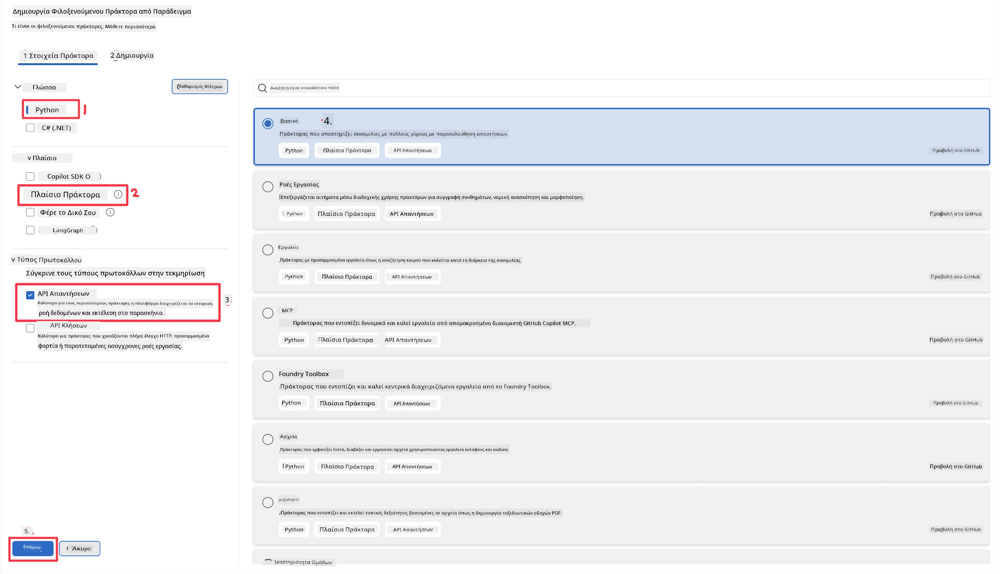
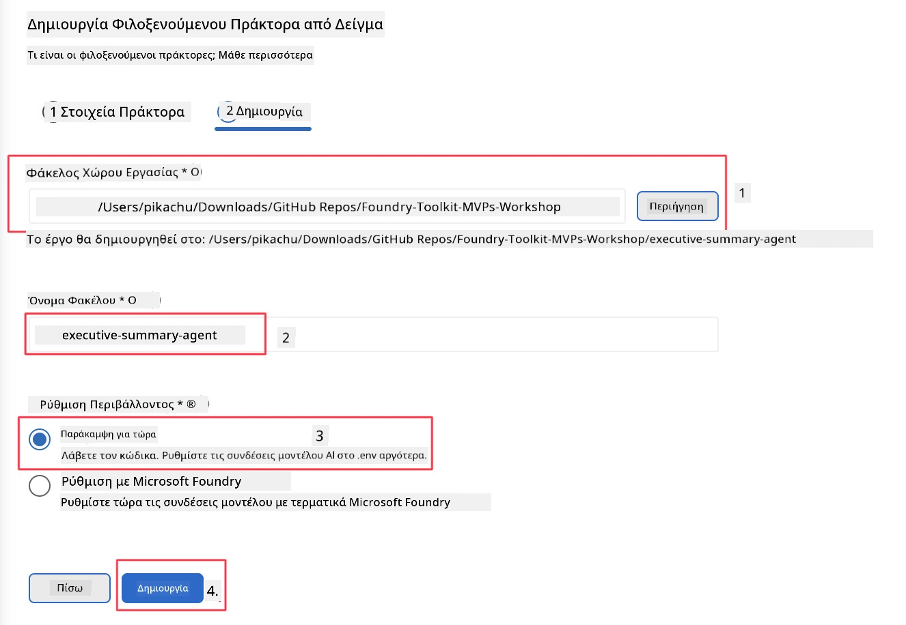

# Ενότητα 2 - Δημιουργία νέου Φιλοξενούμενου Agent

⏱️ ~5 λεπτά

Σε αυτή την ενότητα, χρησιμοποιείτε το Foundry Toolkit για να **δημιουργήσετε το σκελετό ενός προγράμματος φιλοξενούμενου agent**. Ο σκελετός δημιουργεί ολόκληρη τη δομή του προγράμματος - `agent.yaml`, `main.py`, `Dockerfile`, `requirements.txt` και ρύθμιση αποσφαλμάτωσης VS Code - ώστε να μπορείτε να εστιάσετε στην προσαρμογή της συμπεριφοράς του agent.

> **Βασική έννοια:** Ο φάκελος `agent/` σε αυτό το εργαστήριο είναι ένα παράδειγμα από αυτά που παράγει το Foundry Toolkit. Δεν γράφετε αυτά τα αρχεία από την αρχή.

### Ροή οδηγού δημιουργίας σκελετού

```mermaid
flowchart LR
    A["Command Palette:
    Create new Hosted Agent"] --> B["Language:
    Python"]
    B --> C["API type:
    Response API"]
    C --> D["Template:
    Basic - Agent Framework"]
    D --> E["Επιλέξτε μοντέλο"]
    E --> F["Workspace folder
    & agent name"]
    F --> G["Δημιουργημένο έργο"]

    style A fill:#4A90D9,color:#fff
    style B fill:#7B68EE,color:#fff
    style C fill:#7B68EE,color:#fff
    style D fill:#7B68EE,color:#fff
    style E fill:#7B68EE,color:#fff
    style F fill:#7B68EE,color:#fff
    style G fill:#27AE60,color:#fff
```



---

## Βήμα 1: Άνοιγμα του οδηγού Δημιουργίας Φιλοξενούμενου Agent

1. Πατήστε `Ctrl+Shift+P` για να ανοίξετε την **Παλέτα Εντολών**.
2. Πληκτρολογήστε: **Foundry Toolkit: Create new Hosted Agent** και επιλέξτε το.

> **Εναλλακτικά: Δημιουργία μέσω Foundry Portal**
> Αν προτιμάτε το πρόγραμμα περιήγησης, μπορείτε να δημιουργήσετε το έργο σας στο [https://ai.azure.com](https://ai.azure.com). Μόλις προετοιμαστεί το έργο, επιστρέψτε στο VS Code και χρησιμοποιήστε την πλαϊνή μπάρα του **Foundry Toolkit** για να συνδεθείτε σε αυτό.

> **Εναλλακτικά:** Κάντε κλικ στο εικονίδιο **+** δίπλα από το **Hosted Agents (Preview)** στην πλαϊνή μπάρα του Foundry Toolkit.

## Βήμα 2: Επιλογή ρυθμίσεων



1. Στην αριστερή ενότητα πλοήγησης/επιλογών επιλέξτε τα εξής:

| Μενού | Επιλογή | Σημειώσεις |
|--------|-----------|-------|
| **Γλώσσα** | Python | Υποστηρίζεται και C# |
| **Πλαίσιο εργασίας (Framework)** | Agent Framework | Απλό σημείο εκκίνησης με χρήση Agent Framework SDK |
| **Τύπος API** | Response API | `POST /responses` - συνομιλητικό, με ιστορικό διαχειριζόμενο από την πλατφόρμα |
| **Πρότυπο** | Basic | Απλό σημείο εκκίνησης με χρήση Agent Framework SDK |

2. Μόλις επιλεγούν, κάντε κλικ στο **Next**



3. Στο επόμενο παράθυρο, επιλέξτε τα εξής:

| Μενού | Επιλογή | Σημειώσεις |
|--------|-----------|-------|
| **Φάκελος εργασίας** | Επιλέξτε φάκελο προορισμού | π.χ., `/workspace/Foundry_Toolkit_for_VSCode_Lab/` ή υποφάκελο σε αυτό το αποθετήριο |
| **Όνομα agent** | Εισάγετε όνομα | π.χ., `executive-summary-agent` |
| **Ρύθμιση περιβάλλοντος** | παραλείψτε τη ρύθμιση προς το παρόν |  |

Κάντε κλικ στο **create** για να δημιουργήσετε τον agent μας. Θα δημιουργηθεί νέος φάκελος με το όνομα του φιλοξενούμενου agent.

## Βήμα 3: Επισκόπηση του δημιουργημένου έργου

Μετά την ολοκλήρωση του σκελετού, ελέγξτε αν βλέπετε αυτά τα αρχεία στο Explorer (`Ctrl+Shift+E`):

```
📂 my-agent/
├── .env                ← Environment variables (placeholders)
├── .vscode/
│   ├── launch.json     ← Debug config (F5 → run + Agent Inspector)
│   └── tasks.json      ← VS Code task definitions
├── agent.yaml          ← Agent definition (kind: hosted)
├── Dockerfile          ← Container config for deployment
├── main.py             ← Agent entry point (your main code)
└── requirements.txt    ← Python dependencies
```

### Επεξήγηση βασικών αρχείων

| Αρχείο | Σκοπός |
|------|---------|
| `agent.yaml` | Δηλώνει τον agent ως `kind: hosted`, αντιστοιχεί μεταβλητές περιβάλλοντος, ορίζει το πρωτόκολλο `/responses` |
| `main.py` | Δημιουργεί `FoundryChatClient` → το εμπλέκει σε `Agent` με οδηγίες → παρέχει μέσω `ResponsesHostServer` στην θύρα 8088 |
| `Dockerfile` | Χρησιμοποιεί `python:3.12-slim`, εγκαθιστά εξαρτήσεις, ανοίγει την θύρα 8088, τρέχει το `main.py` |
| `requirements.txt` | `agent-framework-foundry`, `agent-framework-foundry-hosting`, `mcp`, `debugpy` |

> **Σημαντικό:** Ανοίξτε τον φάκελο του agent που δημιουργήθηκε απευθείας στο VS Code (τον ίδιο φάκελο `agent/`) ώστε τα `.vscode/launch.json` και `tasks.json` να λειτουργούν σωστά για αποσφαλμάτωση με F5.

---

### ✅ Σημείο ελέγχου

- [ ] Το δημιουργημένο πρόγραμμα σκελετού περιλαμβάνει όλα τα αναμενόμενα αρχεία
- [ ] Το `agent.yaml` δείχνει `kind: hosted` και `protocol: responses`
- [ ] Το `main.py` εισάγει `Agent`, `FoundryChatClient`, `ResponsesHostServer`
- [ ] Ο φάκελος του agent είναι ανοιχτός στο VS Code ως ρίζα του χώρου εργασίας

---

**Προηγούμενο:** [01 - Setup](01-setup.md) · **Επόμενο:** [03 - Configure & Code →](03-configure-and-code.md)

---

<!-- CO-OP TRANSLATOR DISCLAIMER START -->
**Αποποίηση ευθυνών**:
Αυτό το έγγραφο έχει μεταφραστεί χρησιμοποιώντας την υπηρεσία μετάφρασης με τεχνητή νοημοσύνη [Co-op Translator](https://github.com/Azure/co-op-translator). Ενώ επιδιώκουμε την ακρίβεια, παρακαλούμε να έχετε υπόψη ότι οι αυτοματοποιημένες μεταφράσεις ενδέχεται να περιέχουν λάθη ή ανακρίβειες. Το πρωτότυπο έγγραφο στη μητρική του γλώσσα πρέπει να θεωρείται η αυθεντική πηγή. Για κρίσιμες πληροφορίες, συνιστάται επαγγελματική ανθρώπινη μετάφραση. Δεν φέρουμε ευθύνη για τυχόν παρεξηγήσεις ή λανθασμένες ερμηνείες που προκύπτουν από τη χρήση αυτής της μετάφρασης.
<!-- CO-OP TRANSLATOR DISCLAIMER END -->