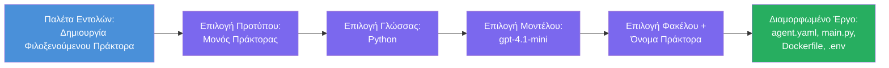

# Module 3 - Δημιουργία Νέου Φιλοξενούμενου Πράκτορα (Αυτόματη Δημιουργία με την Επέκταση Foundry)

Σε αυτό το module, χρησιμοποιείτε την επέκταση Microsoft Foundry για να **δημιουργήσετε ένα νέο έργο [φιλοξενούμενου πράκτορα](https://learn.microsoft.com/azure/foundry/agents/concepts/hosted-agents)**. Η επέκταση δημιουργεί ολόκληρη τη δομή του έργου για εσάς — συμπεριλαμβανομένων των `agent.yaml`, `main.py`, `Dockerfile`, `requirements.txt`, ενός αρχείου `.env` και μιας ρύθμισης αποσφαλμάτωσης για VS Code. Μετά τη δημιουργία της δομής, προσαρμόζετε αυτά τα αρχεία με τις οδηγίες, τα εργαλεία και τη διαμόρφωση του πράκτορά σας.

> **Κεντρική έννοια:** Ο φάκελος `agent/` σε αυτό το εργαστήριο είναι ένα παράδειγμα αυτού που δημιουργεί η επέκταση Foundry όταν εκτελείτε αυτή την εντολή δημιουργίας. Δεν γράφετε αυτά τα αρχεία από την αρχή — η επέκταση τα δημιουργεί και εσείς τα τροποποιείτε.

### Ροή του οδηγού δημιουργίας


---

## Βήμα 1: Άνοιγμα του οδηγού Δημιουργίας Ξενισμένου Πράκτορα

1. Πατήστε `Ctrl+Shift+P` για να ανοίξετε την **Παλαιά Εντολών**.
2. Πληκτρολογήστε: **Microsoft Foundry: Create a New Hosted Agent** και επιλέξτε το.
3. Ο οδηγός δημιουργίας φιλοξενούμενου πράκτορα ανοίγει.

> **Εναλλακτική διαδρομή:** Μπορείτε επίσης να φτάσετε σε αυτόν τον οδηγό από την πλαϊνή μπάρα του Microsoft Foundry → κάντε κλικ στο εικονίδιο **+** δίπλα στο **Agents** ή δεξί κλικ και επιλέξτε **Create New Hosted Agent**.

---

## Βήμα 2: Επιλογή προτύπου

Ο οδηγός σας ζητά να επιλέξετε ένα πρότυπο. Θα δείτε επιλογές όπως:

| Πρότυπο | Περιγραφή | Πότε να το χρησιμοποιήσετε |
|----------|-------------|-------------|
| **Single Agent** | Ένας πράκτορας με το δικό του μοντέλο, οδηγίες και προαιρετικά εργαλεία | Αυτό το εργαστήριο (Lab 01) |
| **Multi-Agent Workflow** | Πολλοί πράκτορες που συνεργάζονται κατά σειρά | Lab 02 |

1. Επιλέξτε **Single Agent**.
2. Κάντε κλικ στο **Next** (ή η επιλογή προχωράει αυτόματα).

---

## Βήμα 3: Επιλογή γλώσσας προγραμματισμού

1. Επιλέξτε **Python** (συνιστάται για αυτό το εργαστήριο).
2. Κάντε κλικ στο **Next**.

> **Υποστηρίζεται και η C#** αν προτιμάτε .NET. Η δομή scaffold είναι παρόμοια (χρησιμοποιεί `Program.cs` αντί για `main.py`).

---

## Βήμα 4: Επιλογή μοντέλου

1. Ο οδηγός εμφανίζει τα μοντέλα που έχετε αναπτύξει στο έργο Foundry (από το Module 2).
2. Επιλέξτε το μοντέλο που αναπτύξατε - π.χ., **gpt-4.1-mini**.
3. Κάντε κλικ στο **Next**.

> Αν δεν βλέπετε κανένα μοντέλο, επιστρέψτε στο [Module 2](02-create-foundry-project.md) και αναπτύξτε ένα πρώτα.

---

## Βήμα 5: Επιλογή τοποθεσίας φακέλου και ονόματος πράκτορα

1. Ανοίγει ένας διάλογος αρχείων - επιλέξτε φάκελο **προορισμού** όπου θα δημιουργηθεί το έργο. Για αυτό το εργαστήριο:
   - Αν ξεκινάτε από την αρχή: επιλέξτε οποιονδήποτε φάκελο (π.χ., `C:\Projects\my-agent`)
   - Αν εργάζεστε μέσα στο αποθετήριο του εργαστηρίου: δημιουργήστε έναν νέο υποφάκελο κάτω από `workshop/lab01-single-agent/agent/`
2. Εισάγετε ένα **όνομα** για τον φιλοξενούμενο πράκτορα (π.χ., `executive-summary-agent` ή `my-first-agent`).
3. Κάντε κλικ στο **Create** (ή πατήστε Enter).

---

## Βήμα 6: Περιμένετε την ολοκλήρωση της δημιουργίας δομής

1. Το VS Code ανοίγει ένα **νέο παράθυρο** με το δημιουργημένο έργο.
2. Περιμένετε λίγα δευτερόλεπτα για να φορτώσει πλήρως το έργο.
3. Θα πρέπει να δείτε τα ακόλουθα αρχεία στον Πίνακα Εξερεύνησης (`Ctrl+Shift+E`):

```
📂 my-first-agent/
├── .env                ← Environment variables (auto-generated with placeholders)
├── .vscode/
│   └── launch.json     ← Debug configuration (F5 to run + Agent Inspector)
├── agent.yaml          ← Agent definition (kind: hosted)
├── Dockerfile          ← Container configuration for deployment
├── main.py             ← Agent entry point (your main code file)
└── requirements.txt    ← Python dependencies
```

> **Αυτή είναι η ίδια δομή με τον φάκελο `agent/`** σε αυτό το εργαστήριο. Η επέκταση Foundry δημιουργεί αυτά τα αρχεία αυτόματα — δεν χρειάζεται να τα δημιουργήσετε χειροκίνητα.

> **Σημείωση εργαστηρίου:** Στο αποθετήριο αυτού του εργαστηρίου, ο φάκελος `.vscode/` βρίσκεται στη **ρίζα του χώρου εργασίας** (όχι μέσα σε κάθε έργο). Περιέχει ένα κοινό `launch.json` και `tasks.json` με δύο ρυθμίσεις αποσφαλμάτωσης - **"Lab01 - Single Agent"** και **"Lab02 - Multi-Agent"** - κάθε μία δείχνει στον σωστό `cwd` του εργαστηρίου. Όταν πατάτε F5, επιλέξτε τη ρύθμιση που ταιριάζει με το εργαστήριο που εργάζεστε από το αναπτυσσόμενο μενού.

---

## Βήμα 7: Κατανόηση κάθε δημιουργημένου αρχείου

Πάρτε λίγο χρόνο να ελέγξετε κάθε αρχείο που δημιούργησε ο οδηγός. Η κατανόησή τους είναι σημαντική για το Module 4 (προσαρμογή).

### 7.1 `agent.yaml` - Ορισμός πράκτορα

Ανοίξτε το `agent.yaml`. Μοιάζει ως εξής:

```yaml
# yaml-language-server: $schema=https://raw.githubusercontent.com/microsoft/AgentSchema/refs/heads/main/schemas/v1.0/ContainerAgent.yaml

kind: hosted
name: my-first-agent
description: >
  A hosted agent deployed to Microsoft Foundry Agent Service.
metadata:
  authors:
    - Microsoft
  tags:
    - Azure AI AgentServer
    - Microsoft Agent Framework
    - Hosted Agent
protocols:
  - protocol: responses
    version: v1
environment_variables:
  - name: AZURE_AI_PROJECT_ENDPOINT
    value: ${PROJECT_ENDPOINT}
  - name: AZURE_AI_MODEL_DEPLOYMENT_NAME
    value: ${MODEL_DEPLOYMENT_NAME}
dockerfile_path: Dockerfile
resources:
  cpu: '0.25'
  memory: 0.5Gi
```

**Κύρια πεδία:**

| Πεδίο | Σκοπός |
|-------|---------|
| `kind: hosted` | Δηλώνει ότι πρόκειται για φιλοξενούμενο πράκτορα (βασισμένο σε κοντέινερ, αναπτυγμένο στην [Foundry Agent Service](https://learn.microsoft.com/azure/foundry/agents/overview)) |
| `protocols: responses v1` | Ο πράκτορας εκθέτει το HTTP endpoint `/responses` συμβατό με OpenAI |
| `environment_variables` | Αντιστοιχεί τιμές από `.env` σε μεταβλητές περιβάλλοντος κοντέινερ κατά την ανάπτυξη |
| `dockerfile_path` | Δείχνει στο Dockerfile που χρησιμοποιείται για την κατασκευή της εικόνας κοντέινερ |
| `resources` | Κατανομή CPU και μνήμης για το κοντέινερ (0.25 CPU, 0.5Gi μνήμη) |

### 7.2 `main.py` - Σημείο εισόδου πράκτορα

Ανοίξτε το `main.py`. Αυτό είναι το κύριο αρχείο Python όπου ζει η λογική του πράκτορά σας. Η δομή περιλαμβάνει:

```python
from agent_framework.azure import AzureAIAgentClient
from azure.ai.agentserver.agentframework import from_agent_framework
from azure.identity.aio import DefaultAzureCredential
```

**Κύριες εισαγωγές:**

| Εισαγωγή | Σκοπός |
|--------|--------|
| `AzureAIAgentClient` | Συνδέεται με το έργο Foundry και δημιουργεί πράκτορες μέσω `.as_agent()` |
| [`DefaultAzureCredential`](https://learn.microsoft.com/azure/developer/python/sdk/authentication/credential-chains#defaultazurecredential-overview) | Διαχειρίζεται την πιστοποίηση (Azure CLI, σύνδεση VS Code, managed identity ή service principal) |
| `from_agent_framework` | Ενανθρακώνει τον πράκτορα ως HTTP server που εκθέτει το endpoint `/responses` |

Η κύρια ροή είναι:
1. Δημιουργία διαπιστευτηρίου → δημιουργία πελάτη → κλήση `.as_agent()` για λήψη πράκτορα (async context manager) → συσκευασία ως server → εκτέλεση

### 7.3 `Dockerfile` - Εικόνα κοντέινερ

```dockerfile
FROM python:3.14-slim

WORKDIR /app

COPY ./ .

RUN pip install --upgrade pip && \
    if [ -f requirements.txt ]; then \
        pip install -r requirements.txt; \
    else \
        echo "No requirements.txt found" >&2; exit 1; \
    fi

EXPOSE 8088

CMD ["python", "main.py"]
```

**Κύριες λεπτομέρειες:**
- Χρησιμοποιεί `python:3.14-slim` ως βασική εικόνα.
- Αντιγράφει όλα τα αρχεία του έργου στο `/app`.
- Αναβαθμίζει το `pip`, εγκαθιστά τις εξαρτήσεις από `requirements.txt` και αποτυγχάνει γρήγορα αν λείπει αυτό το αρχείο.
- **Εκθέτει τη θύρα 8088** - αυτή είναι η απαιτούμενη θύρα για φιλοξενούμενους πράκτορες. Μην την αλλάξετε.
- Εκκινεί τον πράκτορα με `python main.py`.

### 7.4 `requirements.txt` - Εξαρτήσεις

```
agent-framework-azure-ai==1.0.0rc3
agent-framework-core==1.0.0rc3
azure-ai-agentserver-agentframework==1.0.0b16
azure-ai-agentserver-core==1.0.0b16
debugpy
agent-dev-cli
```

| Πακέτο | Σκοπός |
|---------|---------|
| `agent-framework-azure-ai` | Ενσωμάτωση Azure AI για το Microsoft Agent Framework |
| `agent-framework-core` | Βασικό runtime για τη δημιουργία πρακτόρων (περιλαμβάνει `python-dotenv`) |
| `azure-ai-agentserver-agentframework` | Runtime server φιλοξενούμενου πράκτορα για την Foundry Agent Service |
| `azure-ai-agentserver-core` | Βασικές αφαιρέσεις server πράκτορα |
| `debugpy` | Υποστήριξη αποσφαλμάτωσης Python (επιτρέπει F5 debugging στο VS Code) |
| `agent-dev-cli` | CLI τοπικής ανάπτυξης για δοκιμή πρακτόρων (χρησιμοποιείται από τη ρύθμιση αποσφαλμάτωσης/εκτέλεσης) |

---

## Κατανόηση του πρωτοκόλλου πράκτορα

Οι φιλοξενούμενοι πράκτορες επικοινωνούν μέσω του πρωτοκόλλου **OpenAI Responses API**. Όταν τρέχουν (τοπικά ή στο cloud), ο πράκτορας εκθέτει ένα μοναδικό HTTP endpoint:

```
POST http://localhost:8088/responses
Content-Type: application/json

{
  "input": "Your prompt here",
  "stream": false
}
```

Η Foundry Agent Service καλεί αυτό το endpoint για να στείλει αιτήματα χρήστη και να λάβει απαντήσεις πράκτορα. Αυτό είναι το ίδιο πρωτόκολλο που χρησιμοποιεί το OpenAI API, οπότε ο πράκτοράς σας είναι συμβατός με οποιονδήποτε πελάτη μιλάει τη μορφή OpenAI Responses.

---

### Σημείο ελέγχου

- [ ] Ο οδηγός δημιουργίας ολοκληρώθηκε με επιτυχία και άνοιξε **νέο παράθυρο VS Code**
- [ ] Βλέπετε όλα τα 5 αρχεία: `agent.yaml`, `main.py`, `Dockerfile`, `requirements.txt`, `.env`
- [ ] Το αρχείο `.vscode/launch.json` υπάρχει (επιτρέπει αποσφαλμάτωση F5 - σε αυτό το εργαστήριο βρίσκεται στη ρίζα του χώρου εργασίας με ρυθμίσεις ανά εργαστήριο)
- [ ] Έχετε διαβάσει κάθε αρχείο και κατανοείτε τον σκοπό του
- [ ] Κατανοείτε ότι η θύρα `8088` είναι απαραίτητη και ότι το endpoint `/responses` είναι το πρωτόκολλο

---

**Προηγούμενο:** [02 - Create Foundry Project](02-create-foundry-project.md) · **Επόμενο:** [04 - Configure & Code →](04-configure-and-code.md)

---

<!-- CO-OP TRANSLATOR DISCLAIMER START -->
**Αποποίηση ευθύνης**:  
Το έγγραφο αυτό έχει μεταφραστεί χρησιμοποιώντας την υπηρεσία μετάφρασης AI [Co-op Translator](https://github.com/Azure/co-op-translator). Ενώ προσπαθούμε για ακρίβεια, παρακαλούμε να σημειώσετε ότι οι αυτόματες μεταφράσεις μπορεί να περιέχουν λάθη ή ανακρίβειες. Το πρωτότυπο έγγραφο στη μητρική του γλώσσα πρέπει να θεωρείται η αυθεντική πηγή. Για κρίσιμες πληροφορίες, συνιστάται επαγγελματική ανθρώπινη μετάφραση. Δεν ευθυνόμαστε για τυχόν παρεξηγήσεις ή λανθασμένες ερμηνείες που προκύπτουν από τη χρήση αυτής της μετάφρασης.
<!-- CO-OP TRANSLATOR DISCLAIMER END -->