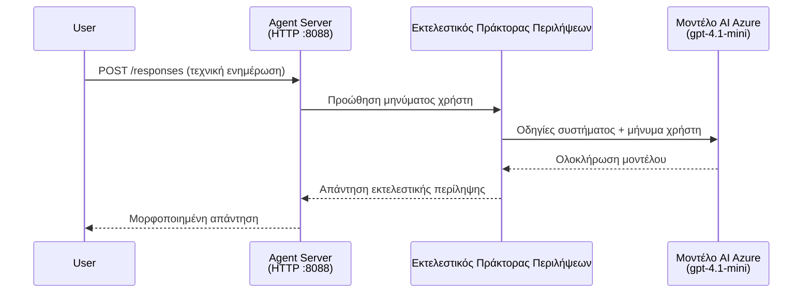
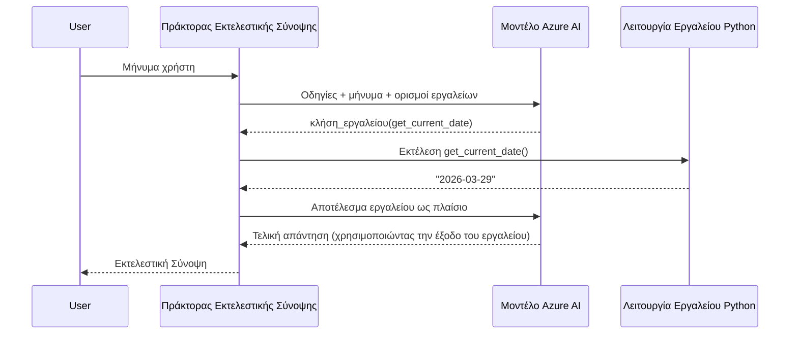

# Module 4 - Ρυθμίστε Οδηγίες, Περιβάλλον & Εγκαταστήστε Εξαρτήσεις

Σε αυτό το module, προσαρμόζετε τα αυτόματα δημιουργημένα αρχεία του agent από το Module 3. Εδώ μετατρέπετε το γενικό σκελετό στο **δικό σας** agent - γράφοντας οδηγίες, ρυθμίζοντας μεταβλητές περιβάλλοντος, προαιρετικά προσθέτοντας εργαλεία και εγκαθιστώντας εξαρτήσεις.

> **Υπενθύμιση:** Η επέκταση Foundry δημιούργησε αυτόματα τα αρχεία του project σας. Τώρα τα τροποποιείτε εσείς. Δείτε τον φάκελο [`agent/`](../../../../../workshop/lab01-single-agent/agent) για ένα πλήρες λειτουργικό παράδειγμα προσαρμοσμένου agent.

---

## Πώς συνδέονται τα συστατικά μεταξύ τους

### Κύκλος ζωής αίτησης (μεμονωμένος agent)


> **Με εργαλεία:** Αν ο agent έχει καταχωρημένα εργαλεία, το μοντέλο μπορεί να επιστρέψει κλήση εργαλείου αντί για άμεση ολοκλήρωση. Το πλαίσιο εκτελεί το εργαλείο τοπικά, τροφοδοτεί το αποτέλεσμα πίσω στο μοντέλο, και το μοντέλο στη συνέχεια παράγει την τελική απάντηση.


---

## Βήμα 1: Ρυθμίστε μεταβλητές περιβάλλοντος

Ο σκελετός δημιούργησε ένα αρχείο `.env` με τιμές θέσης. Πρέπει να συμπληρώσετε τις πραγματικές τιμές από το Module 2.

1. Στο έργο που δημιουργήθηκε, ανοίξτε το αρχείο **`.env`** (βρίσκεται στη ρίζα του έργου).
2. Αντικαταστήστε τις τιμές θέσης με τις πραγματικές λεπτομέρειες του έργου Foundry:

   ```env
   PROJECT_ENDPOINT=https://<your-account>.services.ai.azure.com/api/projects/<your-project>
   MODEL_DEPLOYMENT_NAME=gpt-4.1-mini
   ```

3. Αποθηκεύστε το αρχείο.

### Πού θα βρείτε αυτές τις τιμές

| Τιμή | Πώς να τη βρείτε |
|-------|---------------|
| **Endpoint έργου** | Ανοίξτε την πλευρική γραμμή **Microsoft Foundry** στο VS Code → κάντε κλικ στο έργο σας → το URL του endpoint εμφανίζεται στην προβολή λεπτομερειών. Μοιάζει με `https://<account-name>.services.ai.azure.com/api/projects/<project-name>` |
| **Όνομα ανάπτυξης μοντέλου** | Στην πλευρική γραμμή Foundry, επεκτείνετε το έργο σας → δείτε κάτω από **Models + endpoints** → το όνομα είναι δίπλα στο αναπτυγμένο μοντέλο (π.χ., `gpt-4.1-mini`) |

> **Ασφάλεια:** Ποτέ μην κάνετε commit το αρχείο `.env` στον έλεγχο έκδοσης. Συμπεριλαμβάνεται ήδη στο `.gitignore` από προεπιλογή. Αν δεν είναι, προσθέστε το:
> ```
> .env
> ```

### Πώς ρέουν οι μεταβλητές περιβάλλοντος

Η αλυσίδα αντιστοίχησης είναι: `.env` → `main.py` (διαβάζει μέσω `os.getenv`) → `agent.yaml` (αντιστοιχεί σε μεταβλητές περιβάλλοντος κοντέινερ κατά την ανάπτυξη).

Στο `main.py`, ο σκελετός διαβάζει αυτές τις τιμές ως εξής:

```python
PROJECT_ENDPOINT = os.getenv("AZURE_AI_PROJECT_ENDPOINT") or os.getenv("PROJECT_ENDPOINT")
MODEL_DEPLOYMENT_NAME = os.getenv("AZURE_AI_MODEL_DEPLOYMENT_NAME", os.getenv("MODEL_DEPLOYMENT_NAME", "gpt-4.1-mini"))
```

Αποδέχονται και τα δύο `AZURE_AI_PROJECT_ENDPOINT` και `PROJECT_ENDPOINT` (το `agent.yaml` χρησιμοποιεί το πρόθεμα `AZURE_AI_*`).

---

## Βήμα 2: Γράψτε οδηγίες για τον agent

Αυτή είναι η πιο σημαντική προσαρμογή. Οι οδηγίες ορίζουν την προσωπικότητα, τη συμπεριφορά, τη μορφή εξόδου και τους περιορισμούς ασφάλειας του agent σας.

1. Ανοίξτε το `main.py` στο έργο σας.
2. Βρείτε το string με τις οδηγίες (ο σκελετός περιλαμβάνει μια προεπιλεγμένη/γενική).
3. Αντικαταστήστε το με λεπτομερείς, δομημένες οδηγίες.

### Τι περιλαμβάνουν καλές οδηγίες

| Συστατικό | Σκοπός | Παράδειγμα |
|-----------|---------|---------|
| **Ρόλος** | Τι είναι και τι κάνει ο agent | "Είστε agent για εκτελεστική περίληψη" |
| **Κοινό** | Για ποιους είναι οι απαντήσεις | "Ανώτερα στελέχη με περιορισμένο τεχνικό υπόβαθρο" |
| **Ορισμός εισόδου** | Τι είδους εντολές χειρίζεται | "Τεχνικές αναφορές περιστατικών, επιχειρησιακές ενημερώσεις" |
| **Μορφή εξόδου** | Ακριβής δομή των απαντήσεων | "Εκτελεστική Περίληψη: - Τι συνέβη: ... - Επιχειρησιακό αντίκτυπο: ... - Επόμενο βήμα: ..." |
| **Κανόνες** | Περιορισμοί και συνθήκες άρνησης | "ΜΗΝ προσθέτετε πληροφορίες πέρα από αυτές που δόθηκαν" |
| **Ασφάλεια** | Αποτροπή κακής χρήσης και ψευδών πληροφοριών | "Αν η είσοδος δεν είναι σαφής, ζητήστε διευκρίνιση" |
| **Παραδείγματα** | Ζεύγη εισόδου/εξόδου για καθοδήγηση συμπεριφοράς | Συμπεριλάβετε 2-3 παραδείγματα με διαφορετικές εισόδους |

### Παράδειγμα: Οδηγίες agent εκτελεστικής περίληψης

Εδώ είναι οι οδηγίες που χρησιμοποιήθηκαν στο εργαστήριο στο [`agent/main.py`](../../../../../workshop/lab01-single-agent/agent/main.py):

```python
AGENT_INSTRUCTIONS = """You are an "Explain Like I'm an Executive" agent.

Purpose:
Your job is to translate complex technical or operational information into
clear, concise, and outcome-focused summaries that can be easily understood
by non-technical executives.

Audience:
Senior leaders with limited technical background who care about impact,
risk, and what happens next.

What you must do:
- Rephrase the input so it is understandable to a non-technical audience
- Prioritize clarity, brevity, and outcomes over technical accuracy
- Remove technical jargon, logs, metrics, stack traces, and deep root-cause details
- Translate technical causes into simple cause-and-effect statements
- Explicitly call out business impact
- Always include a clear next step or action
- Maintain a neutral, factual, and calm executive tone
- Do NOT add new facts or speculate beyond the input

Standard Output Structure (always use this wording):

Executive Summary:
- What happened: <plain-language description>
- Business impact: <clear, non-technical impact>
- Next step: <clear action or mitigation>

Rules:
- Keep responses under 100 words
- Do NOT add facts beyond the input
- If input is unclear, ask for clarification
"""
```

4. Αντικαταστήστε την υπάρχουσα συμβολοσειρά οδηγιών στο `main.py` με τις δικές σας.
5. Αποθηκεύστε το αρχείο.

---

## Βήμα 3: (Προαιρετικό) Προσθέστε προσαρμοσμένα εργαλεία

Οι φιλοξενούμενοι agents μπορούν να εκτελέσουν **τοπικές συναρτήσεις Python** ως [εργαλεία](https://learn.microsoft.com/azure/foundry/agents/concepts/tool-catalog). Αυτό είναι μεγάλο πλεονέκτημα των φιλοξενούμενων agents με κώδικα έναντι των agents μόνο με prompt - ο agent σας μπορεί να τρέχει αυθαίρετη λογική server-side.

### 3.1 Ορίστε μια συνάρτηση εργαλείου

Προσθέστε μια συνάρτηση εργαλείου στο `main.py`:

```python
from agent_framework import tool

@tool
def get_current_date() -> str:
    """Returns the current date in YYYY-MM-DD format."""
    from datetime import date
    return str(date.today())
```

Ο διακοσμητής `@tool` μετατρέπει μια κανονική συνάρτηση Python σε εργαλείο agent. Το docstring γίνεται η περιγραφή του εργαλείου που βλέπει το μοντέλο.

### 3.2 Καταχωρήστε το εργαλείο με τον agent

Κατά τη δημιουργία του agent μέσω του context manager `.as_agent()`, περάστε το εργαλείο στην παράμετρο `tools`:

```python
async with AzureAIAgentClient(
    project_endpoint=PROJECT_ENDPOINT,
    model_deployment_name=MODEL_DEPLOYMENT_NAME,
    credential=credential,
).as_agent(
    name="my-agent",
    instructions=AGENT_INSTRUCTIONS,
    tools=[get_current_date],
) as agent:
    server = from_agent_framework(agent)
    await server.run_async()
```

### 3.3 Πώς λειτουργούν οι κλήσεις εργαλείου

1. Ο χρήστης στέλνει prompt.
2. Το μοντέλο αποφασίζει αν χρειάζεται εργαλείο (με βάση το prompt, τις οδηγίες και τις περιγραφές εργαλείων).
3. Αν χρειάζεται, το πλαίσιο καλεί την Python συνάρτηση τοπικά (μέσα στο κοντέινερ).
4. Η τιμή επιστροφής του εργαλείου στέλνεται πίσω ως context στο μοντέλο.
5. Το μοντέλο παράγει την τελική απάντηση.

> **Τα εργαλεία εκτελούνται server-side** - τρέχουν μέσα στο κοντέινερ σας, όχι στον περιηγητή του χρήστη ή το μοντέλο. Αυτό σημαίνει ότι μπορείτε να έχετε πρόσβαση σε βάσεις δεδομένων, APIs, συστήματα αρχείων, ή όποια βιβλιοθήκη Python.

---

## Βήμα 4: Δημιουργία και ενεργοποίηση εικονικού περιβάλλοντος

Πριν εγκαταστήσετε εξαρτήσεις, δημιουργήστε ένα απομονωμένο περιβάλλον Python.

### 4.1 Δημιουργήστε το εικονικό περιβάλλον

Ανοίξτε τερματικό στο VS Code (`` Ctrl+` ``) και τρέξτε:

```powershell
python -m venv .venv
```

Αυτό δημιουργεί φάκελο `.venv` στον κατάλογο του έργου σας.

### 4.2 Ενεργοποιήστε το εικονικό περιβάλλον

**PowerShell (Windows):**

```powershell
.\.venv\Scripts\Activate.ps1
```

**Command Prompt (Windows):**

```cmd
.venv\Scripts\activate.bat
```

**macOS/Linux (Bash):**

```bash
source .venv/bin/activate
```

Θα δείτε `(.venv)` στην αρχή της γραμμής εντολών, που σημαίνει ότι το εικονικό περιβάλλον είναι ενεργό.

### 4.3 Εγκατάσταση εξαρτήσεων

Με ενεργό το εικονικό περιβάλλον, εγκαταστήστε τα απαιτούμενα πακέτα:

```powershell
pip install -r requirements.txt
```

Αυτό εγκαθιστά:

| Πακέτο | Σκοπός |
|---------|---------|
| `agent-framework-azure-ai==1.0.0rc3` | Ενσωμάτωση Azure AI για το [Microsoft Agent Framework](https://learn.microsoft.com/agent-framework/overview/) |
| `agent-framework-core==1.0.0rc3` | Βασικός χρόνος εκτέλεσης για κατασκευή agents (περιλαμβάνει `python-dotenv`) |
| `azure-ai-agentserver-agentframework==1.0.0b16` | Χρόνος εκτέλεσης agent server για [Foundry Agent Service](https://learn.microsoft.com/azure/foundry/agents/overview) |
| `azure-ai-agentserver-core==1.0.0b16` | Βασικές αφαιρέσεις agent server |
| `debugpy` | Αποσφαλμάτωση Python (επιτρέπει debugging F5 στο VS Code) |
| `agent-dev-cli` | Τοπικό CLI ανάπτυξης για δοκιμή agents |

### 4.4 Επαλήθευση εγκατάστασης

```powershell
pip list | Select-String "agent-framework|agentserver"
```

Αναμενόμενη έξοδος:
```
agent-framework-azure-ai   1.0.0rc3
agent-framework-core       1.0.0rc3
azure-ai-agentserver-agentframework 1.0.0b16
azure-ai-agentserver-core  1.0.0b16
```

---

## Βήμα 5: Επαλήθευση αυθεντικοποίησης

Ο agent χρησιμοποιεί το [`DefaultAzureCredential`](https://learn.microsoft.com/azure/developer/python/sdk/authentication/credential-chains#defaultazurecredential-overview) που δοκιμάζει πολλούς τρόπους αυθεντικοποίησης σε αυτή τη σειρά:

1. **Μεταβλητές περιβάλλοντος** - `AZURE_CLIENT_ID`, `AZURE_TENANT_ID`, `AZURE_CLIENT_SECRET` (service principal)
2. **Azure CLI** - παίρνει την τρέχουσα συνεδρία `az login`
3. **VS Code** - χρησιμοποιεί τον λογαριασμό με τον οποίο συνδεθήκατε στο VS Code
4. **Managed Identity** - χρησιμοποιείται όταν τρέχει στο Azure (κατά την ανάπτυξη)

### 5.1 Επαλήθευση για τοπική ανάπτυξη

Ένα τουλάχιστον από αυτά πρέπει να λειτουργεί:

**Επιλογή Α: Azure CLI (συνιστάται)**

```powershell
az account show --query "{name:name, id:id}" --output table
```

Αναμενόμενο: Εμφανίζει το όνομα και το ID της συνδρομής σας.

**Επιλογή Β: Σύνδεση VS Code**

1. Κοιτάξτε κάτω αριστερά στο VS Code για το εικονίδιο **Accounts**.
2. Αν δείτε το όνομα του λογαριασμού σας, είστε αυθεντικοποιημένοι.
3. Αν όχι, κάντε κλικ στο εικονίδιο → **Sign in to use Microsoft Foundry**.

**Επιλογή Γ: Service principal (για CI/CD)**

```powershell
$env:AZURE_TENANT_ID = "<your-tenant-id>"
$env:AZURE_CLIENT_ID = "<your-client-id>"
$env:AZURE_CLIENT_SECRET = "<your-client-secret>"
```

### 5.2 Συχνό πρόβλημα αυθεντικοποίησης

Αν είστε συνδεδεμένοι με πολλούς λογαριασμούς Azure, βεβαιωθείτε ότι είναι επιλεγμένη η σωστή συνδρομή:

```powershell
az account set --subscription "<your-subscription-id>"
```

---

### Σημείο ελέγχου

- [ ] Το αρχείο `.env` έχει έγκυρα `PROJECT_ENDPOINT` και `MODEL_DEPLOYMENT_NAME` (όχι τιμές θέσης)
- [ ] Οι οδηγίες του agent είναι προσαρμοσμένες στο `main.py` - ορίζουν ρόλο, κοινό, μορφή εξόδου, κανόνες και περιορισμούς ασφαλείας
- [ ] (Προαιρετικό) Ορίζονται και καταχωρούνται προσαρμοσμένα εργαλεία
- [ ] Το εικονικό περιβάλλον έχει δημιουργηθεί και ενεργοποιηθεί (`(.venv)` εμφανίζεται στην γραμμή εντολών)
- [ ] Το `pip install -r requirements.txt` ολοκληρώνεται επιτυχώς χωρίς σφάλματα
- [ ] Το `pip list | Select-String "azure-ai-agentserver"` δείχνει ότι το πακέτο είναι εγκατεστημένο
- [ ] Η αυθεντικοποίηση είναι έγκυρη - `az account show` επιστρέφει τη συνδρομή σας ή είστε συνδεδεμένοι στο VS Code

---

**Προηγούμενο:** [03 - Δημιουργία φιλοξενούμενου agent](03-create-hosted-agent.md) · **Επόμενο:** [05 - Δοκιμή τοπικά →](05-test-locally.md)

---

<!-- CO-OP TRANSLATOR DISCLAIMER START -->
**Αποποίηση ευθυνών**:  
Αυτό το έγγραφο έχει μεταφραστεί χρησιμοποιώντας την υπηρεσία αυτόματης μετάφρασης AI [Co-op Translator](https://github.com/Azure/co-op-translator). Παρότι επιδιώκουμε την ακρίβεια, παρακαλούμε να λάβετε υπόψη ότι οι αυτοματοποιημένες μεταφράσεις ενδέχεται να περιέχουν σφάλματα ή ανακρίβειες. Το αρχικό έγγραφο στη μητρική του γλώσσα πρέπει να θεωρείται η επίσημη πηγή. Για κρίσιμες πληροφορίες, συνιστάται η επαγγελματική μετάφραση από ανθρώπους. Δεν φέρουμε ευθύνη για τυχόν παρεξηγήσεις ή λανθασμένες ερμηνείες που προκύπτουν από τη χρήση αυτής της μετάφρασης.
<!-- CO-OP TRANSLATOR DISCLAIMER END -->