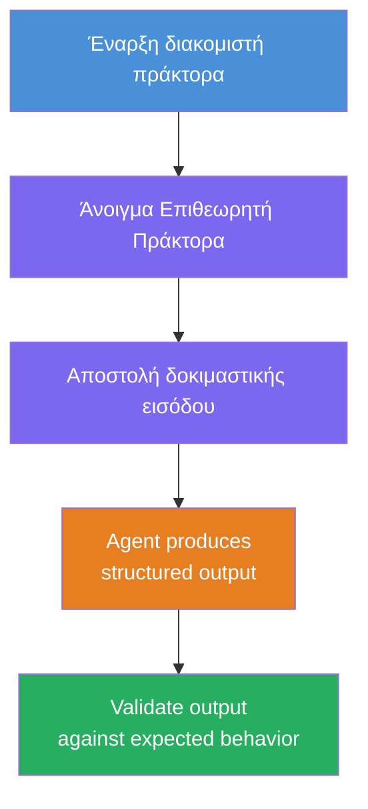
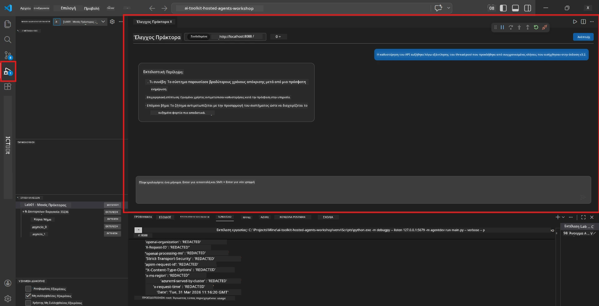
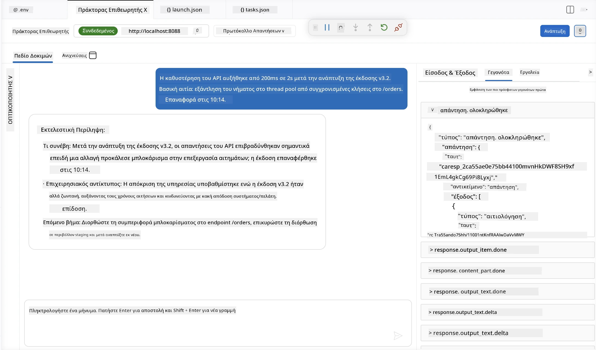

# Ενότητα 4 - Τοπικός Έλεγχος

⏱️ ~10 λεπτά

Σε αυτήν την ενότητα, εκτελείτε τον πράκτορά σας τοπικά και επαληθεύετε ότι λειτουργεί σωστά χρησιμοποιώντας **δοκιμές λειτουργίας καλού διαδρομής**. Θα χρησιμοποιήσετε τον Επιθεωρητή Πράκτορα (οπτικό UI) ή άμεσες κλήσεις HTTP για να επιβεβαιώσετε ότι ο πράκτορας παράγει δομημένες, ακριβείς απαντήσεις.

### Ροή τοπικών δοκιμών



---

## Επιλογή 1: Πατήστε F5 - Αποσφαλμάτωση με τον Επιθεωρητή Πράκτορα (προτεινόμενη)

### Ξεκινήστε τον αποσφαλματωτή

1. Ανοίξτε τον φάκελο **executive-summary-agent/** απευθείας στο VS Code (`Αρχείο → Άνοιγμα Φακέλου`).
2. Ανοίξτε τον πίνακα **Εκτέλεση και Αποσφαλμάτωση** (`Ctrl+Shift+D`).
3. Επιλέξτε **Debug Local Agent Server** από το αναδυόμενο μενού.
4. Πατήστε **F5** (ή κάντε κλικ στο ▶ Έναρξη Αποσφαλμάτωσης).

> ⚠️ **Σημαντικό: Επιλέξτε τον διερμηνέα Python σας**
> Εάν λάβετε "ModuleNotFoundError" ή ο αποσφαλματωτής δεν ξεκινά, πρέπει να υποδείξετε στο VS Code να χρησιμοποιήσει το εικονικό περιβάλλον σας:
  > 1. Πατήστε `Ctrl+Shift+P` → πληκτρολογήστε **Python: Select Interpreter**.
  > 2. Επιλέξτε τον διερμηνέα που βρίσκεται στον φάκελο `.venv` του έργου σας (π.χ., `.\.venv\Scripts\python.exe` στα Windows).
  > 3. Επανεκκινήστε τη συνεδρία αποσφαλμάτωσης.
> Εάν συνεχίσετε να εμφανίζετε σφάλματα, ενημερώστε χειροκίνητα το αρχείο `tasks.json` ως εξής:
  > 1. Μεταβείτε στο αρχείο `.vscode/tasks.json`
  > 2. Βρείτε την εντολή με την ετικέτα: `Run Agent/Workflow HTTP Server`
  > 3. Ενημερώστε την τιμή της εντολής ως εξής: `"value": "${workspaceFolder}/.venv/bin/python",`

### Τι συμβαίνει

1. Ο διακομιστής HTTP ξεκινά στο `http://localhost:8088/responses`.
2. Ο πίνακας **Agent Inspector** ανοίγει αυτόματα - ένα οπτικό περιβάλλον συνομιλίας για δοκιμές.
3. Τα σημεία διακοπής ενεργοποιούνται στο `main.py`.

Παρακολουθήστε το Τερματικό για:
```
Starting executive summary hosted agent
Executive agent server running on http://localhost:8088
```

> **Εάν ο Επιθεωρητής Πράκτορα δεν ανοίγει:** Πατήστε `Ctrl+Shift+P` → **Foundry Toolkit: Open Agent Inspector**.



> *Το στιγμιότυπο οθόνης μπορεί να εμφανίζει παλαιότερη επωνυμία 'AI TOOLKIT' από προηγούμενη έκδοση επέκτασης.*

---

## Επιλογή 2: Δοκιμή μέσω Τερματικού (εναλλακτική)

Ξεκινήστε τον πράκτορα σε ένα τερματικό, στείλτε αιτήματα από άλλο:

```bash
# Τερματικός 1: Εκκίνηση πράκτορα
cd executive-summary-agent/
source .venv/bin/activate
python main.py
```

```bash
# Τερματικό 2: Αποστολή δοκιμής (curl)
curl -sS -X POST http://localhost:8088/responses \
  -H "Content-Type: application/json" \
  -d '{"input": "The API latency increased due to thread pool exhaustion caused by sync calls in v3.2.", "stream": false}'
```

---

## Δοκιμές σεναρίων: Επαλήθευση καλού διαδρομής

Εκτελέστε **και τα τρία** παρακάτω σενάρια. Αυτά επαληθεύουν ότι ο πράκτοράς σας παράγει σωστή, δομημένη έξοδο για ρεαλιστικές εισόδους.



### Σενάριο 1: IT Περιστατικό - Αύξηση καθυστέρησης API

**Είσοδος:**
```
The API latency increased from 200ms to 2s after deploying v3.2.
Root cause: thread pool starvation from synchronous calls in /orders.
Rolled back at 10:14.
```

**Αναμενόμενη συμπεριφορά:**
- ✅ Ακολουθεί τη δομή "Executive Summary" (Τι συνέβη / Επιχειρηματικός αντίκτυπος / Επόμενο βήμα)
- ✅ Χωρίς τεχνική ορολογία (όχι "thread pool", όχι "/orders", όχι "v3.2")
- ✅ Δηλώνει σαφώς τον επιχειρηματικό αντίκτυπο (π.χ., οι χρήστες είχαν καθυστερήσεις)
- ✅ Συμπεριλαμβάνει επόμενο βήμα (π.χ., διόρθωση αναπτυχθείσα, παρακολούθηση σε εφαρμογή)

---

### Σενάριο 2: Data Pipeline - Αποτυχία ETL

**Είσοδος:**
```
The nightly ETL job failed because the upstream schema changed. APAC dashboards show missing data.
```

**Αναμενόμενη συμπεριφορά:**
- ✅ Συνοψίζει την αποτυχία ανανέωσης δεδομένων σε απλή γλώσσα
- ✅ Αναφέρει τον αντίκτυπο στον πίνακα ελέγχου APAC
- ✅ Συμπεριλαμβάνει επόμενο βήμα αποκατάστασης
- ✅ ΔΕΝ αναφέρει όρους όπως "ETL", "schema" ή άλλους τεχνικούς όρους

---

### Σενάριο 3: Ασφάλεια - Εκτεθειμένα στοιχεία πιστοποίησης

**Είσοδος:**
```
Static analysis flagged a hardcoded secret in the repository.
The secret may have been exposed in commit history.
```

**Αναμενόμενη συμπεριφορά:**
- ✅ Περιγράφει πρόβλημα στοιχείων/ασφάλειας με γλώσσα φιλική προς διευθυντικά στελέχη
- ✅ Επισημαίνει πιθανό κίνδυνο (μη εξουσιοδοτημένη πρόσβαση)
- ✅ Δηλώνει ενέργεια αποκατάστασης (περιστροφή κωδικών, έλεγχος)
- ✅ ΔΕΝ περιλαμβάνει όρους όπως "στατική ανάλυση", "ιστορικό commit", ή "hardcoded"

---

## Κριτήρια επαλήθευσης

Για κάθε σενάριο, ελέγξτε:

| # | Κριτήριο | Προϋπόθεση Επιτυχίας |
|---|----------|---------------------|
| 1 | **Δομή** | Η απάντηση χρησιμοποιεί τη μορφή "Executive Summary" με και τις τρεις κουκκίδες |
| 2 | **Απλή γλώσσα** | Χωρίς τεχνική ορολογία που δεν θα καταλάβαινε ένας διευθυντής |
| 3 | **Ακρίβεια** | Η σύνοψη αντανακλά την είσοδο - χωρίς επινοημένες λεπτομέρειες |
| 4 | **Συντομία** | Η απάντηση είναι κάτω από 100 λέξεις |
| 5 | **Επόμενο βήμα** | Δηλώνεται σαφής ενέργεια ή μείωση κινδύνου |

---

## Συμβουλές αποσφαλμάτωσης

| Πρόβλημα | Διόρθωση |
|---------|----------|
| Ο πράκτορας δεν ξεκινά | Ελέγξτε τις τιμές `.env`, βεβαιωθείτε ότι το venv είναι ενεργοποιημένο, εκτελέστε `pip install -r requirements.txt` |
| Κενή ή γενική απάντηση | Επανεξετάστε τις οδηγίες στο `main.py` - βεβαιωθείτε ότι ορίζεται η μορφή εξόδου |
| Η απάντηση περιέχει ορολογία | Ενισχύστε τους κανόνες "αφαίρεσης τεχνικών όρων" στις οδηγίες |
| Ο Επιθεωρητής Πράκτορα δεν ανοίγει | `Ctrl+Shift+P` → **Foundry Toolkit: Open Agent Inspector** |
| Σφάλματα μοντέλου στο Τερματικό | Βεβαιωθείτε ότι το `AZURE_AI_MODEL_DEPLOYMENT_NAME` ταιριάζει ακριβώς (ευαίσθητο σε πεζά-κεφαλαία) |

---

### ✅ Σημείο ελέγχου

- [ ] Ο πράκτορας ξεκινά τοπικά χωρίς σφάλματα
- [ ] Ο Επιθεωρητής Πράκτορα ανοίγει και εμφανίζει περιβάλλον συνομιλίας (εάν χρησιμοποιείτε F5)
- [ ] **Σενάριο 1** (IT περιστατικό) - δομημένο Executive Summary, χωρίς ορολογία
- [ ] **Σενάριο 2** (data pipeline) - σχετική σύνοψη με επιχειρηματικό αντίκτυπο
- [ ] **Σενάριο 3** (ειδοποίηση ασφαλείας) - κατάλληλη επικοινωνία κινδύνου
- [ ] Όλες οι απαντήσεις ακολουθούν την ορισμένη δομή εξόδου

> **Αποθηκεύστε τις απαντήσεις σας** (αντιγράψτε ή κάντε στιγμιότυπο οθόνης) - θα τις συγκρίνετε με τα αποτελέσματα στο σύννεφο στην Ενότητα 06.

---

**Προηγούμενο:** [03 - Configure & Code](03-configure-and-code.md) · **Επόμενο:** [05 - Deploy to Foundry →](05-deploy-to-foundry.md)

---

<!-- CO-OP TRANSLATOR DISCLAIMER START -->
**Αποποίηση ευθυνών**:
Αυτό το έγγραφο έχει μεταφραστεί χρησιμοποιώντας την υπηρεσία μετάφρασης με τεχνητή νοημοσύνη [Co-op Translator](https://github.com/Azure/co-op-translator). Ενώ επιδιώκουμε την ακρίβεια, παρακαλούμε να έχετε υπόψη ότι οι αυτοματοποιημένες μεταφράσεις ενδέχεται να περιέχουν λάθη ή ανακρίβειες. Το πρωτότυπο έγγραφο στη μητρική του γλώσσα πρέπει να θεωρείται η αυθεντική πηγή. Για κρίσιμες πληροφορίες, συνιστάται επαγγελματική ανθρώπινη μετάφραση. Δεν φέρουμε ευθύνη για τυχόν παρεξηγήσεις ή λανθασμένες ερμηνείες που προκύπτουν από τη χρήση αυτής της μετάφρασης.
<!-- CO-OP TRANSLATOR DISCLAIMER END -->