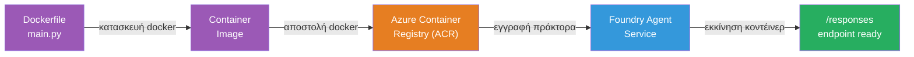
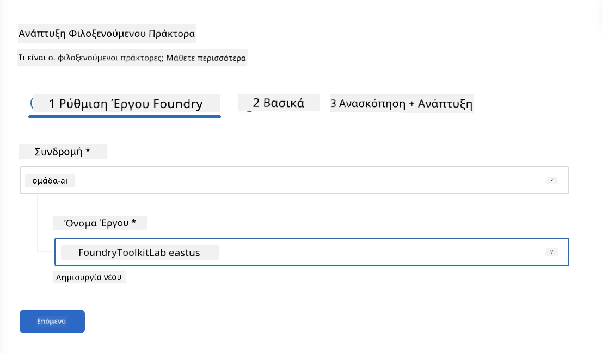
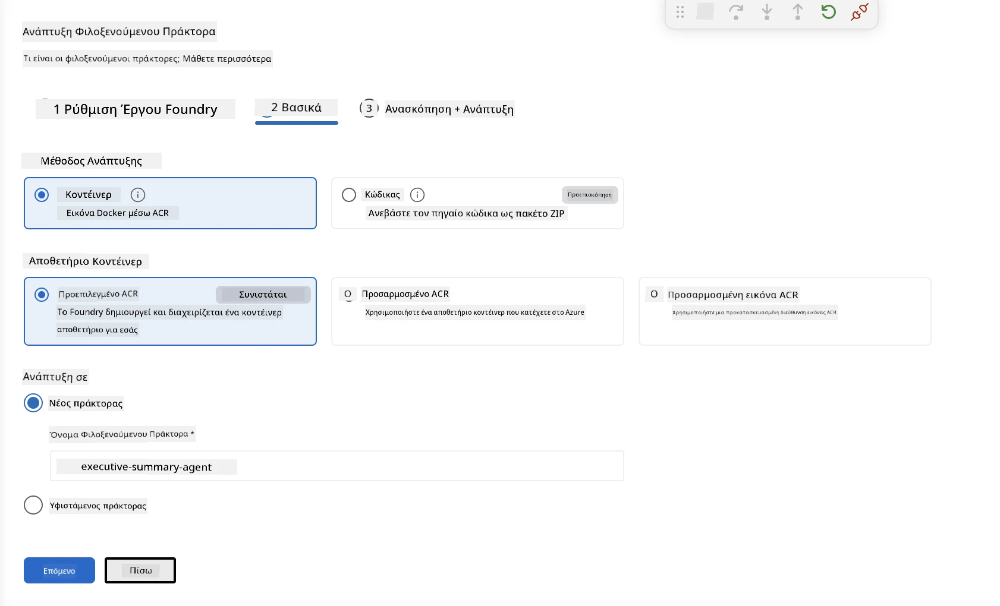
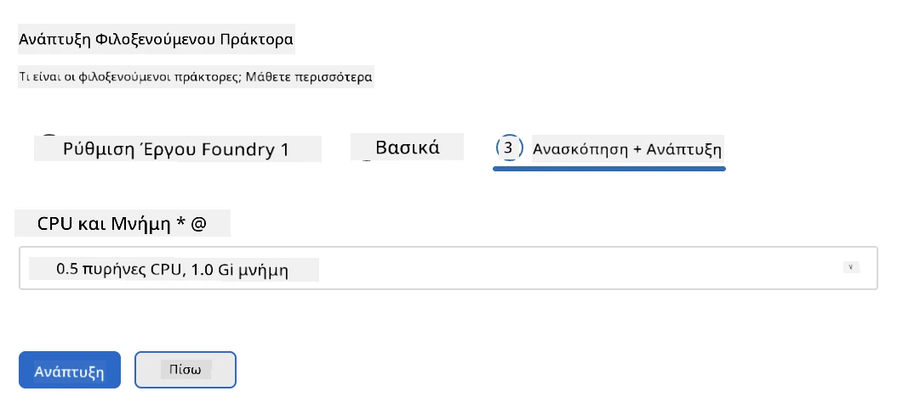
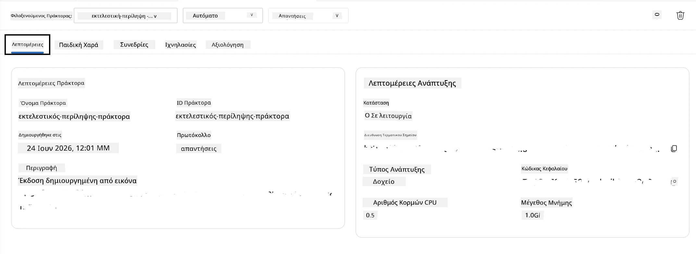

# Ενότητα 5 - Ανάπτυξη στην Υπηρεσία Foundry Agent

⏱️ ~10 λεπτά

> ⚠️ **Χρήστες διαδρομής B:** Αυτή η ενότητα απαιτεί συνδρομή Foundry. Εάν χρησιμοποιείτε το Foundry Local, παραλείψτε στην [Ενότητα 07 - Περίληψη](07-summary.md). Έχετε ολοκληρώσει με επιτυχία τη ροή εργασίας τοπικής ανάπτυξης!

Σε αυτήν την ενότητα, αναπτύσσετε τον τοπικά δοκιμασμένο πράκτορά σας στο Microsoft Foundry ως **Φιλοξενούμενο Πράκτορα**. Η ανάπτυξη δημιουργεί μια εικόνα κοντέινερ, τη στέλνει στο Azure Container Registry και ξεκινά τον πράκτορα στην διαχειριζόμενη υποδομή του Foundry.

### Διαδικασία ανάπτυξης

---

## Έλεγχος προαπαιτούμενων

Πριν την ανάπτυξη, επιβεβαιώστε:

- [ ] Ο πράκτορας περνά όλα τα 3 τοπικά σενάρια από την [Ενότητα 04](04-test-locally.md)
- [ ] Έχετε τον ρόλο **Azure AI User** σε επίπεδο έργου ([Ενότητα 01, Ανάθεση RBAC](01-setup.md#deploy-a-model--assign-rbac))
- [ ] Έχετε συνδεθεί στο Azure στο VS Code (το εικονίδιο Λογαριασμών εμφανίζει το όνομά σας)

---

## Βήμα 1: Ξεκινήστε την ανάπτυξη

### Επιλογή Α: Ανάπτυξη από τον Agent Inspector (συνιστάται)

Αν ο Agent Inspector είναι ανοιχτός (από δοκιμές):
1. Κάντε κλικ στο κουμπί **Deploy** στην πάνω δεξιά γωνία (εικονίδιο σύννεφου ↑).

### Επιλογή Β: Ανάπτυξη από την Command Palette

1. Πατήστε `Ctrl+Shift+P` → **Foundry Toolkit: Deploy Hosted Agent**.

---

## Βήμα 2: Διαμόρφωση της ανάπτυξης

Ο οδηγός σας ζητάει:

| Ερώτηση | Επιλογή |
|--------|-----------|
| **Συνδρομή** | Η Συνδρομή σας στο Azure |
| **Στόχος έργου** | Το έργο Foundry σας (π.χ., `workshop-agents`) |

Πατήστε **επόμενο** για να ρυθμίσετε τον πράκτορά σας.

| Ερώτηση | Επιλογή |
|--------|-----------|
| **Μέθοδος ανάπτυξης** | Container |
| **Κατάστημα κοντέινερ** | **Προεπιλεγμένο ACR** (Το Microsoft Foundry δημιουργεί και διαχειρίζεται ένα για εσάς) |
| **Ανάπτυξη σε** | Νέος Πράκτορας (όνομα, `executive-summary-agent`) |

Πατήστε **επόμενο** για να ελέγξετε και να αναπτύξετε τον πράκτορά σας.

| Ερώτηση | Επιλογή |
|--------|-----------|
| **CPU και μνήμη** | **0.25 πυρήνες CPU, 0.5 Gi μνήμη** (αρκετά για το εργαστήριο) |

---

## Βήμα 3: Ανάπτυξη και παρακολούθηση

1. Κάντε κλικ στο **Deploy**.
2. Παρακολουθήστε τον πίνακα **Output** (επιλέξτε **Microsoft Foundry** από το αναπτυσσόμενο).
3. Η ανάπτυξη εκτελεί τα ακόλουθα στάδια:
   - **Κατασκευή Docker** - δημιουργεί το κοντέινερ από το Dockerfile σας
   - **Αποστολή Docker** - στέλνει την εικόνα στο ACR (1–3 λεπτά στην πρώτη ανάπτυξη)
   - **Καταχώρηση πράκτορα** - δημιουργεί φιλοξενούμενο πράκτορα στο Foundry
   - **Εκκίνηση κοντέινερ** - ξεκινά με διαχειριζόμενη ταυτότητα συστήματος

4. Όταν ολοκληρωθεί, εμφανίζεται ειδοποίηση:
   > **ο πράκτορας μου αναπτύχθηκε επιτυχώς.** `Προβολή αρχείων καταγραφής` `Εκτέλεση πράκτορα`

5. Κάντε κλικ στο **Εκτέλεση πράκτορα** για να ανοίξετε το Agent Playground.

### Τιμές κατάστασης ανάπτυξης

| Κατάσταση | Σημασία |
|--------|---------|
| **Εκτελείται** | Το κοντέινερ είναι έτοιμο, ο πράκτορας ανταποκρίνεται |
| **Σε αναμονή** | Το κοντέινερ ξεκινά - περιμένετε 30–60 δευτερόλεπτα |
| **Απέτυχε** | Ελέγξτε τα αρχεία καταγραφής (δείτε την αντιμετώπιση προβλημάτων παρακάτω) |

---

## Συνηθισμένα σφάλματα ανάπτυξης

| Σφάλμα | Αιτία | Επιδιόρθωση |
|-------|-----------|-----|
| Άδεια `agents/write` απορρίφθηκε | Λείπει ο ρόλος **Azure AI User** σε επίπεδο έργου | [Ενότητα 01, Ανάθεση RBAC](01-setup.md#deploy-a-model--assign-rbac) |
| Το Docker δεν τρέχει | Το Docker Desktop δεν έχει ξεκινήσει | Ξεκινήστε το Docker Desktop → επιβεβαιώστε με `docker info` |
| Εξουσιοδότηση ACR | Η διαχειριζόμενη ταυτότητα δεν μπορεί να τραβήξει την εικόνα | Δείτε την [Ενότητα 08 - Αντιμετώπιση προβλημάτων](08-troubleshooting.md) |

---

### ✅ Σημείο ελέγχου

- [ ] Η ανάπτυξη ολοκληρώθηκε χωρίς σφάλματα
- [ ] Ο πράκτορας εμφανίζεται κάτω από **Hosted Agents (Preview)** στην πλαϊνή μπάρα του Foundry
- [ ] Η κατάσταση του κοντέινερ εμφανίζει **Εκτελείται**
- [ ] Η καρτέλα Agent Playground άνοιξε δείχνοντας λεπτομέρειες πράκτορα και URL τελικού σημείου

---

**Προηγούμενο:** [04 - Τοπικός Έλεγχος](04-test-locally.md) · **Επόμενο:** [06 - Επαλήθευση στο Playground →](06-verify-in-playground.md)

---

<!-- CO-OP TRANSLATOR DISCLAIMER START -->
**Αποποίηση ευθυνών**:
Αυτό το έγγραφο έχει μεταφραστεί χρησιμοποιώντας την υπηρεσία μετάφρασης με τεχνητή νοημοσύνη [Co-op Translator](https://github.com/Azure/co-op-translator). Ενώ επιδιώκουμε την ακρίβεια, παρακαλούμε να έχετε υπόψη ότι οι αυτοματοποιημένες μεταφράσεις ενδέχεται να περιέχουν λάθη ή ανακρίβειες. Το πρωτότυπο έγγραφο στη μητρική του γλώσσα πρέπει να θεωρείται η αυθεντική πηγή. Για κρίσιμες πληροφορίες, συνιστάται επαγγελματική ανθρώπινη μετάφραση. Δεν φέρουμε ευθύνη για τυχόν παρεξηγήσεις ή λανθασμένες ερμηνείες που προκύπτουν από τη χρήση αυτής της μετάφρασης.
<!-- CO-OP TRANSLATOR DISCLAIMER END -->