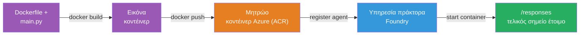
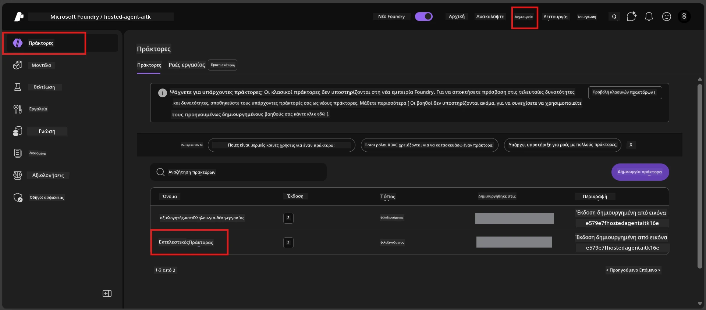

# Module 6 - Ανάπτυξη στην Υπηρεσία Foundry Agent

Σε αυτό το module, αναπτύσσετε τον τοπικά ελεγμένο πρακτορά σας στο Microsoft Foundry ως [**Hosted Agent**](https://learn.microsoft.com/azure/foundry/agents/concepts/hosted-agents). Η διαδικασία ανάπτυξης κατασκευάζει μια εικόνα Docker container από το έργο σας, την ωθεί στο [Azure Container Registry (ACR)](https://learn.microsoft.com/azure/container-registry/container-registry-intro), και δημιουργεί μια έκδοση hosted agent στην [Foundry Agent Service](https://learn.microsoft.com/azure/foundry/agents/overview).

### Pipeline ανάπτυξης


---

## Έλεγχος προϋποθέσεων

Πριν από την ανάπτυξη, επαληθεύστε κάθε στοιχείο παρακάτω. Η παράλειψή τους είναι η πιο συνηθισμένη αιτία αποτυχιών ανάπτυξης.

1. **Ο πράκτορας περνάει τα τοπικά smoke tests:**
   - Ολοκληρώσατε και τα 4 τεστ στο [Module 5](05-test-locally.md) και ο πράκτορας ανταποκρίθηκε σωστά.

2. **Έχετε ρόλο [Azure AI User](https://learn.microsoft.com/azure/foundry/concepts/rbac-foundry#built-in-roles):**
   - Αυτός απενεμήθη στο [Module 2, Βήμα 3](02-create-foundry-project.md). Αν δεν είστε σίγουροι, επιβεβαιώστε τώρα:
   - Azure Portal → πόρος **project** Foundry → **Access control (IAM)** → καρτέλα **Role assignments** → αναζητήστε το όνομά σας → επιβεβαιώστε ότι εμφανίζεται ο ρόλος **Azure AI User**.

3. **Έχετε συνδεθεί στο Azure μέσω VS Code:**
   - Ελέγξτε το εικονίδιο Λογαριασμών κάτω αριστερά στο VS Code. Το όνομα του λογαριασμού σας πρέπει να είναι ορατό.

4. **(Προαιρετικό) Το Docker Desktop λειτουργεί:**
   - Το Docker απαιτείται μόνο αν η επέκταση Foundry ζητήσει τοπικό build. Στις περισσότερες περιπτώσεις, η επέκταση διαχειρίζεται αυτόματα τα container builds κατά την ανάπτυξη.
   - Αν έχετε εγκαταστήσει Docker, ελέγξτε αν τρέχει: `docker info`

---

## Βήμα 1: Ξεκινήστε την ανάπτυξη

Έχετε δύο τρόπους ανάπτυξης - και οι δύο οδηγούν στο ίδιο αποτέλεσμα.

### Επιλογή Α: Ανάπτυξη από το Agent Inspector (συνιστάται)

Αν τρέχετε τον πράκτορα με το debugger (F5) και το Agent Inspector είναι ανοιχτό:

1. Κοιτάξτε στην **πάνω δεξιά γωνία** του πάνελ Agent Inspector.
2. Κάντε κλικ στο κουμπί **Deploy** (εικονίδιο σύννεφου με βέλος προς τα πάνω ↑).
3. Θα ανοίξει ο οδηγός ανάπτυξης.

### Επιλογή Β: Ανάπτυξη από την Command Palette

1. Πατήστε `Ctrl+Shift+P` για να ανοίξετε την **Command Palette**.
2. Πληκτρολογήστε: **Microsoft Foundry: Deploy Hosted Agent** και επιλέξτε την.
3. Θα ανοίξει ο οδηγός ανάπτυξης.

---

## Βήμα 2: Ρυθμίστε την ανάπτυξη

Ο οδηγός ανάπτυξης σας καθοδηγεί στην παραμετροποίηση. Συμπληρώστε κάθε προτροπή:

### 2.1 Επιλέξτε το στοχευόμενο project

1. Μια λίστα εμφανίζει τα έργα Foundry σας.
2. Επιλέξτε το project που δημιουργήσατε στο Module 2 (π.χ., `workshop-agents`).

### 2.2 Επιλέξτε το αρχείο container agent

1. Θα ζητηθεί να επιλέξετε το entry point του πράκτορα.
2. Επιλέξτε **`main.py`** (Python) - αυτό είναι το αρχείο που χρησιμοποιεί ο οδηγός για να αναγνωρίσει το έργο του πράκτορα.

### 2.3 Ρυθμίστε τους πόρους

| Ρύθμιση | Συνιστώμενη τιμή | Σημειώσεις |
|---------|------------------|------------|
| **CPU** | `0.25` | Προεπιλεγμένη, επαρκής για το workshop. Αύξηση για παραγωγικά workloads |
| **Μνήμη** | `0.5Gi` | Προεπιλεγμένη, επαρκής για το workshop |

Αυτές οι τιμές ταιριάζουν με αυτές στο `agent.yaml`. Μπορείτε να αποδεχτείτε τις προεπιλογές.

---

## Βήμα 3: Επιβεβαιώστε και αναπτύξτε

1. Ο οδηγός εμφανίζει συνοπτική περιγραφή ανάπτυξης με:
   - Όνομα στοχευόμενου project
   - Όνομα πράκτορα (από το `agent.yaml`)
   - Αρχείο container και πόρους
2. Εξετάστε τη σύνοψη και κλικάρετε **Confirm and Deploy** (ή **Deploy**).
3. Παρακολουθήστε την πρόοδο στο VS Code.

### Τι γίνεται κατά τη διάρκεια της ανάπτυξης (βήμα-βήμα)

Η ανάπτυξη είναι μια διαδικασία πολλών βημάτων. Παρακολουθήστε το πάνελ **Output** στο VS Code (επιλέξτε "Microsoft Foundry" από το dropdown) για να ακολουθείτε:

1. **Κατασκευή Docker** - Το VS Code κατασκευάζει μια εικόνα Docker container από το `Dockerfile` σας. Θα δείτε μηνύματα στρωμάτων Docker:
   ```
   Step 1/6 : FROM python:<version>-slim
   Step 2/6 : WORKDIR /app
   ...
   Successfully built abc123def456
   ```

2. **Αποστολή Docker (push)** - Η εικόνα ωθείται στο **Azure Container Registry (ACR)** που σχετίζεται με το Foundry project σας. Αυτό μπορεί να πάρει 1-3 λεπτά την πρώτη φορά (η βασική εικόνα είναι >100MB).

3. **Εγγραφή πράκτορα** - Η υπηρεσία Foundry Agent Service δημιουργεί νέο hosted agent (ή νέα έκδοση αν ο πράκτορας ήδη υπάρχει). Χρησιμοποιούνται τα μεταδεδομένα από το `agent.yaml`.

4. **Έναρξη container** - Το container ξεκινά στην υποδομή διαχείρισης Foundry. Η πλατφόρμα αντιστοιχίζει μια [system-managed identity](https://learn.microsoft.com/azure/foundry/agents/concepts/agent-identity) και εκθέτει το endpoint `/responses`.

> **Η πρώτη ανάπτυξη είναι πιο αργή** (το Docker πρέπει να στείλει όλα τα επίπεδα). Οι επόμενες είναι πιο γρήγορες γιατί το Docker προσωρινά αποθηκεύει τα αμετάβλητα στρώματα.

---

## Βήμα 4: Επαληθεύστε την κατάσταση ανάπτυξης

Μετά την ολοκλήρωση της εντολής ανάπτυξης:

1. Ανοίξτε το **Microsoft Foundry** sidebar κάνοντας κλικ στο εικονίδιο Foundry στη Γραμμή Δραστηριοτήτων.
2. Αναπτύξτε την ενότητα **Hosted Agents (Preview)** κάτω από το project σας.
3. Θα δείτε το όνομα του πράκτορα (π.χ., `ExecutiveAgent` ή το όνομα από το `agent.yaml`).
4. **Κλικ στο όνομα του πράκτορα** για να το αναπτύξετε.
5. Θα δείτε μία ή περισσότερες **εκδόσεις** (π.χ., `v1`).
6. Κάντε κλικ στην έκδοση για να δείτε τα **Container Details**.
7. Ελέγξτε το πεδίο **Status**:

   | Κατάσταση | Σημασία |
   |-----------|---------|
   | **Started** ή **Running** | Το container τρέχει και ο πράκτορας είναι έτοιμος |
   | **Pending** | Το container ξεκινά (περιμένετε 30-60 δευτερόλεπτα) |
   | **Failed** | Το container απέτυχε να ξεκινήσει (ελέγξτε τα logs - δείτε αντιμετώπιση προβλημάτων παρακάτω) |



> **Αν δείτε "Pending" για πάνω από 2 λεπτά:** Το container μπορεί να τραβάει την βασική εικόνα. Περιμένετε λίγο ακόμα. Αν παραμένει σε εκκρεμότητα, ελέγξτε τα logs του container.

---

## Κοινά σφάλματα ανάπτυξης και διορθώσεις

### Σφάλμα 1: Permission denied - `agents/write`

```
Error: lacks the required data action 
Microsoft.CognitiveServices/accounts/AIServices/agents/write 
to perform POST /api/projects/{projectName}/assistants operation.
```

**Βασική αιτία:** Δεν έχετε το ρόλο `Azure AI User` σε επίπεδο **project**.

**Διορθώσεις βήμα προς βήμα:**

1. Ανοίξτε το [https://portal.azure.com](https://portal.azure.com).
2. Στη γραμμή αναζήτησης, πληκτρολογήστε το όνομα του Foundry **project** σας και κάντε κλικ.
   - **Κρίσιμο:** Βεβαιωθείτε ότι πηγαίνετε στον πόρο **project** (τύπου: "Microsoft Foundry project"), ΟΧΙ στον γονικό πόρο λογαριασμού/hub.
3. Στο αριστερό μενού, κάντε κλικ στο **Access control (IAM)**.
4. Κάντε κλικ **+ Add** → **Add role assignment**.
5. Στην καρτέλα **Role**, αναζητήστε τον ρόλο [**Azure AI User**](https://learn.microsoft.com/azure/foundry/concepts/rbac-foundry#built-in-roles) και επιλέξτε τον. Κάντε κλικ **Next**.
6. Στην καρτέλα **Members**, επιλέξτε **User, group, or service principal**.
7. Κάντε κλικ **+ Select members**, αναζητήστε το όνομά σας/το email, επιλέξτε τον εαυτό σας, πατήστε **Select**.
8. Κάντε κλικ **Review + assign** → και πάλι **Review + assign**.
9. Περιμένετε 1-2 λεπτά για να διαδοθεί η ανάθεση ρόλου.
10. **Δοκιμάστε ξανά την ανάπτυξη** από το Βήμα 1.

> Ο ρόλος πρέπει να είναι σε επίπεδο **project**, όχι μόνο σε επίπεδο λογαριασμού. Αυτή είναι η πιο συνηθισμένη αιτία αποτυχίας ανάπτυξης.

### Σφάλμα 2: Το Docker δεν τρέχει

```
Error: Docker build failed / Cannot connect to Docker daemon
```

**Διόρθωση:**
1. Ξεκινήστε το Docker Desktop (βρείτε το στο μενού Έναρξης ή στη γραμμή συστήματος).
2. Περιμένετε να εμφανίσει "Docker Desktop is running" (30-60 δευτερόλεπτα).
3. Επιβεβαιώστε: `docker info` σε τερματικό.
4. **Windows ειδικά:** Βεβαιωθείτε ότι το backend WSL 2 είναι ενεργοποιημένο στις ρυθμίσεις Docker Desktop → **General** → **Use the WSL 2 based engine**.
5. Δοκιμάστε ξανά την ανάπτυξη.

### Σφάλμα 3: Εξουσιοδότηση ACR - `AcrPullUnauthorized`

```
Error: AcrPullUnauthorized
```

**Βασική αιτία:** Η διαχειριζόμενη ταυτότητα του Foundry project δεν έχει δικαίωμα pull στο container registry.

**Διόρθωση:**
1. Στο Azure Portal, μεταβείτε στο **[Container Registry](https://learn.microsoft.com/azure/container-registry/container-registry-intro)** σας (βρίσκεται στο ίδιο resource group με το Foundry project).
2. Πηγαίνετε σε **Access control (IAM)** → **Add** → **Add role assignment**.
3. Επιλέξτε τον ρόλο **[AcrPull](https://learn.microsoft.com/azure/container-registry/container-registry-roles)**.
4. Στην ενότητα Μέλη, επιλέξτε **Managed identity** → βρείτε τη διαχειριζόμενη ταυτότητα του Foundry project.
5. Κάντε **Review + assign**.

> Αυτό συνήθως ρυθμίζεται αυτόματα από την επέκταση Foundry. Αν δείτε αυτό το σφάλμα, μπορεί να υποδηλώνει αποτυχία της αυτόματης ρύθμισης.

### Σφάλμα 4: Ασυμφωνία πλατφόρμας container (Apple Silicon)

Αν αναπτύσσετε από Apple Silicon Mac (M1/M2/M3), το container πρέπει να κατασκευαστεί για `linux/amd64`:

```bash
docker build --platform linux/amd64 -t myagent:v1 .
```

> Η επέκταση Foundry το διαχειρίζεται αυτόματα για τους περισσότερους χρήστες.

---

### Έλεγχος προόδου

- [ ] Η εντολή ανάπτυξης ολοκληρώθηκε χωρίς σφάλματα στο VS Code
- [ ] Ο πράκτορας εμφανίζεται κάτω από **Hosted Agents (Preview)** στο πλαϊνό Foundry
- [ ] Κάνατε κλικ στον πράκτορα → επιλέξατε έκδοση → είδατε τα **Container Details**
- [ ] Η κατάσταση του container εμφανίζει **Started** ή **Running**
- [ ] (Αν προέκυψαν σφάλματα) Εντοπίσατε το σφάλμα, εφαρμόσατε τη διόρθωση και αναπτύξατε ξανά επιτυχώς

---

**Προηγούμενο:** [05 - Test Locally](05-test-locally.md) · **Επόμενο:** [07 - Verify in Playground →](07-verify-in-playground.md)

---

<!-- CO-OP TRANSLATOR DISCLAIMER START -->
**Αποποίηση Ευθυνών**:  
Αυτό το έγγραφο έχει μεταφραστεί χρησιμοποιώντας την υπηρεσία μετάφρασης AI [Co-op Translator](https://github.com/Azure/co-op-translator). Παρόλο που προσπαθούμε για ακρίβεια, παρακαλούμε να έχετε υπόψη ότι οι αυτοματοποιημένες μεταφράσεις ενδέχεται να περιέχουν λάθη ή ανακρίβειες. Το πρωτότυπο έγγραφο στην αρχική του γλώσσα πρέπει να θεωρείται η αξιόπιστη πηγή. Για κρίσιμες πληροφορίες, συνιστάται επαγγελματική ανθρώπινη μετάφραση. Δεν φέρουμε ευθύνη για τυχόν παρεξηγήσεις ή λανθασμένες ερμηνείες που προκύπτουν από τη χρήση αυτής της μετάφρασης.
<!-- CO-OP TRANSLATOR DISCLAIMER END -->